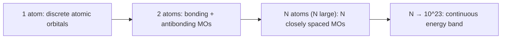
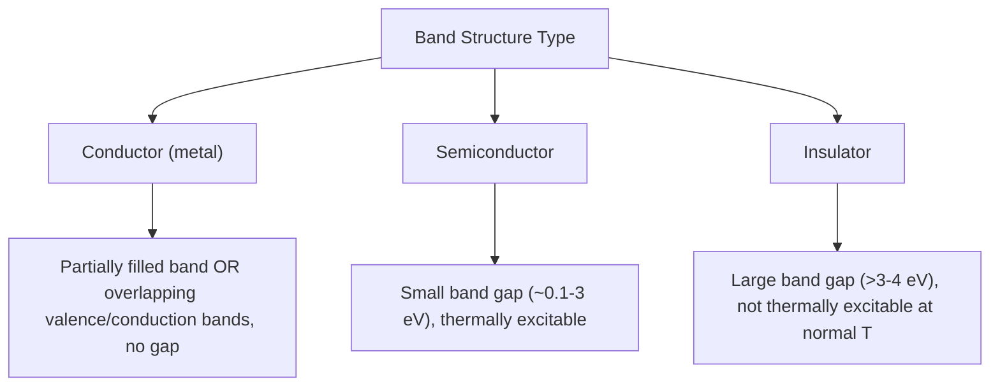

## Band Theory and Semiconductors


### Overview

Band theory explains the electrical, optical, and thermal properties of solids by describing how atomic orbitals combine across a macroscopic number of atoms to form continuous bands of allowed energy states, separated by forbidden energy gaps. The size of the gap between filled and empty bands, and the position of the Fermi level within them, determines whether a solid behaves as a conductor, semiconductor, or insulator.

### From Molecular Orbitals to Bands

**Key Points**

- As the number of atoms $N$ in a solid increases, the number of molecular orbitals formed from overlapping atomic orbitals also increases to $N$, with energy spacing between adjacent orbitals shrinking toward zero
- For a macroscopic crystal ($N \sim 10^{23}$), these discrete energy levels merge into a quasi-continuous **band** of allowed energies
- Each atomic orbital type (e.g., $3s$, $3p$) gives rise to its own band; the energy gap between adjacent bands is the **band gap**, a range of forbidden energies where no electron states exist



**Band Formation with Increasing Atom Number (svg_diagram)**

```svg
<svg xmlns="http://www.w3.org/2000/svg" viewBox="0 0 560 280" font-family="Helvetica,Arial,sans-serif">
  <title>Energy level splitting into bands as atom number increases (svg_diagram)</title>
  <text x="280" y="25" font-size="13" text-anchor="middle">Orbital Splitting → Band Formation</text>

  <text x="70" y="60" font-size="10" text-anchor="middle">2 atoms</text>
  <line x1="40" y1="100" x2="100" y2="100" stroke="#2277cc" stroke-width="3" />
  <line x1="40" y1="180" x2="100" y2="180" stroke="#2277cc" stroke-width="3" />

  <text x="190" y="60" font-size="10" text-anchor="middle">4 atoms</text>
  <line x1="160" y1="90" x2="220" y2="90" stroke="#2277cc" stroke-width="2" />
  <line x1="160" y1="115" x2="220" y2="115" stroke="#2277cc" stroke-width="2" />
  <line x1="160" y1="165" x2="220" y2="165" stroke="#2277cc" stroke-width="2" />
  <line x1="160" y1="190" x2="220" y2="190" stroke="#2277cc" stroke-width="2" />

  <text x="330" y="60" font-size="10" text-anchor="middle">8 atoms</text>
  <g stroke="#2277cc" stroke-width="1.5">
    <line x1="290" y1="80" x2="370" y2="80" />
    <line x1="290" y1="90" x2="370" y2="90" />
    <line x1="290" y1="100" x2="370" y2="100" />
    <line x1="290" y1="110" x2="370" y2="110" />
    <line x1="290" y1="170" x2="370" y2="170" />
    <line x1="290" y1="180" x2="370" y2="180" />
    <line x1="290" y1="190" x2="370" y2="190" />
    <line x1="290" y1="200" x2="370" y2="200" />
  </g>

  <text x="480" y="60" font-size="10" text-anchor="middle">N → large (band)</text>
  <rect x="440" y="70" width="80" height="50" fill="#0055aa" opacity="0.4" />
  <text x="480" y="100" font-size="9" text-anchor="middle">Conduction band</text>
  <rect x="440" y="160" width="80" height="50" fill="#aa2200" opacity="0.4" />
  <text x="480" y="190" font-size="9" text-anchor="middle">Valence band</text>
  <text x="480" y="140" font-size="9" text-anchor="middle">Band gap</text>
</svg>
```

### Band Structure Terminology

| Term | Definition |
| --- | --- |
| Valence band | Highest energy band that is fully (or mostly) occupied by electrons at 0 K |
| Conduction band | Lowest energy band that is empty (or partially occupied) at 0 K; electrons here can move freely and conduct current |
| Band gap ($E_g$) | Energy difference between top of valence band and bottom of conduction band; forbidden energy region |
| Fermi level ($E_F$) | Energy at which the probability of electron occupation is 50% (thermodynamic chemical potential of electrons) |

### Classification of Solids by Band Structure



**Conductor / Metal**

- Either the valence band is only partially filled, or the valence and conduction bands overlap in energy (no gap)
- Electrons require negligible energy input to move into unoccupied states, giving high electrical conductivity
- Conductivity **decreases** with increasing temperature (increased lattice vibration/phonon scattering impedes electron flow)

**Insulator**

- Valence band completely filled, conduction band completely empty, separated by a large band gap (typically $E_g > 4$ eV, though the boundary with semiconductors is not sharply defined)
- Thermal energy at room temperature ($k_BT \approx 0.025$ eV) is far too small to promote electrons across the gap
- Example: diamond ($E_g \approx 5.5$ eV)

**Semiconductor**

- Valence band filled, conduction band empty at 0 K, but separated by a **small** band gap (typically $E_g \approx 0.1$–3 eV)
- At finite temperature, thermal energy promotes a small but significant fraction of electrons across the gap into the conduction band, leaving corresponding **holes** (missing electrons, treated as positive charge carriers) in the valence band
- Conductivity **increases** with increasing temperature (more carriers thermally excited), opposite trend to metals
- Examples: Si ($E_g \approx 1.1$ eV), Ge ($E_g \approx 0.67$ eV), GaAs ($E_g \approx 1.42$ eV)

### Band Diagrams for Conductor, Semiconductor, Insulator (svg_diagram)

```svg
<svg xmlns="http://www.w3.org/2000/svg" viewBox="0 0 600 260" font-family="Helvetica,Arial,sans-serif">
  <title>Band diagrams comparing metal semiconductor and insulator (svg_diagram)</title>
  <text x="100" y="25" font-size="12" text-anchor="middle">Metal</text>
  <rect x="50" y="40" width="100" height="60" fill="#0055aa" opacity="0.5" />
  <text x="100" y="75" font-size="9" text-anchor="middle">Partially filled band</text>
  <text x="100" y="140" font-size="9" text-anchor="middle">No gap / overlap</text>

  <text x="300" y="25" font-size="12" text-anchor="middle">Semiconductor</text>
  <rect x="250" y="40" width="100" height="35" fill="#0055aa" opacity="0.3" />
  <text x="300" y="60" font-size="9" text-anchor="middle">Conduction band (empty)</text>
  <text x="300" y="100" font-size="9" text-anchor="middle">Small Eg (~1 eV)</text>
  <rect x="250" y="130" width="100" height="35" fill="#aa2200" opacity="0.5" />
  <text x="300" y="150" font-size="9" text-anchor="middle">Valence band (filled)</text>

  <text x="500" y="25" font-size="12" text-anchor="middle">Insulator</text>
  <rect x="450" y="40" width="100" height="35" fill="#0055aa" opacity="0.3" />
  <text x="500" y="60" font-size="9" text-anchor="middle">Conduction band (empty)</text>
  <text x="500" y="100" font-size="9" text-anchor="middle">Large Eg (&gt;4 eV)</text>
  <rect x="450" y="160" width="100" height="35" fill="#aa2200" opacity="0.5" />
  <text x="500" y="180" font-size="9" text-anchor="middle">Valence band (filled)</text>
</svg>
```

### Intrinsic vs. Extrinsic Semiconductors

**Intrinsic Semiconductors**

Pure semiconductor material (e.g., pure Si, pure Ge) in which charge carriers arise solely from thermal excitation across the intrinsic band gap. Electron and hole concentrations are equal ($n = p = n_i$, the intrinsic carrier concentration).

**Extrinsic Semiconductors (Doped)**

Deliberate introduction of impurity atoms ("dopants") into the semiconductor lattice dramatically alters carrier concentration and conductivity, forming the basis of virtually all practical semiconductor devices.

**n-Type Doping**

- Dopant atoms have **more** valence electrons than the host lattice atoms (e.g., Group 15 elements P, As, Sb doped into Group 14 Si)
- Extra electron is loosely bound, creating a **donor level** just below the conduction band, easily thermally ionized into the conduction band
- Majority carriers: electrons (negative); minority carriers: holes

**p-Type Doping**

- Dopant atoms have **fewer** valence electrons than the host lattice atoms (e.g., Group 13 elements B, Al, Ga doped into Group 14 Si)
- Missing electron creates an **acceptor level** just above the valence band, easily thermally populated by valence-band electrons, leaving mobile holes
- Majority carriers: holes (positive); minority carriers: electrons

**Doping Diagram (svg_diagram)**

```svg
<svg xmlns="http://www.w3.org/2000/svg" viewBox="0 0 560 260" font-family="Helvetica,Arial,sans-serif">
  <title>n-type and p-type doping energy levels (svg_diagram)</title>
  <text x="140" y="25" font-size="12" text-anchor="middle">n-type (donor level)</text>
  <rect x="90" y="40" width="100" height="35" fill="#0055aa" opacity="0.3" />
  <text x="140" y="60" font-size="9" text-anchor="middle">Conduction band</text>
  <line x1="90" y1="90" x2="190" y2="90" stroke="#cc6600" stroke-dasharray="4,2" />
  <text x="200" y="94" font-size="9">Donor level (filled, shallow)</text>
  <rect x="90" y="150" width="100" height="35" fill="#aa2200" opacity="0.5" />
  <text x="140" y="170" font-size="9" text-anchor="middle">Valence band</text>

  <text x="420" y="25" font-size="12" text-anchor="middle">p-type (acceptor level)</text>
  <rect x="370" y="40" width="100" height="35" fill="#0055aa" opacity="0.3" />
  <text x="420" y="60" font-size="9" text-anchor="middle">Conduction band</text>
  <line x1="370" y1="130" x2="470" y2="130" stroke="#33aa33" stroke-dasharray="4,2" />
  <text x="330" y="134" font-size="9" text-anchor="end">Acceptor level (empty, shallow)</text>
  <rect x="370" y="150" width="100" height="35" fill="#aa2200" opacity="0.5" />
  <text x="420" y="170" font-size="9" text-anchor="middle">Valence band</text>
</svg>
```

### Doping Summary Table

| Property | n-Type | p-Type |
| --- | --- | --- |
| Dopant group (for Si, Group 14 host) | Group 15 (P, As, Sb) | Group 13 (B, Al, Ga) |
| Extra/missing electrons | Extra electron (donor) | Missing electron (acceptor) |
| New energy level position | Near conduction band | Near valence band |
| Majority carrier | Electrons | Holes |
| Fermi level shift | Toward conduction band | Toward valence band |

### The p-n Junction

Joining p-type and n-type semiconductors creates a **p-n junction**, the fundamental building block of diodes, transistors, LEDs, and solar cells.

- At the junction, electrons diffuse from n-side to p-side and holes diffuse from p-side to n-side, leaving behind a **depletion region** of immobile charged dopant ions
- This creates a built-in electric field opposing further diffusion, establishing equilibrium
- Under forward bias (external voltage reducing the barrier), current flows readily; under reverse bias, current flow is blocked (rectification behavior)
- LEDs exploit radiative electron-hole recombination at the junction (photon energy ≈ $E_g$); solar cells exploit the reverse process (photon absorption generates electron-hole pairs, separated by the junction field to produce current)

### Direct vs. Indirect Band Gap Semiconductors

**Key Points**

- **Direct band gap**: conduction band minimum and valence band maximum occur at the same crystal momentum ($k$-value); electron-hole recombination can emit a photon directly (momentum conserved without phonon assistance) — efficient light emission, used in LEDs and laser diodes (e.g., GaAs, GaN, InP)
- **Indirect band gap**: conduction band minimum and valence band maximum occur at different $k$-values; recombination requires simultaneous phonon involvement to conserve momentum, making radiative recombination much less probable (inefficient light emission) — Si and Ge are indirect gap semiconductors, which is why silicon is not used for light-emitting diodes despite its dominance in electronics

### Semiconductor Fabrication and Device Context

**Key Points**

- **Czochralski process**: primary method for growing large single crystals of silicon used in the semiconductor industry, by slowly pulling a seed crystal from molten silicon
- **Doping methods**: ion implantation (precise, controlled dopant introduction via accelerated ion beams) and diffusion doping (thermal diffusion of dopant atoms from a source) are standard industrial techniques
- **Photolithography**: patterns dopant regions and circuit features onto silicon wafers using light-sensitive photoresist and masks, foundational to integrated circuit manufacturing

[Inference: specific fabrication process parameters, node sizes, and industry techniques evolve rapidly; general principles described here reflect standard, well-established semiconductor processing concepts rather than current cutting-edge industrial specifications.]

### Common Semiconductor Materials and Band Gaps

| Material | Band Gap $E_g$ (eV, approx.) | Type | Common Application |
| --- | --- | --- | --- |
| Ge | 0.67 | Indirect | Early transistors, IR detectors |
| Si | 1.11 | Indirect | Dominant electronics/photovoltaics material |
| GaAs | 1.42 | Direct | High-speed electronics, LEDs, laser diodes |
| GaN | 3.4 | Direct | Blue LEDs, high-power/high-frequency devices |
| SiC | 2.3–3.3 (polytype-dependent) | Indirect | High-power, high-temperature electronics |
| Diamond (as wide-gap semiconductor) | ~5.5 | Indirect | Extreme conditions/high-power applications (research-stage) |

[Inference: precise band gap values vary slightly with temperature, measurement method, and crystal quality across literature sources.]

### Temperature Dependence of Conductivity

$$\sigma_{semiconductor} \propto e^{-E_g/2k_BT}$$

This exponential relationship (Arrhenius-type behavior) reflects the thermal activation of carriers across the band gap, in direct contrast to metallic conductors, whose conductivity decreases (resistivity increases roughly linearly) with increasing temperature due to enhanced phonon scattering. This opposite temperature dependence is a key experimental diagnostic distinguishing semiconductors from metals.

**Conclusion**

Band theory unifies the electronic description of solids by treating molecular orbital overlap across a macroscopic number of atoms as continuous energy bands separated by band gaps. The magnitude of the band gap, combined with dopant-controlled carrier concentration in extrinsic semiconductors, governs whether a material conducts, insulates, or functions as a tunable semiconductor — the basis of the p-n junction and the entire modern semiconductor device industry, from diodes and transistors to LEDs and photovoltaics.

**Related Topics**

- Crystal structures and atomic packing (host lattice context for doping)
- p-n junction devices: diodes, transistors, LEDs, solar cells
- Direct vs. indirect band gap and optoelectronic applications
- Defects in crystalline solids and their electronic effects
- Superconductivity and band theory breakdown at low temperature
- Photolithography and semiconductor device fabrication
- Hall effect and experimental determination of carrier type/concentration