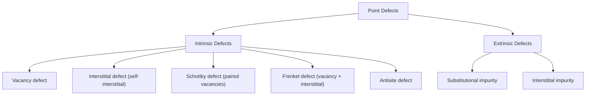
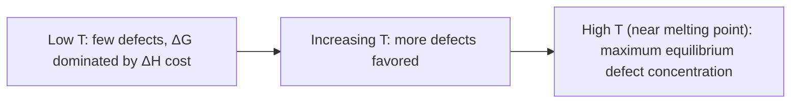

## Point Defects in Solids


### Overview

Point defects are localized irregularities in an otherwise periodic crystal lattice, occurring at or around a single lattice site. Though present even in thermodynamic equilibrium at any temperature above 0 K, point defects profoundly influence electrical conductivity, diffusion, mechanical strength, optical properties, and catalytic activity, making their study central to materials chemistry and solid-state science.

### Classification of Point Defects



### Intrinsic Point Defects

**Vacancy Defect**

An atom or ion missing from its normal lattice site. Vacancies are present in all crystals at thermal equilibrium (entropy-driven) and their concentration increases exponentially with temperature:

$$n_v = N e^{-E_v/k_BT}$$

where $n_v$ is the vacancy concentration, $N$ is the total number of lattice sites, $E_v$ is the vacancy formation energy, $k_B$ is Boltzmann's constant, and $T$ is absolute temperature.

**Self-Interstitial Defect**

An atom of the host lattice occupies a normally unoccupied interstitial site (a gap between regular lattice positions) rather than its usual lattice site. Self-interstitials are generally less favorable energetically than vacancies (higher formation energy due to lattice strain from crowding), so vacancies typically dominate in metals at equilibrium.

**Schottky Defect**

A **paired** set of vacancies maintaining overall electrical neutrality — in an ionic compound, a cation vacancy and an anion vacancy occur together (in stoichiometric ratio matching the compound formula), with the "missing" ions effectively migrated to the crystal surface. Common in ionic compounds with similarly sized cations and anions and high coordination numbers.

- Does not change overall stoichiometry or density significantly changes (density decreases slightly due to missing mass with unchanged unit cell volume)
- Examples: NaCl, KCl, CsCl, most alkali halides

**Frenkel Defect**

An ion displaced from its normal lattice site into an interstitial site, leaving a vacancy behind — the displaced ion and the vacancy together constitute the defect pair, maintaining charge neutrality without loss of ions from the crystal. Common when there is a large size difference between cation and anion (allowing the smaller ion to fit into interstitial space) and typically involves the smaller ion (usually the cation) migrating.

- Does not change overall stoichiometry; density essentially unchanged (no mass leaves the crystal)
- Examples: AgCl, AgBr, ZnS (where the smaller cation moves into interstitial sites)

**Schottky vs. Frenkel Defect Comparison (svg_diagram)**

```svg
<svg xmlns="http://www.w3.org/2000/svg" viewBox="0 0 580 300" font-family="Helvetica,Arial,sans-serif">
  <title>Schottky defect versus Frenkel defect comparison (svg_diagram)</title>
  <text x="150" y="25" font-size="13" text-anchor="middle">Schottky Defect</text>
  <g>
    <circle cx="60" cy="80" r="14" fill="#2277cc" /><circle cx="100" cy="80" r="14" fill="#cc2222" /><circle cx="140" cy="80" r="14" fill="#2277cc" /><circle cx="180" cy="80" r="14" fill="#cc2222" />
    <circle cx="60" cy="120" r="14" fill="#cc2222" /><circle cx="100" cy="120" r="14" fill="none" stroke="#999" stroke-dasharray="2,2" /><circle cx="140" cy="120" r="14" fill="#cc2222" /><circle cx="180" cy="120" r="14" fill="#2277cc" />
    <circle cx="60" cy="160" r="14" fill="#2277cc" /><circle cx="100" cy="160" r="14" fill="#cc2222" /><circle cx="140" cy="160" r="14" fill="none" stroke="#999" stroke-dasharray="2,2" /><circle cx="180" cy="160" r="14" fill="#cc2222" />
  </g>
  <text x="150" y="200" font-size="9" text-anchor="middle">Cation + anion vacancy pair</text>
  <text x="150" y="215" font-size="9" text-anchor="middle">No ions displaced internally</text>
  <text x="150" y="230" font-size="9" text-anchor="middle">(ions effectively removed to surface)</text>

  <text x="430" y="25" font-size="13" text-anchor="middle">Frenkel Defect</text>
  <g>
    <circle cx="340" cy="80" r="14" fill="#2277cc" /><circle cx="380" cy="80" r="14" fill="#cc2222" /><circle cx="420" cy="80" r="14" fill="#2277cc" /><circle cx="460" cy="80" r="14" fill="#cc2222" />
    <circle cx="340" cy="120" r="14" fill="#cc2222" /><circle cx="380" cy="120" r="14" fill="none" stroke="#999" stroke-dasharray="2,2" /><circle cx="420" cy="120" r="14" fill="#cc2222" /><circle cx="460" cy="120" r="14" fill="#2277cc" />
    <circle cx="340" cy="160" r="14" fill="#2277cc" /><circle cx="380" cy="160" r="14" fill="#cc2222" /><circle cx="420" cy="160" r="14" fill="#2277cc" /><circle cx="460" cy="160" r="14" fill="#cc2222" />
    <circle cx="400" cy="100" r="9" fill="#2277cc" />
  </g>
  <text x="430" y="200" font-size="9" text-anchor="middle">Cation vacancy + cation interstitial</text>
  <text x="430" y="215" font-size="9" text-anchor="middle">Ion displaced within lattice</text>
  <text x="430" y="230" font-size="9" text-anchor="middle">(no ions leave the crystal)</text>
</svg>
```

### Schottky vs. Frenkel: Comparison Table

| Property | Schottky Defect | Frenkel Defect |
| --- | --- | --- |
| Composition | Cation vacancy + anion vacancy | Cation (or anion) vacancy + interstitial of same ion |
| Ions leave crystal? | Effectively yes (migrate to surface) | No (ion stays within lattice, just relocated) |
| Density effect | Decreases | Essentially unchanged |
| Favored by | Similar-sized cation/anion, high coordination number | Large size difference between cation/anion |
| Typical examples | NaCl, KCl, CsCl | AgCl, AgBr, ZnS |
| Stoichiometry | Unchanged | Unchanged |

**Antisite Defect**

In compound crystals (especially ordered alloys and compound semiconductors), an atom occupies the lattice site normally belonging to a different atomic species (e.g., a Ga atom sitting on an As site in GaAs, denoted $\text{Ga}_{\text{As}}$). Common in compound semiconductors and can significantly affect electronic properties (introducing deep trap states).

### Extrinsic Point Defects

**Substitutional Impurity**

A foreign atom replaces a host atom at a regular lattice site. Governed by Hume-Rothery-type size/valence/structure compatibility rules for extensive solid solubility, though limited substitutional doping (as used in semiconductor technology) can occur even for significantly mismatched systems at low concentrations.

**Interstitial Impurity**

A foreign atom, typically much smaller than the host lattice atoms (e.g., C, N, H, B in metals), occupies an interstitial site rather than a regular lattice position. Classic example: carbon interstitials in iron (steel), which dramatically increase hardness by impeding dislocation motion.

### Non-Stoichiometric Defects (Metal Excess/Deficiency)

Many ionic solids, particularly transition metal compounds with variable oxidation states, deviate from ideal stoichiometry through defect mechanisms that maintain charge balance via electron/hole compensation.

**Metal Excess Defects**

- **Anion vacancy with trapped electron (F-center)**: an anion is missing, and the resulting negative-charge deficit is compensated by an electron trapped at the vacant site — F-centers (from German "Farbzentrum," color center) are responsible for characteristic colors in alkali halide crystals (e.g., NaCl heated in Na vapor develops a yellow color from F-centers)
- **Interstitial cation with trapped electron**: excess metal cation occupies an interstitial site, with a compensating electron nearby (e.g., ZnO heated, losing oxygen, becomes non-stoichiometric $\text{Zn}_{1+x}\text{O}$, yellow when heated due to interstitial $\text{Zn}$ and trapped electrons)

**Metal Deficiency Defects**

- Cation vacancies compensated by oxidation of neighboring cations to a higher oxidation state, maintaining charge neutrality
- Example: FeO (wüstite) is typically non-stoichiometric, $\text{Fe}_{1-x}\text{O}$, with some $\text{Fe}^{2+}$ vacancies compensated by oxidation of neighboring $\text{Fe}^{2+}$ to $\text{Fe}^{3+}$

### F-Center Diagram (svg_diagram)

```svg
<svg xmlns="http://www.w3.org/2000/svg" viewBox="0 0 400 240" font-family="Helvetica,Arial,sans-serif">
  <title>F-center anion vacancy with trapped electron (svg_diagram)</title>
  <text x="200" y="25" font-size="13" text-anchor="middle">F-Center in NaCl</text>
  <circle cx="80" cy="90" r="14" fill="#2277cc" /><circle cx="120" cy="90" r="14" fill="#cc2222" /><circle cx="160" cy="90" r="14" fill="#2277cc" /><circle cx="200" cy="90" r="14" fill="#cc2222" />
  <circle cx="80" cy="130" r="14" fill="#cc2222" />
  <circle cx="120" cy="130" r="16" fill="none" stroke="#ffaa00" stroke-width="2" />
  <text x="120" y="134" font-size="9" text-anchor="middle" fill="#ffaa00">e-</text>
  <circle cx="160" cy="130" r="14" fill="#cc2222" /><circle cx="200" cy="130" r="14" fill="#2277cc" />
  <circle cx="80" cy="170" r="14" fill="#2277cc" /><circle cx="120" cy="170" r="14" fill="#cc2222" /><circle cx="160" cy="170" r="14" fill="#2277cc" /><circle cx="200" cy="170" r="14" fill="#cc2222" />
  <text x="200" y="215" font-size="10">Trapped electron at Cl- vacancy site</text>
  <text x="200" y="230" font-size="9">absorbs visible light → color center</text>
</svg>
```

### Effects of Point Defects on Material Properties

**Key Points**

- **Ionic conductivity**: vacancies (Schottky) and interstitials (Frenkel) provide pathways for ion migration under an applied electric field, underlying solid electrolyte and battery materials (e.g., yttria-stabilized zirconia, β-alumina, fast-ion conductors)
- **Diffusion**: vacancy and interstitial mechanisms are the two primary atomic diffusion pathways in crystalline solids, governing sintering, annealing, and solid-state reaction kinetics
- **Mechanical properties**: interstitial and substitutional impurities impede dislocation motion (solid-solution strengthening), increasing hardness and yield strength (e.g., carbon in steel)
- **Optical properties**: color centers (F-centers and related defects) produce characteristic absorption and coloration in otherwise colorless ionic crystals
- **Electronic properties**: point defects can introduce trap states within the band gap of semiconductors, acting as recombination centers or, when intentionally introduced as dopants, as the basis of controlled n-type/p-type conductivity

### Thermodynamics of Point Defect Formation

Point defects are stabilized by the entropy increase they provide, despite requiring positive enthalpy (energy input) to form, giving a net negative free energy contribution at any $T > 0$:

$$\Delta G = \Delta H - T\Delta S$$

Since defect formation entropy ($\Delta S$, configurational entropy from the many ways to distribute a small number of defects among many lattice sites) always favors some non-zero equilibrium defect concentration, a perfectly defect-free crystal is thermodynamically impossible above 0 K. The equilibrium defect concentration increases exponentially with temperature per the Arrhenius-type relation shown earlier for vacancies.

### Point Defect Concentration vs. Temperature



### Role in Solid Electrolytes and Ionic Conductors

Materials engineered with high concentrations of vacancies (often via aliovalent doping, e.g., $\text{Y}^{3+}$ substituting for $\text{Zr}^{4+}$ in zirconia, creating compensating oxygen vacancies) achieve high ionic conductivity essential for solid oxide fuel cells (SOFCs), oxygen sensors, and solid-state battery electrolytes.

$$\text{Y}_2\text{O}_3 \xrightarrow{\text{in ZrO}_2 \text{ lattice}} 2\text{Y}'_{\text{Zr}} + 3\text{O}_O^x + V_O^{\bullet\bullet}$$

(Kröger-Vink notation: each pair of $\text{Y}^{3+}$ substituting for $\text{Zr}^{4+}$ creates one doubly-charged oxygen vacancy to maintain charge neutrality.)

### Point Defect Summary Table

| Defect Type | Charge Neutrality Mechanism | Stoichiometry Change | Density Change | Example Systems |
| --- | --- | --- | --- | --- |
| Vacancy (elemental) | N/A (neutral atoms) | N/A | Slight decrease | All crystalline metals |
| Self-interstitial | N/A | N/A | Slight increase | Metals (less common than vacancies) |
| Schottky | Paired cation + anion vacancies | Unchanged | Decreases | NaCl, KCl, CsCl |
| Frenkel | Vacancy + interstitial of same ion | Unchanged | Essentially unchanged | AgCl, AgBr, ZnS |
| Antisite | Species swap on lattice sites | Unchanged | Essentially unchanged | GaAs, ordered alloys |
| F-center (metal excess) | Trapped electron at anion vacancy | Non-stoichiometric | Slight decrease | Heated alkali halides |
| Metal deficiency | Cation vacancy + oxidized neighboring cation | Non-stoichiometric | Slight decrease | $\text{Fe}_{1-x}\text{O}$ |

**Conclusion**

Point defects — vacancies, interstitials, Schottky and Frenkel pairs, antisite defects, and dopant-related substitutional/interstitial impurities — are thermodynamically inevitable features of real crystals above absolute zero, arising from the entropic favorability of defect formation despite its enthalpic cost. Far from being merely imperfections, these defects are exploited deliberately in materials engineering to control ionic conductivity, mechanical strength, optical color centers, and semiconductor electronic behavior, making point defect chemistry a cornerstone of functional materials design.

**Related Topics**

- Band theory and semiconductors (dopant-related point defects)
- Crystal structures and atomic packing (host lattice context)
- Solid electrolytes and ionic conductivity mechanisms
- Kröger-Vink notation for defect chemistry
- Line and planar defects (dislocations, grain boundaries, stacking faults)
- Non-stoichiometric compounds and variable oxidation state solids
- Diffusion mechanisms in crystalline solids (vacancy and interstitial diffusion)