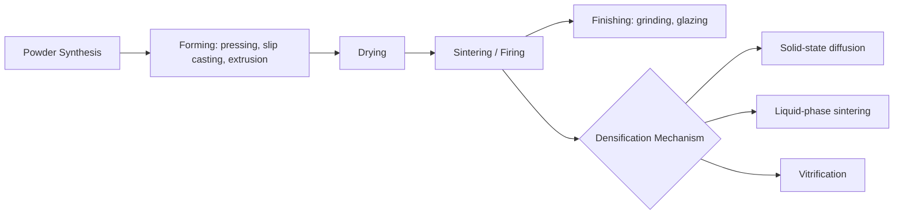

## Ceramics and Glasses

### Overview and Classification

Ceramics and glasses are inorganic, non-metallic solid materials distinguished by their bonding character (predominantly ionic/covalent), high thermal stability, and mechanical brittleness relative to metals.

**Key Points**

- Ceramics: crystalline (long-range periodic atomic order), typically polycrystalline with grains and grain boundaries
- Glasses: amorphous (non-crystalline), lacking long-range order but retaining short-range order
- Glass-ceramics: hybrid materials produced by controlled crystallization of a glass precursor
- Both classes derive properties primarily from strong, directional ionic-covalent bonding, unlike the delocalized metallic bonding in metals

Ceramics are commonly subdivided into:

1. **Traditional (silicate) ceramics** — clay-based products: pottery, brick, porcelain, cement
2. **Advanced (engineering) ceramics** — oxides (Al$_2$O$_3$, ZrO$_2$), non-oxides (SiC, Si$_3$N$_4$), and electroceramics (BaTiO$_3$, PZT)
3. **Refractories** — high-temperature-resistant materials (MgO, ZrO$_2$-based)

---

### Bonding and Structure

#### Ionic and Covalent Character

The bonding character of a ceramic can be estimated from electronegativity difference using the Pauling relation:

$$\%\text{ionic character} = 1 - e^{-0.25(X_A - X_B)^2}$$

where $X_A$ and $X_B$ are the electronegativities of the constituent elements. Most ceramics exhibit mixed ionic-covalent bonding; for example, SiC is roughly 89% covalent, while MgO is roughly 73% ionic.

#### Crystal Structures in Ceramics

Ionic ceramic structures are rationalized using the radius ratio rule, which predicts coordination number (CN) from the cation-to-anion radius ratio $r_C/r_A$:

| $r_C/r_A$ range | Coordination Number | Geometry |
| --- | --- | --- |
| 0.155 – 0.225 | 3 | Triangular |
| 0.225 – 0.414 | 4 | Tetrahedral |
| 0.414 – 0.732 | 6 | Octahedral |
| 0.732 – 1.000 | 8 | Cubic |

Common ceramic crystal structures include:

- **Rock salt (NaCl-type):** MgO, CaO, FeO — CN 6:6
- **Fluorite:** CaF$_2$, ZrO$_2$, UO$_2$ — CN 8:4
- **Corundum:** Al$_2$O$_3$ — hexagonal close-packed oxygen with Al filling two-thirds of octahedral sites
- **Perovskite (ABO$_3$):** BaTiO$_3$, CaTiO$_3$ — basis for ferroelectric and piezoelectric ceramics
- **Spinel (AB$_2$O$_4$):** MgAl$_2$O$_4$ — normal vs. inverse spinel arrangements affect magnetic properties

**Diagram: Rock Salt vs. Fluorite Structure (svg_diagram)**

<svg xmlns="http://www.w3.org/2000/svg" viewBox="0 0 640 320" font-family="Arial, sans-serif">
<text x="160" y="25" text-anchor="middle" font-size="15" font-weight="bold">Rock Salt Structure (svg_diagram)</text>
<g stroke="#333" stroke-width="1.5" fill="none">
<path d="M60,80 L220,80 L260,110 L100,110 Z" />
<path d="M60,80 L60,240 L100,270 L100,110" />
<path d="M220,80 L220,240 L260,270 L260,110" />
<path d="M60,240 L220,240 L260,270 L100,270 Z" />
<line x1="60" y1="80" x2="60" y2="240" stroke-dasharray="3,3" />
<line x1="140" y1="80" x2="140" y2="240" />
<line x1="140" y1="110" x2="140" y2="270" />
<line x1="60" y1="160" x2="220" y2="160" />
<line x1="100" y1="190" x2="260" y2="190" />
</g>
<circle cx="60" cy="80" r="12" fill="#4a90d9" />
<circle cx="220" cy="80" r="12" fill="#4a90d9" />
<circle cx="60" cy="240" r="12" fill="#4a90d9" />
<circle cx="220" cy="240" r="12" fill="#4a90d9" />
<circle cx="100" cy="110" r="12" fill="#4a90d9" />
<circle cx="260" cy="110" r="12" fill="#4a90d9" />
<circle cx="100" cy="270" r="12" fill="#4a90d9" />
<circle cx="260" cy="270" r="12" fill="#4a90d9" />
<circle cx="140" cy="160" r="9" fill="#e08030" />
<circle cx="140" cy="80" r="9" fill="#e08030" />
<circle cx="140" cy="240" r="9" fill="#e08030" />
<circle cx="60" cy="160" r="9" fill="#e08030" />
<circle cx="220" cy="160" r="9" fill="#e08030" />
<circle cx="180" cy="190" r="9" fill="#e08030" />
<text x="160" y="300" text-anchor="middle" font-size="12">Blue = Cation (Na⁺/Mg²⁺), Orange = Anion (Cl⁻/O²⁻), CN 6:6</text>

<text x="480" y="25" text-anchor="middle" font-size="15" font-weight="bold">Fluorite Structure (svg_diagram)</text>

<g stroke="#333" stroke-width="1.5" fill="none">

<path d="M380,80 L540,80 L580,110 L420,110 Z" />

<path d="M380,80 L380,240 L420,270 L420,110" />

<path d="M540,80 L540,240 L580,270 L580,110" />

<path d="M380,240 L540,240 L580,270 L420,270 Z" />

</g>

<circle cx="380" cy="80" r="11" fill="`#4a90d9`" />

<circle cx="540" cy="80" r="11" fill="`#4a90d9`" />

<circle cx="380" cy="240" r="11" fill="`#4a90d9`" />

<circle cx="540" cy="240" r="11" fill="`#4a90d9`" />

<circle cx="420" cy="110" r="11" fill="`#4a90d9`" />

<circle cx="580" cy="110" r="11" fill="`#4a90d9`" />

<circle cx="420" cy="270" r="11" fill="`#4a90d9`" />

<circle cx="580" cy="270" r="11" fill="`#4a90d9`" />

<circle cx="440" cy="120" r="8" fill="`#e08030`" />

<circle cx="480" cy="120" r="8" fill="`#e08030`" />

<circle cx="440" cy="160" r="8" fill="`#e08030`" />

<circle cx="480" cy="160" r="8" fill="`#e08030`" />

<circle cx="460" cy="140" r="8" fill="`#e08030`" />

<circle cx="500" cy="140" r="8" fill="`#e08030`" />

<circle cx="460" cy="180" r="8" fill="`#e08030`" />

<circle cx="500" cy="180" r="8" fill="`#e08030`" />

<text x="480" y="300" text-anchor="middle" font-size="12">Cation CN 8, Anion CN 4 (ZrO₂, CaF₂)</text>

</svg>

#### Glass Structure: Zachariasen Continuous Random Network Model

Glass structure is described by Zachariasen's rules for oxide glass formation:

- Each cation (glass former) is surrounded by 3 or 4 oxygen anions (small polyhedra)
- Oxygen atoms are shared by no more than two polyhedra (bridging oxygens)
- Polyhedra share corners, not edges or faces
- At least three corners of each polyhedron are shared, forming a continuous, disordered 3D network

**Network formers:** SiO$_2$, B$_2$O$_3$, GeO$_2$, P$_2$O$_5$ — form the polyhedral network directly

**Network modifiers:** Na$_2$O, CaO, K$_2$O — disrupt the network by creating non-bridging oxygens (NBOs), lowering viscosity and melting temperature

**Intermediates:** Al$_2$O$_3$, TiO$_2$ — can act as either former or modifier depending on composition

For soda-lime-silica glass (the most common commercial glass), Na$^+$ ions break Si–O–Si bridging bonds:

$$\equiv\text{Si–O–Si} \equiv \; + \; \text{Na}_2\text{O} \rightarrow \; 2 \equiv \text{Si–O}^- \text{Na}^+$$

**Diagram: 2D Representation of Crystalline SiO₂ vs. Vitreous Silica Network (svg_diagram)**

<svg xmlns="http://www.w3.org/2000/svg" viewBox="0 0 640 300" font-family="Arial, sans-serif">
<text x="160" y="25" text-anchor="middle" font-size="14" font-weight="bold">Crystalline (ordered) (svg_diagram)</text>
<g stroke="#555" stroke-width="2">
<line x1="60" y1="80" x2="160" y2="80" />
<line x1="160" y1="80" x2="260" y2="80" />
<line x1="60" y1="150" x2="160" y2="150" />
<line x1="160" y1="150" x2="260" y2="150" />
<line x1="60" y1="220" x2="160" y2="220" />
<line x1="160" y1="220" x2="260" y2="220" />
<line x1="60" y1="80" x2="60" y2="150" />
<line x1="160" y1="80" x2="160" y2="150" />
<line x1="260" y1="80" x2="260" y2="150" />
<line x1="60" y1="150" x2="60" y2="220" />
<line x1="160" y1="150" x2="160" y2="220" />
<line x1="260" y1="150" x2="260" y2="220" />
</g>
<g fill="#4a90d9">
<circle cx="60" cy="80" r="10" /><circle cx="160" cy="80" r="10" /><circle cx="260" cy="80" r="10" />
<circle cx="60" cy="150" r="10" /><circle cx="160" cy="150" r="10" /><circle cx="260" cy="150" r="10" />
<circle cx="60" cy="220" r="10" /><circle cx="160" cy="220" r="10" /><circle cx="260" cy="220" r="10" />
</g>
<g fill="#e08030">
<circle cx="110" cy="80" r="6" /><circle cx="210" cy="80" r="6" />
<circle cx="110" cy="150" r="6" /><circle cx="210" cy="150" r="6" />
<circle cx="60" cy="115" r="6" /><circle cx="160" cy="115" r="6" /><circle cx="260" cy="115" r="6" />
<circle cx="60" cy="185" r="6" /><circle cx="160" cy="185" r="6" /><circle cx="260" cy="185" r="6" />
</g>
<text x="160" y="260" text-anchor="middle" font-size="11">Repeating unit cell (long-range order)</text>

<text x="480" y="25" text-anchor="middle" font-size="14" font-weight="bold">Vitreous / Amorphous (svg_diagram)</text>

<g stroke="#555" stroke-width="2">

<line x1="400" y1="70" x2="460" y2="90" />

<line x1="460" y1="90" x2="520" y2="70" />

<line x1="460" y1="90" x2="450" y2="150" />

<line x1="450" y1="150" x2="400" y2="180" />

<line x1="450" y1="150" x2="520" y2="170" />

<line x1="520" y1="170" x2="560" y2="130" />

<line x1="400" y1="180" x2="380" y2="230" />

<line x1="520" y1="70" x2="570" y2="50" />

<line x1="520" y1="170" x2="540" y2="220" />

</g>

<g fill="`#4a90d9`">

<circle cx="400" cy="70" r="10" /><circle cx="460" cy="90" r="10" /><circle cx="520" cy="70" r="10" />

<circle cx="450" cy="150" r="10" /><circle cx="400" cy="180" r="10" /><circle cx="520" cy="170" r="10" />

<circle cx="560" cy="130" r="10" />

</g>

<g fill="`#e08030`">

<circle cx="430" cy="80" r="6" /><circle cx="490" cy="80" r="6" /><circle cx="455" cy="120" r="6" />

<circle cx="425" cy="165" r="6" /><circle cx="485" cy="160" r="6" /><circle cx="540" cy="150" r="6" />

<circle cx="390" cy="225" r="6" />

</g>

<text x="480" y="260" text-anchor="middle" font-size="11">Continuous random network (short-range order only)</text>

</svg>

---

### Defects in Ceramics

Point defects in ionic ceramics must preserve overall charge neutrality, described using Kröger-Vink notation:

- **Schottky defect:** paired cation and anion vacancies (dominant in NaCl, MgO); preserves stoichiometry and density decreases
- **Frenkel defect:** cation displaced from lattice site to interstitial site (common in AgBr, CaF$_2$); density is largely unchanged

Defect equilibrium constant for Schottky defects follows Arrhenius-type behavior:

$$K_S = [V_C''][V_A^{\bullet\bullet}] = K_0 \exp\left(-\frac{\Delta H_S}{k_B T}\right)$$

where $\Delta H_S$ is the enthalpy of Schottky defect formation, $k_B$ is Boltzmann's constant, and $T$ is absolute temperature.

Aliovalent doping (e.g., Ca$^{2+}$ substituting for Na$^+$ in NaCl) introduces extrinsic vacancies to maintain charge balance:

$$\text{CaCl}_2 \xrightarrow{\text{NaCl}} \text{Ca}_{\text{Na}}^{\bullet} + 2\text{Cl}_{\text{Cl}}^{\times} + V_{\text{Na}}'$$

---

### Mechanical Properties

#### Brittle Fracture and the Griffith Criterion

Ceramics fail via brittle fracture due to limited dislocation mobility (strong directional bonds resist slip). Fracture strength is governed by pre-existing flaws, per the Griffith criterion:

$$\sigma_f = \sqrt{\frac{2E\gamma_s}{\pi a}}$$

where $E$ is Young's modulus, $\gamma_s$ is surface energy, and $a$ is the critical flaw size. This inverse-square-root dependence on flaw size explains the wide scatter in measured ceramic strengths and their sensitivity to surface finish.

#### Weibull Statistics

Because ceramic strength is flaw-controlled and flaws are distributed statistically, failure probability is modeled using the Weibull distribution:

$$P_f = 1 - \exp\left[-\left(\frac{\sigma}{\sigma_0}\right)^m\right]$$

where $m$ is the Weibull modulus (higher $m$ = less scatter, more reliable material) and $\sigma_0$ is a characteristic strength.

#### Fracture Toughness

$$K_{IC} = Y\sigma\sqrt{\pi a}$$

where $Y$ is a geometric factor and $K_{IC}$ is the critical stress intensity factor. Typical $K_{IC}$ values: soda-lime glass ≈ 0.7–0.8 MPa·m$^{1/2}$; Al$_2$O$_3$ ≈ 3–4 MPa·m$^{1/2}$; partially stabilized ZrO$_2$ ≈ 8–10 MPa·m$^{1/2}$ (toughened via stress-induced tetragonal-to-monoclinic transformation).

**Key Points**

- Ceramics are strong in compression, weak in tension (asymmetric strength behavior)
- Toughening mechanisms: transformation toughening (ZrO$_2$), fiber reinforcement (CMCs), microcracking, crack deflection
- Glass strength can be increased substantially by introducing surface compressive stresses (see Thermal/Chemical Tempering below)

---

### Glass Transition and Viscosity

Unlike crystalline melting (a sharp first-order transition at $T_m$), glass formation occurs over a temperature range around the glass transition temperature $T_g$, a kinetic (not thermodynamic) phenomenon.

**Volume–Temperature relationship:**

$$V(T) = V_0 + \alpha_l(T - T_g) \quad \text{(above } T_g\text{, liquid-like expansion)}$$

$$V(T) = V_0 + \alpha_g(T - T_g) \quad \text{(below } T_g\text{, glassy expansion)}$$

where $\alpha_l > \alpha_g$ (liquid thermal expansion coefficient exceeds glassy-state value).

Viscosity–temperature behavior is described by the Vogel-Fulcher-Tammann (VFT) equation:

$$\eta(T) = \eta_0 \exp\left(\frac{B}{T - T_0}\right)$$

Key viscosity reference points in glass processing:

| Point | Viscosity (Pa·s) | Significance |
| --- | --- | --- |
| Melting point | ~10 | Glass is fluid enough to melt/refine |
| Working point | $10^3$ | Glass can be shaped |
| Softening point | $10^{6.6}$ | Glass deforms under own weight |
| Annealing point | $10^{12}$ | Internal stresses relax in minutes |
| Strain point | $10^{13.5}$ | Below this, glass is rigid |

**Diagram: Specific Volume vs. Temperature (svg_diagram)**

<svg xmlns="http://www.w3.org/2000/svg" viewBox="0 0 500 320" font-family="Arial, sans-serif">
<text x="250" y="20" text-anchor="middle" font-size="14" font-weight="bold">Volume–Temperature Behavior (svg_diagram)</text>
<line x1="60" y1="270" x2="460" y2="270" stroke="#333" stroke-width="1.5" />
<line x1="60" y1="270" x2="60" y2="40" stroke="#333" stroke-width="1.5" />
<text x="250" y="300" text-anchor="middle" font-size="12">Temperature (T)</text>
<text x="25" y="150" text-anchor="middle" font-size="12" transform="rotate(-90,25,150)">Specific Volume</text>
<path d="M100,250 L280,150" stroke="#4a90d9" stroke-width="2.5" fill="none" />
<path d="M280,150 L420,60" stroke="#4a90d9" stroke-width="2.5" fill="none" stroke-dasharray="5,3" />
<path d="M100,250 L340,175" stroke="#e08030" stroke-width="2.5" fill="none" />
<path d="M340,175 L420,60" stroke="#e08030" stroke-width="2.5" fill="none" stroke-dasharray="5,3" />
<line x1="280" y1="270" x2="280" y2="150" stroke="#999" stroke-dasharray="2,2" />
<line x1="340" y1="270" x2="340" y2="175" stroke="#999" stroke-dasharray="2,2" />
<line x1="420" y1="270" x2="420" y2="60" stroke="#999" stroke-dasharray="2,2" />
<text x="280" y="285" text-anchor="middle" font-size="11" fill="#4a90d9">Tg (fast cool)</text>
<text x="340" y="285" text-anchor="middle" font-size="11" fill="#e08030">Tg (slow cool)</text>
<text x="420" y="285" text-anchor="middle" font-size="11">Tm</text>
<circle cx="420" cy="60" r="4" fill="#333" />
<line x1="420" y1="60" x2="440" y2="45" stroke="#333" stroke-width="2" />
<text x="450" y="45" font-size="11">Crystal</text>
</svg>

---

### Thermal Properties

#### Thermal Shock Resistance

Ceramics are prone to thermal shock failure due to low thermal conductivity combined with brittleness. The thermal shock resistance parameter is:

$$R = \frac{\sigma_f (1-\nu)}{E\alpha}$$

where $\sigma_f$ is fracture strength, $\nu$ is Poisson's ratio, $E$ is Young's modulus, and $\alpha$ is the coefficient of thermal expansion. Materials with low $\alpha$ (e.g., fused silica, $\alpha \approx 0.5 \times 10^{-6}\,\text{K}^{-1}$) exhibit excellent thermal shock resistance, which is why fused silica and borosilicate glass (Pyrex, $\alpha \approx 3.3 \times 10^{-6}\,\text{K}^{-1}$) withstand rapid temperature changes far better than soda-lime glass ($\alpha \approx 9 \times 10^{-6}\,\text{K}^{-1}$).

#### Thermal and Chemical Tempering (Strengthening Mechanisms)

**Thermal tempering:** Glass is heated above $T_g$ and rapidly quenched with air jets. The surface cools and contracts first while the interior is still fluid; as the interior subsequently cools and contracts, it pulls the already-rigid surface into compression, balanced by tensile stress in the core.

**Chemical tempering (ion exchange):** Glass is immersed in molten KNO$_3$ salt bath; smaller Na$^+$ ions in the glass surface are exchanged for larger K$^+$ ions:

$$\text{Na}^+_{(\text{glass})} + \text{K}^+_{(\text{molten salt})} \rightarrow \text{K}^+_{(\text{glass})} + \text{Na}^+_{(\text{molten salt})}$$

The larger K$^+$ ion is forced into the Na$^+$ site, generating a compressive stress layer without requiring reheating — this is the basis of products like Gorilla Glass.

---

### Electrical and Dielectric Properties of Ceramics

Advanced ceramics span the full range of electrical behavior:

- **Insulators:** Al$_2$O$_3$, MgO — wide bandgap, used in electrical/thermal insulation applications
- **Semiconductors:** doped ZnO, SiC — used in varistors and high-power electronics
- **Ferroelectrics:** BaTiO$_3$, PZT (Pb(Zr,Ti)O$_3$) — exhibit spontaneous, switchable polarization below the Curie temperature $T_C$; dielectric constant follows the Curie-Weiss law above $T_C$:

$$\varepsilon_r = \frac{C}{T - T_C}$$

- **Piezoelectrics:** quartz, PZT — generate electric charge under mechanical stress; used in sensors, actuators, ultrasound transducers
- **Superconducting ceramics:** YBa$_2$Cu$_3$O$_{7-x}$ (YBCO) — cuprate perovskite exhibiting high-$T_C$ superconductivity ($T_C \approx 92\,\text{K}$, above liquid nitrogen temperature)

---

### Processing Routes

#### Ceramic Processing

**Sintering** densifies a powder compact via atomic diffusion, driven by the reduction in surface energy. The Coble creep / diffusion sintering rate relationship for grain growth is often expressed as:

$$\frac{d\rho}{dt} \propto \frac{D \gamma_s \Omega}{k_B T r^n}$$

where $D$ is the diffusion coefficient, $\gamma_s$ is surface energy, $\Omega$ is atomic volume, and $r$ is particle/grain radius.

#### Glass Processing

- **Float glass process:** molten glass floated on a bed of liquid tin, producing flat glass with uniform thickness and fire-polished surfaces (dominant method for architectural/automotive glass)
- **Blow molding:** used for bottles and containers
- **Fiber drawing:** used for glass fibers and optical fibers, drawn from a preform under precise temperature/viscosity control
- **Sol-gel processing:** hydrolysis and condensation of metal alkoxides (e.g., tetraethyl orthosilicate, TEOS) to form a glass network at low temperature:

$$\text{Si(OC}_2\text{H}_5)_4 + 4\text{H}_2\text{O} \rightarrow \text{Si(OH)}_4 + 4\text{C}_2\text{H}_5\text{OH}$$

---

### Worked Example

**Example**

Calculate the theoretical fracture strength ratio between two silica glass samples where Sample A has a surface flaw of $a = 1\,\mu\text{m}$ and Sample B has been etched to reduce flaw size to $a = 0.1\,\mu\text{m}$ (assume $E$ and $\gamma_s$ constant).

Using the Griffith relation, $\sigma_f \propto 1/\sqrt{a}$:

$$\frac{\sigma_{f,B}}{\sigma_{f,A}} = \sqrt{\frac{a_A}{a_B}} = \sqrt{\frac{1\,\mu\text{m}}{0.1\,\mu\text{m}}} = \sqrt{10} \approx 3.16$$

**Output:** The etched sample (Sample B) is predicted to be approximately 3.16 times stronger than Sample A, illustrating why flame-polishing or acid-etching glass surfaces (removing surface flaws) dramatically increases practical strength — this is the basis of the large discrepancy between theoretical (defect-free) glass strength (~10 GPa) and typical measured strength (~50–100 MPa) [Inference: exact strength ratios depend on real flaw population and are sample-specific].

---

### Common Ceramic and Glass Systems Reference Table

| Material | Structure/Type | Key Property | Primary Application |
| --- | --- | --- | --- |
| Al$_2$O$_3$ | Corundum | High hardness, insulator | Cutting tools, substrates |
| ZrO$_2$ (Y-stabilized) | Fluorite/tetragonal | Transformation toughening | Dental crowns, thermal barrier coatings |
| SiC | Covalent, hexagonal/cubic | High thermal conductivity, hardness | Abrasives, high-temp semiconductors |
| Si$_3$N$_4$ | Covalent network | High strength retention at temperature | Engine components, bearings |
| Soda-lime glass | Amorphous silicate | Low cost, moderate durability | Windows, containers |
| Borosilicate glass | Amorphous silicate | Low thermal expansion | Labware, cookware |
| BaTiO$_3$ | Perovskite | Ferroelectric | Capacitors |
| YBCO | Layered perovskite | High-$T_C$ superconductivity | MRI magnets, power transmission |

---

**Related Topics**

- Sintering kinetics and grain growth in polycrystalline ceramics
- Piezoelectric and ferroelectric ceramics: domain switching mechanisms
- Transformation toughening in zirconia ceramics
- Sol-gel chemistry and aerogel synthesis
- Optical fiber glass composition and attenuation mechanisms
- Bioceramics (hydroxyapatite) and biomedical applications
- Refractory ceramics for high-temperature industrial furnaces
- Glass-ceramics: nucleation and controlled crystallization (e.g., LAS, MAS systems)