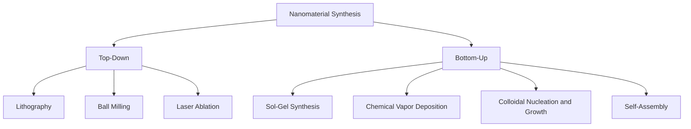

## Nanomaterials

### Overview and Definition

Nanomaterials are materials with at least one external dimension in the nanoscale range (approximately 1–100 nm), where physical, chemical, and electronic properties diverge substantially from bulk behavior due to increased surface-to-volume ratio and quantum confinement effects.

**Key Points**

- Surface-to-volume ratio scales as $3/r$ for a sphere of radius $r$, so properties become increasingly surface-dominated as size decreases
- Quantum confinement occurs when a material's characteristic dimension approaches or falls below the exciton Bohr radius or de Broglie wavelength of charge carriers
- Nanomaterials often display size-tunable properties (optical, electronic, magnetic, catalytic) unavailable in the bulk analog

---

### Classification by Dimensionality

Nanomaterials are conventionally classified by the number of dimensions that remain outside the nanoscale:

| Class | Confined Dimensions | Free Dimensions | Examples |
| --- | --- | --- | --- |
| 0D | 3 | 0 | Quantum dots, nanoparticles, fullerenes |
| 1D | 2 | 1 | Nanowires, nanotubes, nanorods |
| 2D | 1 | 2 | Graphene, MXenes, TMD monolayers (MoS$_2$) |
| 3D (nanostructured bulk) | 0 (nanoscale grains) | 3 | Nanocrystalline metals, bulk nanocomposites |

**Diagram: Dimensionality Classification (svg_diagram)**

<svg xmlns="http://www.w3.org/2000/svg" viewBox="0 0 640 220" font-family="Arial, sans-serif">
<text x="320" y="20" text-anchor="middle" font-size="14" font-weight="bold">Nanomaterial Dimensionality (svg_diagram)</text>
<circle cx="90" cy="120" r="30" fill="#4a90d9" />
<text x="90" y="180" text-anchor="middle" font-size="12">0D: Quantum Dot</text>
<rect x="210" y="105" width="90" height="14" rx="7" fill="#e08030" />
<text x="255" y="180" text-anchor="middle" font-size="12">1D: Nanowire/Tube</text>
<g>
<polygon points="380,90 470,90 495,150 405,150" fill="#5cb85c" opacity="0.85" />
<line x1="380" y1="90" x2="470" y2="90" stroke="#2e6b2e" stroke-width="1" />
</g>
<text x="440" y="180" text-anchor="middle" font-size="12">2D: Sheet (Graphene)</text>
<g stroke="#333" stroke-width="1">
<rect x="540" y="90" width="20" height="20" fill="#9370c2" />
<rect x="562" y="90" width="20" height="20" fill="#9370c2" />
<rect x="540" y="112" width="20" height="20" fill="#9370c2" />
<rect x="562" y="112" width="20" height="20" fill="#9370c2" />
<rect x="551" y="79" width="20" height="20" fill="#b39ddb" />
</g>
<text x="565" y="180" text-anchor="middle" font-size="12">3D: Nanograined Bulk</text>
</svg>

---

### Size-Dependent Physical Effects

#### Surface-to-Volume Ratio

For a spherical nanoparticle of radius $r$:

$$\frac{S}{V} = \frac{4\pi r^2}{\frac{4}{3}\pi r^3} = \frac{3}{r}$$

The fraction of atoms residing at or near the surface increases dramatically as $r$ decreases; a 10 nm particle can have on the order of 5–10% of its atoms at the surface, rising to nearly 100% below ~1 nm. This drives enhanced catalytic activity, altered melting points (Gibbs-Thomson effect), and increased reactivity relative to bulk material.

#### Gibbs-Thomson Melting Point Depression

$$T_m(r) = T_{m,\text{bulk}}\left(1 - \frac{2\gamma_{sl}}{\rho_s L r}\right)$$

where $\gamma_{sl}$ is the solid-liquid interfacial energy, $\rho_s$ is solid density, $L$ is latent heat of fusion, and $r$ is particle radius. This explains why gold nanoparticles below ~5 nm melt hundreds of degrees below the bulk melting point of 1064°C.

#### Quantum Confinement in Semiconductor Quantum Dots

When particle radius approaches the exciton Bohr radius $a_B$, the particle-in-a-sphere model gives an approximate confinement energy:

$$E_g(r) = E_{g,\text{bulk}} + \frac{\hbar^2 \pi^2}{2r^2}\left(\frac{1}{m_e^*} + \frac{1}{m_h^*}\right) - \frac{1.8e^2}{4\pi\varepsilon_0\varepsilon_r r}$$

where $m_e^*$ and $m_h^*$ are effective masses of electron and hole, and the final (Coulomb) term is a correction. As $r$ decreases, the bandgap $E_g$ increases, causing the characteristic blue-shift in quantum dot emission with decreasing particle size — this is the physical basis of size-tunable quantum dot displays (e.g., CdSe QDs emitting across the visible spectrum by size alone).

---

### Major Nanomaterial Classes

#### Carbon-Based Nanomaterials

- **Fullerenes (C$_{60}$, C$_{70}$):** closed-cage carbon molecules, icosahedral symmetry for C$_{60}$ (Buckminsterfullerene), composed of 12 pentagons and 20 hexagons
- **Carbon nanotubes (CNTs):** rolled graphene sheets; classified as single-walled (SWCNT) or multi-walled (MWCNT). Electronic character (metallic vs. semiconducting) depends on chirality, described by the chiral vector:

$$\vec{C}_h = n\vec{a}_1 + m\vec{a}_2 \quad (n,m)$$

A nanotube is metallic when $n - m$ is a multiple of 3; otherwise semiconducting.

- **Graphene:** single atomic layer of sp$^2$-bonded carbon in a honeycomb lattice; exhibits a linear (Dirac cone) electronic dispersion relation near the Fermi level, giving carriers an effective massless behavior and very high carrier mobility (>200,000 cm$^2$V$^{-1}$s$^{-1}$ in suspended samples).

#### Metal and Metal Oxide Nanoparticles

- **Plasmonic nanoparticles (Au, Ag):** exhibit localized surface plasmon resonance (LSPR) — collective oscillation of conduction electrons driven by incident light. Resonance wavelength depends on particle size, shape, and dielectric environment, governed approximately by Mie theory for spherical particles.
- **Magnetic nanoparticles (Fe$_3$O$_4$, γ-Fe$_2$O$_3$):** below a critical size, particles become single-domain and exhibit superparamagnetism — thermal energy overcomes the anisotropy energy barrier, so magnetization randomizes in the absence of an applied field, described by the Néel relaxation time:

$$\tau = \tau_0 \exp\left(\frac{K_uV}{k_BT}\right)$$

where $K_u$ is anisotropy energy density and $V$ is particle volume.

#### 2D Materials Beyond Graphene

- **Transition metal dichalcogenides (TMDs):** MoS$_2$, WS$_2$ — indirect-to-direct bandgap transition occurs when thinned from bulk to monolayer, enabling applications in optoelectronics
- **MXenes:** 2D transition metal carbides/nitrides (e.g., Ti$_3$C$_2$T$_x$), produced by selective etching of the "A" layer from MAX phases; notable for high electrical conductivity combined with hydrophilic surface terminations

#### Nanowires and Quantum Dots

- Semiconductor nanowires (Si, GaAs, ZnO) grown via vapor-liquid-solid (VLS) mechanism using a metal catalyst droplet (commonly Au) to seed anisotropic crystal growth
- Core-shell quantum dot structures (e.g., CdSe/ZnS) passivate surface trap states, improving photoluminescence quantum yield

---

### Synthesis Approaches

Nanomaterial fabrication is broadly divided into two strategies:

**Top-down methods:** start from bulk material and reduce size (e.g., photolithography, electron-beam lithography, mechanical milling). Limited by achievable resolution and often introduces surface defects.

**Bottom-up methods:** build nanostructures from atomic/molecular precursors:

- **Sol-gel processing:** hydrolysis-condensation of metal alkoxide precursors
- **Chemical vapor deposition (CVD):** gas-phase precursor decomposition on a substrate; standard method for graphene and CNT growth
- **Colloidal synthesis (hot-injection method):** rapid nucleation followed by controlled growth, widely used for quantum dot synthesis; La Mer model describes the separation of nucleation and growth phases to achieve narrow size distribution

#### La Mer Nucleation-Growth Model

The La Mer diagram divides colloidal nanoparticle formation into three stages: (I) pre-nucleation accumulation of monomer concentration, (II) burst nucleation once supersaturation exceeds a critical threshold $C_{min}^{nucleation}$, and (III) diffusion-controlled growth as concentration falls below the nucleation threshold but remains above solubility. A short, sharp nucleation burst (Stage II) followed by slow, controlled growth (Stage III) is essential for producing monodisperse nanoparticles.

---

### Characterization Techniques

| Technique | Information Obtained |
| --- | --- |
| TEM (Transmission Electron Microscopy) | Particle size, shape, crystallinity, lattice fringes |
| SEM (Scanning Electron Microscopy) | Surface morphology, aggregation state |
| XRD (X-ray Diffraction) | Crystal structure, phase identification, Scherrer-equation size estimate |
| DLS (Dynamic Light Scattering) | Hydrodynamic size distribution in solution |
| XPS (X-ray Photoelectron Spectroscopy) | Surface elemental composition, oxidation states |
| BET (Brunauer-Emmett-Teller) | Specific surface area from gas adsorption isotherms |
| UV-Vis / Photoluminescence spectroscopy | Bandgap, plasmon resonance, quantum yield |

#### Scherrer Equation (Crystallite Size from XRD)

$$D = \frac{K\lambda}{\beta \cos\theta}$$

where $D$ is the mean crystallite size, $K$ is the shape factor (typically ≈0.9), $\lambda$ is X-ray wavelength, $\beta$ is the full width at half maximum (FWHM) of the diffraction peak (in radians), and $\theta$ is the Bragg angle.

---

### Worked Example

**Example**

A CdSe quantum dot sample shows a characteristic XRD peak with FWHM $\beta = 0.025$ rad at $2\theta = 25.5°$ using Cu K$\alpha$ radiation ($\lambda = 0.15406$ nm), with shape factor $K = 0.9$. Estimate the crystallite size.

Step 1: Convert to $\theta$: $\theta = 12.75° = 0.2225\,\text{rad}$; $\cos\theta = \cos(12.75°) \approx 0.9753$

Step 2: Apply the Scherrer equation:

$$D = \frac{0.9 \times 0.15406\,\text{nm}}{0.025 \times 0.9753} = \frac{0.1387}{0.02438} \approx 5.69\,\text{nm}$$

**Output:** The estimated crystallite diameter is approximately 5.7 nm, consistent with a quantum-confined CdSe nanocrystal regime (exciton Bohr radius of bulk CdSe ≈ 5.6 nm), meaning size-dependent bandgap effects would be significant for this sample [Inference: peak broadening also has strain and instrumental contributions in real XRD data, which the simple Scherrer equation neglects].

---

### Applications

**Key Points**

- **Catalysis:** high surface area and undercoordinated surface atoms enhance catalytic turnover (e.g., Pt nanoparticles in fuel cells, Au nanoparticles for CO oxidation)
- **Drug delivery:** liposomal and polymeric nanoparticles (e.g., PLGA) enable controlled release and enhanced permeability and retention (EPR) effect targeting in tumor tissue
- **Electronics:** CNT and graphene-based transistors, flexible electronics
- **Energy storage:** nanostructured electrodes (Si nanowires for Li-ion battery anodes) accommodate volume expansion and shorten ion diffusion paths
- **Photovoltaics:** quantum dot solar cells, perovskite nanocrystal light absorbers
- **Sensors:** nanomaterial-based sensors exploit high surface reactivity for enhanced sensitivity (e.g., graphene-based gas sensors)

---

### Toxicology and Safety Considerations

Nanomaterial toxicity is influenced by size, shape, surface charge, and surface chemistry rather than composition alone; smaller particles can cross biological barriers (cell membranes, blood-brain barrier) more readily than larger particles of identical composition [Inference: specific toxicological mechanisms and regulatory thresholds are an active research area and vary significantly across nanomaterial types; conclusions should reference current toxicology literature and regulatory guidance for any applied risk assessment].

---

**Related Topics**

- Quantum dot photophysics and Förster resonance energy transfer (FRET)
- Nanoparticle self-assembly and superlattice formation
- Plasmonic sensing and surface-enhanced Raman spectroscopy (SERS)
- Nanocomposite mechanical reinforcement mechanisms
- Green synthesis routes for metal nanoparticles
- Nanotoxicology and environmental fate of engineered nanomaterials
- 2D material heterostructures and van der Waals stacking