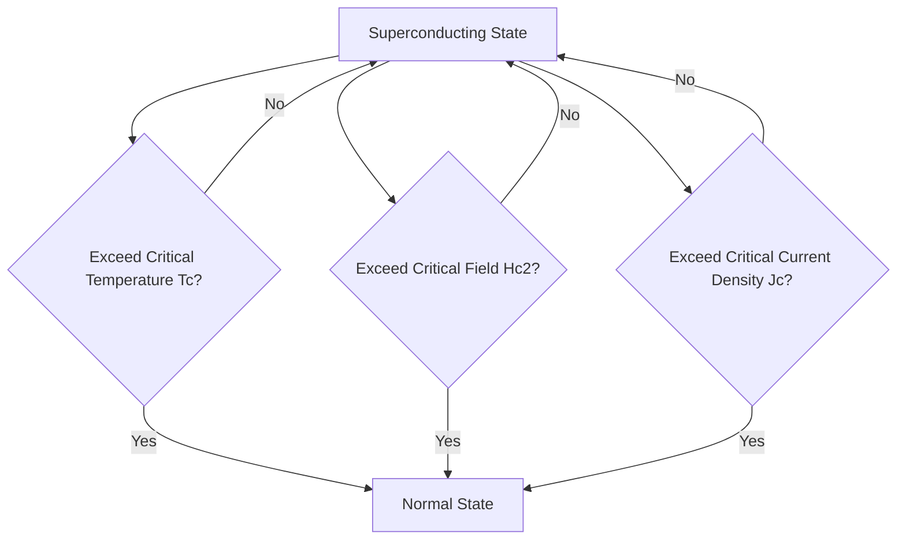

## Superconductors

### Overview and Defining Phenomena

Superconductivity is a state of matter characterized by two hallmark phenomena occurring below a critical temperature $T_C$: zero electrical resistance and perfect diamagnetism (expulsion of magnetic flux, the Meissner effect).

**Key Points**

- Zero DC resistance: persistent currents in a superconducting loop have been observed to flow without measurable decay
- Meissner effect: a superconductor actively expels magnetic field from its interior, distinguishing it from a hypothetical "perfect conductor" (which would merely trap flux, not expel it)
- The superconducting transition is a genuine thermodynamic phase transition, not simply a resistance-vanishing crossover

---

### The Meissner Effect

When a material transitions into the superconducting state in the presence of an external magnetic field, it expels the field from its bulk, maintaining $B = 0$ internally (for a type-I superconductor below $H_C$). This is distinct from simple perfect conductivity ($dB/dt = 0$), which would preserve whatever flux existed at the moment resistance vanished rather than expelling pre-existing flux.

The magnetic field decays exponentially within a thin surface layer, characterized by the **London penetration depth** $\lambda_L$:

$$B(x) = B_0 e^{-x/\lambda_L}$$

$$\lambda_L = \sqrt{\frac{m}{\mu_0 n_s e^2}}$$

where $m$ is electron mass, $n_s$ is the density of superconducting charge carriers, and $e$ is electron charge. Typical penetration depths are on the order of 20–500 nm.

**Diagram: Meissner Effect — Field Expulsion (svg_diagram)**

<svg viewBox="0 0 620 260" xmlns="http://www.w3.org/2000/svg" font-family="Arial, sans-serif">
<text x="150" y="20" text-anchor="middle" font-size="14" font-weight="bold">T > Tc (Normal) (svg_diagram)</text>
<rect x="70" y="60" width="160" height="140" rx="8" fill="#dce8f5" stroke="#4a90d9" stroke-width="2"/>
<g stroke="#e08030" stroke-width="2">
<line x1="50" y1="70" x2="250" y2="70"/>
<line x1="50" y1="100" x2="250" y2="100"/>
<line x1="50" y1="130" x2="250" y2="130"/>
<line x1="50" y1="160" x2="250" y2="160"/>
<line x1="50" y1="190" x2="250" y2="190"/>
</g>
<text x="150" y="225" text-anchor="middle" font-size="11">Field penetrates freely</text>

<text x="470" y="20" text-anchor="middle" font-size="14" font-weight="bold">T < Tc (Superconducting) (svg_diagram)</text>

<rect x="390" y="60" width="160" height="140" rx="8" fill="`#dce8f5`" stroke="`#4a90d9`" stroke-width="2"/>

<g stroke="`#e08030`" stroke-width="2">

<path d="M370,70 L390,70 M550,70 L570,70"/>

<path d="M370,100 L390,100 M550,100 L570,100"/>

<path d="M370,130 Q470,130 470,130 Q470,130 550,130" stroke-dasharray="0" opacity="0"/>

<path d="M370,130 L385,130 Q470,130 555,130 L570,130" opacity="0"/>

<path d="M370,130 C400,130 400,60 470,60 C540,60 540,130 570,130" fill="none"/>

<path d="M370,160 C400,160 400,215 470,215 C540,215 540,160 570,160" fill="none"/>

<path d="M370,190 L390,190 M550,190 L570,190"/>

</g>

<text x="470" y="225" text-anchor="middle" font-size="11">Field expelled (Meissner effect)</text>

</svg>

---

### Type I vs. Type II Superconductors

| Property | Type I | Type II |
| --- | --- | --- |
| Elements/compounds | Pure metals (Pb, Hg, Sn, Al) | Alloys, ceramics (Nb-Ti, Nb$_3$Sn, cuprates) |
| Critical fields | Single $H_C$ | Two fields: $H_{C1}$, $H_{C2}$ |
| Flux behavior | Complete expulsion below $H_C$ | Mixed (vortex) state between $H_{C1}$ and $H_{C2}$ |
| Typical $T_C$ | Low (<10 K) | Can be high (cuprates up to ~135 K) |
| Practical magnets | Rarely used | Standard for high-field magnets (MRI, accelerators) |

For Type II superconductors, between $H_{C1}$ and $H_{C2}$, magnetic flux penetrates in discrete quantized tubes called vortices, each carrying one flux quantum:

$$\Phi_0 = \frac{h}{2e} \approx 2.07 \times 10^{-15}\,\text{Wb}$$

The factor of $2e$ (rather than $e$) reflects that the supercurrent is carried by Cooper pairs.

**Diagram: Phase Diagram — Type I vs. Type II (svg_diagram)**

<svg xmlns="http://www.w3.org/2000/svg" viewBox="0 0 620 280" font-family="Arial, sans-serif">
<text x="150" y="20" text-anchor="middle" font-size="14" font-weight="bold">Type I (svg_diagram)</text>
<line x1="60" y1="230" x2="60" y2="50" stroke="#333" stroke-width="1.5" />
<line x1="60" y1="230" x2="260" y2="230" stroke="#333" stroke-width="1.5" />
<text x="30" y="140" font-size="11" transform="rotate(-90,30,140)">H</text>
<text x="160" y="250" text-anchor="middle" font-size="11">T</text>
<path d="M60,60 Q160,80 240,230" fill="none" stroke="#4a90d9" stroke-width="2.5" />
<text x="100" y="90" font-size="11" fill="#333">Normal</text>
<text x="90" y="190" font-size="11" fill="#333">Meissner</text>
<text x="235" y="245" font-size="10">Tc</text>

<text x="470" y="20" text-anchor="middle" font-size="14" font-weight="bold">Type II (svg_diagram)</text>

<line x1="380" y1="230" x2="380" y2="50" stroke="#333" stroke-width="1.5" />

<line x1="380" y1="230" x2="580" y2="230" stroke="#333" stroke-width="1.5" />

<text x="350" y="140" font-size="11" transform="rotate(-90,350,140)">H</text>

<text x="480" y="250" text-anchor="middle" font-size="11">T</text>

<path d="M380,60 Q480,100 560,230" fill="none" stroke="`#e08030`" stroke-width="2.5" />

<path d="M380,150 Q460,170 555,228" fill="none" stroke="`#4a90d9`" stroke-width="2.5" />

<text x="450" y="90" font-size="11" fill="#333">Normal</text>

<text x="420" y="140" font-size="11" fill="#333">Vortex (mixed)</text>

<text x="390" y="195" font-size="11" fill="#333">Meissner</text>

</svg>

---

### BCS Theory (Microscopic Mechanism)

Developed by Bardeen, Cooper, and Schrieffer (1957), BCS theory explains conventional superconductivity via electron pairing mediated by lattice vibrations (phonons).

#### Cooper Pairing

An electron moving through the ionic lattice attracts nearby positive ions, creating a transient region of enhanced positive charge density that attracts a second electron — the two electrons form a bound state (a Cooper pair) despite their mutual Coulomb repulsion, provided the attractive phonon-mediated interaction dominates near the Fermi surface. Cooper pairs have zero net momentum and opposite spin (singlet state, $S=0$) in conventional superconductors.

#### The Superconducting Energy Gap

BCS theory predicts an energy gap $\Delta$ separating the paired ground state from single-particle excitations. At $T = 0$:

$$\Delta(0) = 1.764\,k_B T_C$$

This is the BCS weak-coupling relation, a well-established result of the theory. The gap closes continuously as $T \to T_C$, and the temperature dependence near $T_C$ follows approximately:

$$\Delta(T) \approx \Delta(0)\sqrt{1 - \frac{T}{T_C}}$$

#### Isotope Effect

BCS theory predicts $T_C$ depends on ionic mass $M$ through phonon frequency:

$$T_C \propto M^{-\alpha}, \quad \alpha \approx 0.5 \text{ (for many conventional superconductors)}$$

The experimental observation of this isotope effect in mercury (varying $T_C$ with different Hg isotopes) was key historical evidence supporting phonon-mediated pairing.

---

### London Equations

Phenomenological electrodynamics of superconductors (predating BCS) are captured by the two London equations:

**First London equation** (describes perfect conductivity):

$$\frac{\partial \vec{J}_s}{\partial t} = \frac{n_s e^2}{m}\vec{E}$$

**Second London equation** (describes the Meissner effect):

$$\nabla \times \vec{J}_s = -\frac{n_s e^2}{m}\vec{B}$$

Combined with Ampère's law, the second London equation yields the exponential field decay characterized by $\lambda_L$ described earlier.

---

### High-Temperature (Cuprate) Superconductors

Discovered by Bednorz and Müller in 1986 (La-Ba-Cu-O, $T_C \approx 35\,\text{K}$), cuprate superconductors are layered perovskite ceramics whose $T_C$ values greatly exceed BCS-theory predictions for phonon-mediated pairing.

**Key cuprate systems:**

| Compound | Common Name | $T_C$ (K) |
| --- | --- | --- |
| La$_{2-x}$Sr$_x$CuO$_4$ | LSCO | ~38 |
| YBa$_2$Cu$_3$O$_{7-x}$ | YBCO ("123" compound) | ~92 |
| Bi$_2$Sr$_2$Ca$_2$Cu$_3$O_{10}$ | BSCCO | ~110 |
| HgBa$_2$Ca$_2$Cu$_3$O_8$ | Mercury cuprate | ~133 (highest at ambient pressure) |

**Structural feature:** all cuprate superconductors contain CuO$_2$ planes separated by charge-reservoir layers; superconductivity is believed to occur primarily within these planes, with carrier density tuned by doping (e.g., oxygen content in YBCO, Sr substitution in LSCO). The pairing mechanism in cuprates remains an active research question and is not fully explained by conventional BCS phonon coupling [Speculation: proposed mechanisms include spin-fluctuation-mediated pairing, though no consensus theory is universally accepted].

Cuprates are generally d-wave (rather than BCS s-wave) superconductors, meaning the energy gap has directional nodes where $\Delta = 0$ — established experimentally via phase-sensitive measurements and angle-resolved photoemission spectroscopy (ARPES).

---

### Critical Parameters and the Type II Phase Envelope

A Type II superconductor is bounded by a three-dimensional critical surface in temperature, field, and current density space. Exceeding any one of the three critical parameters destroys superconductivity:

---

### Worked Example

**Example**

Using the BCS weak-coupling relation, estimate the zero-temperature energy gap $\Delta(0)$ for niobium, which has $T_C = 9.25\,\text{K}$.

$$\Delta(0) = 1.764 \, k_B T_C = 1.764 \times (8.617 \times 10^{-5}\,\text{eV/K}) \times 9.25\,\text{K}$$

$$\Delta(0) = 1.764 \times 7.971 \times 10^{-4}\,\text{eV} \approx 1.406 \times 10^{-3}\,\text{eV} = 1.406\,\text{meV}$$

**Output:** The predicted BCS gap for niobium is approximately 1.41 meV, in reasonable agreement with experimentally measured tunneling-spectroscopy values for Nb (~1.5 meV), supporting niobium's classification as a conventional (moderately strong-coupling) BCS superconductor [Inference: niobium shows modest deviation from ideal weak-coupling BCS due to stronger electron-phonon coupling than the weak-coupling limit assumes].

---

### Applications

**Key Points**

- **MRI magnets:** Nb-Ti and Nb$_3$Sn wire windings generate the strong, stable magnetic fields required for clinical imaging
- **Particle accelerators:** superconducting RF cavities and magnets (e.g., LHC dipole magnets using Nb-Ti at ~1.9 K)
- **SQUIDs (Superconducting Quantum Interference Devices):** exploit the Josephson effect for ultra-sensitive magnetic field detection
- **Maglev transportation:** magnetic levitation exploiting the Meissner effect/flux pinning in Type II superconductors
- **Power transmission:** high-$T_C$ superconducting cables (YBCO tape) for lossless power transmission, currently limited by cryogenic infrastructure costs
- **Quantum computing:** superconducting qubits (transmon architecture) rely on Josephson junctions as nonlinear circuit elements

#### The Josephson Effect

When two superconductors are separated by a thin insulating barrier (a Josephson junction), Cooper pairs can tunnel across without an applied voltage:

$$I = I_C \sin(\delta)$$

where $\delta$ is the phase difference between the two superconducting wavefunctions and $I_C$ is the critical current. Under an applied DC voltage, the AC Josephson effect produces an oscillating current at frequency:

$$f = \frac{2eV}{h}$$

This relation is exact and forms the basis of the modern (SI) voltage standard.

---

**Related Topics**

- Flux pinning and critical current density engineering in Type II wires
- Josephson junctions and superconducting qubit architectures (transmon, fluxonium)
- Unconventional pairing symmetry (d-wave, p-wave) and iron-based superconductors
- Cryogenic engineering for superconducting magnet systems
- Room-temperature superconductivity claims and hydride superconductors under pressure
- Ginzburg-Landau theory and the coherence length $\xi$
- Flux quantization and the Abrikosov vortex lattice