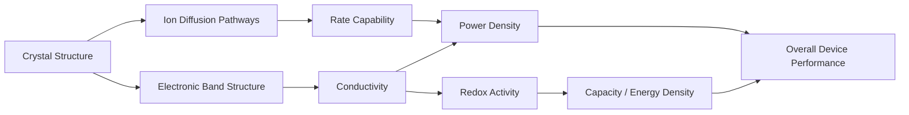
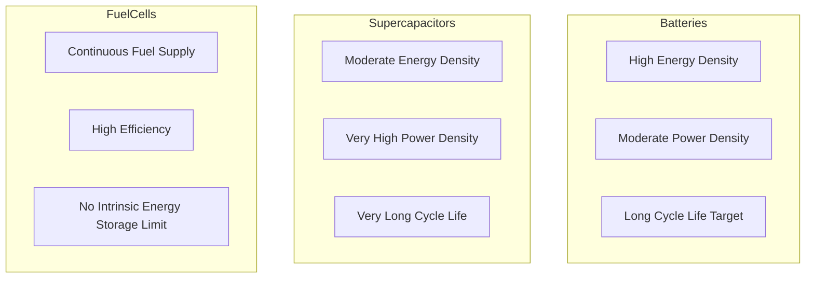

## Materials for Energy Storage and Conversion

### Overview

Energy storage and conversion materials span electrochemical, thermal, and photochemical systems. This field bridges solid-state chemistry, electrochemistry, and materials science to address efficiency, capacity, and stability requirements.

**Key Points**

- Storage materials retain energy chemically (batteries, supercapacitors, hydrogen storage)
- Conversion materials transform one energy form to another (photovoltaics, fuel cells, thermoelectrics)
- Performance is governed by ionic/electronic conductivity, structural stability, and interfacial kinetics
- Crystal structure and defect chemistry directly determine electrochemical performance

### Battery Materials

#### Lithium-Ion Battery (LIB) Cathodes

| Material | Structure Type | Theoretical Capacity (mAh/g) | Voltage (V vs Li/Li⁺) |
| --- | --- | --- | --- |
| $LiCoO_2$ (LCO) | Layered $\alpha$-NaFeO₂ | 274 | 3.9 |
| $LiFePO_4$ (LFP) | Olivine | 170 | 3.4 |
| $LiMn_2O_4$ (LMO) | Spinel | 148 | 4.1 |
| $LiNi_xMn_yCo_zO_2$ (NMC) | Layered | 200–220 | 3.7 |
| $LiNi_{0.8}Co_{0.15}Al_{0.05}O_2$ (NCA) | Layered | 200 | 3.7 |

**Key Points**

- Layered oxides intercalate $Li^+$ between transition-metal oxide sheets
- Olivine $LiFePO_4$ has strong P–O covalent bonds, giving superior thermal stability at the cost of lower voltage and intrinsic electronic conductivity (commonly mitigated by carbon coating and particle-size reduction)
- Spinel structures offer 3D $Li^+$ diffusion pathways, improving rate capability

#### Anode Materials

| Material | Capacity (mAh/g) | Mechanism |
| --- | --- | --- |
| Graphite | 372 | Intercalation ($LiC_6$) |
| Silicon | ~4200 | Alloying ($Li_{4.4}Si$) |
| Lithium titanate ($Li_4Ti_5O_{12}$) | 175 | Intercalation, zero-strain |
| Lithium metal | 3860 | Plating/stripping |

**Example**

Silicon anodes offer roughly 10x the theoretical capacity of graphite, but undergo ~300% volume expansion during lithiation, which causes particle fracture and rapid capacity fade. This is commonly addressed using nanostructured Si, Si/C composites, or void-containing architectures that accommodate volume change.

#### Solid Electrolytes

| Class | Example | Ionic Conductivity (S/cm) |
| --- | --- | --- |
| Garnet | $Li_7La_3Zr_2O_{12}$ (LLZO) | $10^{-4}$–$10^{-3}$ |
| NASICON | $Li_{1.3}Al_{0.3}Ti_{1.7}(PO_4)_3$ | $10^{-3}$ |
| Sulfide | $Li_{10}GeP_2S_{12}$ | $10^{-2}$ |
| Perovskite | $Li_{3x}La_{2/3-x}TiO_3$ | $10^{-3}$ |

Solid electrolytes eliminate flammable liquid electrolytes, enabling higher energy density cells and suppressing dendrite formation, though interfacial resistance at electrode/electrolyte boundaries remains a key engineering challenge.

### Beyond Lithium-Ion

| System | Charge Carrier | Advantage | Challenge |
| --- | --- | --- | --- |
| Sodium-ion | $Na^+$ | Earth-abundant, low cost | Lower energy density |
| Magnesium-ion | $Mg^{2+}$ | Higher volumetric capacity (divalent) | Sluggish diffusion kinetics |
| Lithium-sulfur | $Li^+$/$S$ | High theoretical capacity (1675 mAh/g) | Polysulfide shuttle effect |
| Lithium-air | $Li^+$/$O_2$ | Very high theoretical energy density | Poor rechargeability, side reactions |

### Supercapacitor Materials

**Key Points**

- **Electric double-layer capacitors (EDLCs)**: Store charge electrostatically at electrode/electrolyte interface (activated carbon, graphene, carbon nanotubes)
- **Pseudocapacitors**: Store charge via fast surface redox reactions ($RuO_2$, $MnO_2$, conducting polymers)
- Supercapacitors offer higher power density but lower energy density than batteries, filling the gap between capacitors and batteries in the Ragone plot

$$E = \frac{1}{2}CV^2$$

where $E$ is stored energy, $C$ is capacitance, and $V$ is operating voltage.

### Fuel Cell Materials

| Component | Common Material | Function |
| --- | --- | --- |
| Anode catalyst | Pt/C, Pt-Ru/C | Fuel oxidation (H₂ or methanol) |
| Cathode catalyst | Pt/C | Oxygen reduction reaction (ORR) |
| Proton exchange membrane | Nafion (sulfonated PTFE) | $H^+$ conduction, gas separation |
| Solid oxide electrolyte | Yttria-stabilized zirconia (YSZ) | $O^{2-}$ conduction at high T |

**Solid Oxide Fuel Cells (SOFCs)** operate at 600–1000°C using oxide-ion-conducting ceramics, offering high efficiency and fuel flexibility, while **Proton Exchange Membrane Fuel Cells (PEMFCs)** operate near room temperature with faster startup, suited for transportation applications.

### Thermoelectric Materials

Thermoelectric materials directly convert temperature gradients into electrical energy via the Seebeck effect.

$$ZT = \frac{S^2 \sigma T}{\kappa}$$

where $S$ is the Seebeck coefficient, $\sigma$ is electrical conductivity, $T$ is absolute temperature, and $\kappa$ is thermal conductivity. High-performance thermoelectrics (e.g., $Bi_2Te_3$, $PbTe$, skutterudites) require the "phonon-glass, electron-crystal" concept — low thermal conductivity paired with high electrical conductivity.

### Photovoltaic Materials

| Generation | Material | Efficiency Range |
| --- | --- | --- |
| 1st | Crystalline Si | 20–27% |
| 2nd | CdTe, CIGS (thin film) | 15–23% |
| 3rd | Perovskite ($CH_3NH_3PbI_3$) | 20–26% |
| 3rd | Dye-sensitized (DSSC) | 10–13% |

**Example**

Halide perovskites ($ABX_3$, e.g., methylammonium lead iodide) achieve high efficiencies rapidly due to strong optical absorption, long charge-carrier diffusion lengths, and defect tolerance, though commercial deployment is limited by moisture/thermal instability and lead toxicity concerns. [Inference] The precise degradation mechanisms remain an active research area and can vary substantially with encapsulation strategy.

### Hydrogen Storage Materials

| Method | Example | Gravimetric Capacity |
| --- | --- | --- |
| Metal hydrides | $MgH_2$, $LaNi_5H_6$ | 1.5–7.6 wt% |
| Complex hydrides | $LiBH_4$, $NaAlH_4$ | 10–18 wt% |
| MOFs (physisorption) | MOF-5, HKUST-1 | 1–10 wt% (cryogenic) |
| Chemical hydrides | $NH_3BH_3$ | 19.6 wt% |

### Structure–Property Relationship Diagram

### Key Performance Metrics Comparison

### Design Strategies for Improved Performance

- Doping and substitution to stabilize crystal structure and tune redox potential (e.g., $Mn$ or $Al$ doping in layered oxides)
- Nanostructuring to shorten ion diffusion length and increase surface area
- Surface coating (e.g., $Al_2O_3$, carbon) to suppress interfacial side reactions
- Defect engineering (oxygen vacancies, cation disorder) to enhance ionic conductivity
- Compositional grading (core-shell, concentration-gradient particles) to balance capacity and stability

**Related Topics**

- Solid electrolyte interphase (SEI) formation and stability
- Crystal structure types: layered, spinel, olivine, perovskite
- Electrochemical impedance spectroscopy for materials characterization
- Defect chemistry and non-stoichiometry in solid-state materials
- Ragone plots and energy/power density trade-offs
- Sustainable and critical-materials considerations in battery design