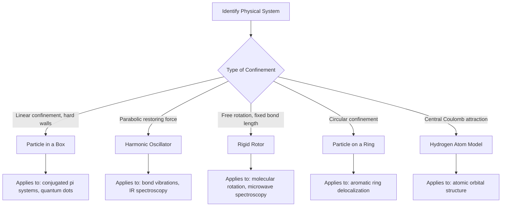

## The Particle in a Box and Simple Quantum Systems

### Overview

The particle-in-a-box (PIB) model is the simplest exactly solvable quantum system, serving as the pedagogical foundation for understanding quantization, boundary conditions, and wavefunction behavior. Related exactly solvable systems (harmonic oscillator, rigid rotor, particle in a ring) extend these principles to vibrational, rotational, and cyclic molecular motion.

**Key Points**

- Exact analytical solutions exist only for a small set of idealized potentials
- These models approximate real chemical systems: PIB for conjugated $\pi$ systems, harmonic oscillator for bond vibrations, rigid rotor for molecular rotation
- All solutions share the common feature of energy quantization arising from boundary conditions

### One-Dimensional Particle in a Box

#### Setup and Potential

A particle of mass $m$ is confined to $0 \leq x \leq L$ with:

$$V(x) = \begin{cases} 0 & 0 \leq x \leq L \\ \infty & x < 0 \text{ or } x > L \end{cases}$$

Inside the box, the time-independent Schrödinger equation reduces to:

$$-\frac{\hbar^2}{2m}\frac{d^2\psi}{dx^2} = E\psi$$

#### Boundary Conditions and Solution

Since $\psi = 0$ outside the box, continuity requires $\psi(0) = 0$ and $\psi(L) = 0$. The general solution $\psi(x) = A\sin(kx) + B\cos(kx)$ reduces (applying $\psi(0)=0$, forcing $B=0$) to:

$$\psi_n(x) = \sqrt{\frac{2}{L}}\sin\left(\frac{n\pi x}{L}\right), \quad n = 1, 2, 3, ...$$

$$E_n = \frac{n^2h^2}{8mL^2}$$

**Key Points**

- $n$ is restricted to positive integers; $n = 0$ is excluded because it gives $\psi = 0$ everywhere (no particle)
- Energy levels are non-degenerate and spaced quadratically ($E_n \propto n^2$)
- The normalization constant $\sqrt{2/L}$ ensures $\int_0^L |\psi_n|^2\,dx = 1$

**Example**

For an electron confined to a 1 nm box:

$$E_1 = \frac{(1)^2(6.626\times10^{-34})^2}{8(9.11\times10^{-31})(1\times10^{-9})^2} \approx 6.02 \times 10^{-20} \text{ J} \approx 0.376 \text{ eV}$$

Doubling the box length to 2 nm reduces $E_1$ by a factor of 4, illustrating the inverse-square dependence on confinement length — directly relevant to quantum dot size-tunable optical properties.

#### Node Structure

The quantum number $n$ equals the number of half-wavelengths fitting in the box; the number of interior nodes (points where $\psi = 0$, excluding endpoints) is $n - 1$.

| $n$ | Interior Nodes | Symmetry |
| --- | --- | --- |
| 1 | 0 | Symmetric (even about center) |
| 2 | 1 | Antisymmetric (odd about center) |
| 3 | 2 | Symmetric |

### Particle-in-a-Box Wavefunctions (svg_diagram)

<svg xmlns="http://www.w3.org/2000/svg" viewBox="0 0 640 300">
<rect x="0" y="0" width="640" height="300" fill="var(--bg,#ffffff)" />
<text x="320" y="22" text-anchor="middle" font-size="15" font-weight="bold" fill="var(--fg,#111)">Probability Densities |psi_n|^2 for n=1,2,3 (svg_diagram)</text>
<line x1="90" y1="50" x2="90" y2="270" stroke="var(--fg,#333)" stroke-width="2" />
<line x1="90" y1="270" x2="560" y2="270" stroke="var(--fg,#333)" stroke-width="2" />

<path d="M 90 260 Q 325 130 560 260" fill="none" stroke="#2563eb" stroke-width="2.5" />
<text x="565" y="200" font-size="12" fill="#2563eb">n=1</text>

<path d="M 90 260 Q 207 180 325 260 Q 442 180 560 260" fill="none" stroke="#dc2626" stroke-width="2.5" />
<text x="565" y="180" font-size="12" fill="#dc2626">n=2</text>

<path d="M 90 260 Q 168 200 246 260 Q 325 200 403 260 Q 481 200 560 260" fill="none" stroke="#16a34a" stroke-width="2.5" />
<text x="565" y="220" font-size="12" fill="#16a34a">n=3</text>

<text x="90" y="288" text-anchor="middle" font-size="12" fill="var(--fg,#333)">0</text>

<text x="560" y="288" text-anchor="middle" font-size="12" fill="var(--fg,#333)">L</text>

</svg>

### Extensions of the Box Model

#### Particle in a Finite Box

Unlike the infinite well, a finite potential barrier allows tunneling — the wavefunction decays exponentially but nonzero into the classically forbidden region ($V > E$), rather than dropping to exactly zero at the walls.

#### Particle in a Two/Three-Dimensional Box

For a 3D box with independent lengths $L_x, L_y, L_z$:

$$E_{n_x,n_y,n_z} = \frac{h^2}{8m}\left(\frac{n_x^2}{L_x^2} + \frac{n_y^2}{L_y^2} + \frac{n_z^2}{L_z^2}\right)$$

**Key Points**

- For a cubic box ($L_x = L_y = L_z$), multiple $(n_x, n_y, n_z)$ combinations can yield the same energy, producing degeneracy
- Degeneracy arises from symmetry; distorting the box (e.g., unequal side lengths) lifts degeneracy

### Particle on a Ring (Rigid Rotor Analog, 2D)

Models free rotation, relevant to aromatic $\pi$-electron delocalization:

$$E_m = \frac{m^2\hbar^2}{2I}, \quad m = 0, \pm1, \pm2, ...$$

where $I$ is the moment of inertia. Unlike the linear box, $m = 0$ is allowed, and states with $\pm m$ are degenerate (clockwise/counterclockwise motion have equal energy).

### Quantum Harmonic Oscillator (Vibrational Model)

$$V(x) = \frac{1}{2}kx^2, \qquad E_n = \left(n + \frac{1}{2}\right)h\nu, \quad n = 0, 1, 2, ...$$

$$\nu = \frac{1}{2\pi}\sqrt{\frac{k}{\mu}}$$

where $k$ is the force constant and $\mu$ is the reduced mass. This is the standard model for molecular bond vibrations in IR spectroscopy.

**Key Points**

- Equally spaced energy levels (unlike PIB's quadratic spacing)
- Nonzero zero-point energy at $n=0$
- Selection rule for IR-active transitions: $\Delta n = \pm 1$ (harmonic approximation)

### Rigid Rotor (Rotational Model)

Models molecular rotation, relevant to microwave/rotational spectroscopy:

$$E_J = \frac{\hbar^2}{2I}J(J+1), \quad J = 0, 1, 2, ...$$

with degeneracy $g_J = 2J+1$ for each level, arising from the $(2J+1)$ possible orientations of angular momentum.

### Comparative Summary Table

| System | Potential | Energy Formula | Level Spacing |
| --- | --- | --- | --- |
| Particle in a box | Infinite walls | $E_n \propto n^2$ | Increasing |
| Harmonic oscillator | $\frac{1}{2}kx^2$ | $E_n \propto (n+\tfrac{1}{2})$ | Constant |
| Rigid rotor | None (constrained to sphere) | $E_J \propto J(J+1)$ | Increasing |
| Particle on a ring | None (constrained to circle) | $E_m \propto m^2$ | Increasing, doubly degenerate |
| Hydrogen atom | Coulomb $-e^2/4\pi\epsilon_0 r$ | $E_n \propto -1/n^2$ | Decreasing |

### System Selection Flowchart

### Applications to Chemistry

**Example**

The PIB model applied to $\beta$-carotene (11 conjugated double bonds) approximates the $\pi$-electron system as a 1D box, using the number of $\pi$ electrons to fill levels via the Pauli exclusion principle (2 electrons per level). The HOMO-LUMO gap calculated this way reasonably predicts the experimentally observed absorption near 450–500 nm, explaining the compound's orange color. [Inference] Quantitative agreement is approximate since the model neglects electron-electron repulsion and the non-uniform potential along the real conjugated chain.

### Common Pitfalls

- Forgetting that $n=0$ is forbidden for the particle-in-a-box and harmonic oscillator ground state numbering, but allowed for the rigid rotor and particle-on-a-ring
- Confusing energy spacing trends: PIB and rigid rotor spacings increase with quantum number; harmonic oscillator spacing is constant
- Neglecting degeneracy in 2D/3D box problems or the rigid rotor when calculating state populations or partition functions
- Treating the harmonic oscillator as exact for real bonds at high vibrational quantum numbers, where anharmonicity becomes significant

**Related Topics**

- Anharmonic oscillator and Morse potential
- Selection rules in vibrational and rotational spectroscopy
- Hückel molecular orbital theory for conjugated systems
- Tunneling and the finite square well
- Quantum dots and nanoscale confinement effects
- Partition functions and statistical thermodynamics of simple quantum systems