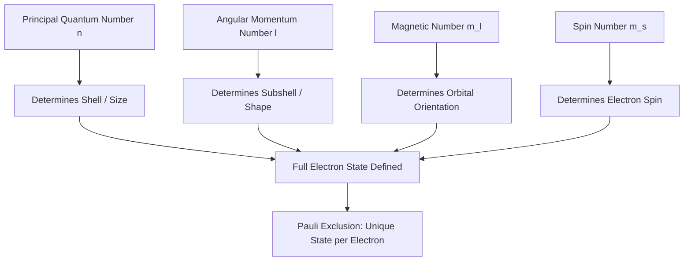

## Atomic Orbitals from Quantum Theory

### Overview

Atomic orbitals arise as solutions to the Schrödinger equation for the hydrogen atom, where the Coulomb potential's spherical symmetry naturally separates the wavefunction into radial and angular components. These solutions introduce the quantum numbers that define atomic structure and underpin the periodic table.

**Key Points**

- Orbitals are wavefunctions $\psi_{n,l,m_l}$, not physical orbits
- $|\psi|^2$ gives the probability density of finding an electron at a given point
- Four quantum numbers ($n$, $l$, $m_l$, $m_s$) fully specify an electron's quantum state
- Orbital shapes (s, p, d, f) arise from the angular part of the wavefunction

### The Hydrogen Atom Schrödinger Equation

For an electron in the Coulomb potential of a nucleus with charge $+Ze$:

$$-\frac{\hbar^2}{2m_e}\nabla^2\psi - \frac{Ze^2}{4\pi\epsilon_0 r}\psi = E\psi$$

Due to spherical symmetry, this is solved in spherical polar coordinates $(r, \theta, \phi)$, where the wavefunction separates as:

$$\psi_{n,l,m_l}(r,\theta,\phi) = R_{n,l}(r) \cdot Y_l^{m_l}(\theta,\phi)$$

**Key Points**

- $R_{n,l}(r)$ is the radial wavefunction, depending on $n$ and $l$
- $Y_l^{m_l}(\theta,\phi)$ is the spherical harmonic (angular wavefunction), depending on $l$ and $m_l$
- This separation is possible specifically because the Coulomb potential $V(r)$ depends only on $r$

### Quantum Numbers

| Quantum Number | Symbol | Allowed Values | Physical Meaning |
| --- | --- | --- | --- |
| Principal | $n$ | $1, 2, 3, ...$ | Energy level, orbital size |
| Angular momentum | $l$ | $0, 1, ..., n-1$ | Orbital shape, subshell |
| Magnetic | $m_l$ | $-l, ..., 0, ..., +l$ | Orbital orientation |
| Spin | $m_s$ | $+\tfrac{1}{2}, -\tfrac{1}{2}$ | Electron spin state |

**Key Points**

- $l = 0, 1, 2, 3$ correspond to s, p, d, f subshells respectively
- For a given $n$, there are $n$ possible values of $l$
- For a given $l$, there are $2l+1$ possible values of $m_l$ (orbital orientations)
- Total orbitals in shell $n$: $n^2$; total electron capacity (with spin): $2n^2$

### Energy Levels

For hydrogen and hydrogen-like ions (single electron, nuclear charge $Z$):

$$E_n = -\frac{Z^2 \cdot 13.6 \text{ eV}}{n^2}$$

**Key Points**

- For hydrogen ($Z=1$), energy depends only on $n$ — all orbitals within a shell are degenerate
- This degeneracy is unique to purely Coulombic (single-electron) potentials
- In multi-electron atoms, electron-electron repulsion breaks this degeneracy, so energy depends on both $n$ and $l$ (subshells split: $E_{ns} < E_{np} < E_{nd}$)

### Radial Wavefunctions and Probability

The radial probability distribution — the probability of finding the electron at distance $r$ from the nucleus, integrated over all angles — is:

$$P(r) = 4\pi r^2 |R_{n,l}(r)|^2$$

**Example**

For the hydrogen 1s orbital:

$$R_{1,0}(r) = 2\left(\frac{1}{a_0}\right)^{3/2}e^{-r/a_0}$$

where $a_0$ is the Bohr radius (52.9 pm). The radial probability $P(r) = 4\pi r^2 |R_{1,0}|^2$ peaks at $r = a_0$ — the most probable distance to find the 1s electron, even though $|\psi|^2$ itself is maximal at $r=0$ (the $4\pi r^2$ volume factor shifts the probability maximum outward).

| Orbital | Radial Nodes | Angular Nodes | Total Nodes |
| --- | --- | --- | --- |
| 1s | 0 | 0 | 0 |
| 2s | 1 | 0 | 1 |
| 2p | 0 | 1 | 1 |
| 3s | 2 | 0 | 2 |
| 3p | 1 | 1 | 2 |
| 3d | 0 | 2 | 2 |

Total nodes $= n - 1$ in all cases, split as radial nodes $= n - l - 1$ and angular nodes $= l$.

### Angular Wavefunctions and Orbital Shapes

The spherical harmonics $Y_l^{m_l}(\theta,\phi)$ determine orbital shape and orientation.

| Subshell | $l$ | Shape Description |
| --- | --- | --- |
| s | 0 | Spherically symmetric |
| p | 1 | Dumbbell, two lobes along an axis |
| d | 2 | Four lobes (mostly); $d_{z^2}$ has a distinct torus + two lobes |
| f | 3 | Complex multi-lobed shapes |

### Orbital Shapes Diagram (svg_diagram)

<svg xmlns="http://www.w3.org/2000/svg" viewBox="0 0 640 280">
<rect x="0" y="0" width="640" height="280" fill="var(--bg,#ffffff)" />
<text x="320" y="22" text-anchor="middle" font-size="15" font-weight="bold" fill="var(--fg,#111)">s, p, and d Orbital Shapes (svg_diagram)</text>

<circle cx="100" cy="150" r="55" fill="#3b82f6" opacity="0.5" stroke="#1e40af" stroke-width="2" />
<text x="100" y="240" text-anchor="middle" font-size="13" fill="var(--fg,#333)">1s</text>

<ellipse cx="270" cy="120" rx="30" ry="45" fill="#dc2626" opacity="0.5" stroke="#991b1b" stroke-width="2" />
<ellipse cx="270" cy="180" rx="30" ry="45" fill="#2563eb" opacity="0.5" stroke="#1e40af" stroke-width="2" />
<text x="270" y="240" text-anchor="middle" font-size="13" fill="var(--fg,#333)">2p (one lobe pair)</text>

<g transform="translate(470,150)">
<ellipse cx="-45" cy="-45" rx="28" ry="28" fill="#16a34a" opacity="0.5" stroke="#166534" stroke-width="2" />
<ellipse cx="45" cy="-45" rx="28" ry="28" fill="#ca8a04" opacity="0.5" stroke="#854d0e" stroke-width="2" />
<ellipse cx="-45" cy="45" rx="28" ry="28" fill="#ca8a04" opacity="0.5" stroke="#854d0e" stroke-width="2" />
<ellipse cx="45" cy="45" rx="28" ry="28" fill="#16a34a" opacity="0.5" stroke="#166534" stroke-width="2" />
</g>
<text x="470" y="240" text-anchor="middle" font-size="13" fill="var(--fg,#333)">3d (xy-type)</text>
</svg>

### Multi-Electron Atoms: Orbital Filling

**Key Points**

- **Aufbau principle**: Electrons fill orbitals in order of increasing energy
- **Pauli exclusion principle**: No two electrons can share all four identical quantum numbers
- **Hund's rule**: Degenerate orbitals are singly occupied before pairing occurs, maximizing total spin

$$1s < 2s < 2p < 3s < 3p < 4s \approx 3d < 4p < 5s \approx 4d < 5p < 6s \approx 4f \approx 5d < 6p$$

**Example**

Chromium ([Ar] $3d^5 4s^1$) and copper ([Ar] $3d^{10} 4s^1$) deviate from strict Aufbau predictions because half-filled and fully-filled $d$ subshells provide additional stability from exchange energy, a well-documented exception to the naive orbital filling order.

### Effective Nuclear Charge and Shielding

Electrons in multi-electron atoms experience a reduced nuclear attraction due to shielding by other electrons:

$$Z_{eff} = Z - \sigma$$

where $\sigma$ is the shielding constant (commonly estimated via Slater's rules). This explains why, for a given $n$, subshells with lower $l$ (which penetrate closer to the nucleus) are lower in energy: $ns < np < nd < nf$.

### Orbital Hierarchy Diagram

### Common Pitfalls

- Interpreting orbitals as literal electron trajectories (Bohr-model thinking) rather than probability distributions
- Forgetting that hydrogen's $n$-only energy degeneracy does not hold for multi-electron atoms
- Miscounting radial vs. angular nodes (total nodes $=n-1$, angular nodes $=l$, radial nodes $=n-l-1$)
- Applying strict Aufbau order without accounting for documented exceptions (Cr, Cu, and other transition metals)

**Related Topics**

- Slater's rules and effective nuclear charge calculations
- Electron configurations and the periodic table
- Term symbols and multi-electron atomic states
- Molecular orbital theory (LCAO approximation)
- Spin-orbit coupling and fine structure
- Photoelectron spectroscopy and orbital energy measurement