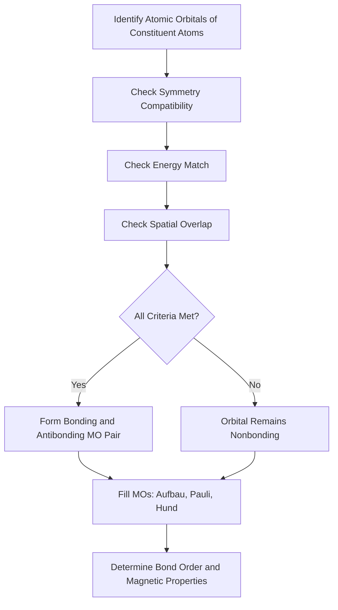

## Molecular Orbital Theory in Depth

### Overview

Molecular orbital (MO) theory describes bonding by constructing molecular wavefunctions from linear combinations of atomic orbitals, treating electrons as delocalized over the entire molecule rather than localized between atom pairs. This contrasts with valence bond theory and provides superior explanations for bond order, magnetism, and electronic spectra.

**Key Points**

- Molecular orbitals are formed by the Linear Combination of Atomic Orbitals (LCAO)
- Bonding, antibonding, and nonbonding MOs arise from constructive/destructive interference
- Electron filling follows the same Aufbau, Pauli, and Hund's rules as atomic orbitals
- MO theory correctly predicts paramagnetism (e.g., $O_2$), which valence bond theory fails to explain

### LCAO Approximation

Molecular orbitals are approximated as linear combinations of atomic orbitals (AOs):

$$\psi_{MO} = \sum_i c_i \phi_i$$

where $\phi_i$ are atomic orbital basis functions and $c_i$ are coefficients determined variationally.

#### Diatomic Case: H₂

For two hydrogen 1s orbitals ($\phi_A$, $\phi_B$), two combinations are possible:

$$\psi_{bonding} = N_+(\phi_A + \phi_B), \qquad \psi_{antibonding} = N_-(\phi_A - \phi_B)$$

**Key Points**

- $\psi_{bonding}$: constructive interference, increased electron density between nuclei, lower energy
- $\psi_{antibonding}$ (denoted $\sigma^*$): destructive interference, node between nuclei, higher energy
- $N_+$, $N_-$ are normalization constants

### Criteria for Effective MO Formation

| Criterion | Requirement |
| --- | --- |
| Symmetry | AOs must have matching symmetry with respect to the internuclear axis |
| Energy | AOs should have similar energies for significant mixing |
| Overlap | AOs must have substantial spatial overlap |

**Example**

A 1s orbital on one atom and a 2p$_x$ orbital on another (perpendicular to the bond axis) have zero net overlap by symmetry — their overlap integral is zero, so they cannot combine to form a bonding MO regardless of energy match.

### Types of Molecular Orbitals

| MO Type | Symmetry | Formed From | Nodal Plane Containing Axis |
| --- | --- | --- | --- |
| $\sigma$ | Cylindrically symmetric about axis | s-s, s-p$_z$, p$_z$-p$_z$ (head-on) | No |
| $\sigma^*$ | Cylindrically symmetric, antibonding | Same as above | No (but node between nuclei) |
| $\pi$ | Antisymmetric under $C_2$ rotation about axis | p$_x$-p$_x$, p$_y$-p$_y$ (side-on) | Yes (one nodal plane) |
| $\pi^*$ | Antibonding $\pi$ | Same as $\pi$ | Yes, plus node between nuclei |

### Molecular Orbital Diagram Construction (svg_diagram)

<svg xmlns="http://www.w3.org/2000/svg" viewBox="0 0 500 340">
<rect x="0" y="0" width="500" height="340" fill="var(--bg,#ffffff)" />
<text x="250" y="22" text-anchor="middle" font-size="15" font-weight="bold" fill="var(--fg,#111)">H2 Molecular Orbital Diagram (svg_diagram)</text>

<line x1="60" y1="220" x2="140" y2="220" stroke="var(--fg,#333)" stroke-width="2" />
<text x="100" y="240" text-anchor="middle" font-size="12" fill="var(--fg,#333)">H(A) 1s</text>
<line x1="360" y1="220" x2="440" y2="220" stroke="var(--fg,#333)" stroke-width="2" />
<text x="400" y="240" text-anchor="middle" font-size="12" fill="var(--fg,#333)">H(B) 1s</text>

<line x1="200" y1="280" x2="300" y2="280" stroke="#2563eb" stroke-width="3" />
<text x="250" y="300" text-anchor="middle" font-size="12" fill="#2563eb">sigma (bonding)</text>
<circle cx="220" cy="280" r="5" fill="#111" />
<circle cx="280" cy="280" r="5" fill="#111" />

<line x1="200" y1="90" x2="300" y2="90" stroke="#dc2626" stroke-width="3" />
<text x="250" y="75" text-anchor="middle" font-size="12" fill="#dc2626">sigma* (antibonding)</text>

<line x1="140" y1="220" x2="200" y2="280" stroke="var(--fg,#999)" stroke-width="1" stroke-dasharray="3,3" />
<line x1="140" y1="220" x2="200" y2="90" stroke="var(--fg,#999)" stroke-width="1" stroke-dasharray="3,3" />
<line x1="360" y1="220" x2="300" y2="280" stroke="var(--fg,#999)" stroke-width="1" stroke-dasharray="3,3" />
<line x1="360" y1="220" x2="300" y2="90" stroke="var(--fg,#999)" stroke-width="1" stroke-dasharray="3,3" />
</svg>

### Bond Order

$$\text{Bond Order} = \frac{1}{2}(n_{bonding} - n_{antibonding})$$

**Key Points**

- Bond order correlates with bond strength and inversely with bond length
- Bond order of zero predicts the species does not exist as a stable bound molecule (e.g., $He_2$)

### Second-Period Homonuclear Diatomics

**MO Energy Ordering**

Two orderings occur depending on $s$-$p$ mixing:

$$\text{Without mixing (O, F, Ne):} \quad \sigma_{2s} < \sigma^*_{2s} < \sigma_{2p_z} < \pi_{2p_x}=\pi_{2p_y} < \pi^*_{2p_x}=\pi^*_{2p_y} < \sigma^*_{2p_z}$$

$$\text{With mixing (Li–N):} \quad \sigma_{2s} < \sigma^*_{2s} < \pi_{2p_x}=\pi_{2p_y} < \sigma_{2p_z} < \pi^*_{2p_x}=\pi^*_{2p_y} < \sigma^*_{2p_z}$$

$s$-$p$ mixing occurs when $2s$ and $2p$ orbitals are close in energy (lighter elements), causing the $\sigma_{2p_z}$ MO to shift above the $\pi_{2p}$ MOs.

| Molecule | Electron Config (valence) | Bond Order | Magnetic Property |
| --- | --- | --- | --- |
| $B_2$ | $\pi_{2p}^2$ | 1 | Paramagnetic |
| $C_2$ | $\pi_{2p}^4$ | 2 | Diamagnetic |
| $N_2$ | $\pi_{2p}^4\sigma_{2p}^2$ | 3 | Diamagnetic |
| $O_2$ | \sigma_{2p}^2\pi_{2p}^4\pi^*_{2p}^2 | 2 | Paramagnetic |
| $F_2$ | \sigma_{2p}^2\pi_{2p}^4\pi^*_{2p}^4 | 1 | Diamagnetic |

**Example**

$O_2$ is a landmark success of MO theory: filling $\pi^*_{2p_x}$ and $\pi^*_{2p_y}$ singly (Hund's rule) predicts two unpaired electrons, correctly explaining oxygen's experimentally observed paramagnetism — a property valence bond theory, which pairs all bonding electrons, cannot account for without invoking additional structures.

### Heteronuclear Diatomics

**Key Points**

- AO energy differences between different elements mean MOs are not equal mixtures of both atoms' orbitals
- The MO closer in energy to a given AO has greater contribution from that atom
- In polar bonds (e.g., HF), the bonding MO has greater electron density on the more electronegative atom (F), while the antibonding MO is weighted toward H

### Polyatomic Systems: Symmetry-Adapted Linear Combinations (SALCs)

For polyatomic molecules, group theory is used to construct SALCs — symmetry-adapted combinations of peripheral atom orbitals that match the symmetry of central atom orbitals.

**Key Points**

- Reducible representations of ligand orbitals are decomposed into irreducible representations using the molecule's point group
- Only SALCs and central-atom orbitals of matching symmetry (same irreducible representation) can combine
- This approach is essential for transition metal complexes (ligand field theory) and larger polyatomics

### Hückel Molecular Orbital (HMO) Theory

A simplified MO treatment for planar conjugated $\pi$ systems, using simplifying approximations for the overlap and resonance integrals:

$$H_{ii} = \alpha \text{ (Coulomb integral)}, \qquad H_{ij} = \beta \text{ (resonance integral, adjacent atoms only)}, \qquad S_{ij} = \delta_{ij}$$

**Example**

For ethylene ($C_2H_4$, 2 $p$-orbitals), the Hückel secular determinant yields:

$$E = \alpha \pm \beta$$

giving a bonding $\pi$ MO at $E = \alpha + \beta$ and antibonding $\pi^*$ at $E = \alpha - \beta$ (since $\beta < 0$, bonding is lower in energy). For benzene (6 $p$-orbitals in a ring), the Hückel treatment yields the well-known pattern of 3 bonding and 3 antibonding MOs, correctly predicting aromatic stabilization.

### MO Theory vs. Valence Bond Theory

| Aspect | MO Theory | Valence Bond Theory |
| --- | --- | --- |
| Electron description | Delocalized over whole molecule | Localized in bonds between atom pairs |
| Magnetism prediction | Direct (e.g., $O_2$ paramagnetism) | Requires modification |
| Excited states | Naturally described | Poorly described |
| Computational basis | Foundation of modern computational chemistry | Basis for resonance structure concepts |
| Conceptual simplicity | Less intuitive for simple molecules | More intuitive, matches Lewis structures |

### MO Construction Workflow

### Common Pitfalls

- Assuming all AO combinations produce bonding/antibonding pairs — symmetry mismatch prevents this regardless of energy or spatial proximity
- Neglecting $s$-$p$ mixing effects for Li₂ through N₂, leading to incorrect MO energy ordering and magnetic predictions
- Confusing bond order changes upon ionization (e.g., removing an electron from $O_2$'s $\pi^*$ MO to form $O_2^+$ increases bond order and bond strength)
- Treating Hückel theory as quantitatively accurate for non-planar or non-conjugated systems, where its core assumptions break down

**Related Topics**

- Ligand field theory and transition metal complex bonding
- Frontier molecular orbital theory (HOMO/LUMO) and reactivity
- Photoelectron spectroscopy and MO energy verification
- Symmetry and group theory in chemistry
- Extended Hückel and semi-empirical computational methods
- Aromaticity and delocalization energy