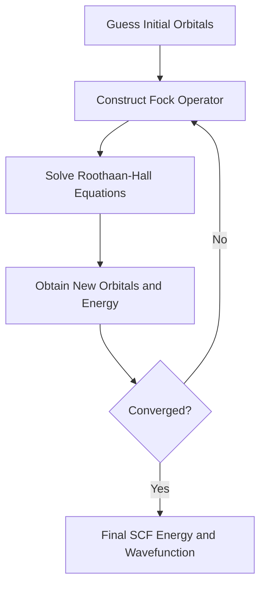

## Computational Methods for Electronic Structure

### Overview

Electronic structure methods solve (or approximate) the many-electron Schrödinger equation to predict molecular energies, geometries, and properties. Since the many-body Schrödinger equation has no closed-form analytical solution for multi-electron systems, computational chemistry relies on a hierarchy of approximations trading accuracy against computational cost.

**Key Points**

- The many-electron problem is intractable exactly due to electron-electron correlation
- Methods range from wavefunction-based (ab initio) to density-based (DFT) to empirical (semi-empirical, molecular mechanics)
- Basis sets approximate atomic orbitals as finite sums of mathematical functions
- Accuracy generally scales with computational cost; method selection balances both

### The Born-Oppenheimer Approximation

Because nuclei are far more massive than electrons, nuclear and electronic motion are separated:

$$\Psi_{total}(r,R) \approx \psi_{elec}(r;R)\chi_{nuc}(R)$$

**Key Points**

- Electrons are assumed to respond instantaneously to nuclear positions
- Electronic Schrödinger equation is solved for fixed nuclear coordinates $R$, generating a potential energy surface (PES)
- This approximation underlies essentially all standard electronic structure methods

### Hartree-Fock (HF) Theory

HF is the foundational ab initio method, approximating the many-electron wavefunction as a single Slater determinant of one-electron spin orbitals.

$$\Psi_{HF} = \frac{1}{\sqrt{N!}}\begin{vmatrix} \chi_1(1) & \chi_2(1) & \cdots \\ \chi_1(2) & \chi_2(2) & \cdots \\ \vdots & \vdots & \ddots \end{vmatrix}$$

**Key Points**

- The Slater determinant enforces antisymmetry, satisfying the Pauli exclusion principle
- Each electron moves in the *average* field of all other electrons (mean-field approximation)
- Solved self-consistently: the Fock operator depends on orbitals, which are the solution being sought

#### Self-Consistent Field (SCF) Procedure

**Key Points**

- HF neglects instantaneous electron correlation (electrons only avoid each other on average, not explicitly)
- HF energy is always above the true energy (variational upper bound)
- The difference between the HF energy and the exact non-relativistic energy is termed the "correlation energy"

### Post-Hartree-Fock (Correlated) Methods

These methods recover electron correlation missing from HF, at significantly increased computational cost.

| Method | Full Name | Scaling | Correlation Type |
| --- | --- | --- | --- |
| MP2 | Møller-Plesset 2nd order | $N^5$ | Perturbative |
| MP4 | Møller-Plesset 4th order | $N^7$ | Perturbative |
| CISD | Configuration Interaction (Singles, Doubles) | $N^6$ | Variational |
| CCSD | Coupled Cluster (Singles, Doubles) | $N^6$ | Non-variational, size-consistent |
| CCSD(T) | CCSD with perturbative Triples | $N^7$ | "Gold standard" accuracy |
| FCI | Full Configuration Interaction | Exponential | Exact within basis set |

**Key Points**

- $N$ represents system size (number of basis functions); scaling determines practical size limits
- CCSD(T) is widely regarded as the benchmark method for small-to-medium molecules when computationally feasible
- FCI is exact within a given basis set but computationally intractable beyond very small systems

**Example**

For a molecule with 50 basis functions, MP2 ($N^5$) scaling is roughly 30x more expensive than HF ($N^4$) for a proportional increase in system size, while CCSD(T) ($N^7$) becomes prohibitive for systems beyond roughly 20-30 heavy atoms on typical computing resources. [Inference] Practical size limits vary considerably with available hardware and software optimization (e.g., resolution-of-identity or local correlation approximations).

### Density Functional Theory (DFT)

DFT reformulates the electronic structure problem in terms of electron density $\rho(r)$ rather than the many-electron wavefunction, based on the Hohenberg-Kohn theorems.

$$E[\rho] = T[\rho] + V_{ne}[\rho] + V_{ee}[\rho]$$

#### Kohn-Sham Formulation

Practical DFT calculations use the Kohn-Sham approach, introducing a fictitious non-interacting reference system with the same density as the real system:

$$\left[-\frac{\hbar^2}{2m}\nabla^2 + V_{eff}(r)\right]\psi_i = \epsilon_i\psi_i$$

$$V_{eff}(r) = V_{ne}(r) + V_H(r) + V_{XC}(r)$$

where $V_{XC}$, the exchange-correlation potential, contains all many-body effects and is approximated.

#### Exchange-Correlation Functional Hierarchy ("Jacob's Ladder")

| Rung | Functional Type | Example | Ingredients |
| --- | --- | --- | --- |
| 1 | LDA (Local Density Approximation) | SVWN | Density only |
| 2 | GGA (Generalized Gradient Approximation) | PBE, BLYP | Density + gradient |
| 3 | meta-GGA | TPSS, M06-L | + kinetic energy density |
| 4 | Hybrid | B3LYP, PBE0 | + fraction of exact HF exchange |
| 5 | Double-hybrid | B2PLYP | + MP2-like correlation |

**Key Points**

- B3LYP remains one of the most widely used hybrid functionals despite known limitations (e.g., poor dispersion treatment without empirical corrections)
- DFT formally scales as $N^3$–$N^4$, making it far more affordable than post-HF methods for comparable system sizes
- DFT does not systematically improve toward the exact answer the way post-HF methods do; functional choice significantly affects accuracy for a given property, and results should be benchmarked against reliable reference data where possible

### Basis Sets

Basis sets are finite sets of mathematical functions used to represent molecular orbitals as linear combinations.

| Basis Set Type | Example | Description |
| --- | --- | --- |
| Minimal | STO-3G | One function per atomic orbital, low accuracy |
| Split-valence | 6-31G | Multiple functions for valence orbitals |
| Polarized | 6-31G(d,p) | Adds higher angular momentum functions |
| Diffuse | 6-31+G(d) | Adds diffuse functions for anions/excited states |
| Correlation-consistent | cc-pVDZ, cc-pVTZ | Systematically improvable, designed for post-HF methods |

**Key Points**

- Gaussian-type orbitals (GTOs) are used rather than Slater-type orbitals (STOs) in most codes because GTO products remain Gaussian, enabling efficient integral evaluation, despite less accurate behavior at the nucleus and long range
- Increasing basis set size (double-zeta → triple-zeta → quadruple-zeta) systematically approaches the "basis set limit"
- Basis Set Superposition Error (BSSE) can artificially stabilize interaction energies in small basis sets and is commonly corrected using the counterpoise method

### Semi-Empirical and Molecular Mechanics Methods

| Method Class | Example | Approach | Typical Use |
| --- | --- | --- | --- |
| Semi-empirical | AM1, PM6, PM7 | HF framework with empirical parameters replacing costly integrals | Large molecules, rapid screening |
| Molecular mechanics | MM2, AMBER, CHARMM | Classical force fields, no explicit electrons | Biomolecules, conformational search |
| QM/MM | Hybrid | QM region embedded in MM environment | Enzyme active sites, large systems |

### Method Accuracy vs. Cost Comparison

### Choosing a Method: Practical Considerations

**Key Points**

- Geometry optimization of moderate-sized organic molecules: DFT (e.g., B3LYP or PBE0) with a polarized basis set is a common default choice
- High-accuracy thermochemistry for small molecules: CCSD(T) with large correlation-consistent basis sets, often extrapolated to the complete basis set limit
- Large biomolecular systems: QM/MM or molecular mechanics
- Non-covalent interactions and dispersion: dispersion-corrected DFT (e.g., DFT-D3) or explicitly correlated methods

### Properties Computed from Electronic Structure Calculations

| Property | Method Requirement |
| --- | --- |
| Geometry (equilibrium structure) | Energy gradients (analytical, most methods) |
| Vibrational frequencies | Second derivatives (Hessian) |
| NMR shielding constants | GIAO-DFT or post-HF methods |
| Excitation energies | TD-DFT, CIS, EOM-CCSD |
| Reaction barriers | Transition state search + single-point refinement |

### Common Pitfalls

- Treating DFT energies from different functionals as directly comparable without benchmarking against experimental or high-level reference data
- Using too small a basis set for anions or excited states, where diffuse functions are essential
- Neglecting BSSE when comparing interaction energies computed with small basis sets
- Assuming HF results are quantitatively reliable without considering the significant errors introduced by neglecting electron correlation, particularly for systems with significant multi-reference character (e.g., biradicals, some transition metal complexes)

**Related Topics**

- Potential energy surfaces and transition state theory
- Time-dependent DFT (TD-DFT) for excited states
- Basis Set Superposition Error and counterpoise correction
- Multi-reference methods (CASSCF, CASPT2) for strongly correlated systems
- Molecular dynamics and force field parameterization
- Benchmarking and error assessment in computational thermochemistry