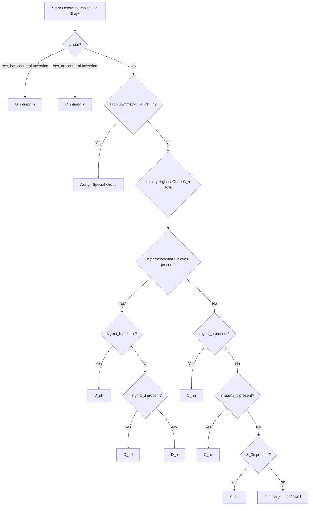

## Symmetry and Group Theory in Chemistry

### Overview

Group theory provides a rigorous mathematical framework for classifying molecular symmetry, enabling systematic predictions about spectroscopic activity, bonding, and orbital interactions without solving the full Schrödinger equation. Molecules are assigned to point groups based on their symmetry elements.

**Key Points**

- Symmetry operations leave a molecule's nuclear framework indistinguishable from its original configuration
- Symmetry elements are geometric entities (points, lines, planes) about which operations occur
- Molecules are classified into point groups based on their complete set of symmetry elements
- Group theory predicts IR/Raman activity, orbital symmetry compatibility, and optical activity

### Symmetry Elements and Operations

| Symmetry Element | Symbol | Operation | Description |
| --- | --- | --- | --- |
| Identity | $E$ | Do nothing | Every molecule possesses this |
| Proper rotation axis | $C_n$ | Rotate by $360°/n$ | Rotation returns identical structure |
| Mirror plane | $\sigma$ | Reflection | $\sigma_v$ (vertical), $\sigma_h$ (horizontal), $\sigma_d$ (dihedral) |
| Center of inversion | $i$ | Inversion through center | Each point $(x,y,z) \to (-x,-y,-z)$ |
| Improper rotation axis | $S_n$ | Rotate by $360°/n$, then reflect | Combination operation |

**Key Points**

- $C_n$ with the highest $n$ value is designated the principal axis
- $\sigma_v$ contains the principal axis; $\sigma_h$ is perpendicular to it; $\sigma_d$ bisects the angle between $C_2$ axes
- $S_1 = \sigma$ and $S_2 = i$ are special cases of improper rotation

### Point Group Assignment Workflow

### Common Point Groups in Chemistry

| Point Group | Example Molecule | Key Symmetry Elements |
| --- | --- | --- |
| $C_1$ | CHFClBr | Only $E$ (no symmetry) |
| $C_s$ | HOCl | $E$, one $\sigma$ |
| $C_{2v}$ | $H_2O$ | $E$, $C_2$, $2\sigma_v$ |
| $C_{3v}$ | $NH_3$ | $E$, $C_3$, $3\sigma_v$ |
| $D_{2h}$ | Ethylene ($C_2H_4$) | $E$, $3C_2$, $i$, $3\sigma$ |
| $D_{3h}$ | $BF_3$ | $E$, $C_3$, $3C_2$, $\sigma_h$, $3\sigma_v$, $S_3$ |
| $D_{6h}$ | Benzene | $E$, $C_6$, $6C_2$, $i$, $\sigma_h$, $3\sigma_v$, $3\sigma_d$ |
| $T_d$ | $CH_4$ | $E$, $8C_3$, $3C_2$, $6S_4$, $6\sigma_d$ |
| $O_h$ | $SF_6$ | $E$, $8C_3$, $6C_2$, $6C_4$, $3C_2'$, $i$, $6S_4$, $8S_6$, $3\sigma_h$, $6\sigma_d$ |
| $D_{\infty h}$ | $CO_2$ | $E$, $C_\infty$, $\infty\sigma_v$, $i$, $S_\infty$ |
| $C_{\infty v}$ | HCl | $E$, $C_\infty$, $\infty\sigma_v$ |

**Example**

Water ($H_2O$) has a $C_2$ axis bisecting the H-O-H angle, plus two vertical mirror planes containing that axis (one containing both H atoms' plane, one perpendicular to it), placing it in point group $C_{2v}$. This assignment directly predicts that all three vibrational modes of water are both IR and Raman active.

### Point Group Symmetry Elements (svg_diagram)

<svg xmlns="http://www.w3.org/2000/svg" viewBox="0 0 560 260">
<rect x="0" y="0" width="560" height="260" fill="var(--bg,#ffffff)" />
<text x="280" y="22" text-anchor="middle" font-size="15" font-weight="bold" fill="var(--fg,#111)">C2v Symmetry Elements of Water (svg_diagram)</text>

<circle cx="280" cy="110" r="14" fill="#dc2626" />
<text x="280" y="115" text-anchor="middle" font-size="11" fill="#fff">O</text>

<circle cx="220" cy="170" r="10" fill="#e5e7eb" stroke="#333" />
<text x="220" y="174" text-anchor="middle" font-size="10" fill="#333">H</text>
<circle cx="340" cy="170" r="10" fill="#e5e7eb" stroke="#333" />
<text x="340" y="174" text-anchor="middle" font-size="10" fill="#333">H</text>

<line x1="280" y1="110" x2="220" y2="170" stroke="var(--fg,#333)" stroke-width="2" />
<line x1="280" y1="110" x2="340" y2="170" stroke="var(--fg,#333)" stroke-width="2" />

<line x1="280" y1="40" x2="280" y2="230" stroke="#2563eb" stroke-width="2" stroke-dasharray="5,3" />
<text x="290" y="45" font-size="12" fill="#2563eb">C2 axis</text>

<line x1="150" y1="230" x2="410" y2="230" stroke="#16a34a" stroke-width="2" stroke-dasharray="2,2" />
<text x="415" y="235" font-size="12" fill="#16a34a">sigma_v (plane)</text>
</svg>

### Character Tables

A character table summarizes how each symmetry operation transforms basis functions, organized by irreducible representations (irreps).

**Example**

The $C_{2v}$ character table:

| $C_{2v}$ | $E$ | $C_2$ | $\sigma_v(xz)$ | $\sigma_v'(yz)$ | Linear/Rotation | Quadratic |
| --- | --- | --- | --- | --- | --- | --- |
| $A_1$ | 1 | 1 | 1 | 1 | $z$ | $x^2, y^2, z^2$ |
| $A_2$ | 1 | 1 | -1 | -1 | $R_z$ | $xy$ |
| $B_1$ | 1 | -1 | 1 | -1 | $x, R_y$ | $xz$ |
| $B_2$ | 1 | -1 | -1 | 1 | $y, R_x$ | $yz$ |

**Key Points**

- Each row is an irreducible representation; each column is a class of symmetry operations
- Characters (the table values) indicate how a basis function transforms under each operation
- The rightmost columns show which irrep corresponds to translations ($x,y,z$), rotations ($R_x,R_y,R_z$), and quadratic functions — directly indicating IR ($x,y,z$) and Raman (quadratic terms) activity

### Reducible to Irreducible Representation Reduction

To determine the symmetry of a set of basis functions (e.g., molecular vibrations, ligand orbitals), a reducible representation $\Gamma$ is decomposed using:

$$n_i = \frac{1}{h}\sum_{R} g(R)\chi(R)\chi_i(R)$$

where $h$ is the order of the group, $g(R)$ is the number of operations in class $R$, $\chi(R)$ is the character of the reducible representation, and $\chi_i(R)$ is the character of irrep $i$.

### Applications in Chemistry

#### Vibrational Spectroscopy

**Key Points**

- Group theory determines which vibrational modes are IR-active (transform as $x, y, z$) and Raman-active (transform as quadratic functions)
- The Mutual Exclusion Rule applies to centrosymmetric molecules: modes active in IR are inactive in Raman and vice versa
- Total number of vibrational modes: $3N-6$ (nonlinear) or $3N-5$ (linear), where $N$ is the number of atoms

**Example**

$CO_2$ ($D_{\infty h}$, centrosymmetric) has the symmetric stretch as Raman-active only (it is symmetric with respect to inversion), while the asymmetric stretch and bending modes are IR-active only — a direct consequence of the mutual exclusion rule arising from the molecule's center of inversion.

#### Molecular Orbital Symmetry

- Only atomic orbitals or SALCs belonging to the same irreducible representation can combine to form molecular orbitals with nonzero overlap
- This principle underlies construction of MO diagrams for polyatomic molecules and transition metal complexes

#### Optical Activity (Chirality)

**Key Points**

- A molecule is chiral (optically active) only if it lacks any improper symmetry element ($S_n$, including $\sigma = S_1$ and $i = S_2$)
- Point groups $C_1$, $C_n$, and $D_n$ (containing only proper rotations) are compatible with chirality
- Presence of any mirror plane or inversion center renders a molecule achiral

### Reducible Representation Example: Water Vibrations

**Example**

For water's 3 atoms, the reducible representation for all atomic motion (9 degrees of freedom) under $C_{2v}$ reduces to $3A_1 + A_2 + 2B_1 + 3B_2$. Removing translations ($A_1+B_1+B_2$) and rotations ($A_2+B_1+B_2$) leaves the vibrational representation $\Gamma_{vib} = 2A_1 + B_2$ — two symmetric stretches/bends of $A_1$ symmetry and one asymmetric stretch of $B_2$ symmetry, all IR and Raman active in this non-centrosymmetric point group.

### Common Pitfalls

- Confusing $\sigma_v$ and $\sigma_d$ classification, which depends on whether the plane contains the principal axis and bisects perpendicular $C_2$ axes versus atoms
- Forgetting to subtract translational and rotational degrees of freedom when determining the true vibrational representation
- Applying the mutual exclusion rule to non-centrosymmetric molecules, where it does not apply
- Misidentifying the principal axis when multiple $C_n$ axes of different order are present (the principal axis is always the highest-order one)

**Related Topics**

- Molecular orbital construction using SALCs
- Vibrational spectroscopy selection rules (IR and Raman)
- Ligand field theory and crystal field splitting
- Chirality and stereochemistry
- Character table derivation and reducible representations
- Symmetry in crystallography and space groups