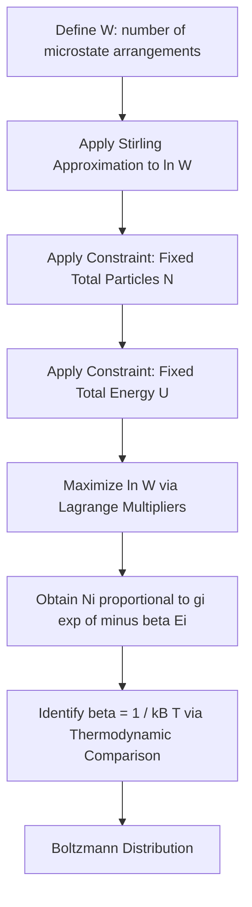

## The Boltzmann Distribution

### Overview

The Boltzmann distribution describes how particles in a system at thermal equilibrium are distributed among available energy states. It is the foundational statistical relationship connecting microscopic energy states to macroscopic thermodynamic properties.

**Key Points**

- Derived from maximizing the number of microstates (entropy) subject to fixed total energy and particle number
- Applies to systems of distinguishable or indistinguishable non-interacting particles at thermal equilibrium
- Higher-energy states are exponentially less populated than lower-energy states
- Forms the basis for statistical thermodynamics, spectroscopic intensity predictions, and reaction rate theory

### Statement of the Distribution

The population ratio between two energy states is:

$$\frac{N_i}{N_j} = \frac{g_i}{g_j}e^{-(E_i-E_j)/k_BT}$$

The absolute population of state $i$ relative to the total number of particles $N$ is:

$$\frac{N_i}{N} = \frac{g_i e^{-E_i/k_BT}}{q}$$

where $q$ is the molecular partition function:

$$q = \sum_i g_i e^{-E_i/k_BT}$$

**Key Points**

- $g_i$ is the degeneracy (number of states with the same energy $E_i$)
- $k_B$ is the Boltzmann constant ($1.381 \times 10^{-23}$ J/K)
- $T$ is absolute temperature in Kelvin
- The partition function $q$ acts as a normalization constant, summing Boltzmann factors over all accessible states

### Derivation Logic

#### Maximizing Configurational Entropy

The number of ways $W$ to distribute $N$ distinguishable particles among energy levels with populations $\{N_i\}$ is:

$$W = \frac{N!}{N_0! N_1! N_2! \cdots}$$

Maximizing $\ln W$ (using Stirling's approximation) subject to the constraints of fixed total particles ($\sum N_i = N$) and fixed total energy ($\sum N_iE_i = U$), via the method of Lagrange multipliers, yields the Boltzmann distribution. The Lagrange multiplier associated with the energy constraint is identified as $-1/k_BT$ through comparison with classical thermodynamics.

### The Partition Function

The partition function $q$ quantifies the number of thermally accessible states at a given temperature — effectively counting how many states are "available" for particles to occupy.

**Key Points**

- At $T \to 0$: $q \to g_0$ (only the ground state degeneracy is accessible)
- At $T \to \infty$: $q \to \infty$ (all states become equally accessible)
- $q$ is dimensionless and depends on the choice of energy zero (conventionally the ground state)

#### Molecular Partition Function Factorization

For a molecule, if energy contributions are independent (separable Hamiltonian), the total partition function factors:

$$q = q_{trans} \cdot q_{rot} \cdot q_{vib} \cdot q_{elec}$$

| Contribution | Typical Formula | Energy Scale |
| --- | --- | --- |
| Translational | $q_{trans} = \left(\frac{2\pi mk_BT}{h^2}\right)^{3/2}V$ | Small spacing, classical limit typically valid |
| Rotational | $q_{rot} = \frac{k_BT}{\sigma hcB}$ (linear molecule, high-T) | Small–moderate spacing |
| Vibrational | $q_{vib} = \frac{1}{1-e^{-h\nu/k_BT}}$ | Larger spacing |
| Electronic | $q_{elec} = g_0 + g_1e^{-\Delta E/k_BT}+...$ | Largest spacing, often $q_{elec}\approx g_0$ at room T |

### Example: Two-Level System

**Example**

Consider a system with a ground state ($E_0 = 0$, $g_0=1$) and excited state ($E_1 = \varepsilon$, $g_1=1$). The population ratio is:

$$\frac{N_1}{N_0} = e^{-\varepsilon/k_BT}$$

At room temperature ($T=298$ K, $k_BT \approx 207$ cm⁻¹ in spectroscopic units), for an excited state at $\varepsilon = 500$ cm⁻¹ above the ground state:

$$\frac{N_1}{N_0} = e^{-500/207} \approx 0.089$$

Only about 8.9% of the population occupies the excited state relative to the ground state — illustrating why most molecules populate their vibrational ground state at room temperature, since typical vibrational spacings (~1000+ cm⁻¹) are much larger than $k_BT$ (~200 cm⁻¹).

### Applications in Chemistry

#### Rotational Population Distributions

Rotational energy levels are closely spaced, so multiple rotational states are populated at room temperature, producing the characteristic rotational fine structure and intensity envelope in rotational/vibrational spectra. The most populated rotational level $J_{max}$ can be found by maximizing $N_J \propto (2J+1)e^{-E_J/k_BT}$:

$$J_{max} = \sqrt{\frac{k_BT}{2hcB}} - \frac{1}{2}$$

**Key Points**

- The $(2J+1)$ degeneracy factor competes with the exponential decay, producing a population maximum at nonzero $J$ rather than monotonic decrease
- This explains the characteristic intensity envelope observed in rotational spectra and rotational fine structure of vibrational bands

#### Vibrational Population and Spectroscopic Intensity

**Key Points**

- Boltzmann populations determine relative intensities of hot bands in IR/Raman spectra
- Anti-Stokes Raman lines arise from transitions out of thermally populated excited vibrational states, so their intensity relative to Stokes lines directly reflects the Boltzmann population ratio
- Electronic transitions typically originate almost entirely from the ground state at room temperature due to large electronic energy gaps relative to $k_BT$

#### Chemical Equilibrium and Reaction Rates

The Boltzmann distribution underlies the Arrhenius equation and transition state theory: the fraction of molecular collisions with sufficient energy to overcome an activation barrier $E_a$ scales as $e^{-E_a/k_BT}$, directly derived from Boltzmann statistics applied to a continuous (Maxwell-Boltzmann) energy distribution.

### Boltzmann Population vs. Temperature (svg_diagram)

<svg xmlns="http://www.w3.org/2000/svg" viewBox="0 0 600 320">
<rect x="0" y="0" width="600" height="320" fill="var(--bg,#ffffff)" />
<text x="300" y="22" text-anchor="middle" font-size="15" font-weight="bold" fill="var(--fg,#111)">Relative Population vs Temperature (svg_diagram)</text>
<line x1="80" y1="270" x2="560" y2="270" stroke="var(--fg,#333)" stroke-width="2" />
<line x1="80" y1="270" x2="80" y2="50" stroke="var(--fg,#333)" stroke-width="2" />
<text x="320" y="300" text-anchor="middle" font-size="12" fill="var(--fg,#333)">Temperature (T)</text>
<text x="35" y="160" text-anchor="middle" font-size="12" fill="var(--fg,#333)" transform="rotate(-90,35,160)">N1/N0</text>

<path d="M 80 268 Q 200 250 320 180 Q 440 110 560 90" fill="none" stroke="#2563eb" stroke-width="2.5" />

<line x1="80" y1="75" x2="560" y2="75" stroke="var(--fg,#999)" stroke-width="1" stroke-dasharray="4,3" />
<text x="500" y="68" font-size="11" fill="var(--fg,#666)">g1/g0 limit (T to infinity)</text>

<text x="90" y="280" font-size="11" fill="var(--fg,#333)">T=0</text>

</svg>

### Maxwell-Boltzmann Speed Distribution

For translational motion in an ideal gas, the Boltzmann distribution over continuous momentum states yields the Maxwell-Boltzmann speed distribution:

$$f(v) = 4\pi\left(\frac{m}{2\pi k_BT}\right)^{3/2}v^2e^{-mv^2/2k_BT}$$

**Key Points**

- Most probable speed: $v_p = \sqrt{2k_BT/m}$
- Mean speed: $\bar{v} = \sqrt{8k_BT/\pi m}$
- Root-mean-square speed: $v_{rms} = \sqrt{3k_BT/m}$
- These three characteristic speeds satisfy $v_p < \bar{v} < v_{rms}$

### Connection to Thermodynamic Properties

Once $q$ is known, macroscopic thermodynamic functions can be derived:

$$U - U(0) = Nk_BT^2\left(\frac{\partial \ln q}{\partial T}\right)_V$$

$$A = -k_BT\ln Q \quad \text{(Helmholtz energy, } Q \text{ = system partition function)}$$

$$S = \frac{U-U(0)}{T} + k_B\ln Q$$

**Key Points**

- For distinguishable particles, $Q = q^N$; for indistinguishable particles (ideal gas), $Q = q^N/N!$
- The $N!$ correction accounts for overcounting identical particle permutations and resolves the Gibbs paradox
- This provides a direct bridge from molecular-level partition functions to bulk thermodynamic quantities

### Common Pitfalls

- Forgetting to include degeneracy $g_i$ when comparing populations of states with different multiplicities
- Applying the distinguishable-particle partition function ($Q = q^N$) to indistinguishable gas-phase molecules, leading to the Gibbs paradox
- Assuming all energy level spacings are small compared to $k_BT$; this holds for translational/rotational levels at room temperature but generally fails for vibrational and electronic levels
- Confusing the Boltzmann distribution (equilibrium population over discrete/continuous states) with the Maxwell-Boltzmann distribution (specifically the continuous speed/velocity distribution derived from it)

**Related Topics**

- Partition functions and their factorization (translational, rotational, vibrational, electronic)
- Maxwell-Boltzmann speed distribution and kinetic theory of gases
- Statistical thermodynamics: entropy, Helmholtz energy, and equilibrium constants
- Transition state theory and the Arrhenius equation
- Rotational and vibrational spectroscopy intensity patterns
- Bose-Einstein and Fermi-Dirac statistics (quantum statistics beyond Boltzmann)