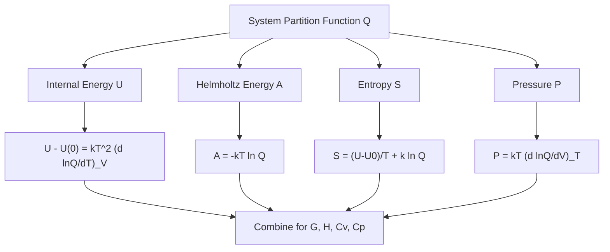

## Partition Functions

### Overview

The partition function is the central mathematical object in statistical mechanics, encoding how a system's total energy is distributed among its accessible microstates at a given temperature. It serves as the bridge connecting microscopic quantum states to macroscopic thermodynamic observables.

**Key Points**

- The partition function $q$ (molecular) or $Q$ (system) sums Boltzmann factors over all accessible states
- Once known, all thermodynamic functions (U, S, A, G, Cv) can be derived from $q$ or $Q$ via standard relations
- For independent, separable energy modes, the total partition function factors into translational, rotational, vibrational, and electronic contributions
- Distinguishability of particles determines the relationship between $q$ (single particle) and $Q$ (N particles)

### Definition

For a single molecule with energy levels $E_i$ and degeneracies $g_i$:

$$q = \sum_i g_i e^{-E_i/k_BT}$$

For a system of $N$ particles:

$$Q = \sum_j e^{-E_j/k_BT}$$

where the sum runs over all system microstates $j$ (not molecular states).

**Key Points**

- For $N$ **distinguishable**, non-interacting particles: $Q = q^N$
- For $N$ **indistinguishable**, non-interacting particles (ideal gas): $Q = \frac{q^N}{N!}$
- The $N!$ correction avoids overcounting permutations of identical particles among the same set of occupied states, resolving the Gibbs paradox

### Factorization of the Molecular Partition Function

When the molecular Hamiltonian separates into independent contributions (Born-Oppenheimer + separable nuclear motion approximation):

$$q = q_{trans} \cdot q_{rot} \cdot q_{vib} \cdot q_{elec} \cdot q_{nuc}$$

$$E_{total} = E_{trans} + E_{rot} + E_{vib} + E_{elec} + E_{nuc}$$

**Key Points**

- Factorization requires that each energy mode is independent of the others (an approximation; rovibrational coupling exists in reality but is often small)
- Nuclear spin partition function $q_{nuc}$ is typically treated as constant and often omitted from thermodynamic calculations since nuclear spin states are rarely thermally accessible or relevant to the property of interest
- The choice of energy zero (usually the ground state of each mode) affects the numerical value of each factor

### Translational Partition Function

For a particle in a 3D box (particle-in-a-box states in the classical/continuum limit):

$$q_{trans} = \left(\frac{2\pi mk_BT}{h^2}\right)^{3/2}V$$

**Key Points**

- Derived by converting the discrete sum over particle-in-a-box states to an integral, valid because translational energy spacing is minute compared to $k_BT$ at ordinary conditions
- Scales with molecular mass ($m^{3/2}$) and volume ($V$)
- Typically the dominant contribution to $q$, often on the order of $10^{24}$–$10^{30}$ for molecules in macroscopic volumes at room temperature

**Example**

For $N_2$ ($m = 4.65\times10^{-26}$ kg) in a 1 L container at 298 K:

$$q_{trans} = \left(\frac{2\pi(4.65\times10^{-26})(1.381\times10^{-23})(298)}{(6.626\times10^{-34})^2}\right)^{3/2}(1\times10^{-3}\text{ m}^3) \approx 2.3\times10^{30}$$

This enormous value reflects the vast number of thermally accessible translational states, consistent with the near-continuous nature of translational energy at macroscopic scales.

### Rotational Partition Function

#### Linear Molecules (High-Temperature Approximation)

$$q_{rot} = \frac{k_BT}{\sigma hcB} = \frac{T}{\sigma\Theta_{rot}}$$

where $B$ is the rotational constant (cm⁻¹), $\sigma$ is the symmetry number, and $\Theta_{rot} = hcB/k_B$ is the rotational temperature.

#### Nonlinear Polyatomic Molecules

$$q_{rot} = \frac{\sqrt{\pi}}{\sigma}\left(\frac{T^3}{\Theta_A\Theta_B\Theta_C}\right)^{1/2}$$

using the three rotational temperatures corresponding to the three principal moments of inertia.

**Key Points**

- The symmetry number $\sigma$ accounts for indistinguishable orientations reached by proper rotation (e.g., $\sigma=2$ for homonuclear diatomics, $\sigma=12$ for $CH_4$, $\sigma=2$ for $H_2O$)
- The high-temperature approximation (replacing sum with integral) is valid when $T \gg \Theta_{rot}$, generally true at room temperature for all but the lightest molecules (e.g., $H_2$ requires care due to its large rotational spacing)
- Omitting or misassigning $\sigma$ is a common source of error in entropy calculations

| Molecule | $\Theta_{rot}$ (K) | Symmetry Number $\sigma$ |
| --- | --- | --- |
| $H_2$ | 87.6 | 2 |
| $N_2$ | 2.88 | 2 |
| $CO$ | 2.77 | 1 |
| $H_2O$ | ~40 (avg.) | 2 |

### Vibrational Partition Function

Treating each vibrational mode as a quantum harmonic oscillator, measured relative to its zero-point energy:

$$q_{vib} = \frac{1}{1-e^{-h\nu/k_BT}} = \frac{1}{1-e^{-\Theta_{vib}/T}}$$

For a polyatomic molecule with $3N-6$ (nonlinear) or $3N-5$ (linear) normal modes, the total vibrational partition function is the product over all modes:

$$q_{vib,total} = \prod_k \frac{1}{1-e^{-\Theta_{vib,k}/T}}$$

**Key Points**

- Unlike translation/rotation, vibrational spacings ($\Theta_{vib}$ typically 300–5000 K) are often comparable to or larger than room temperature, so $q_{vib}$ is frequently close to 1 (only the ground vibrational state significantly populated)
- Low-frequency "floppy" modes (e.g., torsions) can contribute substantially even at room temperature
- The choice of energy reference (bottom of the well vs. zero-point level) shifts the numerical value; consistency matters when combining with electronic energy terms

**Example**

For a vibrational mode at $\tilde{\nu} = 500$ cm⁻¹ ($\Theta_{vib} \approx 719$ K) at $T=298$ K:

$$q_{vib} = \frac{1}{1-e^{-719/298}} \approx \frac{1}{1-0.0893} \approx 1.098$$

Compare this to a high-frequency mode at $\tilde{\nu}=3000$ cm⁻¹ ($\Theta_{vib}\approx4318$ K), which gives $q_{vib} \approx 1.00002$ — essentially frozen in its ground state at room temperature, illustrating why C-H stretching modes contribute negligibly to vibrational partition functions near 298 K while low-frequency skeletal bends contribute significantly.

### Electronic Partition Function

$$q_{elec} = g_0e^{-E_0/k_BT} + g_1e^{-E_1/k_BT} + ...$$

Setting $E_0 = 0$ (ground state as reference):

$$q_{elec} = g_0 + g_1e^{-\Delta E_{01}/k_BT} + ...$$

**Key Points**

- For most closed-shell molecules, $g_0 = 1$ and low-lying excited electronic states are far above $k_BT$, so $q_{elec}\approx 1$
- Open-shell species (radicals, transition metal complexes with low-lying states) can have $g_0 > 1$ (spin degeneracy) or significant excited-state contributions
- $q_{elec}$ is typically the smallest-magnitude but occasionally most consequential factor for species with near-degenerate ground states

### Partition Function Component Summary

| Mode | Typical Magnitude (room T) | Energy Level Spacing |
| --- | --- | --- |
| Translational | $10^{24}$–$10^{30}$ | Extremely small (quasi-continuous) |
| Rotational | $10$–$1000$ | Small |
| Vibrational | $\approx 1$–$10$ per mode | Large (often $> k_BT$) |
| Electronic | Usually $\approx g_0$ (often 1) | Very large (usually $\gg k_BT$) |

### Thermodynamic Properties from Q

### Key Thermodynamic Relations

$$U - U(0) = k_BT^2\left(\frac{\partial \ln Q}{\partial T}\right)_V$$

$$A = -k_BT\ln Q$$

$$S = \frac{U-U(0)}{T} + k_B\ln Q$$

$$p = k_BT\left(\frac{\partial \ln Q}{\partial V}\right)_T$$

For an ideal gas ($Q = q^N/N!$), applying Stirling's approximation ($\ln N! \approx N\ln N - N$) gives the **Sackur-Tetrode equation** for translational entropy:

$$S_{trans} = Nk_B\left[\ln\left(\frac{q_{trans}}{N}\right)+\frac{5}{2}\right]$$

### Applications

#### Equilibrium Constants from Partition Functions

Statistical thermodynamics allows direct calculation of equilibrium constants from molecular partition functions:

$$K = \frac{(q_C/V)^c(q_D/V)^d}{(q_A/V)^a(q_B/V)^b}e^{-\Delta E_0/k_BT}$$

for a reaction $aA + bB \rightleftharpoons cC + dD$, where $\Delta E_0$ is the reaction energy difference at 0 K (including zero-point energies).

#### Heat Capacity

$$C_V = \left(\frac{\partial U}{\partial T}\right)_V$$

Each mode contributes to $C_V$ according to the equipartition theorem in the classical limit: $\frac{1}{2}k_B$ per quadratic degree of freedom. Translational modes contribute $\frac{3}{2}k_B$ per particle; rotational modes contribute $k_B$ (linear) or $\frac{3}{2}k_B$ (nonlinear) at high temperature; vibrational modes contribute $k_B$ per mode only when fully classically excited ($T \gg \Theta_{vib}$), and less otherwise — this is why vibrational contributions to heat capacity "freeze out" at low temperature.

### Common Pitfalls

- Forgetting the $N!$ correction for indistinguishable particles, leading to non-extensive (unphysical) entropy — the Gibbs paradox
- Neglecting or misassigning the rotational symmetry number $\sigma$, causing systematic errors in calculated entropy
- Applying the high-temperature (integral) approximation for $q_{rot}$ to very light molecules like $H_2$ or $D_2$ at low temperature, where the discrete sum must be used instead
- Mixing energy reference points inconsistently between electronic and vibrational contributions (zero-point energy inclusion/exclusion) when combining partition function factors

**Related Topics**

- The Boltzmann distribution and population analysis
- Sackur-Tetrode equation and translational entropy
- Statistical thermodynamics of chemical equilibrium
- Equipartition theorem and heat capacity
- Rotational and vibrational spectroscopy (rotational/vibrational temperatures)
- Residual entropy and the third law of thermodynamics