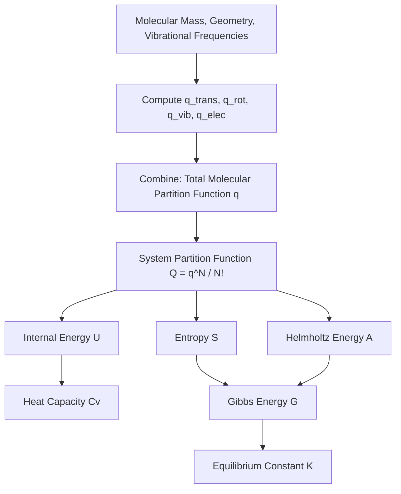

## Statistical Thermodynamics of Gases

### Overview

Statistical thermodynamics of gases applies partition function methods specifically to gas-phase systems, deriving macroscopic thermodynamic quantities (energy, entropy, heat capacity, equilibrium constants) directly from molecular-level properties: mass, geometry, vibrational frequencies, and electronic structure.

**Key Points**

- Gas-phase molecules are treated as indistinguishable, non-interacting particles (ideal gas approximation)
- The system partition function $Q = q^N/N!$ underlies all gas-phase statistical thermodynamic derivations
- Each energy mode (translational, rotational, vibrational, electronic) contributes additively to thermodynamic functions
- This framework enables calculation of thermodynamic properties from spectroscopic and computational data without direct calorimetric measurement

### The Ideal Gas Partition Function

For $N$ indistinguishable, non-interacting gas molecules:

$$Q = \frac{q^N}{N!}, \qquad q = q_{trans}\,q_{rot}\,q_{vib}\,q_{elec}$$

Using Stirling's approximation ($\ln N! \approx N\ln N - N$):

$$\ln Q = N\ln q - \ln N! \approx N\ln q - N\ln N + N = N\ln\left(\frac{q}{N}\right) + N$$

This form is the starting point for all thermodynamic derivations below.

### Internal Energy

$$U - U(0) = k_BT^2\left(\frac{\partial \ln Q}{\partial T}\right)_V = Nk_BT^2\left(\frac{\partial \ln q}{\partial T}\right)_V$$

Since $q = q_{trans}q_{rot}q_{vib}q_{elec}$, and $\ln q$ is a sum of logarithms, $U-U(0)$ separates additively:

$$U - U(0) = U_{trans} + U_{rot} + U_{vib} + U_{elec}$$

| Contribution | Formula (per mole) | Regime |
| --- | --- | --- |
| Translational | $U_{trans} = \frac{3}{2}RT$ | Always (classical limit valid) |
| Rotational (linear) | $U_{rot} = RT$ | High-T limit |
| Rotational (nonlinear) | $U_{rot} = \frac{3}{2}RT$ | High-T limit |
| Vibrational | $U_{vib} = R\sum_k\frac{\Theta_{vib,k}}{e^{\Theta_{vib,k}/T}-1}$ | Mode-dependent |
| Electronic | $U_{elec} \approx 0$ | Usually negligible unless low-lying states exist |

**Key Points**

- Translational and (high-temperature) rotational contributions follow the classical equipartition theorem exactly
- Vibrational contributions require the full quantum expression because vibrational spacings are often comparable to or larger than $k_BT$
- The equipartition value for full vibrational excitation ($RT$ per mode) is only approached when $T \gg \Theta_{vib}$

### Heat Capacity ($C_V$)

$$C_V = \left(\frac{\partial U}{\partial T}\right)_V$$

| Contribution | $C_V$ (per mole) |
| --- | --- |
| Translational | $\frac{3}{2}R$ |
| Rotational (linear) | $R$ |
| Rotational (nonlinear) | $\frac{3}{2}R$ |
| Vibrational (per mode, general) | $R\left(\frac{\Theta_{vib}}{T}\right)^2\frac{e^{\Theta_{vib}/T}}{(e^{\Theta_{vib}/T}-1)^2}$ |
| Vibrational (high-T limit) | $R$ per mode |

**Example**

For $N_2$ gas at room temperature (298 K), with $\Theta_{vib} \approx 3374$ K (vibrational wavenumber ~2359 cm⁻¹):

$$\frac{\Theta_{vib}}{T} = \frac{3374}{298} \approx 11.3$$

Since this ratio is large, the vibrational contribution to $C_V$ is essentially zero at room temperature — the vibrational mode is "frozen out." This explains why diatomic gas $C_V$ near room temperature is well-approximated by $\frac{3}{2}R + R = \frac{5}{2}R$ (translation + rotation only), consistent with classical kinetic theory predictions, only rising toward $\frac{7}{2}R$ at much higher temperatures where the vibrational mode becomes thermally active.

### Vibrational Contribution to Heat Capacity (svg_diagram)

<svg xmlns="http://www.w3.org/2000/svg" viewBox="0 0 600 300">
<rect x="0" y="0" width="600" height="300" fill="var(--bg,#ffffff)" />
<text x="300" y="22" text-anchor="middle" font-size="15" font-weight="bold" fill="var(--fg,#111)">Cv Vibrational Contribution vs T/Theta_vib (svg_diagram)</text>
<line x1="80" y1="250" x2="560" y2="250" stroke="var(--fg,#333)" stroke-width="2" />
<line x1="80" y1="250" x2="80" y2="50" stroke="var(--fg,#333)" stroke-width="2" />
<text x="320" y="280" text-anchor="middle" font-size="12" fill="var(--fg,#333)">T / Theta_vib</text>
<text x="35" y="150" text-anchor="middle" font-size="12" fill="var(--fg,#333)" transform="rotate(-90,35,150)">Cv,vib / R</text>
<path d="M 80 248 Q 200 245 280 200 Q 380 120 560 65" fill="none" stroke="#dc2626" stroke-width="2.5" />
<line x1="80" y1="65" x2="560" y2="65" stroke="var(--fg,#999)" stroke-width="1" stroke-dasharray="4,3" />
<text x="480" y="58" font-size="11" fill="var(--fg,#666)">Classical limit = R</text>

<text x="90" y="262" font-size="11" fill="var(--fg,#333)">Frozen out</text>

</svg>

### Entropy

$$S = \frac{U-U(0)}{T} + k_B\ln Q$$

For the translational contribution specifically, applying the ideal gas partition function gives the **Sackur-Tetrode equation**:

$$S_{trans} = R\left[\ln\left(\frac{q_{trans}}{N}\right)+\frac{5}{2}\right] = R\ln\left[\left(\frac{2\pi mk_BT}{h^2}\right)^{3/2}\frac{k_BT}{p}\right] + \frac{5}{2}R$$

(using $V = Nk_BT/p$ for an ideal gas)

Rotational entropy (linear molecule, high-T):

$$S_{rot} = R\left[\ln\left(\frac{T}{\sigma\Theta_{rot}}\right)+1\right]$$

Vibrational entropy per mode:

$$S_{vib} = R\left[\frac{\Theta_{vib}/T}{e^{\Theta_{vib}/T}-1} - \ln(1-e^{-\Theta_{vib}/T})\right]$$

**Key Points**

- Translational entropy typically dominates total molar entropy for gas-phase species at room temperature and standard pressure
- Rotational entropy is generally the second-largest contribution
- Vibrational entropy contributions are small unless low-frequency modes are present (large-amplitude torsions, weak bonds)

**Example**

For $N_2$ at 298 K and 1 bar, statistical thermodynamics predicts a standard molar entropy of approximately 191.6 J/(mol·K), in close agreement with the calorimetrically measured value — a well-known validation of the statistical thermodynamic approach for simple diatomic gases with no residual (zero-temperature) entropy.

### Gibbs Energy and Equilibrium Constants

$$G - G(0) = -RT\ln\left(\frac{q_m}{N_A}\right) \quad \text{(per mole, } q_m \text{ = molar partition function)}$$

For a gas-phase reaction $aA + bB \rightleftharpoons cC + dD$, the equilibrium constant is calculated directly from molecular partition functions:

$$K_p = \left(\frac{q_C^\circ}{N_A}\right)^c\left(\frac{q_D^\circ}{N_A}\right)^d\left(\frac{q_A^\circ}{N_A}\right)^{-a}\left(\frac{q_B^\circ}{N_A}\right)^{-b}e^{-\Delta_rE_0/RT}$$

where $\Delta_rE_0$ is the reaction energy at 0 K (including zero-point vibrational energy differences) and $q^\circ$ denotes the standard-state molar partition function.

**Key Points**

- This provides a fully first-principles route to equilibrium constants, requiring only molecular mass, geometry, vibrational frequencies, and electronic energies (obtainable from spectroscopy or quantum chemistry calculations)
- Isotope effects on equilibrium constants (e.g., H/D exchange equilibria) arise primarily through mass-dependent differences in $q_{trans}$, $q_{rot}$, and especially $q_{vib}$ (zero-point energy differences)

### Real Gas Corrections

**Key Points**

- The ideal gas statistical treatment neglects intermolecular interactions
- At high pressure or low temperature, deviations from ideal gas behavior require corrections via the virial equation of state or explicit intermolecular potential models
- [Inference] The magnitude of correction needed depends strongly on the specific gas and conditions; light, weakly interacting gases (He, H₂) remain well-described by the ideal treatment over a wider range than more polarizable or hydrogen-bonding species

### Workflow: From Molecular Data to Thermodynamic Properties

### Summary Table: Additive Contributions

| Property | Translational | Rotational | Vibrational | Electronic |
| --- | --- | --- | --- | --- |
| $U$ | $\frac{3}{2}RT$ | $RT$ or $\frac{3}{2}RT$ | Mode-dependent | ~0 (usually) |
| $C_V$ | $\frac{3}{2}R$ | $R$ or $\frac{3}{2}R$ | Mode-dependent | ~0 (usually) |
| $S$ | Dominant term | Significant | Small (unless low-freq) | Small (unless degenerate) |

### Common Pitfalls

- Assuming full classical equipartition ($R$ per vibrational mode) applies at room temperature — most vibrational modes remain substantially frozen out unless $\Theta_{vib} \ll T$
- Neglecting the symmetry number $\sigma$ in rotational entropy calculations, causing systematic entropy errors, particularly for symmetric molecules
- Applying ideal gas statistical thermodynamics without correction to systems at high pressure or low temperature where non-ideality is significant
- Forgetting that zero-point vibrational energy must be included consistently when computing $\Delta_rE_0$ for equilibrium constant calculations

**Related Topics**

- Partition functions and their factorization
- The Boltzmann distribution
- Sackur-Tetrode equation and translational entropy
- Equilibrium constants from statistical thermodynamics
- Equipartition theorem and heat capacity limits
- Third law of thermodynamics and residual entropy