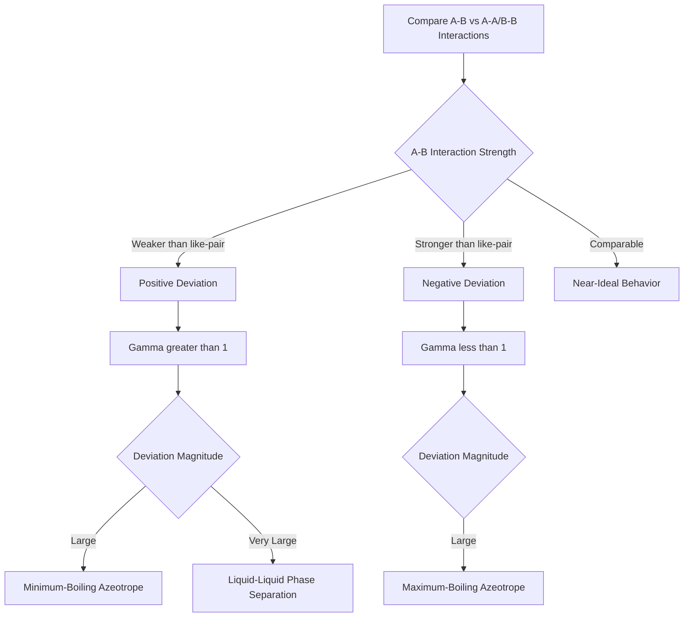

## Deviations from Ideal Solution Behavior

### Overview

Real solutions deviate from ideal (Raoult's law) behavior due to differences in intermolecular interactions between unlike and like molecules. These deviations are quantified using activity coefficients and are essential for accurately predicting phase equilibria, colligative properties, and separation processes.

**Key Points**

- Ideal solutions assume identical intermolecular forces between all molecular pairs (A-A, B-B, A-B)
- Real deviations arise when A-B interactions differ energetically from A-A and B-B interactions
- Positive deviations occur when A-B interactions are weaker than like-pair interactions
- Negative deviations occur when A-B interactions are stronger than like-pair interactions

### Ideal Solution Reference: Raoult's Law

For an ideal solution, the partial vapor pressure of each component is proportional to its mole fraction in solution:

$$p_A = x_A p_A^*$$

where $p_A^*$ is the vapor pressure of pure $A$. Ideal behavior requires that $A$-$B$ interactions be energetically indistinguishable from $A$-$A$ and $B$-$B$ interactions (comparable molecular size, shape, and polarity).

### Activity and Activity Coefficient

Deviations are formally captured by introducing activity $a_A$ and activity coefficient $\gamma_A$:

$$p_A = a_A p_A^* = \gamma_A x_A p_A^*$$

**Key Points**

- $\gamma_A = 1$ recovers ideal (Raoult's law) behavior
- $\gamma_A > 1$: positive deviation (actual vapor pressure exceeds ideal prediction)
- $\gamma_A < 1$: negative deviation (actual vapor pressure is less than ideal prediction)
- $\gamma_A \to 1$ as $x_A \to 1$ (Raoult's law is recovered in the dilute-solvent limit)

### Molecular Origin of Deviations

#### Positive Deviations

Occur when solute-solvent interactions are **weaker** than solute-solute and solvent-solvent interactions, making escape into the vapor phase more favorable than the ideal case predicts.

**Example**

Ethanol-water mixtures show positive deviation: hydrogen bonding in pure ethanol and pure water is partially disrupted upon mixing, since ethanol's hydrophobic ethyl group interferes with water's hydrogen-bond network. This weaker effective A-B interaction increases the escaping tendency of both components relative to the ideal prediction, and the system exhibits a minimum-boiling azeotrope.

#### Negative Deviations

Occur when solute-solvent interactions are **stronger** than solute-solute and solvent-solvent interactions, suppressing the escaping tendency below the ideal prediction.

**Example**

Acetone-chloroform mixtures show negative deviation due to hydrogen bonding between chloroform's acidic C-H and acetone's carbonyl oxygen — an A-B interaction stronger than either pure-component interaction. This system exhibits a maximum-boiling azeotrope.

### Vapor Pressure Diagrams (svg_diagram)

<svg xmlns="http://www.w3.org/2000/svg" viewBox="0 0 640 320">
<rect x="0" y="0" width="640" height="320" fill="var(--bg,#ffffff)" />
<text x="320" y="22" text-anchor="middle" font-size="15" font-weight="bold" fill="var(--fg,#111)">Vapor Pressure vs Composition: Deviation Types (svg_diagram)</text>

<line x1="70" y1="270" x2="600" y2="270" stroke="var(--fg,#333)" stroke-width="2" />
<line x1="70" y1="270" x2="70" y2="50" stroke="var(--fg,#333)" stroke-width="2" />
<text x="335" y="298" text-anchor="middle" font-size="12" fill="var(--fg,#333)">Mole Fraction xA (0 to 1)</text>
<text x="30" y="160" text-anchor="middle" font-size="12" fill="var(--fg,#333)" transform="rotate(-90,30,160)">Vapor Pressure</text>

<line x1="70" y1="230" x2="600" y2="90" stroke="var(--fg,#666)" stroke-width="2" stroke-dasharray="5,4" />
<text x="480" y="105" font-size="11" fill="var(--fg,#666)">Ideal (Raoult's Law)</text>

<path d="M 70 230 Q 335 60 600 90" fill="none" stroke="#dc2626" stroke-width="2.5" />
<text x="300" y="70" font-size="11" fill="#dc2626">Positive Deviation</text>

<path d="M 70 230 Q 335 260 600 90" fill="none" stroke="#2563eb" stroke-width="2.5" />
<text x="260" y="255" font-size="11" fill="#2563eb">Negative Deviation</text>
</svg>

### Excess Thermodynamic Functions

Deviations are quantified using excess functions, defined as the difference between real and ideal mixing quantities at the same $T$, $p$, composition:

$$G^E = G_{mix} - G_{mix}^{ideal} = RT\sum_i x_i\ln\gamma_i$$

$$H^E = H_{mix} - H_{mix}^{ideal}, \qquad S^E = S_{mix} - S_{mix}^{ideal}$$

**Key Points**

- $G^E > 0$ corresponds to positive deviation; $G^E < 0$ corresponds to negative deviation
- For a strictly regular solution (entropy of mixing equals the ideal value, $S^E=0$), $G^E = H^E$
- $H^E > 0$ (endothermic mixing) typically accompanies positive deviation; $H^E < 0$ (exothermic mixing) typically accompanies negative deviation

### Henry's Law for Dilute Components

While Raoult's law applies to the solvent (major component) in the dilute limit, the solute (minor component) instead follows Henry's law:

$$p_B = K_B x_B \quad (x_B \to 0)$$

where $K_B$ is the Henry's law constant, generally different from $p_B^*$ (pure component vapor pressure).

**Key Points**

- $K_B > p_B^*$ corresponds to the solute exhibiting positive deviation behavior at infinite dilution
- $K_B < p_B^*$ corresponds to negative deviation behavior at infinite dilution
- Both Raoult's and Henry's laws are limiting laws, exactly valid only as $x \to 1$ and $x \to 0$ respectively; real solutions interpolate between these regimes at intermediate compositions

### Azeotrope Formation

**Key Points**

- An azeotrope is a composition at which the vapor and liquid phases have identical composition, making the mixture behave as a single component upon boiling
- Minimum-boiling azeotropes arise from sufficiently strong positive deviation (maximum in the vapor pressure curve)
- Maximum-boiling azeotropes arise from sufficiently strong negative deviation (minimum in the vapor pressure curve)
- Azeotropic composition cannot be separated by simple fractional distillation, since vapor and liquid compositions coincide at that point

### Activity Coefficient Models

| Model | Form | Application |
| --- | --- | --- |
| Margules (one-parameter) | $\ln\gamma_A = \beta x_B^2$ | Simple, symmetric deviations |
| van Laar | $\ln\gamma_A = A\left(\frac{Bx_B}{Ax_A+Bx_B}\right)^2$ | Asymmetric deviations |
| Wilson | Based on local composition concept | Strongly non-ideal, including some negative deviation systems |
| NRTL (Non-Random Two-Liquid) | Local composition with non-randomness parameter | Partially miscible systems |
| UNIQUAC/UNIFAC | Combinatorial + residual contributions | Predictive, group-contribution based |

**Example**

The regular solution (Margules one-parameter) model predicts:

$$RT\ln\gamma_A = \beta x_B^2, \qquad RT\ln\gamma_B = \beta x_A^2$$

where $\beta$ is an empirical interaction parameter. A positive $\beta$ produces positive deviation (activity coefficients greater than 1), consistent with weaker A-B interactions relative to like-pair interactions; this simple model captures the qualitative trend but generally requires more sophisticated (e.g., two-parameter or local-composition) models for quantitatively accurate fits across the full composition range.

### Liquid-Liquid Phase Separation

**Key Points**

- Sufficiently large positive deviation ($G^E$ large and positive) can produce partial miscibility, where the mixture separates into two liquid phases below a critical solution temperature
- This occurs when the free energy of mixing curve develops a local double-well shape rather than a single minimum, driven by a large positive enthalpic penalty for mixing
- Systems exhibiting this behavior include phenol-water and many partially miscible organic-aqueous pairs

### Deviation Classification Workflow

### Common Pitfalls

- Assuming Raoult's law applies to both components across the full composition range in a real (non-ideal) solution — it strictly applies only to the solvent in the dilute limit
- Confusing Henry's law constant $K_B$ with the pure-component vapor pressure $p_B^*$; these are generally different quantities
- Assuming an azeotropic mixture can be separated into pure components via ordinary fractional distillation
- Neglecting that $G^E = H^E$ only holds under the regular solution assumption ($S^E = 0$); real systems generally have nonzero excess entropy

**Related Topics**

- Raoult's law and ideal solution thermodynamics
- Henry's law and gas solubility
- Azeotropic distillation and separation processes
- Regular solution theory and excess thermodynamic functions
- Phase diagrams for binary liquid mixtures
- Colligative properties and their deviations in non-ideal solutions