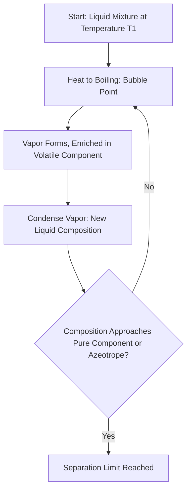

## Phase Equilibria in Multicomponent Systems

### Overview

Multicomponent phase equilibria extend single-component phase behavior to systems with two or more chemical species, governed by the condition that chemical potential of each component must be equal across all coexisting phases. The Gibbs phase rule provides the framework for predicting the degrees of freedom available in such systems.

**Key Points**

- Equilibrium between phases requires equal temperature, pressure, and chemical potential of each component in every phase
- The Gibbs phase rule constrains the number of independent intensive variables
- Binary and ternary phase diagrams are the primary tools for visualizing multicomponent equilibria
- Real systems require activity-based (non-ideal) treatments in addition to ideal-solution limiting laws

### The Gibbs Phase Rule

$$F = C - P + 2$$

where $F$ is the number of degrees of freedom, $C$ is the number of components, and $P$ is the number of phases present.

**Key Points**

- $F$ represents the number of intensive variables (e.g., $T$, $p$, composition) that can be independently varied without changing the number of phases present
- The "+2" accounts for temperature and pressure as additional variable degrees of freedom
- At a triple point in a one-component system ($C=1, P=3$): $F=0$ — the point is uniquely fixed
- For condensed-phase systems at fixed pressure, a reduced phase rule $F = C - P + 1$ is often used, since pressure is no longer a free variable

**Example**

For a binary liquid-vapor system ($C=2$) at a fixed pressure with two phases present ($P=2$): $F = 2-2+1=1$. This means only one intensive variable (e.g., temperature, or equivalently liquid composition) can be freely chosen; once $T$ is fixed, both the liquid and vapor compositions are determined — consistent with the tie-line construction on a standard T-x-y diagram.

### Chemical Potential Equilibrium Condition

At equilibrium, for each component $i$ present in phases $\alpha$ and $\beta$:

$$\mu_i^\alpha = \mu_i^\beta$$

For an ideal solution, chemical potential is expressed as:

$$\mu_i = \mu_i^* + RT\ln x_i$$

and for real solutions, activity replaces mole fraction:

$$\mu_i = \mu_i^* + RT\ln a_i = \mu_i^* + RT\ln(\gamma_i x_i)$$

### Binary Liquid-Vapor Phase Diagrams

#### Ideal Systems (Raoult's Law)

$$p_{total} = x_Ap_A^* + x_Bp_B^* = x_Ap_A^* + (1-x_A)p_B^*$$

**Key Points**

- The liquid composition line (bubble point curve) is linear in $p$ vs. $x_A$ for an ideal system
- The vapor composition line (dew point curve) is calculated using $y_A = x_Ap_A^*/p_{total}$ and is generally curved
- Vapor is always enriched in the more volatile component relative to the liquid it's in equilibrium with (for a system without an azeotrope)

#### T-x-y Diagrams and Distillation

**Key Points**

- Fractional distillation exploits the composition difference between liquid and vapor phases at equilibrium
- Each theoretical plate represents one vaporization-condensation cycle, progressively enriching the distillate
- Azeotropes represent the separation limit for simple fractional distillation, since vapor and liquid compositions become identical there

### Binary T-x-y Diagram Types (svg_diagram)

<svg xmlns="http://www.w3.org/2000/svg" viewBox="0 0 640 300">
<rect x="0" y="0" width="640" height="300" fill="var(--bg,#ffffff)" />
<text x="320" y="22" text-anchor="middle" font-size="15" font-weight="bold" fill="var(--fg,#111)">T-x-y Diagram: Two-Phase Lens Region (svg_diagram)</text>
<line x1="70" y1="260" x2="600" y2="260" stroke="var(--fg,#333)" stroke-width="2" />
<line x1="70" y1="260" x2="70" y2="50" stroke="var(--fg,#333)" stroke-width="2" />
<text x="335" y="285" text-anchor="middle" font-size="12" fill="var(--fg,#333)">Mole Fraction xA</text>
<text x="30" y="160" text-anchor="middle" font-size="12" fill="var(--fg,#333)" transform="rotate(-90,30,160)">Temperature</text>

<path d="M 90 90 Q 335 200 580 70" fill="none" stroke="#2563eb" stroke-width="2.5" />
<text x="150" y="105" font-size="11" fill="#2563eb">Bubble Point (liquid)</text>

<path d="M 90 90 Q 335 120 580 70" fill="none" stroke="#dc2626" stroke-width="2.5" />
<text x="400" y="105" font-size="11" fill="#dc2626">Dew Point (vapor)</text>

<line x1="180" y1="180" x2="480" y2="88" stroke="var(--fg,#666)" stroke-width="1.5" stroke-dasharray="4,3" />
<circle cx="180" cy="180" r="4" fill="#111" />
<circle cx="480" cy="88" r="4" fill="#111" />
<text x="320" y="150" font-size="11" fill="var(--fg,#666)">Tie Line</text>

<text x="130" y="278" font-size="11" fill="var(--fg,#333)">Pure B</text>

<text x="540" y="278" font-size="11" fill="var(--fg,#333)">Pure A</text>

</svg>

### The Lever Rule

For a mixture within a two-phase region with overall composition $z$, at equilibrium between phases with compositions $x^\alpha$ and $x^\beta$:

$$\frac{n^\alpha}{n^\beta} = \frac{z - x^\beta}{x^\alpha - z}$$

**Key Points**

- The lever rule determines the relative amounts (not compositions) of the two coexisting phases
- Compositions of the coexisting phases are fixed by the tie-line endpoints at a given temperature; only the relative phase amounts vary with overall composition $z$

### Binary Liquid-Liquid Phase Diagrams

**Key Points**

- Partially miscible liquids exhibit a two-phase region bounded by a binodal (coexistence) curve
- Above the upper critical solution temperature (UCST), the two liquids become fully miscible in all proportions
- Some systems exhibit a lower critical solution temperature (LCST), where miscibility decreases with increasing temperature (e.g., driven by hydrogen-bonding disruption)
- Some systems show both UCST and LCST, producing a closed-loop miscibility gap

### Binary Solid-Liquid Phase Diagrams

| Diagram Type | Behavior | Example |
| --- | --- | --- |
| Simple eutectic | Complete liquid miscibility, no solid solubility | Bi-Cd |
| Solid solution (isomorphous) | Complete miscibility in both liquid and solid | Cu-Ni |
| Eutectic with partial solid solubility | Limited solid solubility, eutectic point present | Pb-Sn |
| Compound formation | Intermediate compound with its own melting point | Many alloy systems |

**Key Points**

- The eutectic point is the composition and temperature at which the liquid freezes directly to a solid mixture without an intervening temperature range of partial solidification
- At the eutectic point, three phases coexist (liquid + two solid phases) in a binary system, giving $F=0$ at fixed pressure (invariant point)
- Eutectic behavior is exploited in solder alloys, de-icing applications, and cryoscopy-based purity determination

### Ternary Phase Diagrams

For three-component systems, composition is represented on a triangular (Gibbs triangle) diagram, with each vertex representing a pure component and each edge representing a binary sub-system.

**Key Points**

- Any point within the triangle represents a unique ternary composition, read via the perpendicular-distance or parallel-line method
- Tie-lines within a two-phase region are generally not parallel to any triangle edge, unlike binary tie-lines which are trivially horizontal
- Ternary systems are widely used in extraction process design (e.g., liquid-liquid extraction solvent selection)

### Colligative Properties as Phase Equilibrium Consequences

Colligative properties arise directly from the requirement that solvent chemical potential be equal across phases, modified by solute mole fraction:

| Property | Relation | Physical Origin |
| --- | --- | --- |
| Boiling point elevation | $\Delta T_b = K_bm$ | Lowered solvent vapor pressure/chemical potential |
| Freezing point depression | $\Delta T_f = K_fm$ | Lowered solvent chemical potential in liquid phase |
| Osmotic pressure | $\Pi = MRT$ (van't Hoff) | Chemical potential equality across semipermeable membrane |

**Key Points**

- $K_b$ and $K_f$ are solvent-specific constants derived from solvent properties (molar enthalpy of vaporization/fusion, molar mass)
- These relations are strictly valid only in the dilute limit; deviations occur at higher concentration due to solute-solute interactions and non-ideality
- For electrolyte solutes, the van't Hoff factor $i$ must be included to account for dissociation

### Phase Rule Application Summary

| System Type | $C$ | $P$ (typical) | $F$ (at fixed $p$) |
| --- | --- | --- | --- |
| Pure liquid-vapor equilibrium | 1 | 2 | 0 (at fixed p, only one T possible) |
| Binary liquid-vapor, both phases | 2 | 2 | 1 |
| Eutectic point (binary solid-liquid) | 2 | 3 | 0 |
| Ternary, single liquid phase | 3 | 1 | 2 |

### Common Pitfalls

- Confusing degrees of freedom $F$ with the number of phases $P$ or components $C$ directly — $F$ is derived from their difference
- Applying the lever rule to determine phase compositions rather than phase amounts (compositions come from tie-line endpoints, not the lever rule)
- Assuming binary tie-lines' horizontal convention (constant $T$) extends to ternary diagrams, where tie-lines have no such simple orientation
- Treating colligative property relations as valid at concentrations well beyond the dilute limit where they were derived

**Related Topics**

- Raoult's law, Henry's law, and deviations from ideal solution behavior
- Eutectic systems and solid solution phase diagrams
- Ternary phase diagrams and liquid-liquid extraction
- Colligative properties and van't Hoff factor
- Clausius-Clapeyron equation and single-component phase boundaries
- Activity coefficients and non-ideal multicomponent equilibria