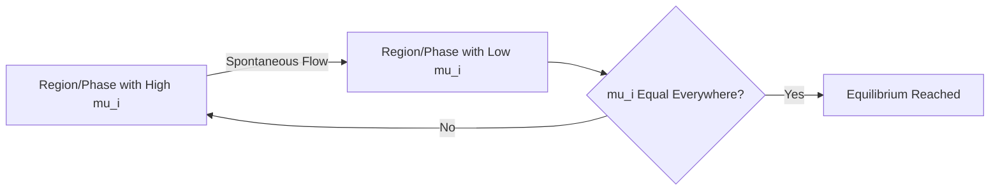

## Chemical Potential

### Overview

Chemical potential is the fundamental thermodynamic quantity governing spontaneous change in composition, phase, and chemical reaction — the driving force analogous to how temperature drives heat flow and pressure drives volume change. It quantifies how a system's free energy responds to the addition or removal of a substance.

**Key Points**

- Chemical potential $\mu_i$ is the partial molar Gibbs energy of component $i$
- Matter flows spontaneously from regions/phases of high chemical potential to low chemical potential
- At equilibrium, chemical potential of each species is equal across all phases/locations where it is present
- Chemical potential underlies phase equilibria, colligative properties, and chemical reaction equilibrium

### Formal Definition

$$\mu_i = \left(\frac{\partial G}{\partial n_i}\right)_{T,p,n_{j\neq i}}$$

Chemical potential is the rate of change of Gibbs energy with respect to the amount of component $i$, holding temperature, pressure, and all other component amounts constant.

**Key Points**

- $\mu_i$ is an intensive property (independent of system size)
- For a pure substance, $\mu = G_m$ (molar Gibbs energy)
- Chemical potential can equivalently be defined as a partial derivative of $U$, $H$, or $A$ under appropriately held-constant natural variables, though the $G$-based definition (constant $T,p$) is most practically useful

### Alternative Definitions from Other State Functions

$$\mu_i = \left(\frac{\partial U}{\partial n_i}\right)_{S,V,n_{j\neq i}} = \left(\frac{\partial H}{\partial n_i}\right)_{S,p,n_{j\neq i}} = \left(\frac{\partial A}{\partial n_i}\right)_{T,V,n_{j\neq i}} = \left(\frac{\partial G}{\partial n_i}\right)_{T,p,n_{j\neq i}}$$

**Key Points**

- All four expressions define the same quantity $\mu_i$, differing only in which pair of variables is held constant
- The Gibbs energy form is most commonly used because $T$ and $p$ are the most experimentally convenient variables to control

### The Fundamental Equation with Variable Composition

$$dG = Vdp - SdT + \sum_i \mu_i\,dn_i$$

At constant $T$ and $p$:

$$dG = \sum_i \mu_i\,dn_i$$

For a pure substance or a system of fixed composition, integrating at constant intensive $\mu_i$ (Euler's theorem for homogeneous functions):

$$G = \sum_i n_i\mu_i$$

### Chemical Potential of an Ideal Gas

$$\mu = \mu^\circ + RT\ln\left(\frac{p}{p^\circ}\right)$$

where $\mu^\circ$ is the standard chemical potential (at standard pressure $p^\circ$, typically 1 bar).

**Key Points**

- $\mu$ increases logarithmically with pressure at constant temperature
- $\mu \to -\infty$ as $p \to 0$, reflecting the unbounded entropy of an infinitely dilute gas
- This relation is the basis for deriving the equilibrium constant expression in terms of partial pressures

### Chemical Potential in Solution

#### Ideal Solutions

$$\mu_i = \mu_i^* + RT\ln x_i$$

where $\mu_i^*$ is the chemical potential of pure component $i$ at the same $T$ and $p$.

#### Real (Non-Ideal) Solutions

$$\mu_i = \mu_i^* + RT\ln a_i = \mu_i^* + RT\ln(\gamma_i x_i)$$

where $a_i$ is activity and $\gamma_i$ is the activity coefficient, correcting for deviations from ideality.

**Key Points**

- Since $x_i \leq 1$, $\ln x_i \leq 0$, so $\mu_i \leq \mu_i^*$ — mixing always lowers chemical potential relative to the pure substance (entropy of mixing contribution)
- This is the thermodynamic origin of colligative properties: adding solute lowers solvent chemical potential, shifting phase equilibria (boiling point elevation, freezing point depression)
- $\gamma_i \to 1$ as $x_i \to 1$ (Raoult's law limit) for the convention based on the pure liquid reference state

### Chemical Potential and Spontaneous Change

**Key Points**

- Matter moves spontaneously from high $\mu$ to low $\mu$, analogous to heat flowing from high $T$ to low $T$
- At equilibrium (phase, reaction, or diffusion), $\mu_i$ becomes equal across all locations/phases/forms where species $i$ exists
- The condition $\mu_i^\alpha = \mu_i^\beta$ for phase equilibrium, and $\sum_i \nu_i\mu_i = 0$ for reaction equilibrium, both derive from minimizing $G$ at constant $T,p$

### Chemical Potential Driving Diffusion and Phase Change

### Application: Phase Equilibrium Condition

At equilibrium between phase $\alpha$ and phase $\beta$ for component $i$:

$$\mu_i^\alpha(T,p) = \mu_i^\beta(T,p)$$

**Example**

For a pure liquid in equilibrium with its vapor at the normal boiling point, $\mu_{liquid} = \mu_{vapor}$. If temperature is raised slightly above this point, $\mu_{vapor}$ becomes lower than $\mu_{liquid}$ (vapor phase Gibbs energy decreases more steeply with $T$ due to its higher entropy), driving spontaneous vaporization until a new equilibrium is established at the corresponding pressure — this is the thermodynamic basis of the Clausius-Clapeyron relation.

### Application: Chemical Reaction Equilibrium

For a reaction $aA + bB \rightleftharpoons cC + dD$, the reaction Gibbs energy is:

$$\Delta_rG = \sum_i \nu_i\mu_i = c\mu_C + d\mu_D - a\mu_A - b\mu_B$$

At equilibrium, $\Delta_rG = 0$, which combined with the pressure/concentration dependence of $\mu_i$ yields the equilibrium constant expression:

$$\Delta_rG^\circ = -RT\ln K$$

**Key Points**

- $\Delta_rG < 0$: reaction proceeds spontaneously forward (toward products)
- $\Delta_rG > 0$: reaction proceeds spontaneously in reverse (toward reactants)
- $\Delta_rG = 0$: system is at equilibrium, no net driving force in either direction
- This derivation directly connects chemical potential to the familiar equilibrium constant expression used throughout chemical equilibrium calculations

### Chemical Potential Across Common Contexts (svg_diagram)

<svg xmlns="http://www.w3.org/2000/svg" viewBox="0 0 620 280">
<rect x="0" y="0" width="620" height="280" fill="var(--bg,#ffffff)" />
<text x="310" y="22" text-anchor="middle" font-size="15" font-weight="bold" fill="var(--fg,#111)">Chemical Potential Drives Equilibration (svg_diagram)</text>

<rect x="60" y="70" width="220" height="160" fill="#dbeafe" stroke="#2563eb" stroke-width="2" />
<text x="170" y="160" text-anchor="middle" font-size="13" fill="#1e3a8a">High mu region</text>
<rect x="340" y="70" width="220" height="160" fill="#fee2e2" stroke="#dc2626" stroke-width="2" />
<text x="450" y="160" text-anchor="middle" font-size="13" fill="#7f1d1d">Low mu region</text>

<line x1="285" y1="150" x2="335" y2="150" stroke="var(--fg,#333)" stroke-width="3" marker-end="url(#arrow)" />
<text x="310" y="135" text-anchor="middle" font-size="11" fill="var(--fg,#333)">flow</text>

<text x="310" y="255" text-anchor="middle" font-size="12" fill="var(--fg,#333)">Equilibrium: mu equal in both regions</text>

</svg>

### Electrochemical Potential (Extension for Charged Species)

For charged species (ions, electrons), an additional electrical work term is included:

$$\tilde{\mu}_i = \mu_i + z_iF\phi$$

where $z_i$ is the ionic charge, $F$ is the Faraday constant, and $\phi$ is the local electric potential.

**Key Points**

- The electrochemical potential $\tilde{\mu}_i$, not the chemical potential alone, must be equal across phases at equilibrium for charged species (e.g., across an electrode/electrolyte interface)
- This extension underlies electrochemical cell potentials and the Nernst equation
- Equilibrium across a membrane with an electric potential difference (Donnan equilibrium) also relies on electrochemical potential equality

### Chemical Potential and Colligative Properties Summary

| Colligative Effect | Mechanism via $\mu$ |
| --- | --- |
| Vapor pressure lowering | Solute lowers $\mu_{solvent}$ in liquid, shifting liquid-vapor equilibrium |
| Boiling point elevation | Lower liquid $\mu_{solvent}$ requires higher $T$ to match vapor $\mu$ |
| Freezing point depression | Lower liquid $\mu_{solvent}$ requires lower $T$ to match solid $\mu$ |
| Osmotic pressure | Pressure difference needed to equalize $\mu_{solvent}$ across a membrane |

### Common Pitfalls

- Treating chemical potential as an energy in the ordinary sense rather than recognizing it as a partial molar (intensive, per-mole) quantity
- Forgetting that phase equilibrium requires $\mu_i$ equality specifically, not equality of total Gibbs energy or concentration
- For charged species, applying the plain chemical potential equality condition instead of the electrochemical potential, which is required whenever an electric potential difference exists between phases
- Assuming $\mu_i^\circ$ (standard chemical potential) is a fixed universal constant rather than a reference value that depends on the defined standard state convention (e.g., ideal gas at 1 bar, or a specific solution reference state)

**Related Topics**

- Gibbs energy and spontaneity criteria
- Phase equilibria and the Gibbs phase rule
- Chemical equilibrium and the equilibrium constant
- Colligative properties (boiling point elevation, freezing point depression, osmotic pressure)
- Electrochemistry and the Nernst equation
- Activity and activity coefficients in non-ideal systems