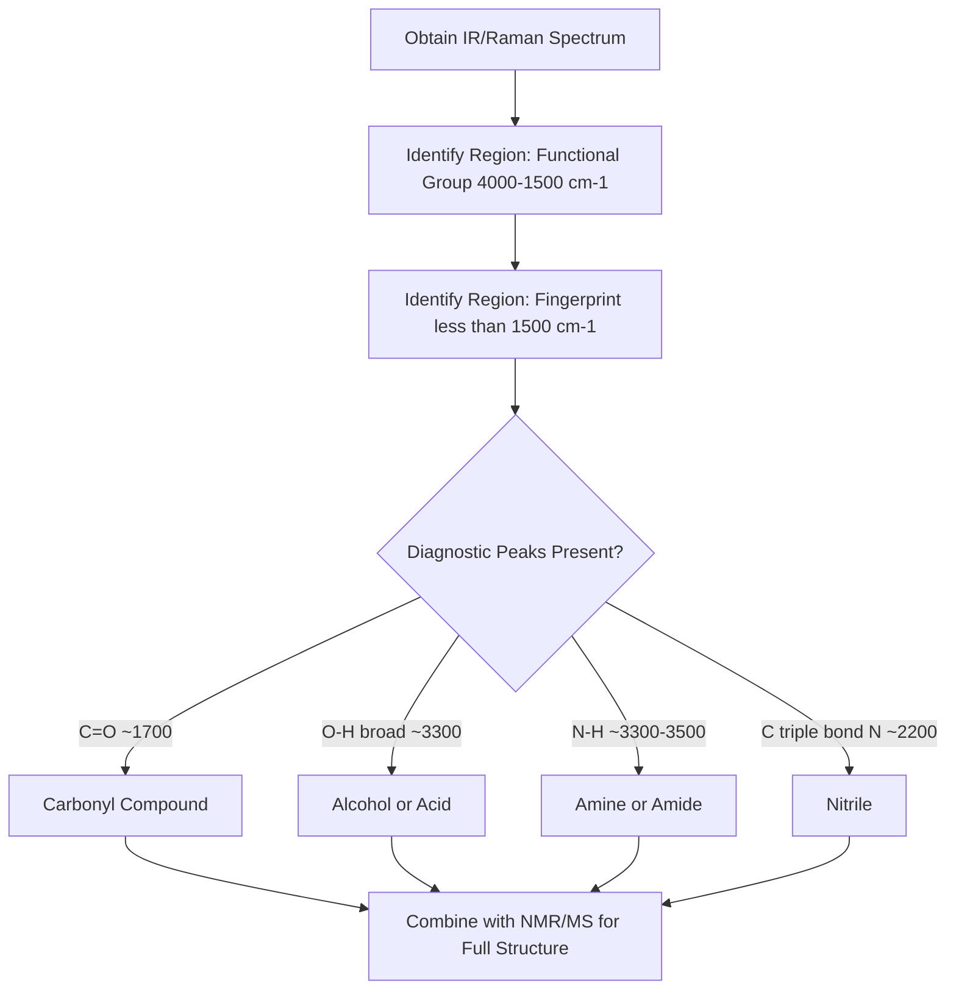

## Vibrational Spectroscopy

### Overview

Vibrational spectroscopy probes the quantized vibrational energy levels of molecules, typically observed in the infrared (IR) region of the electromagnetic spectrum. It provides direct information on bond strength, functional groups, and molecular force constants, making it one of the most widely used structural characterization techniques in chemistry.

**Key Points**

- Vibrational transitions occur primarily in the infrared region (~400–4000 cm⁻¹ for fundamental modes)
- IR absorption requires a change in dipole moment during the vibration
- The harmonic oscillator model provides the foundational quantum treatment; anharmonicity corrections improve accuracy
- Polyatomic molecules possess $3N-6$ (nonlinear) or $3N-5$ (linear) normal modes of vibration

### The Harmonic Oscillator Model

Treating a diatomic bond as a mass-spring system obeying Hooke's law, $F = -kx$, the Schrödinger equation yields quantized energy levels:

$$E_v = \left(v+\frac{1}{2}\right)h\nu, \qquad v = 0, 1, 2, ...$$

$$\nu = \frac{1}{2\pi}\sqrt{\frac{k}{\mu}}$$

where $v$ is the vibrational quantum number, $k$ is the force constant, and $\mu$ is the reduced mass.

**Key Points**

- Energy levels are equally spaced by $h\nu$ (unlike the quadratically spaced rotational levels)
- Zero-point energy $E_0 = \frac{1}{2}h\nu$ exists even at $v=0$, meaning the bond is never fully at rest
- Vibrational frequency increases with bond strength (larger $k$) and decreases with heavier reduced mass (larger $\mu$)

### Selection Rules

**Key Points**

- Gross selection rule: the vibration must produce a change in dipole moment ($d\mu/dx \neq 0$ at the equilibrium position) — homonuclear diatomics ($N_2$, $O_2$) are IR-inactive
- Specific selection rule (harmonic approximation): $\Delta v = \pm 1$
- Anharmonicity relaxes the strict selection rule, allowing weak overtone transitions ($\Delta v = \pm2, \pm3, ...$)

### Vibrational Wavenumber and Force Constant

$$\tilde{\nu} = \frac{1}{2\pi c}\sqrt{\frac{k}{\mu}} \quad \text{(cm}^{-1}\text{)}$$

**Example**

For HCl, the fundamental vibrational absorption occurs at $\tilde{\nu} \approx 2886$ cm⁻¹. With $\mu_{HCl} = 1.63\times10^{-27}$ kg:

$$k = (2\pi c\tilde{\nu})^2\mu = \left(2\pi(3\times10^{10})(2886)\right)^2(1.63\times10^{-27}) \approx 516\text{ N/m}$$

This force constant reflects the H-Cl bond stiffness and can be compared across related molecules — for example, the force constant for HF (~966 N/m) is substantially larger, consistent with its shorter, stronger bond and correspondingly higher stretching frequency (~4141 cm⁻¹).

### Anharmonicity: The Morse Potential

Real bonds deviate from perfect harmonic behavior, especially at high $v$, where bond dissociation eventually occurs. The Morse potential provides a more realistic model:

$$V(r) = D_e\left[1-e^{-a(r-r_e)}\right]^2$$

yielding energy levels:

$$E_v = \left(v+\frac{1}{2}\right)h\tilde{\nu}_e - \left(v+\frac{1}{2}\right)^2h\tilde{\nu}_ex_e$$

where $x_e$ is the anharmonicity constant.

**Key Points**

- Unlike the harmonic oscillator, Morse energy levels converge (become more closely spaced) as $v$ increases, approaching the dissociation limit
- $D_e$ is the well-depth dissociation energy from the potential minimum; $D_0 = D_e - \frac{1}{2}h\tilde{\nu}_e$ is the observed dissociation energy from the zero-point level
- Anharmonicity permits weak overtone bands ($v=0\to2$, $v=0\to3$) and combination bands, in addition to the strong fundamental ($v=0\to1$)

### Harmonic vs. Morse Potential Comparison (svg_diagram)

<svg xmlns="http://www.w3.org/2000/svg" viewBox="0 0 600 320">
<rect x="0" y="0" width="600" height="320" fill="var(--bg,#ffffff)" />
<text x="300" y="22" text-anchor="middle" font-size="15" font-weight="bold" fill="var(--fg,#111)">Harmonic vs Morse Potential Energy Curves (svg_diagram)</text>
<line x1="70" y1="270" x2="560" y2="270" stroke="var(--fg,#333)" stroke-width="2" />
<line x1="70" y1="270" x2="70" y2="50" stroke="var(--fg,#333)" stroke-width="2" />
<text x="315" y="298" text-anchor="middle" font-size="12" fill="var(--fg,#333)">Bond Length r</text>

<path d="M 150 260 Q 315 60 480 260" fill="none" stroke="#2563eb" stroke-width="2.5" stroke-dasharray="6,3" />
<text x="420" y="110" font-size="11" fill="#2563eb">Harmonic (parabolic)</text>

<path d="M 180 268 Q 260 90 320 85 Q 400 95 560 130" fill="none" stroke="#dc2626" stroke-width="2.5" />
<text x="440" y="150" font-size="11" fill="#dc2626">Morse (anharmonic, dissociates)</text>

<line x1="230" y1="230" x2="410" y2="230" stroke="var(--fg,#666)" stroke-width="1" />
<line x1="215" y1="200" x2="425" y2="200" stroke="var(--fg,#666)" stroke-width="1" />
<line x1="205" y1="175" x2="435" y2="175" stroke="var(--fg,#666)" stroke-width="1" />
<line x1="198" y1="155" x2="442" y2="155" stroke="var(--fg,#666)" stroke-width="1" />

<text x="560" y="135" font-size="10" fill="var(--fg,#333)">De</text>

</svg>

### Normal Modes of Polyatomic Molecules

$$\text{Number of vibrational modes} = 3N - 6 \text{ (nonlinear)} \quad \text{or} \quad 3N-5 \text{ (linear)}$$

**Key Points**

- $3N$ total degrees of freedom, minus 3 translational and 3 rotational (or 2 for linear molecules, which lack rotation about the molecular axis)
- Each normal mode is a collective, synchronized motion of multiple atoms at a single characteristic frequency
- Normal modes are classified by symmetry (group theory) into irreducible representations, determining IR/Raman activity

### Types of Vibrational Modes

| Mode Type | Description |
| --- | --- |
| Symmetric stretch | Bonds stretch/contract in phase |
| Asymmetric stretch | Bonds stretch/contract out of phase |
| Scissoring (bend) | In-plane bending, bond angle changes |
| Rocking | In-plane bending, whole group moves |
| Wagging | Out-of-plane bending |
| Twisting | Out-of-plane bending, rotational character |

**Example**

Water ($H_2O$, $C_{2v}$, nonlinear, $N=3$) has $3(3)-6=3$ normal modes: symmetric stretch (~3657 cm⁻¹), bend (~1595 cm⁻¹), and asymmetric stretch (~3756 cm⁻¹). All three transform as either $A_1$ or $B_2$ symmetry species, both of which correspond to $x$, $y$, or $z$ translations in the $C_{2v}$ character table — meaning all three modes are IR-active.

### IR-Active vs. Raman-Active Modes

| Technique | Selection Rule | Mechanism |
| --- | --- | --- |
| IR absorption | Change in dipole moment ($d\mu/dQ \neq 0$) | Direct photon absorption |
| Raman scattering | Change in polarizability ($d\alpha/dQ \neq 0$) | Inelastic photon scattering |

**Key Points**

- **Mutual exclusion rule**: for centrosymmetric molecules (possessing a center of inversion), modes that are IR-active are Raman-inactive and vice versa
- Non-centrosymmetric molecules can have modes that are both IR- and Raman-active
- Group theory (character tables) formally determines activity by checking whether a mode's symmetry species corresponds to a linear function ($x,y,z$ — IR active) or quadratic function ($x^2, xy$, etc. — Raman active)

### Vibrational Spectrum Interpretation Workflow

### Characteristic Group Frequencies

| Bond/Group | Wavenumber Range (cm⁻¹) | Notes |
| --- | --- | --- |
| O–H (free) | 3580–3650 | Sharp |
| O–H (H-bonded) | 3200–3550 | Broad |
| C–H (sp³) | 2850–2960 | Medium |
| C–H (sp²) | 3000–3100 | Medium |
| C≡C, C≡N | 2100–2260 | Sharp, medium intensity |
| C=O | 1650–1750 | Strong, sharp; position varies by carbonyl type |
| C=C | 1620–1680 | Weak–medium |
| C–O | 1000–1300 | Strong |

**Key Points**

- Group frequencies arise because certain bonds vibrate largely independently of the rest of the molecule (localized modes), particularly for light-atom terminal groups (O-H, N-H, C-H) and strong multiple bonds
- The fingerprint region (~1500–400 cm⁻¹) involves complex coupled vibrations unique to each molecule, useful for compound identification via spectral comparison rather than functional group assignment
- Hydrogen bonding broadens and shifts O-H/N-H stretches to lower wavenumber due to weakening of the bond being stretched

### Rovibrational Coupling

At high resolution in the gas phase, vibrational transitions show rotational fine structure, producing P and R branches (and Q branch when allowed):

$$\tilde{\nu}_R(J) = \tilde{\nu}_0 + 2B(J+1) \quad (\Delta J=+1)$$

$$\tilde{\nu}_P(J) = \tilde{\nu}_0 - 2BJ \quad (\Delta J=-1)$$

**Key Points**

- The R branch appears at higher wavenumber than the band center $\tilde{\nu}_0$; the P branch appears at lower wavenumber
- The Q branch ($\Delta J=0$) is allowed only for certain molecular symmetries (e.g., not for simple diatomics, but present in many polyatomic/symmetric top spectra)
- The characteristic gap between P and R branches (missing Q branch in diatomics) is a diagnostic feature of rovibrational spectra

### Applications

**Key Points**

- Functional group identification in organic and inorganic compound characterization
- Reaction monitoring via characteristic bond formation/disappearance (e.g., disappearance of C=O upon reduction)
- Force constant and bond strength determination from vibrational frequencies
- Quality control and compound identification via fingerprint region comparison to reference spectral libraries

### Common Pitfalls

- Assuming all vibrational modes are IR-active; the dipole-moment-change selection rule excludes symmetric modes in centrosymmetric molecules
- Confusing overtone/combination bands (weak, anharmonicity-enabled) with fundamental transitions
- Applying the mutual exclusion rule to non-centrosymmetric molecules, where it does not hold
- Misinterpreting a broad O-H stretch as indicating a specific functional group without considering hydrogen bonding effects on peak shape and position

**Related Topics**

- Rotational spectroscopy and rovibrational coupling
- Anharmonicity, the Morse potential, and overtone transitions
- Symmetry and group theory (IR/Raman activity determination)
- Raman spectroscopy and polarizability selection rules
- Combining spectral data (IR, NMR, MS) to determine structure
- Force constants and bond strength correlations