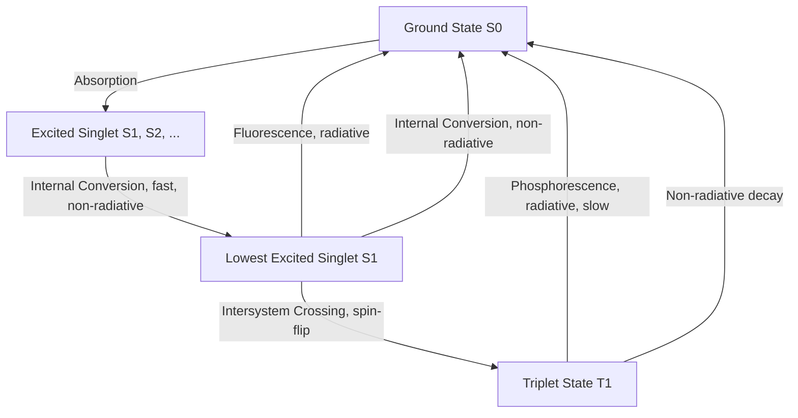

## Electronic Spectroscopy of Molecules

### Overview

Electronic spectroscopy probes transitions between electronic energy states of molecules, typically observed in the UV-visible region of the electromagnetic spectrum. These transitions involve simultaneous changes in vibrational and rotational states, producing broad, structured absorption and emission bands that reveal information about molecular orbitals, conjugation, and photophysical processes.

**Key Points**

- Electronic transitions occur in the UV-visible region (~200–800 nm, roughly 1.5–6 eV)
- Transitions involve promotion of an electron between molecular orbitals (e.g., HOMO to LUMO)
- Electronic spectra are vibronically structured due to simultaneous vibrational excitation
- Governs photophysical processes: fluorescence, phosphorescence, and photochemical reactivity

### Types of Electronic Transitions

| Transition | Approximate Energy | Typical Chromophore |
| --- | --- | --- |
| $\sigma \to \sigma^*$ | High (far-UV, <200 nm) | Saturated C-C, C-H bonds |
| $n \to \sigma^*$ | High-medium UV | Lone pairs (O, N, halogens) on saturated systems |
| $\pi \to \pi^*$ | Medium UV-visible | Alkenes, aromatics, conjugated systems |
| $n \to \pi^*$ | Low energy (near-UV/visible) | Carbonyls, imines with lone pairs |

**Key Points**

- $\pi \to \pi^*$ transitions are typically the most intense (high molar absorptivity, $\varepsilon$) due to favorable orbital overlap
- $n \to \pi^*$ transitions are typically weak (low $\varepsilon$) because they are symmetry-forbidden or spatially poorly overlapping
- Extending conjugation lowers the HOMO-LUMO gap, red-shifting absorption to longer wavelength (bathochromic shift)

### The Franck-Condon Principle

Electronic transitions occur much faster (~$10^{-15}$ s) than nuclear motion (~$10^{-13}$ s), so the nuclear geometry is essentially frozen during the transition (vertical transitions on a potential energy diagram).

**Key Points**

- Transition intensity is proportional to the square of the vibrational wavefunction overlap (Franck-Condon factor) between initial and final states
- The most probable vibronic transition connects points of maximum wavefunction amplitude in both electronic states
- If the excited state has a significantly different equilibrium geometry than the ground state, transitions to higher vibrational levels of the excited state become more probable, producing extended vibronic progressions

### Franck-Condon Principle Diagram (svg_diagram)

<svg xmlns="http://www.w3.org/2000/svg" viewBox="0 0 600 340">
<rect x="0" y="0" width="600" height="340" fill="var(--bg,#ffffff)" />
<text x="300" y="22" text-anchor="middle" font-size="15" font-weight="bold" fill="var(--fg,#111)">Franck-Condon Vertical Transitions (svg_diagram)</text>

<path d="M 150 300 Q 230 150 310 300" fill="none" stroke="#2563eb" stroke-width="2.5" />
<text x="160" y="130" font-size="12" fill="#2563eb">Ground State S0</text>

<path d="M 230 130 Q 330 20 430 130" fill="none" stroke="#dc2626" stroke-width="2.5" />
<text x="400" y="45" font-size="12" fill="#dc2626">Excited State S1</text>

<line x1="230" y1="270" x2="230" y2="100" stroke="var(--fg,#333)" stroke-width="1.5" stroke-dasharray="3,2" />
<line x1="245" y1="270" x2="245" y2="90" stroke="var(--fg,#333)" stroke-width="1.5" stroke-dasharray="3,2" />
<line x1="260" y1="270" x2="260" y2="85" stroke="var(--fg,#333)" stroke-width="1.5" stroke-dasharray="3,2" />

<text x="235" y="290" text-anchor="middle" font-size="10" fill="var(--fg,#333)">v'=0,1,2 (vertical, fixed r)</text>

</svg>

### Vibronic Structure

Electronic absorption bands are composed of multiple overlapping vibrational sub-transitions, producing fine structure (particularly visible in gas-phase or low-temperature spectra):

$$\Delta E_{total} = \Delta E_{elec} + \Delta E_{vib} + \Delta E_{rot}$$

**Example**

The UV absorption spectrum of gas-phase benzene shows a series of closely spaced vibronic peaks (a progression) superimposed on the broad $\pi \to \pi^*$ electronic envelope near 255 nm, corresponding to different combinations of vibrational excitation in the excited electronic state. In solution, collisional broadening and solvent interactions typically smear this fine structure into a broad, mostly featureless band.

### Molar Absorptivity and the Beer-Lambert Law

$$A = \varepsilon c l$$

where $A$ is absorbance, $\varepsilon$ is the molar absorptivity (L·mol⁻¹·cm⁻¹), $c$ is concentration, and $l$ is path length.

**Key Points**

- $\varepsilon$ reflects the transition probability (related to the transition dipole moment) and is characteristic of the specific electronic transition
- Allowed transitions typically have $\varepsilon > 10^4$ L·mol⁻¹·cm⁻¹; forbidden transitions have $\varepsilon < 100$
- The Beer-Lambert law provides the basis for quantitative UV-Vis spectrophotometric analysis

### Selection Rules for Electronic Transitions

| Rule Type | Statement | Consequence |
| --- | --- | --- |
| Spin selection rule | $\Delta S = 0$ | Singlet-triplet transitions are spin-forbidden |
| Symmetry (Laporte) rule | Transitions must involve a change in parity ($g \leftrightarrow u$) | $g\to g$ or $u\to u$ transitions forbidden in centrosymmetric molecules |
| Orbital overlap | Transition dipole moment integral must be nonzero | Determines allowed vs. forbidden character |

**Key Points**

- "Forbidden" transitions are not strictly zero-intensity; vibronic coupling and spin-orbit coupling can relax these rules, producing weak but observable bands
- The Laporte rule applies specifically to centrosymmetric molecules (e.g., many transition metal complexes with octahedral symmetry), explaining why d-d transitions in centrosymmetric complexes are typically weak
- Spin-forbidden transitions become more allowed with increasing spin-orbit coupling, which is stronger for heavier atoms (heavy atom effect)

### Jablonski Diagram: Photophysical Pathways

**Key Points**

- Fluorescence occurs from $S_1 \to S_0$ (spin-allowed), typically on nanosecond timescales
- Phosphorescence occurs from $T_1 \to S_0$ (spin-forbidden), typically much slower (microseconds to seconds) due to the required spin flip
- Kasha's rule: emission (fluorescence) typically occurs from the lowest excited state of a given multiplicity, regardless of the initially excited state, because higher excited states rapidly relax via internal conversion

### Stokes Shift

**Key Points**

- Emission occurs at longer wavelength (lower energy) than absorption due to vibrational relaxation in the excited state before emission and solvent reorganization effects
- The energy difference between absorption and emission maxima is the Stokes shift
- Larger Stokes shifts generally indicate greater excited-state geometry change or stronger solvent reorganization

### Applications

#### Conjugated Systems and Color

**Key Points**

- Extended conjugation progressively lowers the HOMO-LUMO gap, shifting absorption from UV into the visible region — the basis of color in organic dyes and pigments
- Auxochromes (substituents like -OH, -NH₂) donate electron density into the conjugated system, further red-shifting absorption
- Chromophores are the specific structural units (e.g., C=C, C=O, aromatic rings) responsible for absorption in a given spectral region

#### Transition Metal Complexes

**Key Points**

- d-d transitions (within the d-orbital manifold, split by ligand field) are responsible for the characteristic colors of many transition metal complexes
- Charge-transfer bands (ligand-to-metal or metal-to-ligand) are typically far more intense than d-d transitions since they are both spin- and symmetry-allowed
- Crystal/ligand field splitting energy can be estimated directly from d-d transition energies observed in UV-Vis spectra

#### Photochemistry

**Key Points**

- Excited-state species have different electronic distributions and reactivity than ground-state species, enabling photochemical reactions inaccessible thermally
- The excited-state potential energy surface can differ substantially from the ground state, sometimes leading to bond dissociation, isomerization (e.g., cis-trans photoisomerization), or electron transfer
- Photosensitizers absorb light and transfer energy to another species, enabling indirect photochemical activation

### Common Pitfalls

- Assuming forbidden transitions have exactly zero intensity rather than reduced (but nonzero) intensity due to relaxation mechanisms
- Confusing fluorescence (spin-allowed, fast) with phosphorescence (spin-forbidden, slow) timescales and mechanisms
- Neglecting the Franck-Condon principle when interpreting vibronic band shapes and relative intensities within an electronic absorption band
- Assuming absorption and emission maxima coincide; the Stokes shift is a general feature arising from excited-state relaxation processes

**Related Topics**

- Molecular orbital theory and HOMO-LUMO gaps
- Franck-Condon principle and vibronic coupling
- Fluorescence and phosphorescence spectroscopy
- Ligand field theory and transition metal complex colors
- Photochemistry and photoisomerization reactions
- Symmetry and group theory (Laporte selection rule)