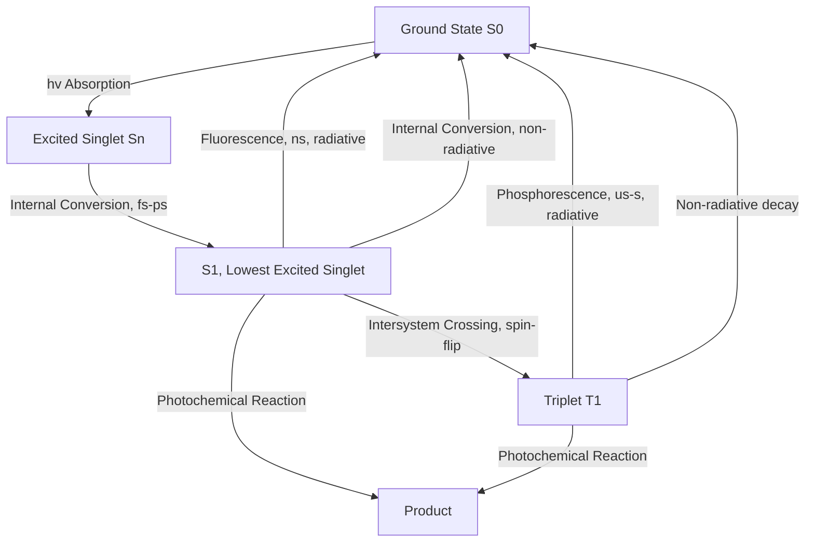

## Photochemical Reactions and Photophysics

### Overview

Photochemistry studies chemical reactions initiated by light absorption, while photophysics addresses the non-reactive pathways by which excited states dissipate energy. Together they explain phenomena from vision and photosynthesis to solar energy conversion and photolithography.

**Key Points**

- Light absorption promotes a molecule to an electronically excited state with distinct reactivity from the ground state
- Excited states decay via radiative (fluorescence, phosphorescence) or non-radiative (internal conversion, intersystem crossing) pathways
- Photochemical reactions include isomerization, dissociation, electron transfer, and cycloaddition
- The Grotthuss-Draper and Stark-Einstein laws govern the fundamental requirements for photochemistry

### Fundamental Laws of Photochemistry

**Key Points**

- **Grotthuss-Draper law**: only light that is absorbed by a molecule can produce a photochemical effect
- **Stark-Einstein law**: each photon absorbed activates (at most) one molecule in the primary photochemical process
- **Quantum yield** ($\Phi$) quantifies photochemical efficiency: $\Phi = \frac{\text{number of molecules reacting (or events occurring)}}{\text{number of photons absorbed}}$

$$\Phi = \frac{\text{rate of process}}{\text{rate of photon absorption}}$$

**Key Points**

- $\Phi \leq 1$ for a simple primary process, but $\Phi$ can exceed 1 for chain reactions (e.g., $H_2$-$Cl_2$ photochemical chain reaction, where one absorbed photon triggers many product-forming cycles)
- Quantum yields near zero indicate the excited state predominantly relaxes via non-reactive (photophysical) pathways rather than chemical transformation

### Jablonski Diagram: Photophysical Decay Pathways

### Photophysical Decay Pathway Rates

| Process | Typical Timescale | Spin Character |
| --- | --- | --- |
| Vibrational relaxation | $10^{-14}$–$10^{-11}$ s | N/A |
| Internal conversion (IC) | $10^{-13}$–$10^{-11}$ s | Spin-allowed ($S_n \to S_1$) |
| Fluorescence | $10^{-9}$–$10^{-7}$ s | Spin-allowed ($S_1 \to S_0$) |
| Intersystem crossing (ISC) | $10^{-10}$–$10^{-8}$ s | Spin-forbidden ($S_1 \to T_1$) |
| Phosphorescence | $10^{-6}$–$10^{1}$ s | Spin-forbidden ($T_1 \to S_0$) |

**Key Points**

- Kasha's rule: fluorescence generally occurs from $S_1$ regardless of which excited state was initially populated, since higher states relax rapidly via internal conversion
- Intersystem crossing efficiency increases with spin-orbit coupling, enhanced by heavy atoms (heavy atom effect) or the presence of paramagnetic species like molecular oxygen
- Because $T_1$ is typically lower in energy than $S_1$ (Hund's rule-like stabilization for parallel spins) and its decay to $S_0$ is spin-forbidden, triplet states are longer-lived and often more chemically reactive

### Types of Photochemical Reactions

#### Photoisomerization

**Example**

The cis-trans photoisomerization of retinal in rhodopsin is the primary event of vertebrate vision: absorption of a photon by 11-cis-retinal triggers rotation about a C=C double bond to the all-trans form within roughly a picosecond, initiating a conformational change in the opsin protein that leads to a neural signal. This process exhibits a notably high quantum yield, reflecting efficient conversion of absorbed light energy into productive isomerization rather than wasteful photophysical decay.

#### Photodissociation

**Key Points**

- Absorption of sufficiently energetic light can populate a repulsive (dissociative) excited state or promote the molecule above its dissociation limit, breaking a chemical bond
- Photodissociation of ozone and $O_2$ in the stratosphere by UV radiation is central to atmospheric ozone chemistry
- Photolysis is widely used to generate reactive intermediates (radicals, carbenes) for mechanistic and synthetic studies

#### Photocycloaddition

**Example**

The [2+2] photocycloaddition, such as the dimerization of two alkene units to form a cyclobutane ring, is thermally forbidden by orbital symmetry (Woodward-Hoffmann rules) but photochemically allowed, since population of the antibonding $\pi^*$ orbital in the excited state changes the symmetry requirements for a concerted, suprafacial-suprafacial cycloaddition.

#### Photoinduced Electron Transfer (PET)

**Key Points**

- Excited states are both better oxidants and better reductants than the corresponding ground state, since the excited electron is more easily donated and the resulting hole more easily filled
- PET is fundamental to photosynthesis, photoredox catalysis, and solar energy conversion (dye-sensitized solar cells)
- The Rehm-Weller equation relates the free energy of photoinduced electron transfer to the excited-state energy and the ground-state redox potentials of donor and acceptor

### Woodward-Hoffmann Rules: Thermal vs. Photochemical Selectivity

| Reaction Type | Thermally Allowed | Photochemically Allowed |
| --- | --- | --- |
| [4+2] cycloaddition (Diels-Alder) | Suprafacial-suprafacial | Suprafacial-antarafacial |
| [2+2] cycloaddition | Suprafacial-antarafacial (geometrically strained) | Suprafacial-suprafacial |
| Electrocyclic ($4n$ electrons) | Conrotatory | Disrotatory |
| Electrocyclic ($4n+2$ electrons) | Disrotatory | Conrotatory |

**Key Points**

- These rules arise from orbital symmetry conservation, formalized via the correlation diagram approach or the Möbius-Hückel aromatic transition state model
- Photochemical excitation changes the symmetry of the frontier orbital(s) involved, inverting the stereochemical outcome relative to the thermal pathway
- This complementarity allows photochemistry to access product stereochemistry unobtainable via thermal reaction pathways

### Photosensitization

**Key Points**

- A photosensitizer absorbs light and transfers its excitation energy to a substrate that may not itself absorb efficiently at the excitation wavelength
- Energy transfer mechanisms include Förster resonance energy transfer (FRET, dipole-dipole, through-space, distance-dependent as $r^{-6}$) and Dexter electron exchange (requires orbital overlap, short-range)
- Triplet-triplet energy transfer is a common photosensitization pathway, exploiting the longer lifetime of triplet states

### Photostationary States and Quantum Yield Analysis

**Example**

For a reversible photoisomerization $A \underset{h\nu'}{\overset{h\nu}{\rightleftharpoons}} B$, continuous irradiation eventually establishes a photostationary state where the forward and reverse photochemical rates balance:

$$\frac{[B]}{[A]}_{pss} = \frac{\Phi_{A\to B}\,\varepsilon_A}{\Phi_{B\to A}\,\varepsilon_B}$$

This ratio depends on both quantum yields and molar absorptivities at the irradiation wavelength, meaning the photostationary composition can be tuned by selecting different excitation wavelengths — a strategy used in molecular switches and photopharmacology.

### Quenching of Excited States

**Key Points**

- Collisional (dynamic) quenching: an excited state is deactivated through collision with a quencher molecule, reducing observed fluorescence/phosphorescence intensity and lifetime
- Static quenching: quencher forms a non-fluorescent ground-state complex, reducing intensity without affecting the lifetime of the remaining emissive population
- The Stern-Volmer equation describes dynamic quenching: $\frac{I_0}{I} = 1+K_{SV}[Q]$, where $K_{SV}$ is the Stern-Volmer constant and $[Q]$ is quencher concentration

### Applications

**Key Points**

- Photosynthesis: light-harvesting antenna complexes funnel excitation energy via FRET to reaction centers, driving photoinduced electron transfer
- Photodynamic therapy: photosensitizers generate reactive singlet oxygen (via triplet-triplet energy transfer to ground-state triplet $O_2$) to selectively destroy targeted tissue
- Photoredox catalysis: visible-light-absorbing catalysts enable radical and electron-transfer reactions under mild conditions in modern organic synthesis
- Photolithography: UV-induced photochemical reactions in photoresists enable semiconductor microfabrication

### Common Pitfalls

- Assuming quantum yield must be less than or equal to 1; chain reactions can produce $\Phi \gg 1$
- Applying ground-state Woodward-Hoffmann selection rules to photochemical reactions, where the allowed/forbidden designation is inverted
- Confusing FRET (through-space, dipole-dipole, long-range) with Dexter energy transfer (requires orbital overlap, short-range, relevant to triplet-triplet transfer)
- Neglecting that triplet states, despite being lower in energy than the corresponding singlet, are often the more chemically important reactive intermediate due to their longer lifetime

**Related Topics**

- Electronic spectroscopy and the Jablonski diagram
- Woodward-Hoffmann rules and pericyclic reaction stereochemistry
- Fluorescence quenching and the Stern-Volmer equation
- Photoredox catalysis in organic synthesis
- Singlet oxygen chemistry and photodynamic therapy
- Förster resonance energy transfer (FRET) and biological light harvesting