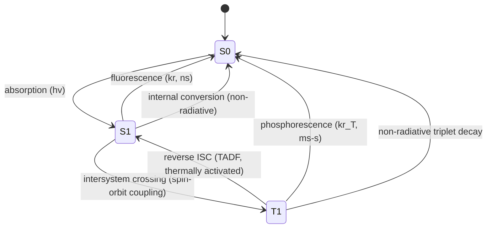

## Fluorescence and Phosphorescence

### Overview

Fluorescence and phosphorescence are both forms of photoluminescence: the emission of light from a molecule that has absorbed electromagnetic radiation and relaxed from an electronically excited state back to the ground state. The distinction between them rests on the spin multiplicity of the states involved in the transition, which in turn governs the timescale, quantum mechanical selection rules, and physical mechanism of emission.

### Electronic States and Spin Multiplicity

Most stable organic molecules have a ground state with all electrons paired, giving a total spin $S=0$ and a singlet configuration, denoted $S_0$. Absorption of a photon promotes an electron to a higher-energy orbital without changing its spin (spin is conserved in electric-dipole transitions), producing an excited singlet state $S_1, S_2, ...$, in which the excited electron remains paired (antiparallel) with the electron left behind in the ground orbital.

A triplet state $T_1$ has the excited electron's spin parallel to the remaining electron, giving $S=1$ and multiplicity $2S+1=3$. Direct absorption from $S_0$ to $T_1$ is spin-forbidden and therefore very weak; triplet states are populated indirectly, via intersystem crossing from $S_1$.

### The Jablonski Diagram

The Jablonski diagram is the standard framework for visualizing these processes.

<svg xmlns="http://www.w3.org/2000/svg" viewBox="0 0 760 520" font-family="Helvetica, Arial, sans-serif">
<text x="380" y="30" text-anchor="middle" font-size="18" font-weight="bold">Jablonski Diagram (svg_diagram)</text>

<line x1="60" y1="460" x2="220" y2="460" stroke="black" stroke-width="2" />
<text x="30" y="465" font-size="14">S0</text>
<line x1="60" y1="150" x2="220" y2="150" stroke="black" stroke-width="2" />
<text x="30" y="155" font-size="14">S1</text>
<line x1="60" y1="120" x2="220" y2="120" stroke="black" stroke-width="1" />
<text x="30" y="115" font-size="11">vib.</text>
<line x1="60" y1="60" x2="220" y2="60" stroke="black" stroke-width="2" />
<text x="30" y="65" font-size="14">S2</text>
<line x1="450" y1="220" x2="610" y2="220" stroke="black" stroke-width="2" />
<text x="620" y="225" font-size="14">T1</text>

<line x1="100" y1="460" x2="100" y2="60" stroke="#1a73e8" stroke-width="2" marker-end="url(#arrowBlue)" />
<text x="70" y="270" font-size="12" fill="#1a73e8" transform="rotate(-90 70,270)">Absorption</text>

<line x1="220" y1="60" x2="300" y2="150" stroke="gray" stroke-width="2" stroke-dasharray="4,3" marker-end="url(#arrowGray)" />
<text x="225" y="95" font-size="10" fill="gray">IC</text>

<path d="M140 150 q8 -10 16 0 q8 10 16 0 q8 -10 16 0" stroke="gray" stroke-width="1.5" fill="none" />

<line x1="160" y1="150" x2="160" y2="460" stroke="#2e9e4f" stroke-width="2" marker-end="url(#arrowGreen)" />
<text x="168" y="300" font-size="12" fill="#2e9e4f">Fluorescence</text>

<line x1="220" y1="150" x2="450" y2="220" stroke="#8a2be2" stroke-width="2" stroke-dasharray="4,3" marker-end="url(#arrowPurple)" />
<text x="300" y="175" font-size="11" fill="#8a2be2">ISC</text>

<line x1="530" y1="220" x2="530" y2="460" stroke="#d9534f" stroke-width="2" stroke-dasharray="6,3" marker-end="url(#arrowRed)" />
<text x="538" y="340" font-size="12" fill="#d9534f">Phosphorescence</text>
<line x1="530" y1="460" x2="220" y2="460" stroke="black" stroke-width="1" stroke-dasharray="2,2" />
<text x="60" y="500" font-size="11" fill="gray">Solid arrows: radiative. Dashed: non-radiative. Vertical position = energy.</text>

</svg>

**Key Points**

- Absorption ($S_0 \to S_n$) occurs in $\sim10^{-15}\,s$ (Franck–Condon vertical transition).
- Vibrational relaxation and internal conversion (IC, $S_n \to S_1$) occur in $10^{-12}$–$10^{-10}\,s$, giving Kasha's rule: emission almost always occurs from the lowest excited state of a given multiplicity ($S_1$ for fluorescence, $T_1$ for phosphorescence).
- Intersystem crossing (ISC, $S_1 \to T_1$) is a spin-forbidden, non-radiative process enhanced by spin–orbit coupling.

### Fluorescence

Fluorescence is the spin-allowed radiative transition $S_1 \to S_0$.

**Key Points**

- Both initial and final states are singlets, so the transition is spin-allowed and has a large transition dipole moment.
- Typical fluorescence lifetimes $\tau_F$ are $10^{-9}$–$10^{-7}\,s$ (nanoseconds), since the radiative rate constant $k_r$ is large.
- The rate of spontaneous emission for an allowed transition is described by the Einstein $A$ coefficient; the observed lifetime is

  $$\tau_F=\frac{1}{k_r+\sum_i k_{nr,i}}$$

  where $k_{nr,i}$ are competing non-radiative decay rate constants (internal conversion, intersystem crossing, quenching).
- Fluorescence quantum yield:

  $$\Phi_F=\frac{k_r}{k_r+\sum_i k_{nr,i}}$$
- The Stokes shift is the energy gap between the absorption maximum and emission maximum, arising from vibrational relaxation in both $S_1$ (before emission) and $S_0$ (after emission).
- The mirror-image rule: for many rigid molecules, the fluorescence spectrum is approximately the mirror image of the lowest-energy absorption band, reflecting similar vibrational spacing in $S_0$ and $S_1$ (Franck–Condon principle).

### Phosphorescence

Phosphorescence is the spin-forbidden radiative transition $T_1 \to S_0$.

**Key Points**

- The transition changes spin multiplicity, making it formally forbidden by the spin selection rule $\Delta S=0$; it becomes weakly allowed through spin–orbit coupling, which mixes some singlet character into the triplet state.
- Because the transition is forbidden, $k_r$ is small and phosphorescence lifetimes $\tau_P$ are long: typically $10^{-3}$–$10^{2}\,s$, sometimes longer.
- Phosphorescence is strongly quenched by molecular oxygen (itself a ground-state triplet, $^3O_2$) via triplet–triplet energy transfer, and by other collisional/vibrational deactivation pathways; it is therefore usually observed only in rigid media (frozen glasses, rigid polymers) or with the sample thoroughly deoxygenated, at low temperature.
- Phosphorescence quantum yield depends on the ISC yield $\Phi_{ISC}$ and the competition between radiative and non-radiative triplet decay:

  $$\Phi_P=\Phi_{ISC}\cdot\frac{k_r^T}{k_r^T+\sum_i k_{nr,i}^T}$$
- Heavy-atom effect: the presence of heavy atoms (Br, I, or heavy-metal centers), either within the molecule (internal heavy-atom effect) or in the solvent (external heavy-atom effect), increases spin–orbit coupling, enhancing both ISC and phosphorescence radiative rate.

### Comparing Fluorescence and Phosphorescence

| Property | Fluorescence | Phosphorescence |
| --- | --- | --- |
| Transition | $S_1 \to S_0$ | $T_1 \to S_0$ |
| Spin selection rule | Allowed ($\Delta S=0$) | Forbidden ($\Delta S\neq0$), spin–orbit mediated |
| Typical lifetime | $ns$ ($10^{-9}$–$10^{-7}\,s$) | $ms$ to $s$ or longer |
| Emission energy relative to absorption | Red-shifted (Stokes shift) | Further red-shifted than fluorescence (lower energy than $S_1$) |
| Sensitivity to oxygen/collisions | Relatively low | High (efficiently quenched) |
| Persistence after excitation source removed | Ceases almost immediately | Can persist visibly ("afterglow") |

### Kinetic (Rate Equation) Treatment

For a simple excited-state population $[S_1]$ decaying by first-order radiative and non-radiative pathways:

$$\frac{d[S_1]}{dt}=-\left(k_r+k_{IC}+k_{ISC}\right)[S_1]$$

giving exponential decay $[S_1](t)=[S_1]_0\,e^{-t/\tau_F}$, with $\tau_F=(k_r+k_{IC}+k_{ISC})^{-1}$.

The triplet population, fed by ISC and depleted by radiative and non-radiative triplet decay:

$$\frac{d[T_1]}{dt}=k_{ISC}[S_1]-\left(k_r^T+k_{nr}^T\right)[T_1]$$

produces the characteristically slower, often non-single-exponential decay observed in phosphorescence experiments, especially when bimolecular quenching (e.g., by $O_2$) contributes a concentration-dependent term $k_q[Q][T_1]$.

### Related Photophysical Concepts

**Fluorescence quenching and the Stern–Volmer equation**

Collisional (dynamic) quenching reduces both fluorescence intensity and lifetime according to:

$$\frac{F_0}{F}=\frac{\tau_0}{\tau}=1+k_q\tau_0[Q]$$

where $F_0,\tau_0$ are the unquenched intensity and lifetime, $[Q]$ is quencher concentration, and $k_q$ is the bimolecular quenching rate constant.

**Delayed fluorescence**

Two mechanisms allow emission with the spectral signature of fluorescence but the long decay kinetics of phosphorescence:

- **E-type (thermally activated) delayed fluorescence:** thermal repopulation of $S_1$ from $T_1$ when the $S_1$–$T_1$ gap is small (exploited in TADF-based OLED emitters).
- **P-type (triplet–triplet annihilation) delayed fluorescence:** two $T_1$ molecules collide, one is promoted back to $S_1$ while the other returns to $S_0$.

**Photoluminescence excitation and emission spectra**

An excitation spectrum (emission monitored at fixed $\lambda$, excitation wavelength scanned) closely resembles the absorption spectrum when $\Phi_F$ is wavelength-independent (Vavilov's rule), while an emission spectrum (fixed excitation, emission wavelength scanned) shows the characteristic Stokes-shifted, mirror-image band.

### Example

Anthracene in dilute, deoxygenated ethanol solution:

- Absorbs strongly around 375 nm ($\pi\to\pi^*$), giving a vibronically structured absorption band.
- Fluoresces with a mirror-image emission band centered near 400–410 nm, $\tau_F\approx5\,ns$, $\Phi_F$ close to 0.3 in solution [Unverified — exact value is solvent- and purity-dependent].
- Phosphorescence is essentially unobservable at room temperature in fluid solution due to oxygen and collisional quenching of $T_1$; it becomes observable in a rigid glass (e.g., EPA solvent mixture) at 77 K, appearing at longer wavelength than the fluorescence band.

### Diagram: State Population and Decay Pathways

### Experimental Techniques

**Key Points**

- Steady-state fluorimetry measures emission intensity vs. wavelength at constant excitation.
- Time-correlated single photon counting (TCSPC) and phase-modulation fluorimetry measure fluorescence lifetimes $\tau_F$ directly.
- Phosphorescence is typically measured with a time-gated or chopped excitation source to exclude the much faster fluorescence signal, or by working at low temperature in a rigid glass matrix.

**Related Topics**

- Franck–Condon principle and vibronic transitions
- Spin–orbit coupling and the heavy-atom effect
- Jablonski diagram kinetics and rate constant determination
- Stern–Volmer quenching analysis
- Triplet–triplet annihilation and thermally activated delayed fluorescence (TADF)
- Photosensitization and singlet oxygen generation
- Fluorescence resonance energy transfer (FRET)
- Applications: fluorescent probes, phosphorescent OLED emitters, glow-in-the-dark materials