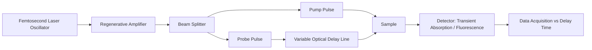

## Lasers in Chemical Research

### Overview

Lasers provide monochromatic, coherent, high-intensity, and temporally well-defined light sources that have become central tools across physical, analytical, and organic chemistry. Their utility in chemical research stems from four combined properties: narrow spectral linewidth (high resolution), high photon flux (nonlinear and multiphoton processes), spatial coherence (tight focusing, precise beam delivery), and pulse durations ranging from continuous-wave down to femtoseconds (time-resolved studies of molecular dynamics).

### Fundamental Laser Physics Relevant to Chemistry

**Key Points**

- Laser action requires population inversion between two electronic, vibrational, or rotational states, achieved by an external pump source (optical, electrical discharge, or chemical reaction).
- Stimulated emission produces coherent photons at the transition energy:

  $$\Delta E=h\nu=\frac{hc}{\lambda}$$
- An optical resonator (cavity) formed by mirrors provides feedback, and a gain medium (gas, dye, solid-state crystal, semiconductor) amplifies light on each pass.
- Output can be continuous-wave (CW) or pulsed; pulsed lasers are characterized by pulse energy, pulse duration, repetition rate, and peak power, $P_{peak}=E_{pulse}/\tau_{pulse}$.

### Types of Lasers Used in Chemistry

| Laser type | Gain medium | Typical wavelength range | Common chemical use |
| --- | --- | --- | --- |
| Nd:YAG (solid-state) | Nd³⁺:Y₃Al₅O₁₂ crystal | 1064 nm (fundamental); 532, 355, 266 nm (harmonics) | Pump source, Raman spectroscopy, LIBS, ablation |
| Dye laser | Organic dye in solvent | Tunable, ~300–1000 nm (dye-dependent) | Tunable excitation, high-resolution spectroscopy |
| Ti:sapphire | Ti³⁺-doped sapphire | Tunable ~650–1100 nm; frequency-doubled to visible/UV | Ultrafast spectroscopy, mode-locked femtosecond pulses |
| Excimer laser | Noble gas–halide (ArF, KrF, XeCl) | UV, 193–351 nm | Photolysis, ablation, lithography-related chemistry |
| CO₂ laser | CO₂ gas | 10.6 μm (IR) | Vibrational excitation, IR multiphoton dissociation |
| Diode laser | Semiconductor (e.g., GaAs, InGaAsP) | Near-IR to visible, tunable by composition | Absorption spectroscopy, trace gas detection |
| Optical parametric oscillator (OPO)/amplifier (OPA) | Nonlinear crystal, pumped by another laser | Broadly tunable, UV–mid-IR | Generating tunable pulses for pump–probe experiments |

### Spectroscopic Applications

**Laser-Induced Fluorescence (LIF)**

A tunable laser excites a specific rovibronic transition; the resulting fluorescence is collected to determine state populations, rate constants, or concentrations with high sensitivity and selectivity. Widely used for combustion diagnostics and reaction-product state distributions.

**Raman Spectroscopy**

Monochromatic laser light is inelastically scattered by molecular vibrations, producing Stokes and anti-Stokes shifted lines:

$$\Delta\tilde\nu=\tilde\nu_{laser}-\tilde\nu_{scattered}$$

Because Raman scattering is inherently weak ($\sim10^{-6}$–$10^{-8}$ of incident intensity), high laser power and narrow linewidth are essential. Resonance Raman spectroscopy uses laser excitation coincident with an electronic absorption band to selectively enhance vibrational modes coupled to that transition.

**Surface-Enhanced Raman Spectroscopy (SERS)**

Laser excitation of molecules adsorbed on nanostructured metal (Au, Ag) surfaces exploits localized surface plasmon resonance to enhance Raman signal by factors of $10^{6}$–$10^{10}$ [Unverified — enhancement factor is highly substrate- and analyte-dependent], enabling single-molecule sensitivity in favorable cases.

**Laser-Induced Breakdown Spectroscopy (LIBS)**

A high-power pulsed laser (commonly Nd:YAG) ablates a small volume of sample, generating a microplasma. Atomic emission lines from the cooling plasma are analyzed to determine elemental composition, applicable to solids, liquids, and gases without extensive sample preparation.

**Cavity Ring-Down Spectroscopy (CRDS)**

A laser pulse is injected into a high-finesse optical cavity; the exponential decay rate of light leaking from the cavity is measured, with the decay constant sensitive to trace absorbers inside the cavity. This achieves very high sensitivity absorption measurements (parts-per-trillion range for some species) largely independent of laser intensity fluctuations, since only the decay time constant is used.

$$I(t)=I_0\,e^{-t/\tau},\qquad \tau=\frac{L}{c(1-R+\alpha L)}$$

where $L$ is cavity length, $R$ mirror reflectivity, and $\alpha$ the absorption coefficient of the sample.

### Time-Resolved and Ultrafast Chemistry

**Pump–Probe Spectroscopy**

A "pump" laser pulse excites the sample to an excited state; a time-delayed "probe" pulse monitors the resulting transient absorption, fluorescence, or other spectroscopic signature as a function of delay time, mapped by a mechanical or optical delay line. This is the primary technique for studying:

- Excited-state relaxation dynamics ($S_1$ lifetimes, internal conversion, intersystem crossing)
- Bond-breaking and bond-forming events in real time (femtochemistry)
- Charge- and energy-transfer processes in photosynthetic and photovoltaic systems

Femtosecond ($10^{-15}\,s$) and picosecond ($10^{-12}\,s$) lasers, typically Ti:sapphire-based mode-locked oscillators combined with regenerative amplifiers, provide the temporal resolution required to observe transition-state dynamics directly, an area pioneered experimentally by Ahmed Zewail (femtochemistry).

**Key Points**

- Mode-locking forces many longitudinal cavity modes into fixed phase relationships, producing very short pulses; pulse duration and spectral bandwidth are related by the time–bandwidth (Fourier transform) limit:

  $$\Delta\nu\cdot\Delta t\geq K$$

  where $K$ is a constant depending on pulse shape (e.g., $K\approx0.44$ for a Gaussian pulse).
- Chirped pulse amplification (CPA) allows femtosecond pulses to be amplified to high energies without damaging optical components, by stretching, amplifying, then recompressing the pulse.

### Photochemical and Synthetic Applications

**Laser Photolysis / Flash Photolysis**

A high-intensity laser pulse generates transient species (radicals, excited states, reactive intermediates) whose subsequent kinetics are monitored by transient absorption or emission. This extends classical flash photolysis (Norrish and Porter) to much shorter timescales and greater selectivity.

**Multiphoton Absorption and Photodissociation**

At sufficiently high intensity, a molecule can absorb two or more photons simultaneously (or sequentially within the excited-state lifetime), accessing states not reachable by single-photon absorption, or driving stepwise vibrational-ladder-climbing dissociation with IR lasers (IR multiphoton dissociation, IRMPD), useful for mass-spectrometric structural characterization of ions.

**Laser Ablation**

Pulsed lasers (commonly Nd:YAG or excimer) vaporize material from a solid target, used in:

- Laser ablation inductively coupled plasma mass spectrometry (LA-ICP-MS) for elemental/isotopic analysis of solids
- Matrix-assisted laser desorption/ionization (MALDI), where a laser desorbs and ionizes large biomolecules embedded in a matrix for mass spectrometry
- Pulsed laser deposition (PLD) for thin-film materials synthesis

**Isotope Separation and Selective Chemistry**

Tunable lasers can selectively excite specific isotopologues (due to small vibrational frequency shifts between isotopes), enabling laser isotope separation schemes [Inference — practical large-scale implementation is technically demanding and industrially limited compared to other separation methods].

### Nonlinear Optical Processes Used with Lasers

**Key Points**

- Second-harmonic generation (SHG) and sum-frequency generation (SFG): nonlinear crystals convert laser light to higher frequencies; SFG spectroscopy is surface-selective and used to probe interfacial molecular structure and orientation.
- Optical parametric oscillation/amplification (OPO/OPA): converts fixed-wavelength laser output into widely tunable radiation via nonlinear frequency mixing, essential for accessing wavelengths not directly available from a laser gain medium.
- Coherent anti-Stokes Raman spectroscopy (CARS): a nonlinear four-wave-mixing process using multiple laser beams to generate a strong, coherent Raman-like signal, used for chemically selective imaging (e.g., in microscopy of biological tissue).

### Instrumentation Schematic: Pump–Probe Setup

### Example

Studying the photodissociation of a diatomic or small polyatomic molecule:

- A femtosecond pump pulse promotes the molecule to a dissociative excited electronic state.
- A time-delayed femtosecond probe pulse ionizes or interrogates the evolving nuclear geometry (e.g., via resonance-enhanced multiphoton ionization, REMPI, coupled to time-of-flight mass spectrometry).
- Scanning the pump–probe delay reconstructs the reaction coordinate in real time, allowing direct determination of bond-breaking timescales, often in the range of tens to hundreds of femtoseconds [Unverified — specific value is system-dependent].

### Safety Considerations

**Key Points**

- Laser classification (Class 1–4) determines required engineering and administrative controls; Class 3B and 4 lasers used in most research settings require enclosed beam paths, interlocks, and protective eyewear matched to the specific wavelength and power.
- High-power pulsed UV and IR lasers pose both ocular and skin hazards, and can generate hazardous byproducts (ozone, ablation plumes) that require appropriate ventilation.

**Related Topics**

- Femtochemistry and the transition-state dynamics of chemical reactions
- Raman and resonance Raman spectroscopy
- Transient absorption spectroscopy and excited-state kinetics
- Nonlinear optics: SHG, SFG, CARS
- Mass spectrometry ionization techniques (MALDI, REMPI)
- Photodissociation dynamics and reaction coordinate mapping
- Cavity ring-down and trace gas detection
- Laser safety standards (ANSI Z136, IEC 60825)