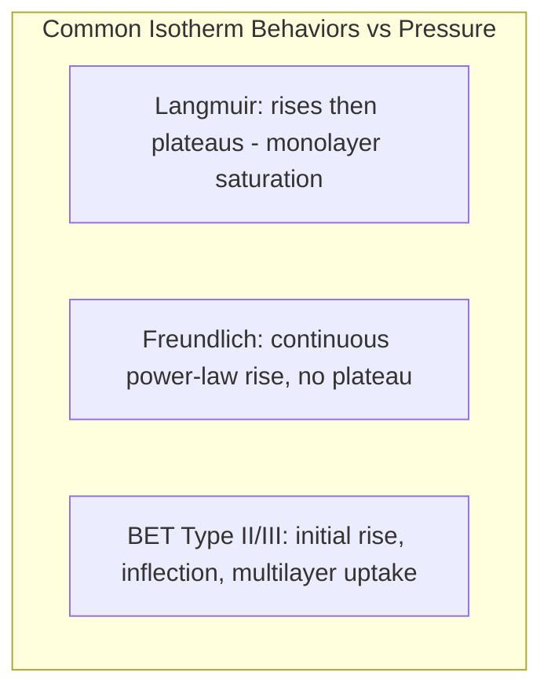

## Adsorption and Surface Phenomena

### Overview

Adsorption is the accumulation of a substance (the adsorbate) at the interface of a solid or liquid (the adsorbent), as distinct from absorption, in which a substance is taken up into the bulk of another phase. Surface phenomena governed by adsorption underlie heterogeneous catalysis, gas storage, chromatography, corrosion, colloid stability, and many biological interfacial processes. Understanding adsorption requires thermodynamic, kinetic, and structural descriptions of how molecules interact with surfaces.

### Physisorption vs. Chemisorption

| Property | Physisorption | Chemisorption |
| --- | --- | --- |
| Bonding | Van der Waals forces (dispersion, dipole interactions) | Formation of chemical bonds (covalent/ionic character) with the surface |
| Enthalpy of adsorption | Low, typically $5$–$40\,kJ/mol$ | High, typically $40$–$800\,kJ/mol$ |
| Reversibility | Generally reversible | Often irreversible or requires significant activation energy to reverse |
| Specificity | Non-specific, occurs on most surfaces | Highly specific, depends on chemical nature of adsorbate/adsorbent |
| Layer structure | Can form multilayers | Typically limited to a monolayer |
| Activation energy | Low or negligible | Can be significant (activated chemisorption) |
| Temperature dependence | Favored at lower temperatures | Can be favored at higher temperatures if activated |

**Key Points**

- The distinction is not always sharp; some systems show a precursor physisorbed state that converts to a chemisorbed state.
- Chemisorption is a prerequisite for most heterogeneous catalytic mechanisms, since it activates the adsorbate (e.g., weakening or breaking bonds) prior to reaction.

### Thermodynamics of Adsorption

Adsorption is generally exothermic: $\Delta H_{ads}<0$. Since surface confinement reduces the translational and rotational freedom of the adsorbate, $\Delta S_{ads}<0$ as well. For adsorption to be spontaneous:

$$\Delta G_{ads}=\Delta H_{ads}-T\Delta S_{ads}<0$$

requires $|\Delta H_{ads}|>T|\Delta S_{ads}|$, consistent with the empirical observation that adsorption is favored at lower temperature and becomes less favorable as temperature increases (Le Chatelier-consistent behavior for an exothermic process).

The isosteric heat of adsorption, obtained from adsorption isotherms at multiple temperatures via the Clausius–Clapeyron-type relation:

$$\left(\frac{\partial\ln P}{\partial T}\right)_\theta=\frac{\Delta H_{ads}}{RT^2}$$

quantifies the strength of adsorbate–surface interaction at a given surface coverage $\theta$.

### Adsorption Isotherms

**Langmuir Isotherm**

The Langmuir model assumes: a fixed number of equivalent, localized adsorption sites; monolayer coverage only; no lateral interaction between adsorbed molecules; and dynamic equilibrium between adsorption and desorption.

$$\theta=\frac{K P}{1+K P}$$

where $\theta$ is fractional surface coverage, $P$ is adsorbate pressure (or concentration in solution), and $K$ is the equilibrium (Langmuir) constant related to the adsorption/desorption rate constants, $K=k_{ads}/k_{des}$.

**Key Points**

- At low pressure, $\theta\approx KP$ (linear, first-order behavior).
- At high pressure, $\theta\to1$ (monolayer saturation).
- The linearized form, $\dfrac{P}{\theta}=\dfrac{1}{K}+P$ (or equivalent rearrangements), is used to extract $K$ and monolayer capacity from experimental data via linear regression.

**Freundlich Isotherm**

An empirical isotherm often applied to heterogeneous surfaces with a distribution of site energies:

$$\theta = K_F P^{1/n}$$

where $K_F$ and $n$ ($n>1$) are empirical constants. Unlike the Langmuir isotherm, it does not predict a saturation limit, making it most accurate at intermediate coverages.

**BET (Brunauer–Emmett–Teller) Isotherm**

Extends the Langmuir treatment to multilayer physisorption:

$$\frac{P}{V(P_0-P)}=\frac{1}{V_mC}+\frac{(C-1)}{V_mC}\cdot\frac{P}{P_0}$$

where $V$ is the volume of gas adsorbed at pressure $P$, $P_0$ is the saturation vapor pressure, $V_m$ is the monolayer volume, and $C$ is a constant related to the heat of adsorption of the first layer versus subsequent layers. BET analysis is the standard method for determining the specific surface area of porous solids (catalysts, activated carbons, zeolites) from nitrogen (or other gas) adsorption data.

**Key Points**

- The BET method is normally applied over the relative pressure range $P/P_0\approx0.05$–$0.35$, where the underlying assumptions are most valid.
- Surface area is calculated from $V_m$ using the known cross-sectional area of the adsorbate molecule (e.g., $0.162\,nm^2$ for N₂) [Unverified — standard reference value, may vary slightly by source].

### Surface Coverage and Reaction Kinetics

**Langmuir–Hinshelwood Mechanism**

For a bimolecular surface reaction where both reactants A and B adsorb competitively on the same type of site before reacting:

$$rate=k\,\theta_A\theta_B=k\frac{K_AP_A}{1+K_AP_A+K_BP_B}\cdot\frac{K_BP_B}{1+K_AP_A+K_BP_B}$$

**Eley–Rideal Mechanism**

A gas-phase molecule reacts directly with an adsorbed species without itself adsorbing first:

$$rate=k\,\theta_A\,P_B$$

**Key Points**

- These two limiting kinetic models are foundational for interpreting rate laws in heterogeneous catalysis.
- Real catalytic cycles frequently involve more complex, multistep sequences (adsorption, surface diffusion, reaction, desorption) that may combine features of both idealized mechanisms.

### Surface Structure and Characterization

**Key Points**

- Surface science techniques used to probe adsorption include: X-ray photoelectron spectroscopy (XPS, elemental/oxidation-state analysis of surface species), low-energy electron diffraction (LEED, surface crystallography), scanning tunneling microscopy (STM, atomic-resolution imaging), temperature-programmed desorption (TPD, measuring binding energies and desorption kinetics), and infrared reflection-absorption spectroscopy (IRRAS, vibrational identification of adsorbed species).
- Surface reconstruction and relaxation: adsorption can induce changes in the arrangement of surface atoms relative to the bulk-terminated structure, altering reactivity.
- The surface free energy (surface tension for liquids) drives phenomena such as wetting, capillary action, and the Kelvin equation's prediction of vapor pressure over curved surfaces.

### Electrical Double Layer and Solution-Phase Adsorption

For adsorption at solid–liquid or liquid–liquid interfaces (e.g., ions at electrode surfaces, surfactants at liquid interfaces):

- The Gibbs adsorption isotherm relates surface excess concentration $\Gamma$ to the change in surface tension $\gamma$ with solute activity $a$:

  $$\Gamma=-\frac{1}{RT}\left(\frac{\partial\gamma}{\partial\ln a}\right)_T$$
- Surfactant molecules adsorb at interfaces with a preferred orientation (hydrophilic head toward the aqueous phase, hydrophobic tail away), reducing interfacial tension and enabling emulsification and micelle formation above the critical micelle concentration (CMC).
- At charged solid–electrolyte interfaces, the electrical double layer (Helmholtz, Gouy–Chapman, and Stern models) describes the distribution of ions near a charged surface, relevant to electrochemistry and colloid stability (DLVO theory).

### Diagram: Adsorption Isotherm Shapes

### Example

Determining the surface area of an activated carbon catalyst support:

1. Degas the sample under vacuum/heat to remove pre-adsorbed contaminants.
2. Expose the sample to nitrogen gas at 77 K across a range of relative pressures $P/P_0$.
3. Measure the volume of N₂ adsorbed at each pressure point.
4. Apply the BET equation over the linear region ($P/P_0\approx0.05$–$0.35$) to extract $V_m$.
5. Calculate specific surface area:

   $$S_{BET}=\frac{V_m N_A \sigma}{22400\,m_{sample}}$$

   where $N_A$ is Avogadro's number, $\sigma$ is the molecular cross-sectional area of N₂, and $m_{sample}$ is the mass of the sample (assuming $V_m$ in cm³ at STP).

### Applications

**Key Points**

- Heterogeneous catalysis: adsorption of reactants onto active sites (metal surfaces, zeolite pores) is the essential first step in the catalytic cycle.
- Gas storage and separation: porous materials (zeolites, metal–organic frameworks, activated carbon) exploit selective adsorption for gas purification, carbon capture, and hydrogen storage.
- Chromatography: separation of mixtures based on differential adsorption affinities between a stationary phase and mobile phase.
- Corrosion inhibition: adsorbed inhibitor molecules form protective monolayers on metal surfaces.
- Water and air purification: activated carbon and related adsorbents remove pollutants via physisorption/chemisorption.

**Related Topics**

- Heterogeneous catalysis mechanisms and active site theory
- Zeolites and metal–organic frameworks (MOFs) as porous adsorbents
- Electrochemical double layer and electrode kinetics
- Surface characterization techniques (XPS, STM, LEED, TPD)
- Colloid stability and DLVO theory
- Chromatographic separation principles
- Catalyst poisoning and surface site blocking