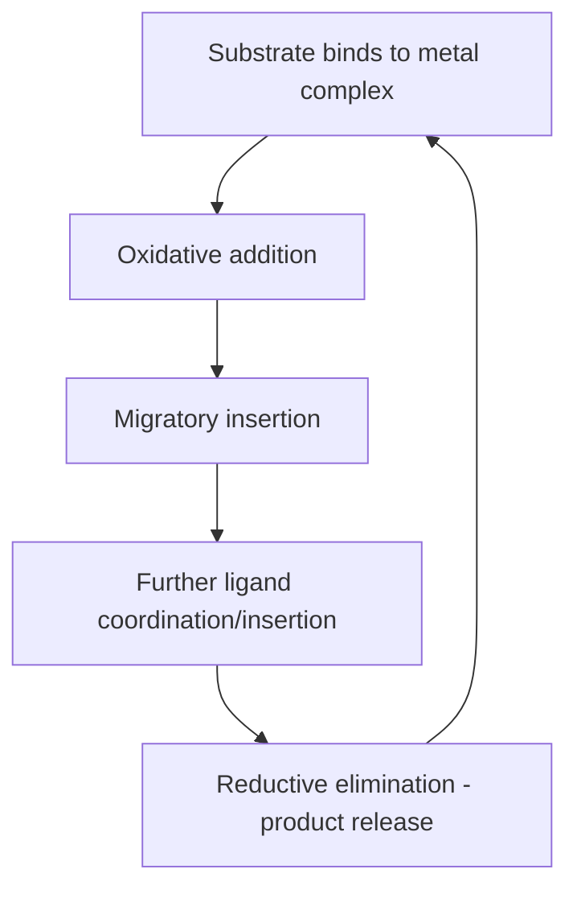

## Homogeneous Catalysis

### Overview

Homogeneous catalysis occurs when the catalyst is present in the same phase as the reactants, most commonly a soluble metal complex or organic molecule dissolved together with substrates in a liquid reaction medium. Because catalyst and substrate molecules interact freely throughout the bulk solution, homogeneous catalysts typically offer well-defined, single-site active centers, high selectivity (including enantioselectivity), and mild operating conditions, at the cost of more difficult catalyst/product separation compared to heterogeneous systems.

### Comparison with Heterogeneous Catalysis

| Property | Homogeneous | Heterogeneous |
| --- | --- | --- |
| Phase | Same phase as reactants (usually liquid) | Different phase (usually solid catalyst, fluid reactants) |
| Active sites | Well-defined, uniform (molecular) | Often heterogeneous distribution of site types |
| Selectivity | Generally high, tunable via ligand design | Often lower, though shape selectivity possible (zeolites) |
| Mechanistic characterization | More tractable (spectroscopy, kinetics on discrete species) | More difficult (surface-sensitive techniques required) |
| Separation/recovery | Often difficult, may require distillation/extraction | Simple (filtration), easily regenerated |
| Operating conditions | Generally milder temperature/pressure | Often requires higher temperature/pressure |
| Thermal stability | Often lower (ligand decomposition) | Generally more robust |

### Organometallic Catalytic Cycles: Elementary Steps

Most homogeneous catalytic cycles, particularly transition-metal catalyzed reactions, are built from a small set of recurring elementary organometallic steps.

**Key Points**

- **Ligand association/dissociation:** a ligand (including substrate) binds to or leaves the metal center, often changing coordination number and/or oxidation state accessibility.
- **Oxidative addition:** the metal inserts into a substrate bond (e.g., X–Y), increasing its formal oxidation state by two and coordination number by two.
- **Reductive elimination:** the reverse process, forming a new bond between two ligands and releasing them from the metal, decreasing oxidation state by two.
- **Migratory insertion:** a ligand (e.g., CO, alkene) inserts into a metal–ligand bond (commonly metal–hydride or metal–alkyl), forming a new bond without changing the metal's formal oxidation state.
- **β-hydride elimination:** the reverse of insertion for alkyl ligands with β-hydrogens, generating a metal-hydride and a coordinated alkene.
- **σ-bond metathesis:** a concerted four-centered exchange of σ-bonded ligands, common for early transition metals and lanthanides that cannot easily access oxidative addition/reductive elimination cycles.

### Key Mechanistic Classes and Industrial Examples

**Hydrogenation (Wilkinson's Catalyst)**

RhCl(PPh₃)₃ catalyzes homogeneous alkene hydrogenation via oxidative addition of H₂ to Rh(I), alkene coordination, migratory insertion, and reductive elimination of the alkane product, regenerating the active Rh(I) species.

**Hydroformylation**

Rh- or Co-based catalysts convert alkenes, CO, and H₂ into aldehydes (oxo process):

$$RCH=CH_2 + CO + H_2 \xrightarrow{\text{catalyst}} RCH_2CH_2CHO$$

via alkene coordination, migratory insertion into a metal–hydride to form a metal–alkyl, CO insertion (migratory insertion), and reductive elimination/hydrogenolysis to release the aldehyde and regenerate the active hydride species.

**Cross-Coupling Reactions (Pd-catalyzed)**

Suzuki, Negishi, Stille, and related couplings proceed through a canonical Pd(0)/Pd(II) cycle:

1. Oxidative addition of an aryl/vinyl halide to Pd(0)
2. Transmetalation with an organometallic coupling partner (boronic acid, organozinc, organostannane)
3. Reductive elimination to form the new C–C bond and regenerate Pd(0)

**Alkene Metathesis**

Ru- and Mo-based carbene catalysts (Grubbs, Schrock catalysts) interconvert alkene pairs via a [2+2] cycloaddition/retro-[2+2] mechanism through a metallacyclobutane intermediate, widely used in ring-closing metathesis, cross metathesis, and polymer synthesis.

**Asymmetric Catalysis**

Chiral ligands (phosphines such as BINAP, salen complexes, etc.) coordinated to a metal center create a chiral pocket that differentiates prochiral faces of a substrate, enabling enantioselective hydrogenation, epoxidation, and related transformations; this area has been recognized by multiple Nobel Prizes (e.g., Knowles, Noyori, Sharpless in 2001).

**Ziegler–Natta and Related Polymerization Catalysis**

Homogeneous single-site catalysts (metallocenes, post-metallocenes) enable precise control over polymer tacticity and molecular weight distribution in alkene polymerization, complementing traditional heterogeneous Ziegler–Natta systems.

**Acid/Base and Organocatalysis**

Not all homogeneous catalysts are organometallic; Brønsted/Lewis acids and bases, as well as small organic molecules (proline derivatives, N-heterocyclic carbenes, thioureas), catalyze reactions such as esterifications, aldol condensations, and various asymmetric transformations through hydrogen-bonding, iminium/enamine activation, or nucleophilic catalysis mechanisms.

### Kinetics of Homogeneous Catalysis

**Key Points**

- Homogeneous catalytic kinetics are typically analyzed with the same steady-state approximation framework used for other multistep mechanisms, often producing saturation-type rate laws analogous in form to Michaelis–Menten kinetics when a pre-equilibrium substrate-binding step precedes a rate-determining step.
- Catalyst resting state: the most stable, and often most populated, species in the catalytic cycle; identifying it (via spectroscopy or kinetics) is central to understanding which step is rate-determining.
- The turnover number (TON, moles product per mole catalyst) and turnover frequency (TOF, TON per unit time) are standard metrics for catalyst efficiency and productivity.
- Catalyst deactivation pathways include ligand dissociation/decomposition, formation of catalytically inactive dimeric or oligomeric species, and poisoning by trace impurities or reaction byproducts.

### Ligand Design and Electronic/Steric Effects

**Key Points**

- Phosphine ligands are characterized by the Tolman cone angle (steric bulk) and electronic parameter (donor strength via CO stretching frequency in model Ni(CO)₃L complexes), both of which strongly influence catalytic activity and selectivity.
- Bidentate and chelating ligands (bite angle effects) can favor specific coordination geometries and reductive elimination pathways.
- Electron-rich vs. electron-poor ligand sets tune the metal's propensity for oxidative addition (favored by electron-rich, low oxidation state metals) versus reductive elimination (often favored by more electron-poor centers).

### Catalyst Recovery Strategies

Because separating a homogeneous catalyst from product can be costly, several strategies bridge homogeneous selectivity with heterogeneous-like recovery:

- **Biphasic catalysis:** water-soluble ligands (e.g., sulfonated phosphines) keep the catalyst in an aqueous phase separate from an organic product phase.
- **Supported homogeneous catalysts:** metal complexes covalently anchored to solid supports, attempting to combine homogeneous selectivity with heterogeneous ease of separation, though often with some loss of activity or leaching concerns [Inference — degree of success is highly system-dependent].
- **Fluorous biphasic catalysis:** fluorinated ligands render the catalyst soluble preferentially in a fluorous phase, separable from the organic product phase by temperature-dependent phase behavior.
- **Membrane/nanofiltration separation:** size-selective membranes retain large catalyst-ligand complexes while allowing smaller product molecules to pass through.

### Example

Rhodium-catalyzed asymmetric hydrogenation of a prochiral alkene (simplified catalytic cycle), analogous to industrial L-DOPA synthesis:

1. Chiral Rh(I) catalyst (e.g., Rh–DIPAMP) coordinates the prochiral enamide substrate through its alkene and carbonyl groups.
2. Oxidative addition of H₂ to Rh(I) generates a Rh(III) dihydride.
3. Migratory insertion of the alkene into a Rh–H bond forms a Rh–alkyl intermediate; the chiral ligand environment favors insertion at one prochiral face, setting the stereochemical outcome.
4. Reductive elimination releases the chiral hydrogenated product and regenerates the active Rh(I) catalyst.

**Related Topics**

- Organometallic reaction mechanisms (oxidative addition, migratory insertion, reductive elimination)
- Ligand design: phosphines, N-heterocyclic carbenes, chiral ligands
- Cross-coupling reaction methodology (Suzuki, Negishi, Heck)
- Asymmetric catalysis and enantioselective synthesis
- Alkene metathesis and Grubbs/Schrock catalysts
- Catalyst immobilization and biphasic/fluorous separation techniques
- Comparison with heterogeneous catalytic mechanisms