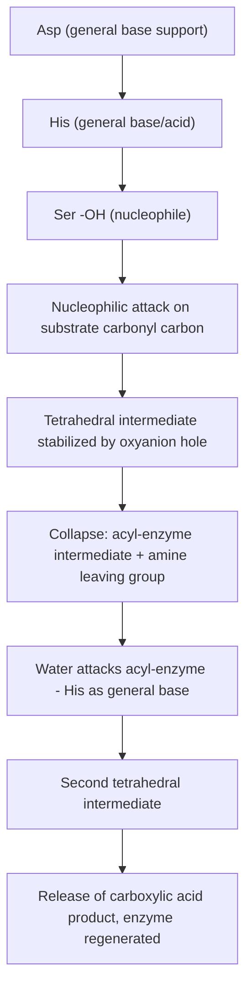

## Enzyme Catalysis Mechanisms

### Overview

Enzymes are biological catalysts, almost exclusively proteins (with some catalytic RNAs, ribozymes), that accelerate biochemical reactions by factors typically ranging from $10^6$ to $10^{17}$ relative to the uncatalyzed reaction [Unverified — exact rate enhancement is highly reaction-specific], while operating under mild physiological conditions of temperature, pressure, and pH. Enzyme catalysis combines many of the same fundamental principles as chemical catalysis (transition-state stabilization, lowering of activation energy) with additional features arising from precise three-dimensional active-site architecture, multiple simultaneous catalytic strategies, and evolved substrate specificity.

### General Principles of Enzymatic Rate Enhancement

**Key Points**

- Enzymes do not alter the thermodynamics ($\Delta G$) of a reaction; they lower the activation energy ($\Delta G^\ddagger$) of the rate-determining step, increasing rate without shifting the equilibrium position.
- The transition-state stabilization theory (Pauling) proposes that enzyme active sites are structurally and electronically complementary to the transition state of the reaction, binding it more tightly than either substrate or product.
- Multiple catalytic strategies typically act in combination within a single active site: proximity and orientation effects, general acid–base catalysis, covalent catalysis, electrostatic stabilization, and metal ion catalysis.

### Proximity and Orientation Effects

By binding substrates within the active site, enzymes convert what would be a bimolecular (or higher-order) reaction in solution into an effectively unimolecular process, dramatically increasing the effective local concentration of reactants and constraining their relative orientation for reaction. This contributes substantially to the entropic component of rate enhancement, since much of the translational and rotational entropy loss associated with bringing two molecules together is "paid for" during binding rather than during the reaction step itself.

### General Acid–Base Catalysis

Active-site amino acid side chains (commonly His, Asp, Glu, Lys, Cys, Tyr, Ser) donate or accept protons to stabilize developing charge in the transition state.

**Key Points**

- General acid catalysis: a side chain donates a proton to stabilize a developing negative charge or leaving group.
- General base catalysis: a side chain abstracts a proton, often activating a nucleophile (e.g., deprotonating a serine hydroxyl to enhance its nucleophilicity).
- Histidine's imidazole side chain (pKₐ near physiological pH) makes it particularly versatile as either a general acid or general base, a recurring feature in many catalytic triads.

### Covalent Catalysis

The enzyme forms a transient covalent bond with the substrate, creating a reactive intermediate that lowers the activation energy of subsequent steps.

**Key Points**

- Serine proteases (chymotrypsin, trypsin) use a nucleophilic serine to form a covalent acyl-enzyme intermediate.
- Schiff base (imine) formation with a lysine residue is used by enzymes such as aldolases and some decarboxylases.
- Thiamine pyrophosphate (TPP)- and pyridoxal phosphate (PLP)-dependent enzymes use cofactor-based covalent catalysis to stabilize carbanion intermediates.

### Electrostatic and Metal Ion Catalysis

**Key Points**

- Electrostatic catalysis: charged or polar active-site residues stabilize a transition state with different charge distribution than the ground-state substrate (e.g., an oxyanion hole stabilizing a tetrahedral alkoxide intermediate).
- Metal ion catalysis (metalloenzymes): metal cofactors (Zn²⁺, Mg²⁺, Fe²⁺/Fe³⁺, Mn²⁺, Cu²⁺, etc.) can polarize substrate bonds, stabilize negative charge, orient substrates, or directly participate in redox chemistry.
- Desolvation effects: the hydrophobic, low-dielectric environment of many active sites can enhance electrostatic interactions that would be substantially weakened in bulk water.

### Case Study: Serine Protease Catalytic Triad

The chymotrypsin/trypsin family illustrates the combination of several catalytic strategies in a single mechanism.

**Key Points**

- The Asp–His–Ser catalytic triad functions as a "charge-relay system": Asp orients and polarizes His, which in turn deprotonates Ser, increasing its nucleophilicity.
- The oxyanion hole (typically backbone amide N–H groups) hydrogen-bonds to and stabilizes the developing negative charge on the tetrahedral intermediate's oxygen.
- The mechanism proceeds through two tetrahedral intermediates and a covalent acyl-enzyme intermediate, with His alternating between general base (activating Ser, then activating the water nucleophile) and general acid (protonating the leaving group) roles.

### Enzyme Kinetics: Michaelis–Menten Framework

$$E+S \underset{k_{-1}}{\overset{k_1}{\rightleftharpoons}} ES \xrightarrow{k_2} E+P$$

Applying the steady-state approximation to $[ES]$ yields the Michaelis–Menten equation:

$$v_0=\frac{V_{max}[S]}{K_M+[S]}$$

where $V_{max}=k_2[E]_{total}$ and $K_M=\dfrac{k_{-1}+k_2}{k_1}$.

**Key Points**

- $K_M$ approximates the substrate concentration at which $v_0=\dfrac{1}{2}V_{max}$, and under many (though not all) conditions can be interpreted as an approximate measure of the enzyme's affinity for substrate.
- $k_{cat}$ (turnover number), defined as $V_{max}/[E]_{total}$, represents the maximum number of substrate molecules converted to product per active site per unit time.
- The specificity constant $k_{cat}/K_M$ is used to compare catalytic efficiency across different substrates or enzymes, and its upper practical limit is set by the diffusion-controlled encounter rate between enzyme and substrate ($\sim10^8$–$10^9\,M^{-1}s^{-1}$).
- Lineweaver–Burk (double-reciprocal), Eadie–Hofstee, and Hanes–Woolf plots are linearized transformations historically used to extract $K_M$ and $V_{max}$ from experimental data, though nonlinear regression is generally preferred for accuracy [Inference — modern practice favors nonlinear fitting over linearized plots due to error propagation issues in the latter].

### Enzyme Inhibition

| Inhibition type | Effect on $K_M$ | Effect on $V_{max}$ | Mechanism |
| --- | --- | --- | --- |
| Competitive | Increases (apparent) | Unchanged | Inhibitor binds free enzyme at (or overlapping) the active site, competing with substrate |
| Uncompetitive | Decreases (apparent) | Decreases | Inhibitor binds only the ES complex |
| Noncompetitive (mixed, equal affinity case) | Unchanged | Decreases | Inhibitor binds E and ES with similar affinity at a site distinct from substrate binding |
| Mixed | Changes (increase or decrease) | Decreases | Inhibitor binds E and ES with different affinities |
| Irreversible | N/A (enzyme inactivated) | Effectively decreases active enzyme concentration | Covalent modification or very tight binding at/near active site |

### Enzyme Regulation

**Key Points**

- Allosteric regulation: binding of an effector molecule at a site distinct from the active site alters enzyme conformation and activity, often described by the Monod–Wyman–Changeux (concerted) or Koshland–Némethy–Filmer (sequential) models for cooperative behavior in multi-subunit enzymes.
- Covalent modification: reversible post-translational modifications (phosphorylation, acetylation, etc.) can activate or inhibit enzyme activity.
- Zymogen activation: some enzymes are synthesized as inactive precursors (e.g., trypsinogen, chymotrypsinogen) and activated by proteolytic cleavage.
- Feedback inhibition: the end product of a metabolic pathway inhibits an earlier enzyme in that pathway, a common regulatory motif in biosynthetic sequences.

### Cofactors and Coenzymes

**Key Points**

- Cofactors are non-protein components required for catalytic activity; they include metal ions and organic coenzymes.
- Coenzymes often derive from vitamins: NAD⁺/NADH and FAD/FADH₂ (redox chemistry), coenzyme A (acyl group transfer), pyridoxal phosphate (amino acid metabolism), thiamine pyrophosphate (decarboxylation), biotin (carboxylation).
- A prosthetic group is a cofactor tightly (often covalently) bound to the enzyme, as distinguished from a co-substrate that binds and releases with each catalytic cycle.

### Comparison with Non-Enzymatic (Chemical) Catalysis

**Key Points**

- Enzymes achieve extraordinary rate enhancements and substrate specificity under mild aqueous conditions, whereas comparable chemical catalysts often require extremes of temperature, pressure, or non-aqueous solvents.
- Enzyme active sites frequently combine several catalytic strategies simultaneously (multifunctional catalysis) within a single, precisely pre-organized binding pocket, whereas synthetic catalysts typically rely on one or two dominant mechanisms.
- Enzyme kinetics (Michaelis–Menten, saturation kinetics) parallels the kinetic treatment used for heterogeneous catalysis on a finite number of active sites, and is mathematically analogous to Langmuir-type surface saturation behavior.

### Example

Carbonic anhydrase catalyzes the reversible hydration of CO₂:

$$CO_2+H_2O \rightleftharpoons HCO_3^-+H^+$$

using a Zn²⁺ cofactor coordinated by three histidine residues; the zinc-bound water is polarized and deprotonated (assisted by a general base, often a nearby His acting as a proton shuttle) to generate a nucleophilic zinc-hydroxide, which attacks CO₂ directly. This enzyme is notable for approaching the diffusion-controlled limit, with $k_{cat}/K_M$ reported near $10^8\,M^{-1}s^{-1}$ [Unverified — precise value varies by isoform and experimental conditions], making it one of the most catalytically efficient enzymes known.

**Related Topics**

- Michaelis–Menten kinetics and enzyme inhibition analysis
- Transition-state theory and transition-state analog inhibitors
- Allosteric regulation and cooperative binding models
- Metalloenzyme structure and mechanism
- Coenzymes and vitamin-derived cofactors
- Enzyme engineering and directed evolution
- Comparison of enzymatic and heterogeneous/homogeneous catalytic strategies