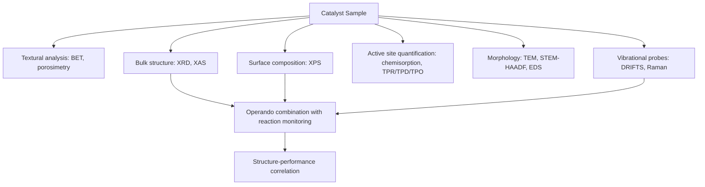

## Characterizing Catalysts

### Overview

Catalyst characterization encompasses the analytical techniques used to determine a catalyst's structural, chemical, and textural properties, and to connect these properties to catalytic performance (activity, selectivity, stability). Because catalysis is fundamentally an interfacial phenomenon, characterization methods must probe surface composition and structure specifically, often distinguishing surface behavior from bulk properties. Techniques are commonly grouped into ex-situ (before/after reaction, under vacuum or ambient conditions), in-situ (under reaction-relevant conditions but not necessarily during turnover), and operando (simultaneously monitoring structure and catalytic performance during reaction) categories.

### Textural Characterization: Surface Area and Porosity

**Gas Physisorption (BET Method)**

N₂ (or Ar, Kr for low-surface-area materials) physisorption at cryogenic temperature is the standard method for determining specific surface area, using the BET equation:

$$\frac{P}{V(P_0-P)}=\frac{1}{V_mC}+\frac{(C-1)}{V_mC}\cdot\frac{P}{P_0}$$

**Key Points**

- Pore size distribution is obtained from the adsorption/desorption isotherm shape using models such as BJH (Barrett–Joyner–Halenda) for mesopores (2–50 nm) and various micropore-specific models (e.g., Horvath–Kawazoe, DFT-based methods) for pores < 2 nm.
- Hysteresis between adsorption and desorption branches of the isotherm indicates mesoporosity and capillary condensation effects, with hysteresis loop shape (IUPAC Type H1–H4) providing information on pore geometry.
- Mercury intrusion porosimetry complements gas physisorption for characterizing larger (macro-) pores by measuring the pressure required to force mercury into pores of a given size.

### Bulk Structural Characterization

**X-ray Diffraction (XRD)**

Measures the crystalline phase composition, crystallite size, and lattice parameters of a catalyst via Bragg diffraction:

$$n\lambda=2d\sin\theta$$

**Key Points**

- Crystallite (not necessarily particle) size can be estimated from peak broadening using the Scherrer equation:

  $$D=\frac{K\lambda}{\beta\cos\theta}$$

  where $K$ is a shape factor (commonly $\approx0.9$), $\beta$ is the peak full width at half maximum (corrected for instrumental broadening), and $\theta$ is the Bragg angle.
- In-situ XRD (variable temperature, controlled atmosphere) can track phase transformations and reduction/oxidation behavior of catalysts under near-reaction conditions.
- XRD is insensitive to amorphous phases and to crystallites below roughly 3–5 nm [Unverified — detection limit depends on instrument and material], which is a significant limitation for highly dispersed metal catalysts.

**X-ray Absorption Spectroscopy (XAS): XANES and EXAFS**

Synchrotron-based XAS probes the local coordination environment and oxidation state of a specific element, even in amorphous or highly dispersed (non-crystalline) samples.

**Key Points**

- XANES (X-ray Absorption Near Edge Structure): the edge position and shape are sensitive to the oxidation state and coordination geometry of the absorbing atom.
- EXAFS (Extended X-ray Absorption Fine Structure): oscillations beyond the absorption edge encode coordination number, bond distances, and identity of neighboring atoms, obtained through Fourier-transform analysis of the EXAFS signal.
- XAS can be performed in-situ/operando, making it one of the most powerful tools for tracking active-site structural evolution under reaction conditions.

### Surface-Sensitive Spectroscopy

**X-ray Photoelectron Spectroscopy (XPS)**

Measures the kinetic energy of photoelectrons ejected by X-ray irradiation to determine elemental composition, oxidation states, and chemical environment of surface atoms (typically probing the outermost 1–10 nm, due to the short inelastic mean free path of photoelectrons).

**Key Points**

- Binding energy shifts reveal oxidation state and chemical bonding environment (e.g., distinguishing metallic Pt⁰ from oxidized Pt²⁺/Pt⁴⁺ species).
- Surface atomic ratios (e.g., surface metal-to-support ratio) can be estimated from relative peak intensities, providing information complementary to bulk elemental analysis.
- Requires ultra-high vacuum, historically limiting XPS to ex-situ characterization, though near-ambient-pressure XPS (NAP-XPS) instruments now allow measurements closer to realistic reaction pressures.

**Infrared and Raman Spectroscopy**

**Key Points**

- Diffuse reflectance infrared Fourier transform spectroscopy (DRIFTS) identifies surface functional groups, adsorbed intermediates, and probe-molecule interactions (e.g., CO or pyridine adsorption to distinguish Brønsted vs. Lewis acid sites in zeolites).
- Pyridine-DRIFTS: pyridine adsorbed on Brønsted acid sites forms a pyridinium ion (characteristic band near 1545 cm⁻¹), while pyridine on Lewis acid sites forms a coordinated complex (characteristic band near 1450 cm⁻¹) [Unverified — exact band positions vary somewhat by instrument and material], allowing quantitative differentiation of acid site types.
- Raman spectroscopy probes vibrational modes of metal oxide catalysts, supported species, and carbonaceous deposits (coke), often used operando alongside reaction monitoring.

### Chemisorption Techniques

**Key Points**

- Selective chemisorption of probe molecules (H₂, CO, O₂, N₂O) quantifies the number of accessible active metal sites and metal dispersion, calculated from the amount of gas irreversibly chemisorbed assuming a known stoichiometry (e.g., typically one H atom or one CO molecule per surface metal atom, though stoichiometry can vary by metal and technique).
- Metal dispersion (fraction of metal atoms exposed at the surface) is calculated from chemisorption uptake and total metal loading, and is used together with particle size estimates (from XRD or TEM) as a cross-check.
- Temperature-Programmed Reduction (TPR): sample is heated under a reducing gas (typically dilute H₂) while monitoring gas consumption, revealing the reducibility and interaction strength of metal oxide species with the support.
- Temperature-Programmed Desorption (TPD): sample is heated under inert gas after probe-molecule adsorption, with desorbed species detected (often by mass spectrometry) as a function of temperature, providing information on binding site strength distribution and, via analysis methods such as the Redhead equation, approximate desorption activation energies.
- Temperature-Programmed Oxidation (TPO): used particularly to quantify and characterize coke deposits by monitoring CO₂ evolution during controlled oxidation.

### Microscopy

**Key Points**

- Transmission electron microscopy (TEM) and high-resolution TEM (HRTEM) provide direct imaging of particle size, morphology, and, in favorable cases, lattice fringes revealing crystal structure.
- Scanning transmission electron microscopy with high-angle annular dark-field detection (STEM-HAADF) provides Z-contrast imaging sensitive to atomic number, useful for visualizing heavy metal atoms/clusters on lighter oxide supports, including single-atom catalysts.
- Energy-dispersive X-ray spectroscopy (EDS/EDX), typically coupled to electron microscopy, provides spatially resolved elemental composition and mapping.
- Scanning probe microscopies (STM, AFM) provide atomic- or near-atomic-resolution imaging of surface structure, particularly valuable for single-crystal model catalyst studies.

### Surface Crystallography

**Key Points**

- Low-Energy Electron Diffraction (LEED): probes the two-dimensional periodicity of ordered single-crystal surfaces, used to identify surface reconstructions and adsorbate overlayer structures.
- Applicable primarily to well-defined single-crystal model systems under ultra-high vacuum, providing fundamental mechanistic insight that complements the more "real-world" but structurally heterogeneous behavior of practical supported catalysts.

### Operando Methodology

**Key Points**

- Operando characterization simultaneously measures catalytic performance (conversion, selectivity, via downstream gas analysis such as mass spectrometry or gas chromatography) and structural/spectroscopic information under actual working reaction conditions.
- This approach directly correlates structural features with catalytic performance in real time, avoiding artifacts that can arise from characterizing a catalyst before or after reaction under non-representative conditions (e.g., re-oxidation upon air exposure).
- Common operando combinations include operando XRD, operando XAS, operando DRIFTS, and operando Raman, each paired with simultaneous reactor product analysis.

### Example

Characterizing a supported Pt/Al₂O₃ catalyst for CO oxidation:

1. **BET analysis** determines the alumina support's specific surface area (commonly on the order of $100$–$200\,m^2/g$ for γ-Al₂O₃ [Unverified — depends on specific support preparation]).
2. **XRD** confirms the alumina crystalline phase and checks for detectable Pt reflections (their absence suggests highly dispersed, small Pt particles below the XRD detection limit).
3. **H₂ or CO chemisorption** quantifies Pt dispersion and estimates average Pt particle size.
4. **TEM/STEM-HAADF** directly images Pt particle size distribution, cross-validating the chemisorption-derived estimate.
5. **XPS** confirms the Pt oxidation state (metallic Pt⁰ vs. oxidized species) at the surface after reduction pretreatment.
6. **Operando DRIFTS** during CO oxidation identifies adsorbed CO species (linear vs. bridged binding modes) and correlates their disappearance with CO₂ product evolution monitored by mass spectrometry, directly linking surface chemistry to catalytic turnover.

**Related Topics**

- Adsorption isotherms and surface area determination (BET)
- Heterogeneous catalytic mechanisms and active site theory
- X-ray absorption spectroscopy (XANES/EXAFS) for local structure
- Electron microscopy techniques for nanoparticle characterization
- Acid site characterization in zeolites (pyridine-IR, NH₃-TPD)
- Operando spectroscopy methodology
- Catalyst deactivation diagnosis (coking, sintering, poisoning)