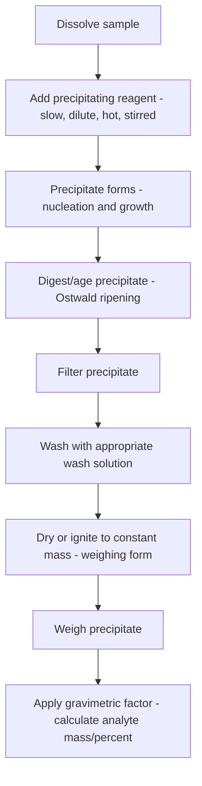

## Gravimetric Analysis

### Overview

Gravimetric analysis is a class of quantitative analytical methods in which the amount of an analyte is determined by measuring its mass, either as an isolated pure substance or, more commonly, as a precipitate of known, reproducible stoichiometric composition. As one of the oldest quantitative analytical techniques, it relies on mass measurement, one of the most accurate and precise fundamental physical measurements achievable, and remains an important reference/primary method against which other techniques are validated.

### General Types of Gravimetric Methods

**Key Points**

- **Precipitation gravimetry:** the analyte is converted to a sparingly soluble precipitate of known composition, which is filtered, washed, dried/ignited, and weighed.
- **Volatilization (evolution) gravimetry:** the analyte, or a compound derived from it, is converted to a gas of known composition, and the mass loss (or mass of gas absorbed elsewhere) is measured (e.g., determination of carbonate content by CO₂ evolution and absorption).
- **Electrogravimetry:** the analyte is quantitatively deposited (commonly as a metal) onto an electrode by electrolysis, and the mass gain of the electrode is measured.
- **Thermogravimetry:** mass changes of a sample are monitored as a continuous function of temperature (or time at constant temperature), used both for compositional analysis and for materials characterization (decomposition, dehydration, oxidation behavior).

### Requirements for a Valid Gravimetric Precipitation Method

**Key Points**

- The precipitate must have very low solubility, so that quantitative recovery (typically requiring losses due to solubility to be undetectable at the balance's precision, generally corresponding to less than about 0.1–0.2 mg error, or effectively $<0.1\%$ relative error) is achieved.
- The precipitate must be readily filterable, meaning it should form as large, well-defined crystals rather than colloidal or gelatinous material that clogs filters and traps impurities.
- The precipitate must be of known, constant, and stoichiometrically well-defined composition after drying or igniting (i.e., convertible to a "weighing form" of fixed, reproducible formula).
- The method must be selective (or the procedure must include steps to remove/mask interferences) so that only the analyte of interest is precipitated and weighed.

### Precipitate Formation: Nucleation and Crystal Growth

The physical character of a precipitate (particle size, purity, filterability) is governed by the relationship between the rate of nucleation and the rate of crystal growth, both of which depend on the degree of supersaturation.

**Key Points**

- Von Weimarn's empirical relation relates relative supersaturation to the tendency toward nucleation versus growth:

  $$RSS=\frac{Q-S}{S}$$

  where $Q$ is the concentration of the solute immediately after mixing (before precipitation), and $S$ is the equilibrium solubility.
- High relative supersaturation favors rapid, extensive nucleation, producing many small particles (colloidal precipitates); low relative supersaturation favors fewer nuclei and slower crystal growth, producing larger, more easily filtered crystals.
- Practical strategies to minimize supersaturation and favor larger crystal formation include: using dilute solutions, adding the precipitating reagent slowly with good stirring, precipitating from hot solution, and digesting (aging) the precipitate at elevated temperature before filtration.

### Digestion (Ostwald Ripening) and Precipitate Purification

**Key Points**

- Digestion (heating the precipitate in contact with its mother liquor, typically for an extended period) allows smaller, less stable crystals to dissolve and redeposit onto larger crystals (Ostwald ripening), improving particle size, purity, and filterability.
- Digestion also allows structural rearrangement of the precipitate toward a more stable, less defective, and less impurity-laden crystal form.

### Sources of Precipitate Impurity (Coprecipitation)

Coprecipitation is the process by which normally soluble impurities are carried down with a precipitate during its formation, and is a major source of systematic error in gravimetric analysis.

| Coprecipitation mechanism | Description |
| --- | --- |
| Surface adsorption | Ions from solution adsorb onto the large surface area of precipitate particles, especially significant for colloidal precipitates |
| Occlusion | Impurities become physically trapped within the growing crystal lattice during rapid crystal growth |
| Mixed-crystal (isomorphous) formation | An impurity ion of similar size/charge substitutes into the crystal lattice in place of the analyte ion, chemically incorporated rather than merely trapped |
| Mechanical entrapment | Pockets of mother liquor (containing dissolved impurities) become physically trapped as crystals grow together rapidly |

**Key Points**

- Post-precipitation is a related but distinct phenomenon in which a second, normally more soluble compound slowly precipitates onto the surface of the primary precipitate after it has already formed, typically becoming more significant the longer the precipitate is left in contact with the mother liquor.
- Reprecipitation (dissolving the precipitate and re-precipitating it from fresh solution) can reduce coprecipitation, since the impurity concentration in the second precipitation is much lower relative to the now-isolated analyte.
- Washing the precipitate with a dilute electrolyte solution (rather than pure water) helps prevent peptization (breakup of a precipitate back into colloidal particles that can pass through filter paper) while still removing surface-adsorbed impurities.

### Precipitating Agents

**Key Points**

- Inorganic precipitating agents form ionic precipitates (e.g., AgCl for chloride determination, BaSO₄ for sulfate determination).
- Organic precipitating agents often form chelate complexes with metal ions, producing precipitates with favorable properties (low solubility, well-defined composition, sometimes selective for specific metals); classic examples include dimethylglyoxime (selective for Ni²⁺) and 8-hydroxyquinoline (oxine, less selective, precipitates many metal ions).
- Homogeneous precipitation generates the precipitating agent slowly and uniformly throughout the solution via a controlled chemical reaction (e.g., generating hydroxide ion slowly from urea hydrolysis, or sulfide slowly from thioacetamide hydrolysis), maintaining low supersaturation throughout the entire volume and producing purer, more easily filtered precipitates than direct reagent addition.

### Filtration, Washing, and Drying/Ignition

**Key Points**

- Precipitates are typically collected on ashless filter paper (which can be burned away completely during ignition) or in a fritted (sintered glass) crucible, chosen based on whether the precipitate will be ignited at high temperature or only dried at moderate temperature.
- Washing removes soluble impurities and adsorbed ions from the precipitate surface without causing significant analyte loss through solubility or peptization; wash solution composition (often a dilute solution of a volatile electrolyte) is chosen to minimize both problems.
- The precipitate is converted to its "weighing form": either dried at moderate temperature (100–120 °C, removing physically adsorbed water while retaining chemical composition) or ignited at high temperature in a muffle furnace (typically 500–1200 °C, converting the precipitate to a well-defined, often anhydrous or oxide, stoichiometric compound).
- The crucible is brought to constant mass (repeated cycles of heating, cooling in a desiccator, and weighing until successive mass measurements agree within an acceptable tolerance) to ensure complete conversion and equilibration with ambient conditions.

### Stoichiometric Calculations: The Gravimetric Factor

The mass of analyte is calculated from the mass of the weighed precipitate ("weighing form") using a gravimetric factor derived from the stoichiometric relationship between analyte and precipitate:

$$\text{mass of analyte}=\text{mass of precipitate}\times\left(\frac{a}{b}\cdot\frac{M_{analyte}}{M_{precipitate}}\right)$$

where $a$ and $b$ are the stoichiometric coefficients balancing moles of analyte to moles of precipitate in the relevant chemical equation, and $M$ denotes molar mass.

**Example calculation:**

Determination of chloride as AgCl: $Cl^-+Ag^+\rightarrow AgCl(s)$, so $a=b=1$ (1:1 stoichiometry).

$$\%Cl=\frac{\text{mass AgCl}\times\dfrac{M_{Cl}}{M_{AgCl}}}{\text{mass sample}}\times100\%$$

With $M_{Cl}=35.45\,g/mol$ and $M_{AgCl}=143.32\,g/mol$, the gravimetric factor is $35.45/143.32\approx0.2474$.

For a sample of mass 0.5000 g yielding 0.3450 g of AgCl precipitate:

$$\%Cl=\frac{0.3450\,g\times0.2474}{0.5000\,g}\times100\%\approx17.06\%$$

### Sources of Error and Quality Considerations

**Key Points**

- Solubility losses during precipitation and washing (minimized by common-ion effect additions, appropriate wash solution choice, and low-temperature/high-supersaturation-avoidant conditions, balanced against the risk of coprecipitation).
- Coprecipitation of impurities (addressed via digestion, reprecipitation, and careful reagent addition as described above).
- Incomplete drying/ignition or decomposition beyond the intended weighing form (addressed by bringing the sample to demonstrated constant mass and verifying appropriate ignition temperature for the specific gravimetric system).
- Loss of precipitate during transfer/filtration (minimized through careful technique, quantitative transfer with rinsing, and use of appropriately fine filter media).
- Relative supersaturation control throughout precipitation, since it governs essentially all of the above through its influence on particle size and purity.

### Thermogravimetric Analysis (TGA) as an Extension

**Key Points**

- TGA continuously records sample mass as a function of controlled temperature (or isothermally over time), producing a thermogram that reveals discrete decomposition, dehydration, or oxidation steps as mass-loss (or mass-gain) plateaus.
- Beyond direct compositional gravimetric analysis, TGA is widely used for materials characterization: determining moisture/volatile content, decomposition temperatures, compositional analysis of mixtures (e.g., polymer composites, mineral samples), and oxidative/thermal stability studies.
- Differential thermogravimetry (DTG), the derivative of the mass-vs-temperature curve, is often used alongside TGA to more clearly resolve overlapping decomposition steps.

### Example

Gravimetric determination of sulfate as barium sulfate:

$$SO_4^{2-}+Ba^{2+}\rightarrow BaSO_4(s)$$

1. Dissolve the sulfate-containing sample and acidify slightly (commonly with HCl) to suppress interference from other anions that might co-precipitate with barium under neutral/basic conditions.
2. Heat the solution and add dilute BaCl₂ slowly, with good stirring, to keep relative supersaturation low and favor larger, purer BaSO₄ crystals.
3. Digest the precipitate at near-boiling temperature for an extended period to promote crystal growth and reduce coprecipitated impurities.
4. Filter (commonly using fine ashless filter paper, since BaSO₄ crystals are typically small), wash with dilute acid to remove soluble impurities while minimizing peptization.
5. Ignite the filter and precipitate together in a pre-weighed crucible at high temperature (commonly 800 °C or higher) to burn off the filter paper and convert the precipitate fully to pure BaSO₄.
6. Cool in a desiccator, weigh, and repeat heating/cooling/weighing cycles until constant mass is achieved.
7. Calculate percent sulfate using the gravimetric factor $M_{SO_4}/M_{BaSO_4}$.

**Related Topics**

- Solubility product ($K_{sp}$) and precipitation equilibria
- Common-ion effect and precipitate solubility control
- Complexometric and chelate precipitating agents
- Thermogravimetric analysis (TGA) and differential thermal analysis (DTA)
- Volumetric (titrimetric) analysis as a complementary quantitative technique
- Error analysis and significant figures in quantitative analytical chemistry
- Homogeneous precipitation techniques