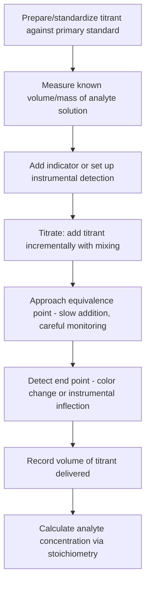

## Volumetric and Titrimetric Analysis

### Overview

Volumetric (titrimetric) analysis is a quantitative analytical technique in which the concentration or amount of an analyte is determined by measuring the volume of a reagent of known concentration (the titrant) required to react completely with the analyte. The technique relies on precise volume delivery (typically via a burette) and a reliable means of detecting the equivalence point, the point at which stoichiometrically equivalent amounts of titrant and analyte have reacted. It remains a foundational quantitative method valued for its accuracy, low cost, and minimal instrumentation requirements.

### Core Concepts and Terminology

**Key Points**

- **Standard solution:** a solution of accurately known concentration, either a primary standard (prepared directly by dissolving a precisely weighed, highly pure, stable compound) or standardized against a primary standard.
- **Equivalence point:** the point in a titration at which the moles of titrant added are exactly stoichiometrically equivalent to the moles of analyte present, a theoretical concept defined by the reaction stoichiometry.
- **End point:** the experimentally observed point at which a physical change (indicator color change, potentiometric inflection, etc.) signals that the titration should be stopped; ideally coincides closely with the equivalence point, though a small systematic difference (titration error) is common.
- **Primary standard requirements:** high purity, stability (not hygroscopic, not affected by air/CO₂), high molar mass (to minimize relative weighing error), and ready solubility.
- **Standardization:** the process of determining the exact concentration of a solution (often not directly preparable as a primary standard, e.g., NaOH, HCl) by titrating it against a known mass of primary standard.

### Types of Titrimetric Methods

| Method | Reaction type | Typical detection | Common applications |
| --- | --- | --- | --- |
| Acid–base titration | Proton transfer | Indicator color change, pH electrode | Determination of acids, bases, and their salts |
| Complexometric titration | Metal–ligand complex formation | Metal-ion indicator, ion-selective electrode | Water hardness, metal ion determination |
| Precipitation titration | Formation of insoluble precipitate | Indicator (e.g., adsorption indicator), potentiometry | Halide determination (e.g., Mohr, Volhard, Fajans methods) |
| Redox titration | Electron transfer | Self-indicating color change, redox indicator, potentiometry | Determination of oxidizable/reducible species |

### Acid–Base Titrations

**Key Points**

- Governed by proton-transfer equilibria; the shape of the titration curve (pH vs. volume of titrant) depends on the strength of the acid and base involved (strong–strong, weak–strong, polyprotic systems).
- For a strong acid–strong base titration, the equivalence point occurs at $pH=7$ (at 25 °C); for a weak acid titrated with strong base, the equivalence point occurs at $pH>7$ due to hydrolysis of the conjugate base; for a weak base titrated with strong acid, the equivalence point occurs at $pH<7$.
- The Henderson–Hasselbalch equation describes the buffer region of a weak acid/weak base titration:

  $$pH=pK_a+\log\frac{[A^-]}{[HA]}$$
- Indicators are chosen so their color-change transition range (typically $pK_{In}\pm1$) overlaps with the steep vertical portion of the titration curve near the equivalence point; common examples include phenolphthalein ($pK_{In}\approx9.1$ [Unverified — literature values vary slightly by source], colorless to pink) and methyl orange ($pK_{In}\approx3.7$ [Unverified], red to yellow).
- Polyprotic acid/base titrations show multiple equivalence points, each corresponding to sequential proton transfer steps, provided the successive $K_a$ values are sufficiently different (typically differing by at least a factor of $10^3$–$10^4$) to produce distinguishable inflections.

### Complexometric Titrations

Most commonly employ EDTA (ethylenediaminetetraacetic acid), a hexadentate ligand that forms stable 1:1 complexes with most metal cations.

**Key Points**

- EDTA titrations are widely used for determining water hardness (Ca²⁺/Mg²⁺) and other metal ion concentrations.
- Metal ion indicators (e.g., Eriochrome Black T) form a colored complex with free metal ion; as EDTA is added and complexes the metal, the indicator is displaced near the equivalence point, producing a color change.
- The conditional formation constant, $K_f'$, accounts for the effect of solution pH (via $\alpha_{Y^{4-}}$, the fraction of EDTA in its fully deprotonated, complexing form) on the effective stability of the metal–EDTA complex, making pH control essential for sharp, quantitative end points.
- Masking agents can be added to selectively bind interfering metal ions, allowing sequential or selective determination of specific metals in mixtures.

### Precipitation Titrations

Primarily used for halide determination via reaction with Ag⁺.

**Key Points**

- **Mohr method:** titration of Cl⁻ with standardized AgNO₃ using chromate ion (CrO₄²⁻) as indicator; a secondary, more soluble red Ag₂CrO₄ precipitate forms only after essentially all Cl⁻ has been consumed as AgCl, signaling the end point. Requires near-neutral pH.
- **Volhard method:** excess standardized AgNO₃ is added to precipitate the halide, and the unreacted Ag⁺ is back-titrated with standardized thiocyanate (SCN⁻) using Fe³⁺ as indicator (red FeSCN²⁺ complex signals the end point); useful in acidic solution and adaptable to halides where the Mohr method is unsuitable.
- **Fajans method:** uses an adsorption indicator (e.g., dichlorofluorescein) that changes color when adsorbed onto the precipitate surface as it acquires excess charge from the titrant near the equivalence point.

### Redox Titrations

**Key Points**

- Governed by electron-transfer equilibria, with titration curves tracking solution potential ($E$) as titrant is added, describable via the Nernst equation for each redox couple involved.
- Common oxidizing titrants include permanganate (MnO₄⁻, self-indicating due to its intense purple color), dichromate (Cr₂O₇²⁻), and iodine/iodometric systems (I₂/I⁻, commonly using starch as a sensitive indicator for the iodine–starch complex).
- Iodometric titrations are especially important: an oxidizing analyte first liberates I₂ from excess iodide, and the liberated I₂ is then titrated with standardized thiosodium thiosulfate (Na₂S₂O₃), providing an indirect but highly precise determination method for many oxidizing species.
- The equivalence point potential for a symmetric redox titration ($n_1=n_2$) can be approximated as the weighted average of the two half-reaction standard potentials:

  $$E_{eq}\approx\frac{n_1E^\circ_1+n_2E^\circ_2}{n_1+n_2}$$

### Titration Curves and the Equivalence Point Region

**Key Points**

- Near the equivalence point, the titration curve (pH, $E$, or $pM$ vs. volume) shows a steep inflection; the sharpness of this inflection depends on the strength/completeness of the underlying reaction (larger equilibrium constants and/or higher analyte concentrations produce sharper, more easily detected inflections).
- The first derivative of the titration curve ($d(signal)/dV$) shows a maximum at the inflection point (equivalence point); the second derivative crosses zero at this point, and both derivative methods are used for precise potentiometric end-point determination, particularly when a visual indicator is unavailable or insufficiently sharp.
- Gran plots provide a linearized method for locating the equivalence point from potentiometric data collected before the steep inflection region, useful when the curve near the equivalence point itself is difficult to resolve precisely.

### Potentiometric and Instrumental End-Point Detection

**Key Points**

- A potentiometric titration monitors the potential of an indicator electrode (pH glass electrode, ion-selective electrode, or inert redox electrode such as Pt) relative to a reference electrode as titrant is added, locating the end point from the inflection in the $E$ vs. $V$ curve without requiring a visual indicator.
- Conductometric titrations monitor solution conductivity, useful when color-change indicators are unsuitable (e.g., colored or turbid solutions).
- Automated titrators combine a motor-driven burette with potentiometric or other instrumental detection and often computer-controlled end-point recognition algorithms, improving precision and enabling unattended operation.

### Calculations

For a simple 1:1 stoichiometry titration:

$$mol_{analyte}=mol_{titrant}=M_{titrant}\times V_{titrant}$$

More generally, for a reaction with stoichiometric coefficients $aA+bT\rightarrow products$ (A = analyte, T = titrant):

$$mol_A=\frac{a}{b}\times M_T\times V_T$$

**Example calculation:**

Standardization of NaOH against potassium hydrogen phthalate (KHP, $M=204.22\,g/mol$, 1:1 acid–base stoichiometry):

If 0.4084 g of KHP requires 21.48 mL of NaOH solution to reach the phenolphthalein end point:

$$mol_{KHP}=\frac{0.4084\,g}{204.22\,g/mol}=1.9998\times10^{-3}\,mol$$

$$M_{NaOH}=\frac{1.9998\times10^{-3}\,mol}{0.02148\,L}\approx0.09311\,M$$

### Sources of Error

**Key Points**

- Indicator error: the difference between the visually observed end point and the true equivalence point, generally minimized by selecting an indicator whose transition range closely matches the equivalence point pH/potential.
- Systematic errors in volumetric glassware (burette calibration, parallax in reading the meniscus) and in standard solution preparation/standardization.
- Carbonate contamination of standard base solutions (from atmospheric CO₂ absorption) is a classic systematic error source in acid–base titrimetry, addressable through use of freshly boiled/decarbonated water and minimizing solution exposure to air.
- Titration errors from overshooting the end point, particularly significant with rapid or careless titrant addition near the steep inflection region.

### Example

Determination of the concentration of an unknown HCl solution by titration with standardized NaOH:

1. Standardize a NaOH solution against primary-standard KHP as shown above, establishing an accurate NaOH molarity.
2. Pipette a precise aliquot (e.g., 25.00 mL) of the unknown HCl solution into a flask and add a few drops of phenolphthalein indicator.
3. Titrate with the standardized NaOH from a burette, swirling continuously, adding titrant dropwise as the solution approaches the anticipated end point.
4. Stop at the first persistent faint pink color (end point), and record the volume of NaOH delivered.
5. Calculate HCl concentration using the 1:1 stoichiometry: $M_{HCl}=\dfrac{M_{NaOH}\times V_{NaOH}}{V_{HCl}}$.
6. Repeat in triplicate and average results to assess precision (relative standard deviation).

**Related Topics**

- Acid–base equilibria and buffer systems
- EDTA complexometric titration and conditional stability constants
- Redox equilibria and the Nernst equation
- Potentiometry and ion-selective electrodes
- Primary standards and solution standardization practices
- Gravimetric analysis as a complementary classical technique
- Error propagation and statistical treatment of titration data