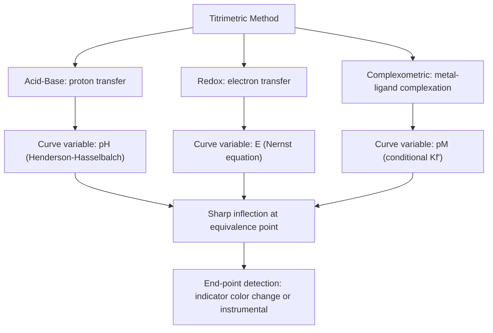

## Acid-Base, Redox, and Complexometric Titrations

### Overview

Acid–base, redox, and complexometric titrations are the three major classes of titrimetric methods distinguished by the type of chemical equilibrium underlying the titration reaction: proton transfer, electron transfer, and metal–ligand complex formation, respectively. While a precipitation titration (a fourth class, based on formation of an insoluble solid) is treated separately, these three classes share a common quantitative framework: an equivalence-point-based calculation of analyte amount from a precisely measured, stoichiometrically consistent titrant volume, differing mainly in the equilibrium model needed to predict the titration curve and select an appropriate end-point detection method.

### Acid–Base Titrations

**Underlying Equilibrium**

Governed by proton-transfer (Brønsted–Lowry) equilibria between the analyte (acid or base) and a titrant of opposite character.

**Key Points**

- Strong acid–strong base titrations show a very sharp equivalence point at $pH=7$ (25 °C), since both species dissociate completely.
- Weak acid–strong base titrations exhibit a buffer region (governed by the Henderson–Hasselbalch equation) before the equivalence point, which occurs at $pH>7$ due to hydrolysis of the conjugate base:

  $$pH=pK_a+\log\frac{[A^-]}{[HA]}$$
- Weak base–strong acid titrations show an analogous buffer region and an equivalence point at $pH<7$.
- Polyprotic systems (e.g., H₃PO₄, carbonate/bicarbonate) produce multiple equivalence points when successive $K_a$ values differ sufficiently (typically by $\geq10^3$–$10^4$).
- Indicator selection matches the indicator's color-transition range ($pK_{In}\pm1$) to the steep portion of the curve; phenolphthalein (transition near pH 8–10) suits strong acid/strong base and weak acid/strong base titrations, while methyl orange (transition near pH 3–4.5) suits titrations with a lower equivalence-point pH.
- Non-aqueous acid–base titrations (e.g., in glacial acetic acid or other non-aqueous solvents) extend the technique to very weak acids or bases whose strength is leveled or insufficiently differentiated in water.

### Redox Titrations

**Underlying Equilibrium**

Governed by electron-transfer equilibria between two redox couples, with the titration curve tracking solution potential $E$ (via the Nernst equation) rather than concentration directly.

**Key Points**

- Common oxidizing titrants: potassium permanganate (MnO₄⁻, self-indicating intense purple color, requires acidic conditions for its most common 5-electron reduction to Mn²⁺), potassium dichromate (Cr₂O₇²⁻, more stable as a primary standard than permanganate), and iodine (I₂, typically used in iodometric/iodimetric procedures).
- Iodometric titration: an oxidizing analyte is used to liberate I₂ from excess iodide ($2I^-\rightarrow I_2+2e^-$), and the liberated I₂ is titrated with standardized sodium thiosulfate (Na₂S₂O₃), using starch as a sensitive indicator near the end point (deep blue starch–iodine complex disappears sharply).
- Iodimetric titration: I₂ solution is used directly as the titrant against a reducing analyte.
- The equivalence-point potential for a titration between two reversible redox couples of equal electron stoichiometry ($n_1=n_2$) can be approximated as:

  $$E_{eq}\approx\frac{n_1E^\circ_1+n_2E^\circ_2}{n_1+n_2}$$
- For unequal electron stoichiometries, a more general weighted expression (accounting for $n_1$ and $n_2$ explicitly in the combined Nernst treatment) is required to locate $E_{eq}$ accurately.
- Redox indicators change color over a characteristic potential range (analogous to the pH range of acid–base indicators), and are chosen so their transition potential lies within the steep inflection of the $E$ vs. $V$ curve.

### Complexometric Titrations

**Underlying Equilibrium**

Governed by metal-ion/ligand complex formation equilibria, almost universally using EDTA (ethylenediaminetetraacetic acid) as the titrant due to its strong, predictable 1:1 hexadentate binding with most metal cations.

**Key Points**

- The stability of the metal–EDTA complex is described by the formation constant $K_f$; because EDTA's fully deprotonated form (Y⁴⁻) is the actively complexing species, the conditional formation constant $K_f'=\alpha_{Y^{4-}}K_f$ accounts for the fraction of EDTA present as Y⁴⁻ at a given pH, making solution pH control critical to titration sharpness and selectivity.
- Metal-ion indicators (e.g., Eriochrome Black T, murexide) form a colored complex with free metal ion at the start of the titration; as EDTA progressively binds the metal, the indicator is displaced from the metal near the equivalence point, producing a sharp color change to the free-indicator form.
- Selectivity between metal ions with different formation constants can be achieved by careful pH control (since $\alpha_{Y^{4-}}$, and thus $K_f'$, increases steeply with pH) or by using masking agents to block interfering metal ions from reacting with EDTA.
- Back-titration and displacement titration variants extend complexometric methods to metals lacking a suitable direct indicator, or to situations where the direct reaction with EDTA is kinetically slow.

### Comparative Summary

| Feature | Acid–Base | Redox | Complexometric |
| --- | --- | --- | --- |
| Governing equilibrium | Proton transfer | Electron transfer | Metal–ligand complexation |
| Key equation | Henderson–Hasselbalch | Nernst equation | Formation constant / conditional $K_f'$ |
| Common titrant(s) | HCl, NaOH | KMnO₄, I₂, Na₂S₂O₃, K₂Cr₂O₇ | EDTA |
| Typical indicator | pH indicator dye (phenolphthalein, methyl orange) | Self-indicating color or redox indicator, starch (iodometric) | Metal-ion indicator (Eriochrome Black T) |
| Equivalence-point variable | pH | Potential (E) | pM (metal ion concentration, as -log[M]) |
| Key selectivity control | Choice of indicator transition range | Choice of oxidant/reductant strength | Solution pH, masking agents |

### Titration Curve Shapes: A Unified View

**Key Points**

- All three titration types produce an S-shaped curve when plotting the relevant equilibrium variable (pH, E, or pM) against titrant volume, with a steep inflection at the equivalence point.
- The sharpness of the inflection in each case depends on the magnitude of the relevant equilibrium constant ($K_a/K_b$ for acid–base, combined $K^\circ$ from $E^\circ$ values via $\Delta G^\circ=-nFE^\circ=-RT\ln K$ for redox, and $K_f'$ for complexometric titrations): larger equilibrium constants produce sharper, more easily detected end points.
- The first derivative of the curve peaks at the equivalence point; this common mathematical structure underlies potentiometric/instrumental end-point detection methods applicable across all three titration types.

### Instrumental (Potentiometric) End-Point Detection Across All Three Types

**Key Points**

- A pH glass electrode monitors acid–base titrations directly.
- An inert indicator electrode (commonly Pt) paired with a reference electrode monitors redox titrations via solution potential.
- An ion-selective electrode (ISE) for the specific metal cation, or occasionally a mercury-based electrode responsive to EDTA equilibria, can monitor complexometric titrations directly.
- In all three cases, the equivalence point is located from the inflection (maximum in $d(signal)/dV$) of the potentiometric curve, providing an objective, indicator-independent alternative particularly valuable for colored, turbid, or otherwise visually difficult samples.

### Example

Sequential water-hardness analysis illustrating complexometric titration in practice:

1. A water sample is buffered to pH ≈10 (typically with an NH₃/NH₄⁺ buffer) to ensure a sufficiently high conditional formation constant for Ca²⁺/Mg²⁺–EDTA complexes.
2. A small amount of Eriochrome Black T indicator is added, forming a wine-red Mg–indicator complex (Mg²⁺ typically required for a sharp color change, since Ca²⁺–indicator complexes alone often give a less distinct end point).
3. Standardized EDTA solution is added from a burette; EDTA preferentially binds free Ca²⁺ and Mg²⁺ first, then finally displaces the indicator from its Mg complex.
4. The end point is signaled by a color change from wine-red to blue.
5. Total hardness (as combined Ca²⁺ + Mg²⁺, often reported as mg/L CaCO₃ equivalent) is calculated from the volume and concentration of EDTA delivered, using the 1:1 EDTA:metal stoichiometry.

### Example (Redox)

Iodometric determination of copper in an ore sample:

$$2Cu^{2+}+4I^-\rightarrow2CuI(s)+I_2$$

The liberated I₂ is titrated with standardized Na₂S₂O₃ using starch indicator near the end point:

$$I_2+2S_2O_3^{2-}\rightarrow2I^-+S_4O_6^{2-}$$

The Cu²⁺ content is back-calculated from the thiosulfate volume via the combined 2:1 (Cu:I₂) and 2:1 (S₂O₃²⁻:I₂) stoichiometric relationships, giving an overall 1:1 correspondence between moles Cu²⁺ and moles S₂O₃²⁻ consumed.

**Related Topics**

- Buffer solutions and the Henderson–Hasselbalch equation
- Nernst equation and standard reduction potentials
- EDTA formation constants and alpha-fraction (conditional constant) calculations
- Potentiometry and ion-selective electrodes
- Precipitation titrations (Mohr, Volhard, Fajans methods)
- Primary standards and solution standardization
- Gravimetric analysis as a complementary classical quantitative method