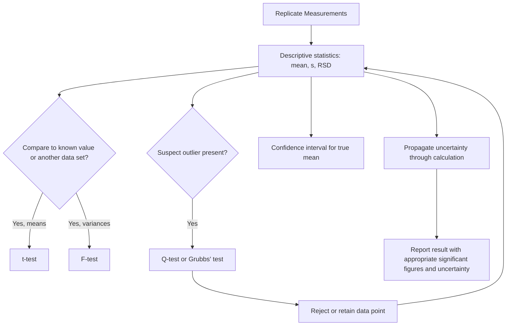

## Statistical Treatment of Experimental Error

### Overview

Every quantitative measurement in analytical chemistry carries some degree of uncertainty, and the statistical treatment of experimental error provides the mathematical framework for quantifying that uncertainty, distinguishing signal from noise, evaluating measurement quality, and making defensible decisions from data. Sound statistical practice underlies proper reporting of results, method validation, and comparison of analytical methods or datasets.

### Types of Error

**Key Points**

- **Systematic (determinate) error:** a consistent, reproducible bias that affects all measurements in the same direction, arising from identifiable sources (instrument miscalibration, procedural flaws, reagent impurity, method bias). In principle, systematic error can be identified and corrected once its source is known.
- **Random (indeterminate) error:** unpredictable fluctuations arising from many small, uncontrollable variables, causing scatter around the true (or mean) value in both directions. Random error can be characterized statistically but not eliminated entirely, only reduced through replication and technique refinement.
- **Gross errors:** large, often one-time mistakes (e.g., sample contamination, instrument malfunction, transcription errors) that produce outliers and are generally distinct from routine systematic or random error, typically addressed through outlier tests or simply discarding clearly erroneous data points with justification.

### Accuracy vs. Precision

**Key Points**

- **Accuracy** describes how close a measured value (or mean of replicate measurements) is to the true or accepted value, and is primarily degraded by systematic error.
- **Precision** describes the reproducibility of repeated measurements of the same quantity under the same conditions, and is primarily governed by random error.
- A measurement set can be precise but inaccurate (tightly clustered but offset from the true value, indicating systematic bias), accurate but imprecise (scattered but centered near the true value), both, or neither.
- Accuracy is typically assessed using error metrics (absolute or relative error against a known/accepted value); precision is typically assessed using measures of dispersion (standard deviation, variance, range).

### Descriptive Statistics

For a set of $n$ replicate measurements $x_1, x_2, ..., x_n$:

**Mean:**

$$\bar{x}=\frac{\sum_{i=1}^{n}x_i}{n}$$

**Standard deviation (sample):**

$$s=\sqrt{\frac{\sum_{i=1}^{n}(x_i-\bar{x})^2}{n-1}}$$

**Key Points**

- The denominator $n-1$ (degrees of freedom) rather than $n$ corrects for the fact that the sample mean itself is estimated from the same data, and provides an unbiased estimator of the population standard deviation $\sigma$.
- Relative standard deviation (RSD), often expressed as a percentage, normalizes $s$ by the mean: $RSD(\%)=\dfrac{s}{\bar{x}}\times100\%$, allowing comparison of precision across measurements of different magnitude.
- Variance is simply $s^2$, and is additive for independent sources of error, a property exploited extensively in error propagation.
- For large datasets or when comparing to a known population, the population standard deviation $\sigma$ (using $n$ in the denominator) may be used instead, though $s$ (sample standard deviation) is more commonly applicable in typical analytical replicate measurements.

### Error Expression

**Key Points**

- Absolute error: $E=x_i-x_{true}$ (has the same units as the measurement).
- Relative error: $E_r=\dfrac{x_i-x_{true}}{x_{true}}\times100\%$ (dimensionless, allows comparison across different measurement scales).
- Absolute and relative uncertainty can similarly be expressed for a mean value (e.g., $\bar{x}\pm s$, or $\bar{x}\pm$ confidence interval).

### The Normal (Gaussian) Distribution

Random error in analytical measurements is commonly modeled as following a normal distribution, characterized by the mean $\mu$ and standard deviation $\sigma$:

$$f(x)=\frac{1}{\sigma\sqrt{2\pi}}e^{-\frac{(x-\mu)^2}{2\sigma^2}}$$

**Key Points**

- Approximately 68.3% of values fall within $\mu\pm1\sigma$, approximately 95.5% within $\mu\pm2\sigma$, and approximately 99.7% within $\mu\pm3\sigma$ for a truly normal distribution.
- The central limit theorem provides theoretical justification for assuming approximate normality in many measurement contexts, since the sum of many small, independent sources of random error tends toward a normal distribution regardless of the individual error sources' own distributions.

### Confidence Intervals

For a sample mean based on $n$ measurements with sample standard deviation $s$, the confidence interval for the true mean $\mu$ is:

$$\mu=\bar{x}\pm\frac{ts}{\sqrt{n}}$$

where $t$ is the critical value from the Student's t-distribution at the desired confidence level and $n-1$ degrees of freedom.

**Key Points**

- The t-distribution is used (rather than the normal z-distribution) because $s$ is only an estimate of the true $\sigma$, particularly important for small sample sizes; as $n$ increases, the t-distribution approaches the normal distribution.
- A 95% confidence interval is standard in most analytical reporting, meaning that if the experiment were repeated many times, approximately 95% of the calculated intervals would be expected to contain the true mean.
- Confidence intervals narrow as $n$ increases (via the $\sqrt{n}$ term) and as precision improves (smaller $s$), reflecting greater certainty in the estimate of the true mean.

### Hypothesis Testing: Comparing Data Sets

**The t-test**

Used to compare a measured mean to a known/accepted value, or to compare the means of two independent data sets, testing the null hypothesis that no significant difference exists.

**Key Points**

- Comparing a sample mean to a known value: $t_{calc}=\dfrac{|\bar{x}-\mu|\sqrt{n}}{s}$, compared against a critical $t$ value at the chosen confidence level and $n-1$ degrees of freedom.
- Comparing two independent means (assuming comparable variances) uses a pooled standard deviation and combined degrees of freedom.
- If $t_{calc}$ exceeds the critical $t$ value, the null hypothesis is rejected, indicating a statistically significant difference at the chosen confidence level.

**The F-test**

Used to compare the precision (variances) of two data sets:

$$F_{calc}=\frac{s_1^2}{s_2^2}\quad(s_1^2>s_2^2\text{ by convention})$$

If $F_{calc}$ exceeds the critical $F$ value (from an F-distribution table, at the chosen confidence level and appropriate degrees of freedom for each set), the two data sets are judged to have significantly different precision.

**Key Points**

- The F-test is often performed prior to a t-test comparing two means, since the appropriate form of the t-test (pooled vs. separate variance) depends on whether the two data sets have statistically comparable variances.

### Outlier Tests

**Q-test (Dixon's Q-test)**

Used to determine whether a suspect data point in a small data set can be statistically rejected:

$$Q_{calc}=\frac{|x_{suspect}-x_{nearest}|}{\text{range of all data}}$$

If $Q_{calc}$ exceeds a critical $Q$ value (tabulated by sample size and confidence level), the suspect value can be rejected as a statistical outlier.

**Grubbs' test**

An alternative outlier test, generally considered more statistically rigorous than the Q-test, comparing the deviation of a suspect value from the mean (in units of standard deviation) against a critical value:

$$G_{calc}=\frac{|x_{suspect}-\bar{x}|}{s}$$

**Key Points**

- Outlier tests should be applied cautiously and are not a substitute for identifying and addressing the underlying cause of an anomalous result; rejecting data solely on statistical grounds without investigation is generally discouraged in rigorous analytical practice.
- A rejected outlier is typically excluded from subsequent mean and standard deviation calculations, and the rejection, along with its justification, should be documented.

### Propagation of Uncertainty

When a calculated result depends on multiple measured quantities, the uncertainty in each measured quantity propagates into the uncertainty of the final result.

**For addition/subtraction** ($y=a+b-c$), absolute uncertainties combine in quadrature:

$$s_y=\sqrt{s_a^2+s_b^2+s_c^2}$$

**For multiplication/division** ($y=\dfrac{ab}{c}$), relative uncertainties combine in quadrature:

$$\frac{s_y}{y}=\sqrt{\left(\frac{s_a}{a}\right)^2+\left(\frac{s_b}{b}\right)^2+\left(\frac{s_c}{c}\right)^2}$$

**For exponents** ($y=a^n$):

$$\frac{s_y}{y}=|n|\frac{s_a}{a}$$

**Key Points**

- These propagation rules assume the individual uncertainties are independent and random; systematic errors do not generally propagate by simple quadrature addition and must be considered separately.
- Proper propagation of uncertainty is essential whenever a reported analytical result (e.g., a concentration from a calibration curve, or a percentage from a gravimetric factor calculation) is derived from several measured quantities, each with its own associated error.

### Linear Regression and Calibration Curves

For a calibration curve relating instrument signal $y$ to analyte concentration $x$, least-squares linear regression finds the best-fit line $y=mx+b$ by minimizing the sum of squared residuals.

**Key Points**

- The correlation coefficient $r$ (or $r^2$) quantifies how well the data fit a linear model, though a high $r^2$ alone does not guarantee the appropriateness of a linear model or the absence of systematic error.
- Standard error of the regression, along with uncertainties in slope and intercept, can be propagated to determine the uncertainty in an analyte concentration interpolated from the calibration curve.
- The limit of detection (LOD) and limit of quantitation (LOQ) are commonly defined in terms of the calibration curve's slope and the standard deviation of blank/low-concentration signal measurements, e.g., $LOD\approx\dfrac{3s_{blank}}{m}$ and $LOQ\approx\dfrac{10s_{blank}}{m}$ [Unverified — exact numerical multipliers and definitions vary somewhat by regulatory body/convention].

### Significant Figures and Rounding

**Key Points**

- The number of significant figures in a reported result should reflect the actual precision of the measurement and any subsequent calculation, generally limited by the least precise measurement involved.
- For addition/subtraction, the result is rounded to the same number of decimal places as the least precise value; for multiplication/division, the result is rounded to the same number of significant figures as the value with the fewest significant figures.
- Proper significant-figure practice is a simplified, non-statistical proxy for full uncertainty propagation, useful for routine reporting but not a substitute for rigorous error analysis in critical applications.

### Example

Evaluating whether a new analytical method gives results statistically consistent with an established reference method, using paired data on the same set of samples:

1. Calculate the differences ($d_i$) between paired measurements (new method vs. reference method) for each sample.
2. Calculate the mean difference $\bar{d}$ and standard deviation of the differences $s_d$.
3. Apply a paired t-test: $t_{calc}=\dfrac{|\bar{d}|\sqrt{n}}{s_d}$.
4. Compare $t_{calc}$ to the critical $t$ value at the chosen confidence level (commonly 95%) and $n-1$ degrees of freedom.
5. If $t_{calc}$ is less than the critical value, conclude there is no statistically significant difference between the two methods at that confidence level; if it exceeds the critical value, conclude a significant systematic difference (bias) exists between the methods.

**Related Topics**

- Calibration curve methodology and standard addition techniques
- Limit of detection and limit of quantitation determination
- Quality assurance and method validation in analytical chemistry
- Analysis of variance (ANOVA) for multi-group comparisons
- Control charts and quality control in routine analysis
- Uncertainty budgets in measurement science (metrology)
- Least-squares regression and residual analysis