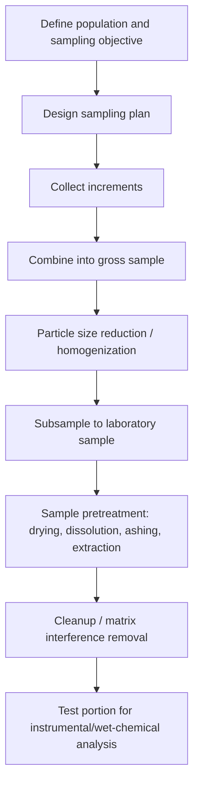

## Sampling and Sample Preparation

### Overview

Sampling and sample preparation are the initial steps of the analytical process in which a representative portion of material is obtained from a larger bulk (the population), reduced to a manageable and homogeneous laboratory sample, and converted into a form suitable for the chosen analytical measurement. These steps are frequently the largest source of overall error in an analytical result, often exceeding the uncertainty contributed by the measurement technique itself, making rigorous sampling design and sample handling essential to data quality.

### The Analytical Process: Where Sampling Fits

**Key Points**

- The overall analytical sequence typically proceeds: define the problem → select a sampling plan → collect gross sample → reduce to laboratory sample → prepare/pretreat sample → perform measurement → report and interpret results.
- Errors introduced at the sampling stage cannot be corrected by even the most precise subsequent measurement; a highly precise analysis of a non-representative sample yields an inaccurate result for the population of interest.

### Sampling Terminology

**Key Points**

- **Population (target population):** the entire quantity of material about which information is sought (e.g., an entire batch of product, a body of water, a shipment of ore).
- **Gross sample (bulk sample):** a portion collected from the population intended to represent it, often assembled by combining multiple increments taken at different locations/times.
- **Laboratory sample:** a reduced, homogenized portion of the gross sample, of a size appropriate for transport and laboratory handling.
- **Test portion (aliquot):** the specific, precisely measured portion of the laboratory sample actually used for a given analytical measurement.
- **Increment:** an individual portion collected at one sampling point/time, later combined with other increments to form the gross sample.

### Sampling Plans and Strategies

| Sampling strategy | Description | Typical use case |
| --- | --- | --- |
| Random sampling | Every portion of the population has an equal probability of selection | Homogeneous or well-mixed populations; statistically defensible baseline strategy |
| Systematic sampling | Increments collected at regular, predetermined intervals (spatial or temporal) | Process monitoring, production line sampling |
| Stratified sampling | Population divided into sub-populations (strata) with more homogeneous internal characteristics, sampled proportionally or independently within each | Heterogeneous populations with identifiable subgroups (e.g., different depths in a water body, different particle size fractions) |
| Composite sampling | Multiple increments physically combined into a single gross sample before analysis | Estimating an average value across a population when individual increment values are not needed |
| Judgmental sampling | Increments selected based on operator knowledge/judgment rather than randomization | Situations requiring targeted sampling of known problem areas (e.g., visibly contaminated zones), though statistically less defensible as representative of the whole population |

**Key Points**

- The appropriate sampling plan depends on the population's homogeneity, the analytical question being asked (average composition vs. variability vs. extremes), cost/time constraints, and regulatory or protocol requirements.
- For heterogeneous populations, increasing the number of increments (rather than only increasing the mass of each individual increment) is generally more effective at reducing sampling uncertainty.

### The Sampling Constant and Minimum Sample Mass

For particulate/heterogeneous solid materials, Ingamells' sampling constant ($K_s$) relates the required sample mass to the desired relative standard deviation of the sampling step:

$$m\cdot R^2=K_s$$

where $m$ is the mass of sample analyzed, $R$ is the percent relative standard deviation due to sampling, and $K_s$ is a constant (with units of mass) determined empirically for a given material, representing the sample mass required to achieve $R=1\%$.

**Key Points**

- This relationship formalizes the intuitive principle that smaller, more finely divided, or more homogeneous particles require less sample mass to achieve a given sampling precision, while coarser or more heterogeneous materials require larger sample masses.
- Particle size reduction (grinding, milling) prior to subsampling is a standard strategy for reducing the sampling constant and thus the minimum representative sample mass required.

### Gross Sample Collection Considerations

**Key Points**

- Number and location of increments should be determined based on known or suspected heterogeneity of the population (spatial, temporal, or compositional gradients).
- Sampling equipment and containers must be appropriately clean and constructed of materials that will not contaminate or react with the sample (e.g., avoiding metal containers for trace metal analysis, avoiding certain plastics for trace organic analysis).
- Sample preservation at the point of collection (cooling, acidification, addition of preservatives, protection from light) may be necessary to prevent degradation, precipitation, volatilization, or microbial activity between collection and analysis.
- Chain-of-custody documentation (particularly important in regulatory, forensic, and environmental contexts) tracks sample handling, transfer, and storage to ensure sample integrity and legal defensibility of results.

### Reduction of Gross Sample to Laboratory Sample

**Key Points**

- **Particle size reduction:** crushing, grinding, or milling reduces particle size, which both aids homogenization and, per the sampling constant relationship, reduces the mass required for a representative subsample.
- **Mixing/homogenization:** thorough mixing ensures that any subsequently withdrawn subsample accurately reflects the composition of the whole gross sample.
- **Sample splitting/subsampling techniques:** methods such as coning and quartering, or use of a riffle splitter (a mechanical device that divides a sample into representative, equal fractions), reduce sample mass while attempting to preserve representativeness.
- Care must be taken during size reduction to avoid introducing contamination (from grinding equipment), losing volatile components (from frictional heating), or altering the analyte of interest.

### Sample Preparation and Pretreatment for Analysis

**Key Points**

- **Drying:** removal of moisture (often by oven drying at a specified temperature) to report results on a consistent dry-weight basis and to prevent further sample degradation; care is needed to avoid loss of volatile analytes or thermal decomposition.
- **Dissolution:** conversion of a solid sample into solution form suitable for wet-chemical or instrumental analysis, often via acid digestion (open-vessel or microwave-assisted closed-vessel digestion), fusion with a flux (e.g., lithium metaborate/tetraborate fusion for silicate/mineral samples), or alkaline/oxidative digestion depending on sample matrix and analyte.
- **Ashing:** for organic or biological matrices, dry ashing (high-temperature combustion) or wet ashing (oxidative acid digestion) removes organic matter to isolate inorganic analytes, particularly for subsequent trace metal analysis.
- **Extraction:** analyte is selectively transferred from the sample matrix into a solvent or phase suitable for analysis (liquid–liquid extraction, solid-phase extraction (SPE), Soxhlet extraction, supercritical fluid extraction, QuEChERS for food/environmental matrices), often exploiting differential solubility or selective sorbent chemistry.
- **Derivatization:** chemical modification of the analyte to improve detectability, volatility (for GC analysis), or chromatographic behavior, common in trace organic analysis.
- **Cleanup:** removal of matrix interferences (co-extracted compounds, particulates) prior to instrumental analysis, using techniques such as solid-phase extraction, filtration, or selective precipitation.

### Matrix Effects and Interferences

**Key Points**

- The sample matrix (all components of the sample other than the analyte) can interfere with analysis through spectral overlap, chemical interference (competing reactions), physical interference (viscosity, surface tension effects in techniques like nebulization), or signal suppression/enhancement.
- Matrix-matched calibration standards, standard addition methods, or internal standards are common strategies to compensate for matrix effects that cannot be eliminated by sample cleanup alone.

### Avoiding Contamination and Sample Loss

**Key Points**

- Trace-level analysis (particularly trace metals and trace organics) is especially vulnerable to contamination from reagents, containers, laboratory air, and handling; use of high-purity reagents, appropriately cleaned labware, and controlled laboratory environments (e.g., clean rooms for ultra-trace work) is critical.
- Procedural (method) blanks, carried through the entire sample preparation and analysis sequence, are used to detect and correct for background contamination introduced during preparation.
- Loss of volatile analytes during drying, heating, or open-vessel procedures, and adsorptive loss of analyte onto container walls, are common sources of negative bias requiring appropriate mitigation (sealed vessels, appropriate container materials, minimizing sample handling steps).

### Quality Assurance in Sampling

**Key Points**

- Replicate sampling (collecting and analyzing multiple independent gross samples or increments) allows estimation of the sampling variance component separately from analytical measurement variance, often via analysis of variance (ANOVA)-based approaches.
- Field blanks, trip blanks, and equipment blanks are used specifically to assess contamination introduced during sample collection, transport, and handling, as distinct from laboratory-based method blanks.
- Sampling protocols are frequently codified in standardized methods (e.g., ASTM, EPA, ISO protocols) to ensure consistency, defensibility, and comparability of results across laboratories and over time.

### Example

Sampling and preparing a soil sample for trace metal analysis:

1. Collect multiple increments across the sampling area following a systematic or stratified grid pattern, based on prior knowledge of potential contamination gradients.
2. Combine increments into a gross sample, avoiding metal sampling tools that could introduce trace metal contamination.
3. Air-dry (or freeze-dry) the gross sample to remove moisture while minimizing loss of volatile analytes and avoiding high-temperature drying that could alter speciation.
4. Homogenize and reduce particle size by grinding/sieving (e.g., to pass a 2 mm or finer mesh), then subsample using a riffle splitter to obtain a representative laboratory sample.
5. Weigh a precise test portion and perform acid digestion (e.g., microwave-assisted digestion with nitric acid/hydrogen peroxide) to bring the metals of interest into solution.
6. Include a procedural blank and a certified reference material (CRM) alongside the sample batch to verify accuracy and detect contamination throughout the preparation sequence.
7. Analyze the digested solution by the chosen instrumental technique (e.g., ICP-OES or ICP-MS), and report results on a dry-weight basis.

**Related Topics**

- Statistical treatment of sampling error and Ingamells' sampling constant
- Sample digestion and dissolution techniques (acid digestion, fusion)
- Solid-phase extraction and liquid–liquid extraction methods
- Matrix-matched calibration and standard addition
- Quality assurance/quality control (QA/QC) in analytical laboratories
- Chain-of-custody procedures in regulatory and forensic analysis
- Certified reference materials and method validation