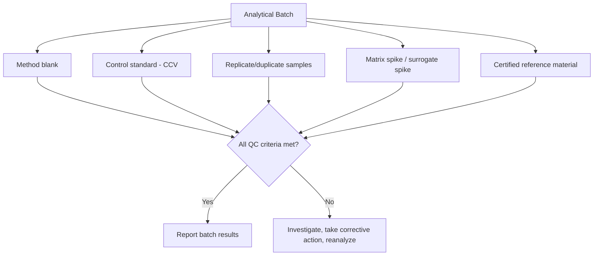

## Quality Assurance in Chemical Analysis

### Overview

Quality assurance (QA) in chemical analysis encompasses the systematic set of activities, policies, and procedures designed to ensure that analytical results are accurate, precise, reliable, and defensible for their intended purpose. QA operates at a program level (laboratory-wide policies, accreditation, documentation systems), while quality control (QC) refers to the specific operational techniques (blanks, standards, replicates) used within individual analytical runs to monitor and maintain data quality in real time. Together, QA/QC provide the evidentiary basis for trusting a reported analytical result.

### QA vs. QC: Distinguishing the Concepts

**Key Points**

- **Quality assurance (QA):** the overarching management system, including laboratory accreditation, standard operating procedures (SOPs), personnel training and competency documentation, method validation, proficiency testing participation, and document/data traceability.
- **Quality control (QC):** the specific technical measures applied during each analytical batch or run to verify that the method is performing as expected, including blanks, control standards, replicates, spikes, and control charts.
- QA answers "is our overall system capable of producing reliable data?" while QC answers "did this particular batch of measurements meet the expected performance criteria?"

### Key Quality Control Elements

**Blanks**

| Blank type | Purpose |
| --- | --- |
| Method (procedural) blank | Carried through the entire preparation and analysis procedure; detects contamination introduced by reagents, glassware, or the procedure itself |
| Reagent blank | Contains only reagents, without sample matrix; isolates reagent-derived background |
| Field blank | Prepared and handled in the field alongside real samples; detects contamination during sample collection/transport |
| Instrument blank | Solvent or matrix-free blank run on the instrument; assesses baseline instrumental background/carryover |

**Key Points**

- Blank signal is typically subtracted from sample signal, and consistently elevated or highly variable blank values signal a contamination problem requiring investigation before results can be considered reliable.

**Control (Check) Standards**

**Key Points**

- A control standard of known concentration is analyzed periodically throughout an analytical run (e.g., at the beginning, middle, and end, or after a fixed number of samples) to verify the method continues to perform within acceptable bounds throughout the run.
- Continuing calibration verification (CCV) standards confirm that instrument calibration remains valid over the course of an extended analytical sequence, addressing potential instrument drift.

**Replicates**

**Key Points**

- Analyzing replicate samples (repeated measurements of the same test portion, or independently prepared duplicate samples) provides a direct, ongoing estimate of measurement precision (as sample/duplicate relative percent difference, RPD) specific to the current batch, complementing precision estimates established during method validation.
- Duplicate analysis distinguishes analytical (instrumental) precision from combined sampling-plus-analytical precision, depending on whether duplicates are taken from the same prepared test portion or independently prepared from the laboratory sample.

**Spikes (Matrix Spikes) and Recovery**

**Key Points**

- A matrix spike is prepared by adding a known amount of analyte to a real sample (or a separate aliquot of it) prior to preparation/analysis; the percent recovery is calculated as:

  $$\%Recovery=\frac{(\text{spiked sample result})-(\text{unspiked sample result})}{\text{spike amount added}}\times100\%$$
- Recovery outside an established acceptable range (often approximately 80–120% [Unverified — acceptance criteria vary by method, matrix, and regulatory framework]) signals a possible matrix interference or method bias specific to that sample type, distinct from the more general performance information provided by blanks and control standards.
- Surrogate spikes (in organic trace analysis) use a compound chemically similar to, but distinguishable from, the target analyte(s), spiked into every sample to monitor extraction efficiency and method performance on a per-sample basis.

**Certified Reference Materials (CRMs)**

**Key Points**

- A CRM is a material with one or more property values (e.g., analyte concentrations) certified by a recognized standards body via a rigorous, often interlaboratory, characterization process, accompanied by a stated uncertainty.
- Analyzing a CRM alongside routine samples provides direct verification of overall method accuracy against an independently established "true" value, addressing systematic error in a way that internal QC measures (blanks, replicates) alone cannot.
- Matrix-matched CRMs (similar in composition to the actual sample matrix) provide the most rigorous accuracy check, since matrix effects can significantly influence measured recovery.

### Control Charts

Control charts plot QC measurements (e.g., control standard results, blank values, recovery percentages) over time, providing a visual and statistical tool for detecting when a method is drifting out of statistical control.

**Key Points**

- Typically constructed with a center line (established mean, $\bar{x}$), and warning/action limits set at $\pm2s$ and $\pm3s$ respectively from historical method performance data.
- Western Electric rules (and related pattern-recognition rules) flag not only single points beyond the action limit, but also non-random patterns (e.g., multiple consecutive points on one side of the mean, or a consistent trend), which can indicate a developing systematic problem before it produces an outright out-of-control result.
- Control charting allows ongoing statistical process control (SPC) of the analytical method itself, distinguishing normal random variation from a genuine shift in method performance requiring corrective action.

### Method Validation

Before a method is used routinely, it must be validated to demonstrate it is fit for its intended purpose.

**Key Points**

- **Accuracy:** typically established via recovery studies using CRMs or spiked samples.
- **Precision:** established via repeatability (same analyst, instrument, short time frame) and reproducibility (different analysts, instruments, laboratories, or over longer time) studies.
- **Selectivity/specificity:** demonstrates the method responds only (or predictably) to the target analyte(s) in the presence of expected matrix components and potential interferences.
- **Linearity and range:** establishes the concentration range over which the method's response is linearly (or otherwise predictably) related to analyte concentration.
- **Limit of detection (LOD) and limit of quantitation (LOQ):** establish the lowest concentrations at which the analyte can be reliably detected and reliably quantified, respectively.
- **Robustness:** assesses the method's sensitivity to small, deliberate variations in procedural parameters (e.g., temperature, pH, reagent concentration), indicating how carefully those parameters must be controlled during routine use.
- Method validation studies are typically documented and, for regulated methods, may need to satisfy specific guidelines (e.g., those published by ICH, EPA, AOAC, or other relevant regulatory/standards bodies).

### Laboratory Accreditation and Standards

**Key Points**

- Laboratory accreditation (e.g., under ISO/IEC 17025, the general international standard for testing and calibration laboratory competence) formally assesses a laboratory's quality management system, technical competence, and ability to produce technically valid results.
- Standard operating procedures (SOPs) provide detailed, documented, step-by-step instructions for every method and process performed in the laboratory, ensuring consistency regardless of which analyst performs the work.
- Proficiency testing (PT) / interlaboratory comparison programs involve analyzing blind samples distributed by an external provider and comparing results against other participating laboratories or an established reference value, providing independent, ongoing verification of laboratory performance.
- Chain-of-custody and full data traceability (documenting every step from sample collection through final reported result, including instrument calibration records and analyst identification) are essential for legal defensibility, particularly in regulatory, environmental, and forensic contexts.

### Traceability and Uncertainty

**Key Points**

- Metrological traceability establishes an unbroken chain of calibrations linking a laboratory's working standards back to recognized primary reference standards (often ultimately to SI units), ensuring that results from different laboratories or instruments can be meaningfully compared.
- A formal measurement uncertainty budget combines all identified sources of uncertainty (from calibration, sample preparation, instrumental measurement, and reference material uncertainty) into a single reported uncertainty value, going beyond simple replicate standard deviation to capture systematic and calibration-related contributions.

### Corrective Action and Continuous Improvement

**Key Points**

- When QC criteria are not met (e.g., a control standard falls outside acceptance limits, a blank shows contamination, or a control chart signals an out-of-control condition), a documented corrective action process is triggered: investigation of root cause, reanalysis of affected samples where possible, and, where appropriate, review of previously reported results that may have been affected.
- Root-cause investigation distinguishes between instrument malfunction, reagent/standard degradation, procedural deviation, and genuine sample-related matrix effects, each requiring a different corrective response.
- Non-conformance documentation and trend analysis of recurring QC failures support continuous improvement of laboratory methods and procedures over time.

### Example

QA/QC elements in a routine batch of environmental water samples analyzed for trace metals by ICP-MS:

1. Analyze an initial calibration curve using a series of standards spanning the expected concentration range, verified against a second-source calibration verification standard.
2. Include a method blank (deionized water carried through the full digestion procedure) to check for contamination.
3. Include a laboratory control sample (a blank matrix spiked with known analyte concentrations) to verify overall method accuracy independent of any specific sample matrix.
4. Analyze a matrix spike and matrix spike duplicate on one representative sample from the batch to assess matrix-specific recovery and precision.
5. Insert a continuing calibration verification standard after every set number of samples (e.g., every 10 samples) to monitor for instrument drift.
6. Analyze a certified reference material with a matrix similar to the samples, alongside the batch, to verify overall method accuracy against an independently certified value.
7. Compare all QC results against pre-established acceptance criteria; if any criterion fails, investigate and take corrective action (reanalysis, recalibration, or batch rejection) before reporting results.

**Related Topics**

- Statistical treatment of experimental error and control charts
- Method validation parameters (LOD, LOQ, linearity, robustness)
- Certified reference materials and metrological traceability
- ISO/IEC 17025 laboratory accreditation
- Sampling and sample preparation quality considerations
- Calibration curve methodology and standard addition
- Proficiency testing and interlaboratory comparison programs