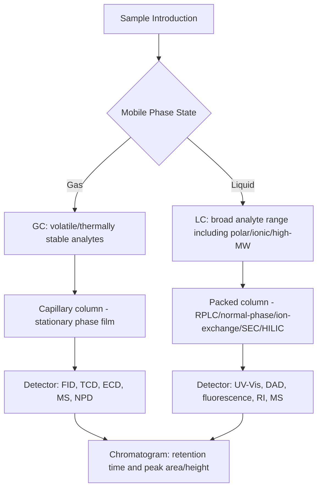

## Gas and Liquid Chromatography

### Overview

Chromatography is a family of separation techniques in which components of a mixture are separated based on differential partitioning between a mobile phase (which carries the sample through the system) and a stationary phase (fixed within a column or on a planar support). Gas chromatography (GC) and liquid chromatography (LC) are the two dominant instrumental forms, distinguished primarily by the physical state of the mobile phase, which in turn dictates the range of applicable analytes, achievable resolution, and instrumentation design.

### Fundamental Chromatographic Theory

**Key Points**

- Separation arises because different analytes partition differently between the mobile and stationary phases, characterized by the distribution constant $K=\dfrac{C_S}{C_M}$ (concentration in stationary phase over concentration in mobile phase).
- The retention factor (capacity factor) $k$ describes how strongly a solute is retained relative to an unretained species:

  $$k=\frac{t_R-t_M}{t_M}$$

  where $t_R$ is the analyte's retention time and $t_M$ is the mobile-phase (dead/void) time.
- Selectivity between two peaks is quantified by the separation factor:

  $$\alpha=\frac{k_2}{k_1}\quad(k_2>k_1)$$
- Column efficiency is described by the number of theoretical plates $N$:

  $$N=16\left(\frac{t_R}{w}\right)^2=5.54\left(\frac{t_R}{w_{1/2}}\right)^2$$

  where $w$ is the peak base width and $w_{1/2}$ the width at half height; plate height $H=L/N$ (L = column length) is a practical measure of band-broadening per unit column length.
- Resolution between two adjacent peaks combines efficiency, selectivity, and retention:

  $$R_s=\frac{\sqrt{N}}{4}(\alpha-1)\frac{k_2}{1+k_2}$$

  This form (the "fundamental resolution equation") shows resolution improves with more plates (efficiency), greater $\alpha$ (selectivity, often the most powerful lever), and higher retention (up to diminishing returns).

### The Van Deemter Equation

Band broadening (loss of efficiency) as a function of mobile-phase linear velocity $u$ is described by the Van Deemter equation:

$$H=A+\frac{B}{u}+Cu$$

**Key Points**

- **A term (eddy diffusion):** band broadening from multiple flow paths through packed stationary phase particles; minimized by smaller, more uniformly packed particles (this term is generally negligible/absent in open-tubular capillary GC columns).
- **B term (longitudinal diffusion):** broadening from analyte diffusion along the flow axis, more significant at low velocity; more pronounced in gas-phase (GC) systems than liquid-phase (LC) systems due to higher gas-phase diffusion coefficients.
- **C term (mass transfer resistance):** broadening from finite equilibration time between mobile and stationary phases, increasingly significant at high velocity; reduced by thinner stationary-phase films and smaller particle sizes.
- An optimal mobile-phase velocity exists at the minimum of the Van Deemter curve, representing the best trade-off between these competing broadening mechanisms; operating faster than optimal (common in practice to reduce analysis time) trades some efficiency for shorter run times.

### Gas Chromatography (GC)

**Key Points**

- The mobile phase is an inert carrier gas (commonly He, H₂, or N₂), which does not interact chemically with the analytes; separation is governed entirely by analyte volatility and interaction with the stationary phase.
- Applicable to analytes that are volatile and thermally stable (or can be made so via derivatization); typically limited to compounds with molecular weight below roughly 1000 Da and sufficient vapor pressure at achievable column temperatures.
- Columns are almost universally open-tubular (capillary) columns coated with a thin liquid or bonded stationary-phase film on the inner wall, though packed columns remain in limited use for specific applications (e.g., permanent gas analysis).
- Temperature programming (systematically increasing oven temperature during a run) improves separation of components with a wide range of volatilities within a single analysis, analogous in purpose to gradient elution in LC.

**Common GC Detectors**

| Detector | Principle | Selectivity |
| --- | --- | --- |
| Flame ionization detector (FID) | Ion formation from combustion of organic compounds in a H₂/air flame | Broad response to most organic compounds; insensitive to water, permanent gases |
| Thermal conductivity detector (TCD) | Change in carrier gas thermal conductivity due to analyte presence | Universal (responds to virtually all compounds), non-destructive, lower sensitivity |
| Electron capture detector (ECD) | Reduction in standing current from electron-capturing analytes | Highly selective/sensitive for halogenated and electronegative compounds |
| Mass spectrometer (MS) | Ionization and mass-to-charge separation of eluting compounds | Universal detection with structural/identification capability |
| Nitrogen-phosphorus detector (NPD) | Enhanced ionization response to N- and P-containing compounds | Selective for nitrogen- and phosphorus-containing analytes |

### Liquid Chromatography (LC)

**Key Points**

- The mobile phase is a liquid solvent (or solvent mixture), which can itself interact with both analyte and stationary phase, adding an additional, tunable dimension (mobile-phase composition) to separation control not generally available in GC.
- Applicable to a much broader range of analytes than GC, including non-volatile, thermally labile, ionic, and high-molecular-weight compounds (proteins, polymers, pharmaceuticals).
- High-performance (high-pressure) liquid chromatography (HPLC) uses small-particle-size packed columns and high pressure (up to several hundred bar) to achieve high efficiency and reasonable analysis times; ultra-high-performance LC (UHPLC) extends this further with sub-2 μm particles and higher operating pressures for improved speed and resolution.
- Gradient elution (progressively changing mobile-phase composition, e.g., increasing organic solvent fraction over time) improves separation of analytes spanning a wide polarity range, analogous in purpose to temperature programming in GC.

**Major LC Modes**

**Key Points**

- **Reversed-phase LC (RPLC):** nonpolar stationary phase (commonly C18-bonded silica) with a polar mobile phase (water/organic solvent mixtures); the most widely used LC mode, suited to a broad range of moderately polar to nonpolar analytes.
- **Normal-phase LC:** polar stationary phase (e.g., bare silica) with a nonpolar mobile phase; useful for separating compounds by polarity in the opposite retention order from reversed-phase, and for certain isomer separations.
- **Ion-exchange chromatography:** stationary phase bears fixed charged groups that retain analytes via electrostatic interaction, separating based on ionic charge and charge density; widely used for inorganic ions, amino acids, and proteins.
- **Size-exclusion chromatography (SEC, gel permeation/filtration chromatography):** separates based on molecular size via differential access to pores in the stationary phase (larger molecules elute first, having less accessible pore volume); used for polymers and biomolecules, and does not rely on chemical interaction-based retention.
- **Hydrophilic interaction chromatography (HILIC):** polar stationary phase with a mostly organic mobile phase (opposite mobile-phase polarity trend from normal-phase LC), useful for very polar and hydrophilic analytes poorly retained in RPLC.

**Common LC Detectors**

| Detector | Principle | Selectivity |
| --- | --- | --- |
| UV-Vis absorbance | Absorption of UV/visible light by chromophoric analytes | Requires analyte chromophore; widely applicable, moderate sensitivity |
| Diode array detector (DAD/PDA) | Simultaneous multi-wavelength UV-Vis detection | Provides spectral information for peak identification/purity assessment |
| Fluorescence detector | Emission from fluorescent (or derivatized) analytes | Highly selective and sensitive, requires native or induced fluorescence |
| Refractive index (RI) detector | Change in refractive index due to analyte presence | Near-universal but low sensitivity; incompatible with gradient elution |
| Mass spectrometer (LC-MS) | Ionization (commonly ESI or APCI) and mass analysis | Universal detection with structural/identification capability |

### Comparative Summary: GC vs. LC

| Property | Gas Chromatography | Liquid Chromatography |
| --- | --- | --- |
| Mobile phase | Inert gas | Liquid solvent(s) |
| Analyte requirements | Volatile, thermally stable | Broad: polar, ionic, high-MW, thermally labile analytes all accommodated |
| Primary separation mechanism | Volatility / stationary-phase partitioning | Multiple mechanisms: partition, adsorption, ion-exchange, size-exclusion |
| Typical operating pressure | Low (a few atm) | High (HPLC/UHPLC: tens to hundreds of bar) |
| Key optimization variable | Temperature program, stationary phase | Mobile-phase composition/gradient, stationary phase |
| Typical efficiency (plates) | Very high (capillary columns, often >100,000 plates) | High but generally lower than capillary GC for a comparable analysis time |

### Coupling to Mass Spectrometry

**Key Points**

- GC-MS is a mature, widely standardized technique; electron ionization (EI) produces highly reproducible fragmentation patterns searchable against extensive reference spectral libraries, enabling confident compound identification.
- LC-MS requires an interface to ionize analytes from solution at atmospheric pressure, most commonly electrospray ionization (ESI, suited to polar/ionic analytes and readily coupled to gradient RPLC) or atmospheric pressure chemical ionization (APCI, suited to less polar analytes); soft ionization typically produces primarily molecular ion species (e.g., [M+H]⁺), often requiring tandem MS (MS/MS) fragmentation for structural confirmation.
- Both hyphenated techniques (GC-MS, LC-MS) combine the separation power of chromatography with the identification/quantification power of mass spectrometry, and are foundational in modern trace organic, environmental, forensic, pharmaceutical, and metabolomics analysis.

### Quantitative Analysis in Chromatography

**Key Points**

- Peak area (generally more reliable than peak height, particularly for asymmetric or partially resolved peaks) is proportional to analyte amount under a given set of conditions, forming the basis for external calibration curve quantification.
- Internal standard methods (adding a known amount of a chemically similar, but distinguishable, compound to every sample and standard) correct for variability in injection volume, extraction efficiency, and detector response, generally improving quantitative precision and accuracy over external standard methods alone.
- Standard addition can be used when the sample matrix significantly affects analyte response (matrix effects/suppression, particularly relevant in LC-MS) and a matrix-matched blank is unavailable.

### Example

Separation and quantification of a mixture of volatile organic compounds (VOCs) in a water sample by GC-MS:

1. Extract VOCs from the aqueous sample using purge-and-trap or headspace sampling to transfer volatile analytes into the gas phase for injection.
2. Inject onto a capillary GC column (e.g., a moderately polar or nonpolar bonded-phase column) with helium carrier gas.
3. Apply a temperature program (e.g., starting near 35 °C, ramping to 200+ °C) to elute analytes of increasing boiling point in a single run.
4. Detect eluting compounds by mass spectrometry (electron ionization), recording full-scan spectra for identification via library matching and monitoring specific quantitation ions for quantification.
5. Construct an external calibration curve using authentic standards spanning the expected concentration range, or apply an internal standard added to every sample and standard.
6. Calculate analyte concentrations in the original water sample from measured peak areas via the calibration relationship, applying appropriate QA/QC (method blank, laboratory control sample, surrogate recovery).

**Related Topics**

- Van Deemter equation and column efficiency optimization
- Mass spectrometry ionization techniques (EI, ESI, APCI) and fragmentation
- Sample preparation and extraction techniques for chromatographic analysis
- Internal standard and standard addition quantification methods
- Reversed-phase vs. normal-phase separation mechanisms
- Capillary electrophoresis as a complementary separation technique
- Method validation for chromatographic assays (LOD, LOQ, linearity)