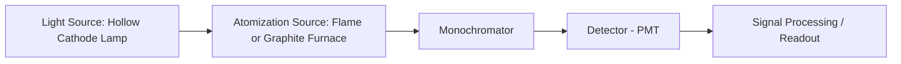

## Atomic Absorption and Emission Spectroscopy

### Overview

Atomic absorption spectroscopy (AAS) and atomic emission spectroscopy (AES) are instrumental techniques for the quantitative and qualitative determination of elemental (typically metallic) composition, based on the interaction of free, gas-phase atoms with electromagnetic radiation. Both techniques require the sample to be atomized, converted into a population of free, ground-state or excited-state atoms, since atomic (as opposed to molecular) transitions are the basis of detection. The two techniques are complementary: AAS measures the absorption of radiation by ground-state atoms, while AES measures the emission of radiation by thermally or electrically excited atoms.

### Fundamental Principles

**Key Points**

- Atomic transitions occur between discrete electronic energy levels of an atom, producing narrow, element-characteristic spectral lines (in contrast to the broad bands typical of molecular electronic transitions, since atoms lack vibrational/rotational sub-structure).
- In AAS, a beam of radiation at a wavelength specific to the analyte element is passed through a population of free ground-state atoms; the fraction of light absorbed follows the Beer-Lambert law and is proportional to atom population (and thus analyte concentration).
- In AES, atoms are thermally or electrically excited to higher energy states; upon relaxation back to the ground state, they emit radiation at characteristic wavelengths, and the emitted intensity is proportional to the number of excited atoms (and, under controlled conditions, to analyte concentration).
- The Boltzmann distribution governs the equilibrium ratio of excited-state to ground-state atom populations at a given temperature:

  $$\frac{N_j}{N_0}=\frac{g_j}{g_0}e^{-\Delta E/k_BT}$$

  where $g_j,g_0$ are statistical weights of the excited and ground states. Because $\Delta E/k_BT$ is typically large for atomic transitions, the excited-state population (and thus emission signal) is highly temperature-sensitive, whereas the ground-state population (relevant to absorption) is comparatively much less affected by moderate temperature changes.

### Atomization Sources

**Key Points**

- **Flame atomization:** sample solution is nebulized into a flame (commonly air-acetylene or nitrous oxide-acetylene for higher-temperature, more refractory elements), which desolvates, vaporizes, and atomizes the analyte; widely used for both flame AAS (FAAS) and flame AES.
- **Electrothermal (graphite furnace) atomization:** sample is deposited in a graphite tube and heated through a programmed sequence (drying, ashing/charring, atomization, cleanout) using resistive electrical heating, achieving much higher atomization efficiency and sensitivity than flame atomization, primarily used in graphite furnace AAS (GFAAS).
- **Inductively coupled plasma (ICP):** an argon plasma sustained by radiofrequency induction reaches very high temperatures (roughly 6000–10,000 K [Unverified — precise value depends on plasma region and operating conditions]), providing efficient atomization and, importantly, substantial excitation, making it the dominant atomization/excitation source for atomic emission spectroscopy (ICP-OES/ICP-AES) and also serving as an ion source for ICP-mass spectrometry.
- **Cold vapor and hydride generation:** specialized atomization approaches for specific elements (cold vapor for mercury, exploiting its unique volatility as elemental Hg; hydride generation for elements such as As, Se, Sb that form volatile covalent hydrides), providing enhanced sensitivity for these particular analytes.

### Atomic Absorption Spectroscopy (AAS)

**Instrumentation**

**Key Points**

- The light source is typically a hollow cathode lamp (HCL) or electrodeless discharge lamp (EDL), constructed with a cathode of the specific element being analyzed, emitting narrow, characteristic emission lines of that element that serve as the probe radiation for absorption measurement.
- Because the light source emits the analyte's own characteristic wavelengths, AAS achieves high elemental selectivity, but conventional (non-continuum-source) AAS requires a different lamp for each element (or, in some cases, multi-element lamps for a limited number of compatible elements).
- Modulation of the source (mechanical chopping or electronic pulsing) combined with selective (AC-coupled) detection distinguishes light from the source from the steady (DC) emission background of the flame/furnace itself.
- Background correction methods (deuterium lamp background correction, Zeeman-effect background correction) compensate for non-specific absorption/scattering from the sample matrix, which is especially important in GFAAS where matrix effects are often more pronounced than in flame AAS.
- Graphite furnace AAS generally achieves substantially better detection limits than flame AAS due to more complete, longer-residence-time atomization of a small, precisely measured sample volume, at the cost of longer analysis time per sample and generally more pronounced matrix interferences.

**Applications and Limitations**

**Key Points**

- AAS is a single-element-at-a-time technique in its conventional configuration (multi-element AAS instruments exist but are less common and less versatile than multi-element emission techniques such as ICP-OES).
- Well suited to routine, targeted determination of specific trace metals when only a limited number of elements need to be measured per sample.
- Linear dynamic range is typically more limited than ICP-OES, and highly refractory elements (forming very stable oxides resistant to atomization) can be challenging for flame atomization, sometimes requiring the hotter nitrous oxide-acetylene flame or electrothermal atomization.

### Atomic Emission Spectroscopy (AES)

**Instrumentation**

**Key Points**

- Because AES relies on excitation followed by spontaneous emission (rather than requiring an element-specific external light source), a single excitation source (most commonly ICP) can simultaneously excite atoms/ions of many different elements, enabling true simultaneous or rapid sequential multi-element analysis.
- ICP-OES (also called ICP-AES) uses the high-temperature argon ICP both to atomize and to excite/ionize the sample, producing rich emission spectra containing both neutral atom and ionic emission lines for most elements of the periodic table.
- A polychromator (or scanning monochromator) coupled to an array detector (charge-coupled device, CCD, or charge-injection device, CID) or multiple photomultiplier tubes allows simultaneous acquisition of multiple characteristic emission wavelengths, dramatically increasing sample throughput compared to single-element AAS.
- Other excitation sources historically used in AES include the DC arc and spark discharge (common in traditional metals/alloy analysis) and flame emission (still used for straightforward determination of alkali metals such as Na and K, which have low excitation energies and ionize/excite readily even in a relatively cool flame).

**Spectral Interferences**

**Key Points**

- Because ICP-OES generates emission from many elements simultaneously, spectral line overlap (one element's emission line coinciding with or closely adjacent to another's) is a more significant interference concern than in single-element AAS, requiring careful wavelength selection, high-resolution spectrometers, or interference correction algorithms.
- Background emission (from the plasma itself, or from continuum/molecular band emission in the sample matrix) must be subtracted, typically by measuring emission intensity at wavelengths adjacent to the analyte line.

### Comparative Summary: AAS vs. AES (ICP-OES)

| Property | Atomic Absorption (AAS) | Atomic Emission (ICP-OES) |
| --- | --- | --- |
| Measured process | Absorption by ground-state atoms | Emission by excited-state atoms |
| Typical elements per run | One (conventional single-beam AAS) | Many, simultaneously or rapidly sequential |
| Typical atomization/excitation source | Flame or graphite furnace | ICP (high-temperature argon plasma) |
| Linear dynamic range | Generally narrower | Generally wider |
| Sensitivity for refractory elements | Can be limited (flame); improved with GFAAS | Generally good, due to high plasma temperature |
| Typical throughput | Lower (sequential, single-element) | Higher (simultaneous multi-element) |
| Primary interference concern | Chemical/matrix interferences in atomization | Spectral line overlap, background emission |

### Quantitative Analysis and Calibration

**Key Points**

- External calibration curves, constructed from a series of standards of known concentration, are the standard quantification approach for both AAS and AES.
- The method of standard additions is commonly used when matrix effects (chemical interferences affecting atomization efficiency, or ionization interference in AES) are significant and cannot be adequately addressed by matrix matching alone.
- Internal standardization (adding a fixed concentration of a non-analyte reference element to all samples and standards) is frequently used in ICP-OES to correct for variations in sample introduction efficiency (nebulization, plasma stability) between measurements.
- Detection limits are strongly technique- and element-dependent; as a general pattern, GFAAS often achieves the lowest detection limits for a given element among the flame/furnace/ICP-OES techniques discussed here, though ICP-OES offers superior throughput and multi-element capability, and ICP-MS (a related but distinct technique) generally surpasses both in sensitivity for most elements [Inference — relative sensitivity ranking is technique-, element-, and instrument-dependent, and specific published detection limits should be consulted for rigorous comparison].

### Interferences in Atomic Spectroscopy

**Key Points**

- **Spectral interferences:** overlap of atomic emission/absorption lines, or background continuum/molecular emission overlapping the analyte signal.
- **Chemical interferences:** formation of thermally stable compounds (e.g., refractory oxides, phosphate complexes) in the atomization source that reduce the population of free analyte atoms; often addressed with releasing agents (which preferentially react with the interferent) or ionization suppressants (particularly relevant for easily ionized elements like alkali/alkaline earth metals, where an added excess of an even more easily ionized element suppresses analyte ionization via the common-ion-type effect on ionization equilibrium).
- **Ionization interference:** in high-temperature sources (ICP, hot flames), a fraction of atoms can be ionized rather than remaining as neutral atoms, reducing the neutral-atom emission/absorption signal; addressed via ionization buffers or by monitoring ionic emission lines instead where appropriate.
- **Physical interferences:** differences in sample viscosity, surface tension, or dissolved solids content affecting nebulization efficiency and thus signal, typically addressed via matrix matching or internal standardization.

### Example

Determination of lead in a drinking water sample by graphite furnace AAS:

1. Prepare an appropriately acidified (e.g., dilute HNO₃) sample and a series of matrix-matched calibration standards spanning the expected low-ppb concentration range.
2. Inject a small, precise volume (typically a few microliters) of sample or standard into the graphite tube.
3. Apply a temperature program: drying step (to remove solvent without spattering), charring/ashing step (to remove matrix organic material while retaining the analyte, often assisted by a chemical modifier such as a palladium-based modifier to stabilize lead against premature volatilization), and atomization step (rapid heating to a high temperature to atomize the remaining lead).
4. Measure the transient absorbance signal at the lead resonance wavelength (283.3 nm) using a lead hollow cathode lamp, with Zeeman or deuterium background correction to compensate for matrix-related non-specific absorption.
5. Construct a calibration curve from standard absorbance values and calculate the sample lead concentration by interpolation, applying standard addition if matrix effects are suspected to be significant.

**Related Topics**

- Beer-Lambert law and molecular UV-Vis absorption spectroscopy
- ICP-mass spectrometry (ICP-MS) as a related, highly sensitive multi-element technique
- Sample preparation and digestion for trace metal analysis
- Standard addition and internal standardization methods
- Interferences in atomic spectroscopy and their mitigation
- X-ray fluorescence (XRF) as a complementary elemental technique
- Quality assurance/quality control in trace elemental analysis