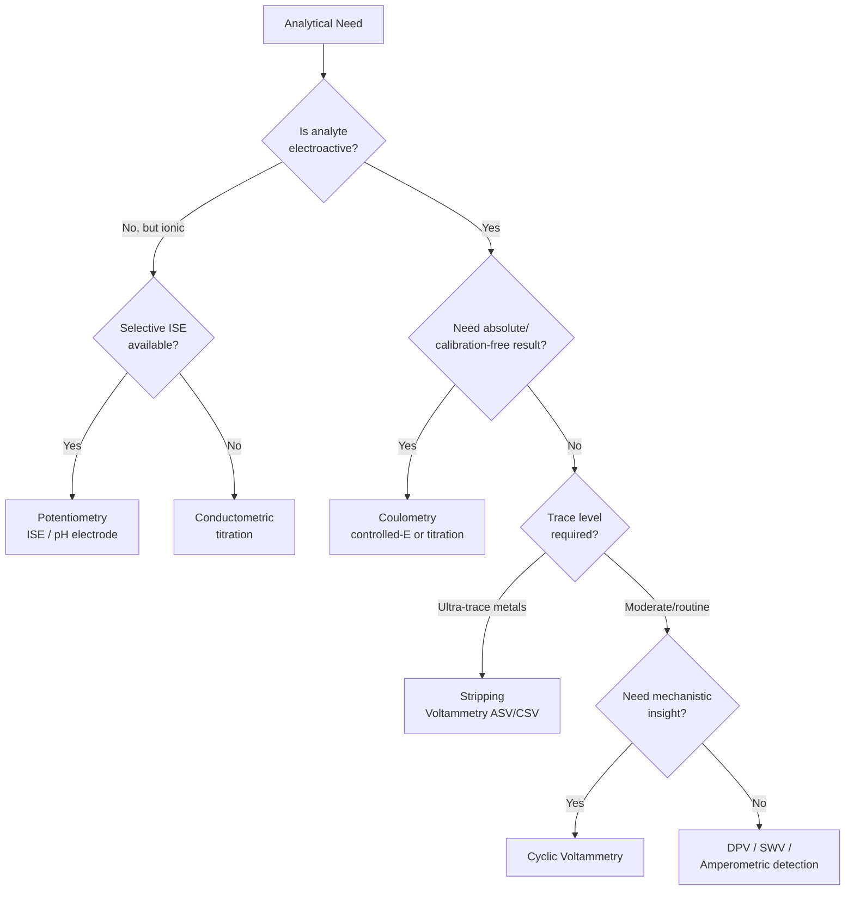

## Electroanalytical Methods

### Overview

Electroanalytical methods are a family of quantitative analytical techniques that exploit the electrical properties (potential, current, charge, conductance) of an analyte solution when it is made part of an electrochemical cell. Because the measured signal arises directly from electron-transfer or ion-transport processes at an electrode-solution interface, these methods are distinguished from spectroscopic methods by their dependence on interfacial chemistry, mass transport, and electrode kinetics rather than photon absorption/emission.

The field is broadly divided by which electrical quantity is held constant and which is measured:

- **Potentiometry** — measures cell potential ($E$) at (near-) zero current
- **Coulometry** — measures total charge ($Q$) passed to completely convert an analyte
- **Voltammetry/Amperometry** — measures current ($i$) as a function of applied, controlled potential
- **Conductometry** — measures solution conductance ($G$), with no reference to a specific electrode reaction

### Fundamental Concepts

**Electrochemical Cell**

An electroanalytical measurement requires a cell consisting of at least two electrodes immersed in an electrolyte solution:

- **Working electrode (WE)** — where the analytical reaction of interest occurs
- **Reference electrode (RE)** — maintains a fixed, known potential independent of the sample composition (e.g., saturated calomel electrode SCE, Ag/AgCl)
- **Counter/auxiliary electrode (CE)** — carries the current in a three-electrode setup, protecting the reference electrode from current flow (used in voltammetry/coulometry, not typically in simple potentiometry)

**Nernst Equation**

The thermodynamic relationship between electrode potential and analyte activity underlies potentiometry and much of voltammetry:

$$E = E^{\circ} - \frac{RT}{nF}\ln Q$$

where $E^{\circ}$ is the standard electrode potential, $R$ the gas constant, $T$ temperature, $n$ the number of electrons transferred, $F$ the Faraday constant, and $Q$ the reaction quotient. At 25°C, the coefficient $\frac{RT}{F}\ln(10) \approx 0.05916\ \text{V}$, giving the commonly used form:

$$E = E^{\circ} - \frac{0.05916}{n}\log Q$$

**Faraday's Laws (basis of coulometry)**

$$Q = nFN$$

where $Q$ is total charge (coulombs), $n$ is electrons per mole of analyte, $F = 96{,}485\ \text{C/mol}$, and $N$ is moles converted. Since $Q = \int i\, dt$, integrating current over time gives moles directly — this is the principle underlying all coulometric methods.

**Mass Transport Mechanisms**

Analyte flux to the electrode surface occurs via three mechanisms:

1. **Diffusion** — concentration-gradient-driven movement (the dominant, desired mechanism in most voltammetric techniques)
2. **Migration** — electric-field-driven movement of charged species (suppressed by adding excess inert supporting electrolyte)
3. **Convection** — bulk fluid motion (stirring, flow, or electrode rotation; deliberately used in hydrodynamic methods, avoided in quiescent voltammetry)

---

## Potentiometry

### Principle

Potentiometry measures the potential difference between an indicator electrode (sensitive to the analyte) and a reference electrode under conditions of (near) zero current flow, so the measurement does not perturb the equilibrium being probed. A high-impedance voltmeter (pH/ion meter) is required to prevent current draw.

### Indicator Electrodes

**Metallic indicator electrodes**

- *First-kind* — a metal in equilibrium with its own cation (e.g., $\text{Ag}^0 | \text{Ag}^+$)
- *Second-kind* — a metal coated with an insoluble salt, responsive to the salt's anion (e.g., Ag/AgCl responds to $\text{Cl}^-$)
- *Redox (inert) electrodes* — Pt or Au electrodes that respond to a redox couple in solution without participating themselves (e.g., $\text{Fe}^{3+}/\text{Fe}^{2+}$)

**Ion-Selective Electrodes (ISEs)**

The most widely used potentiometric sensors, built around a membrane selectively permeable to (or reactive with) a target ion, generating a membrane potential.

- **Glass membrane electrode (pH electrode)** — a thin glass membrane (typically Li⁺/Na⁺-doped silicate) develops a boundary potential dependent on $\text{H}^+$ activity via ion-exchange at hydrated gel layers on each face
- **Crystalline/solid-state membrane** — e.g., LaF₃ single crystal doped with Eu²⁺ for fluoride-selective electrodes; Ag₂S-based membranes for $\text{S}^{2-}$ and $\text{Ag}^+$
- **Liquid membrane (ion-exchanger/ionophore-based)** — a hydrophobic membrane (PVC matrix) containing a liquid ion-exchanger or a neutral ionophore (e.g., valinomycin for $\text{K}^+$) dissolved in a plasticizer

The general potentiometric response follows a Nernstian form:

$$E = \text{const} \pm \frac{0.05916}{z_i}\log a_i$$

where $z_i$ is the charge of the target ion and $a_i$ its activity.

### Selectivity and Interference

Real ISEs respond to interferents to some degree, quantified by the **Nikolsky-Eisenman equation**:

$$E = \text{const} + \frac{0.05916}{z_i}\log\left(a_i + \sum_j K_{i,j}^{pot}\, a_j^{z_i/z_j}\right)$$

where $K_{i,j}^{pot}$ is the selectivity coefficient of the electrode for interferent $j$ relative to the primary ion $i$. Smaller $K_{i,j}^{pot}$ indicates better selectivity.

### Instrumentation and Practice

- **Ionic strength adjustment buffer (ISAB/TISAB)** is added to samples and standards to fix ionic strength, keeping activity coefficients constant so the calibration relates potential to concentration rather than activity
- **Direct potentiometry** — potential is read and converted to concentration via a calibration curve (plot of $E$ vs. $\log C$) or standard addition
- **Potentiometric titration** — the indicator electrode potential is monitored as titrant is added; the equivalence point appears as an inflection (maximum $dE/dV$) in the titration curve, useful for colored/turbid solutions where visual indicators fail

**Example**

A fluoride ISE calibrated with standards from $10^{-5}$ to $10^{-2}\ \text{M}$ gives a linear plot of $E$ (mV) vs. $\log[\text{F}^-]$ with slope $\approx -59\ \text{mV/decade}$ (Nernstian, since $z = -1$). An unknown reading of $E = 145\ \text{mV}$ interpolated on this line yields the sample fluoride concentration directly, after TISAB addition to mask $\text{Al}^{3+}$/$\text{Fe}^{3+}$ interferents and fix ionic strength.

---

## Coulometry

### Principle

Coulometry determines the amount of analyte by measuring the total charge required to convert it completely (100% current efficiency) at an electrode, using Faraday's law $N = Q/nF$. No calibration curve against standards is required if $n$ is known exactly, making coulometry a primary (absolute) method.

### Controlled-Potential Coulometry

The working electrode potential is held constant (via a potentiostat) at a value that ensures the analyte reacts quantitatively while minimizing side reactions. Current decays exponentially as the analyte is depleted:

$$i_t = i_0 e^{-kt}$$

Total charge is obtained by integrating the current-time curve (electronically or graphically) until current falls to background/baseline levels. High selectivity is achieved by choosing a potential on the diffusion-plateau of the analyte's voltammogram.

### Coulometric Titration (Constant-Current Coulometry)

A constant current generates a titrant electrochemically in situ (e.g., $\text{I}_2$ generated at a Pt anode from $\text{I}^-$ for Karl Fischer or iodometric coulometry). The titration "endpoint" is detected by an auxiliary indicator system (potentiometric or amperometric), and elapsed time $t$ at constant current $i$ gives $Q = it$, hence moles of titrant/analyte.

**Advantages**: no need to prepare, standardize, or store unstable titrants (e.g., electrogenerated $\text{Br}_2$, $\text{Ce}^{4+}$); microgram-to-milligram quantities can be measured with high precision; well suited to automation (this is the basis of **Karl Fischer coulometric water titration**, widely used for trace moisture determination).

**Example**

Water content in a pharmaceutical sample is determined by Karl Fischer coulometry: iodine generated at constant current $i = 100\ \text{mA}$ reacts stoichiometrically with water via the Bunsen-type reaction. If the endpoint requires $t = 45.2\ \text{s}$, then $Q = it = 4.52\ \text{C}$, and since 1 mole $\text{I}_2$ reacts with 1 mole $\text{H}_2\text{O}$ ($n = 2$ electrons per $\text{I}_2$), the mass of water is calculated directly from $Q$, without any titrant standardization step.

---

## Voltammetry and Amperometry

### Principle

In voltammetry, potential is applied to the working electrode (relative to a reference) following a controlled waveform, and the resulting current is measured as a function of that potential, producing a **voltammogram** ($i$ vs. $E$). Amperometry is the special case where current is monitored at a single fixed potential over time.

A three-electrode cell with a **potentiostat** is standard: the potentiostat forces the WE-RE potential difference to follow the programmed waveform while passing the necessary current through the CE, so negligible current flows through the reference electrode (preserving its stability).

### Diffusion-Limited Current: The Basis of Quantitation

When electron transfer kinetics are fast, the current becomes limited by the rate of analyte diffusion to the electrode. The **Cottrell equation** describes the current-time transient at a planar electrode after a potential step to the diffusion-limited region:

$$i_t = \frac{nFAD^{1/2}C^*}{\pi^{1/2}t^{1/2}}$$

where $A$ is electrode area, $D$ the diffusion coefficient, and $C^*$ the bulk analyte concentration. This $t^{-1/2}$ decay underlies transient techniques; for the mass-transport-limited current in stirred/hydrodynamic or steady-state systems, the **Levich equation** and related relations apply.

### Classical Polarography

Developed by Heyrovský (Nobel Prize 1959), polarography uses a **dropping mercury electrode (DME)**, where a continuously renewed Hg drop provides a fresh, reproducible surface each cycle, eliminating electrode fouling/passivation issues.

- **Linear sweep polarography** — potential ramped linearly; produces a sigmoidal wave; the **diffusion current** $i_d$ (plateau height) is proportional to concentration via the **Ilkovic equation**:

$$i_d = 708\, n D^{1/2} m^{2/3} t^{1/6} C$$

(constants reflect drop mass flow rate $m$ and drop time $t$)

- **Half-wave potential** ($E_{1/2}$) — the potential at half the diffusion current plateau height; characteristic of the redox couple and used for qualitative identification, analogous to $E^{\circ}$

**Limitation**: classical DC polarography suffers from large **charging (capacitive) current**, which limits sensitivity to roughly $10^{-5}$ M.

### Pulse Techniques (Modern Polarography/Voltammetry)

Pulse methods dramatically improve sensitivity by exploiting the different decay rates of faradaic current ($\propto t^{-1/2}$) versus capacitive/charging current ($\propto e^{-t/RC}$, decaying much faster); sampling current only after the fast-decaying capacitive component has died away isolates the faradaic signal.

- **Normal Pulse Voltammetry (NPV)** — increasing-amplitude potential pulses applied from a fixed base potential, current sampled near the end of each pulse
- **Differential Pulse Voltammetry (DPV)** — small fixed-amplitude pulses superimposed on a slow linear ramp; current is measured just before and at the end of each pulse, and the *difference* is plotted vs. potential, producing peak-shaped (rather than sigmoidal) voltammograms with excellent resolution of closely spaced peaks and detection limits down to $\sim 10^{-8}$ M
- **Square-Wave Voltammetry (SWV)** — a symmetrical square wave superimposed on a staircase ramp; forward and reverse currents are sampled and subtracted, giving very high sensitivity and speed (full scan in seconds), widely used in modern electrochemical instruments

### Stripping Voltammetry

The most sensitive electroanalytical technique (detection limits to $10^{-10}$–$10^{-12}$ M), used extensively for trace metal analysis (e.g., $\text{Pb}^{2+}$, $\text{Cd}^{2+}$, $\text{Cu}^{2+}$, $\text{Zn}^{2+}$ in environmental/clinical samples).

Two-step process:

1. **Preconcentration (deposition) step** — analyte is electrolytically deposited/accumulated onto the electrode (e.g., as an amalgam on a hanging mercury drop or mercury film electrode) at a fixed cathodic potential for a controlled time, concentrating trace analyte from a dilute solution into the electrode phase
2. **Stripping step** — the potential is scanned (usually anodically, "anodic stripping voltammetry," ASV) and the deposited metal is oxidized back into solution; the resulting current peak is proportional to the preconcentrated (and hence original solution) concentration

**Cathodic stripping voltammetry (CSV)** operates in reverse, for anions/analytes that form insoluble salts with the electrode material.

**Example**

Trace $\text{Pb}^{2+}$ and $\text{Cd}^{2+}$ in a water sample are determined by ASV at a mercury film electrode: deposition at $-1.0\ \text{V}$ for 120 s reduces and amalgamates both metals; the potential is then scanned anodically, producing well-separated stripping peaks near $-0.4\ \text{V}$ ($\text{Pb}$) and $-0.6\ \text{V}$ ($\text{Cd}$) vs. SCE, each peak height calibrated against standard additions to quantify sub-ppb concentrations.

### Cyclic Voltammetry (CV)

Although used more for mechanistic/diagnostic study than routine quantitation, CV is central to electroanalytical chemistry. Potential is swept linearly from an initial value to a switching potential and back, producing a characteristic duck-shaped voltammogram with anodic ($i_{pa}$) and cathodic ($i_{pc}$) peak currents.

The **Randles-Ševčík equation** describes peak current for a reversible system:

$$i_p = (2.69\times10^5)\, n^{3/2} A D^{1/2} C^* \nu^{1/2}$$

where $\nu$ is the scan rate. Key diagnostic criteria for electrochemical reversibility include $\Delta E_p = E_{pa} - E_{pc} \approx 59/n\ \text{mV}$ (at 25°C) and $i_{pa}/i_{pc} \approx 1$; deviations indicate quasi-reversible or irreversible electron transfer, coupled chemical reactions, or adsorption effects.

### Amperometric Sensors and Detection

Fixed-potential amperometry underlies many practical sensors and detectors:

- **Clark oxygen electrode** — a Pt cathode behind an $\text{O}_2$-permeable membrane reduces dissolved oxygen; current is proportional to $\text{O}_2$ concentration (basis of dissolved-oxygen meters and blood-gas analyzers)
- **Amperometric detection in HPLC/flow injection analysis** — WE held at a potential where the analyte is oxidized/reduced as it flows past, giving a real-time concentration-proportional current signal (common for electroactive species like catecholamines, phenols)
- **Biosensors** — enzyme-modified electrodes (e.g., glucose oxidase-based glucose sensors) couple a selective biochemical reaction to amperometric transduction of a product (often $\text{H}_2\text{O}_2$ oxidation)

---

## Conductometry

### Principle

Conductometric methods measure the electrolytic conductance of a solution, which depends on the concentration, charge, and mobility of all ions present — it is a non-selective, bulk property measurement (unlike potentiometry/voltammetry, which can target specific redox-active or membrane-permeable species).

$$G = \frac{1}{R} = \kappa \frac{A}{l}$$

where $G$ is conductance (siemens), $R$ resistance, $\kappa$ specific conductivity, $A$ electrode area, and $l$ electrode separation. An AC excitation (typically 1-3 kHz) is used to avoid electrolysis and polarization effects at the electrodes.

### Conductometric Titration

Because conductometry is non-selective, it is used almost exclusively in the titration mode: conductance is monitored as titrant is added, and the equivalence point appears as a break (change in slope) in the conductance-vs-volume plot, reflecting the differing ionic mobilities/charges of reactant vs. product ions (e.g., in acid-base titrations, the very high mobility of $\text{H}^+$/$\text{OH}^-$ relative to other ions produces sharp, easily identified breaks).

**Example**

Titrating HCl with NaOH conductometrically: initial conductance is high (mobile $\text{H}^+$ dominates); as $\text{OH}^-$ is added, $\text{H}^+$ is consumed (replaced by less-mobile $\text{Na}^+$), so conductance *decreases* linearly; past the equivalence point, excess $\text{OH}^-$ (also highly mobile) causes conductance to *increase* again. The V-shaped minimum at the intersection of the two linear segments locates the equivalence point precisely, even without indicators.

---

## Comparative Summary

| Method | Measured Quantity | Held Constant | Typical LOD | Primary Use |
| --- | --- | --- | --- | --- |
| Potentiometry | $E$ (potential) | $i \approx 0$ | $10^{-6}$–$10^{-1}$ M | Ion-selective sensing, pH, titration endpoints |
| Controlled-potential coulometry | $Q$ (charge) | $E$ | µg-mg quantities | Absolute (calibration-free) quantitation |
| Coulometric titration | $Q$ via $t$ | $i$ | µg-mg quantities | In-situ titrant generation (e.g., Karl Fischer) |
| DPV / SWV | $i$ (peak) | Potential program | $10^{-8}$ M | Trace organic/inorganic analysis |
| Stripping voltammetry | $i$ (stripping peak) | Deposition then scan | $10^{-10}$–$10^{-12}$ M | Ultra-trace metal analysis |
| Cyclic voltammetry | $i$ vs $E$ (full cycle) | Scan program | N/A (mechanistic tool) | Redox mechanism/kinetics study |
| Conductometry | $G$ (conductance) | AC frequency | Non-selective | Titration endpoint detection, purity/TDS |

### Process Flow: Instrument/Method Selection Logic (svg_diagram)

### Instrumentation Schematic: Three-Electrode Potentiostatic Cell (svg_diagram)

<svg xmlns="http://www.w3.org/2000/svg" viewBox="0 0 640 340" font-family="Helvetica, Arial, sans-serif">
<text x="320" y="24" text-anchor="middle" font-size="16" font-weight="bold">Three-Electrode Potentiostatic Cell (svg_diagram)</text>

<path d="M120 80 L120 280 Q120 300 140 300 L500 300 Q520 300 520 280 L520 80" fill="#eaf4fb" stroke="#2c6e8f" stroke-width="2" />
<line x1="120" y1="80" x2="520" y2="80" stroke="#2c6e8f" stroke-width="2" stroke-dasharray="4,3" />
<text x="320" y="70" text-anchor="middle" font-size="12" fill="#2c6e8f">Electrolyte + Supporting Electrolyte</text>

<rect x="185" y="90" width="10" height="170" fill="#444" />
<circle cx="190" cy="270" r="8" fill="#b58a2c" />
<text x="190" y="320" text-anchor="middle" font-size="12" font-weight="bold">WE</text>
<text x="190" y="335" text-anchor="middle" font-size="10">(sensing electrode)</text>

<rect x="310" y="100" width="10" height="120" fill="#555" />
<rect x="300" y="210" width="30" height="30" rx="4" fill="#cfd8dc" stroke="#555" />
<text x="315" y="320" text-anchor="middle" font-size="12" font-weight="bold">RE</text>
<text x="315" y="335" text-anchor="middle" font-size="10">(fixed potential)</text>

<rect x="440" y="90" width="10" height="170" fill="#444" />
<circle cx="445" cy="260" r="6" fill="#777" />
<text x="445" y="320" text-anchor="middle" font-size="12" font-weight="bold">CE</text>
<text x="445" y="335" text-anchor="middle" font-size="10">(current path)</text>

<rect x="230" y="10" width="180" height="40" rx="6" fill="#fff3e0" stroke="#b5651d" stroke-width="2" />
<text x="320" y="34" text-anchor="middle" font-size="13" font-weight="bold">Potentiostat</text>

<line x1="190" y1="90" x2="240" y2="50" stroke="#333" stroke-width="1.5" />
<line x1="315" y1="100" x2="320" y2="50" stroke="#333" stroke-width="1.5" />
<line x1="445" y1="90" x2="400" y2="50" stroke="#333" stroke-width="1.5" />

<text x="320" y="290" text-anchor="middle" font-size="11" fill="`#2c6e8f`">Bulk solution (diffusion + migration + convection)</text>

</svg>

---

**Key Points**

- Electroanalytical methods are classified by the measured electrical quantity: potential (potentiometry), charge (coulometry), current vs. potential (voltammetry/amperometry), or conductance (conductometry)
- The Nernst equation governs equilibrium potentiometric response; Faraday's law governs coulometric quantitation; diffusion-controlled current (Cottrell/Ilkovic/Randles-Ševčík relations) governs voltammetric quantitation
- Pulse and stripping voltammetric techniques achieve the lowest detection limits among electroanalytical methods by separating faradaic from capacitive current and/or preconcentrating analyte before measurement
- Conductometry is inherently non-selective and is primarily applied in titration mode
- A three-electrode cell with a potentiostat is the standard instrumental configuration for controlled-potential techniques (voltammetry, controlled-potential coulometry)

**Next Steps**

- Ion-selective electrode membrane theory and design (glass, crystalline, liquid/polymeric membranes)
- Electrode kinetics: Butler-Volmer equation and the origin of overpotential
- Instrumentation deep dive: potentiostat circuit design (operational amplifier-based control/current-follower circuits)
- Spectroelectrochemistry (coupling UV-Vis/IR with electrochemical control)
- Electrochemical impedance spectroscopy (EIS) as an extension beyond simple conductometry
- Microelectrodes and ultramicroelectrodes: steady-state voltammetry and reduced ohmic drop
- Bulk electrolysis and its role in synthesis vs. analysis
- Bioanalytical electrochemistry: enzyme-based and DNA-based biosensors