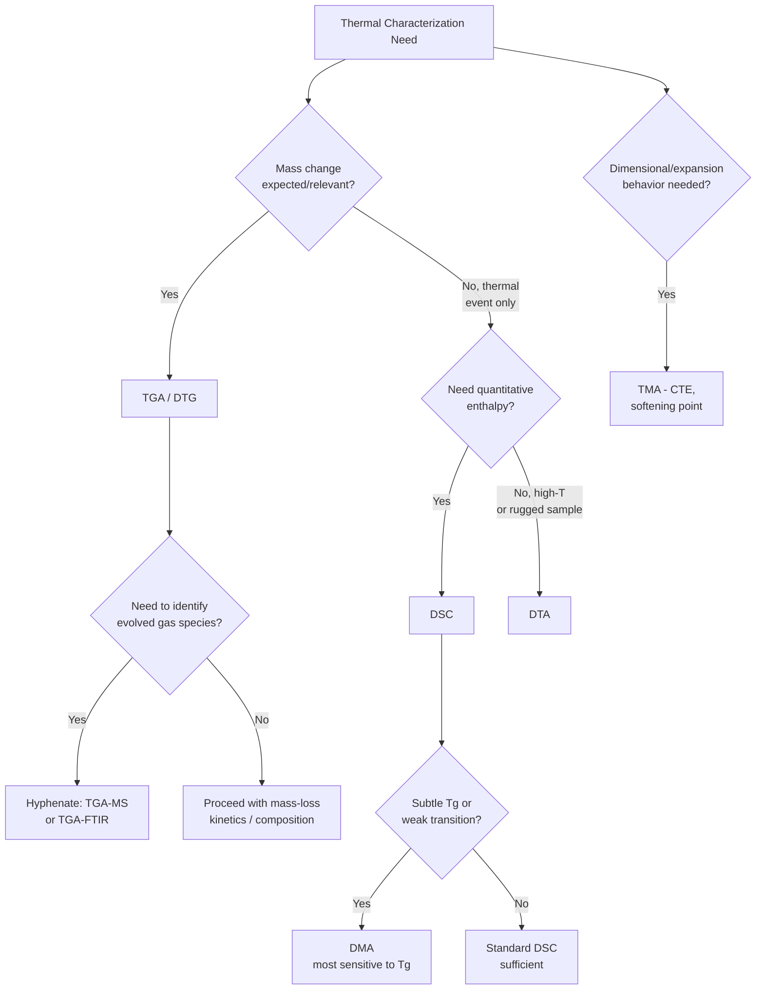

## Thermal Analysis Methods

### Overview

Thermal analysis comprises a group of techniques in which a physical or chemical property of a sample is measured as a function of temperature (or time, under a controlled temperature program), typically while the sample is subjected to a controlled heating, cooling, or isothermal regime in a defined atmosphere. These methods are central to characterizing decomposition behavior, phase transitions, purity, compositional analysis, and material stability.

The major techniques are distinguished by the property monitored:

- **Thermogravimetry (TGA)** — mass
- **Differential Thermal Analysis (DTA)** — temperature difference relative to a reference
- **Differential Scanning Calorimetry (DSC)** — heat flow/enthalpy
- **Thermomechanical Analysis (TMA)** and **Dynamic Mechanical Analysis (DMA)** — dimensional/mechanical properties
- **Evolved Gas Analysis (EGA)** — composition of gases released, often coupled (TGA-MS, TGA-FTIR)

### Fundamental Concepts

**Controlled Temperature Program**

A sample is exposed to a linear heating/cooling ramp ($\beta = dT/dt$, typically 1-20°C/min), an isothermal hold, or a combination, inside a furnace under a controlled purge gas (inert: $\text{N}_2$/Ar for decomposition studies without oxidation; oxidative: air/$\text{O}_2$ to study combustion/oxidative stability).

**Sample Pan and Reference**

Most techniques (DTA, DSC) require a matched inert reference material (or empty pan) measured simultaneously alongside the sample, so that differential (sample minus reference) signals cancel out systematic thermal lag and baseline drift common to both.

**Types of Thermal Events**

Two broad classes of thermally induced changes are detected:

- *Physical transitions* — melting, crystallization, glass transition, polymorphic phase changes, adsorption/desorption, sublimation — generally do **not** involve mass change (except desorption/sublimation) but do involve enthalpy change
- *Chemical transitions* — decomposition, oxidation, dehydration, combustion, curing/crosslinking — generally involve mass change (loss of volatiles, gain of oxygen) and enthalpy change

---

## Thermogravimetric Analysis (TGA/TG)

### Principle

TGA continuously measures the mass of a sample as it is heated (or held isothermally) under a controlled atmosphere, using a precision microbalance housed with the sample in a furnace. The raw output is a **thermogram** (TG curve): mass (or % mass remaining) vs. temperature (or time).

### Instrumentation

- **Thermobalance** — a highly sensitive null-point or beam microbalance (µg resolution) mechanically or magnetically isolated from the furnace to prevent thermal interference with the mass measurement
- **Furnace** — programmable heating, typically ambient to 1000-1600°C depending on design, with the sample pan (Pt, alumina, or ceramic crucible for high-temperature stability) suspended or seated on the balance arm
- **Purge gas control** — inert (N₂, Ar, He) to observe pyrolytic decomposition without combustion; switching to oxidizing gas (air/O₂) partway through a run allows a two-stage protocol (e.g., pyrolysis followed by combustion of residual char)

### Derivative Thermogravimetry (DTG)

The first derivative of the TG curve, $d m/dT$, is plotted to resolve overlapping mass-loss events into distinct peaks, with each DTG peak maximum corresponding to the point of maximum decomposition rate — much easier to interpret than inflection points on the raw TG curve, especially for multi-step decompositions.

### Applications

- **Compositional analysis** — sequential mass losses correspond to loss of moisture, volatiles, decomposition of organic matter, and (under switch to oxidizing atmosphere) combustion of carbon residue, leaving inorganic ash; widely used for polymer composite analysis (filler content), coal/petroleum proximate analysis, and pharmaceutical hydrate/solvate characterization
- **Thermal stability assessment** — onset decomposition temperature ($T_{onset}$) and temperature of maximum mass-loss rate benchmark material stability for quality control and formulation comparison
- **Kinetic analysis** — mass-loss data collected at multiple heating rates can be fit to kinetic models (e.g., Kissinger method, Ozawa-Flynn-Wall isoconversional method) to extract activation energy $E_a$ for decomposition

**Example**

A calcium oxalate monohydrate ($\text{CaC}_2\text{O}_4 \cdot \text{H}_2\text{O}$) sample analyzed by TGA under $\text{N}_2$ shows three discrete mass-loss steps: (1) ~100-200°C, loss of water of hydration (theoretical 12.3% mass loss); (2) ~400-500°C, loss of CO to form $\text{CaCO}_3$ (theoretical 19.2%); (3) ~700-850°C, loss of $\text{CO}_2$ to form CaO (theoretical 30.3%). This classic three-step pattern is a standard reference reaction for calibrating TGA instruments and validating stoichiometric interpretation of mass-loss curves.

---

## Differential Thermal Analysis (DTA)

### Principle

DTA measures the *temperature difference* ($\Delta T = T_{sample} - T_{reference}$) between the sample and an inert reference as both are heated identically in the same furnace. When the sample undergoes an **endothermic** event (melting, dehydration, endothermic decomposition), its temperature lags behind the reference, producing a negative $\Delta T$ deflection; an **exothermic** event (crystallization, oxidation, combustion) causes the sample temperature to run ahead, producing a positive deflection.

### Instrumentation

Sample and reference pans sit in symmetric positions within the same furnace block, each with an embedded thermocouple; the thermocouples are wired differentially so that the output directly reflects $\Delta T$ rather than absolute temperature (which cancels common-mode furnace drift).

### Interpretation

The DTA curve ($\Delta T$ vs. $T$ or $t$) shows peaks (exothermic) and troughs (endothermic) by convention (though sign conventions vary by instrument manufacturer). Peak area is roughly proportional to the enthalpy of the transition, but because DTA is not power-compensated or heat-flux calibrated with the same rigor as DSC, it is generally treated as **semi-quantitative** for enthalpy and is more valued for its higher-temperature range capability (DTA instruments often extend well beyond typical DSC limits, to 1600°C or higher) and robustness with difficult sample types (minerals, ceramics, metals).

**[Unverified]** The exact quantitative accuracy of enthalpy values from DTA versus DSC depends strongly on instrument design and calibration protocol, and can vary significantly between specific commercial models.

---

## Differential Scanning Calorimetry (DSC)

### Principle

DSC directly measures the **heat flow** (in mW, or normalized to mW/g) required to maintain the sample and reference at the same temperature as both are heated/cooled through a controlled program. Because heat flow is measured directly (rather than inferred from a temperature difference), DSC gives quantitatively reliable enthalpy values and is the most widely used thermal technique in materials science, polymer science, and pharmaceutical analysis.

### Two Principal DSC Designs

**Heat-flux DSC**

Sample and reference are placed on a single heat-flux plate/disk within one furnace; $\Delta T$ between them is measured (similar hardware to DTA) but is converted to heat flow via a calibrated heat-flux sensor and known thermal resistance, using:

$$\frac{dq}{dt} = -K\,\Delta T$$

where $K$ is the calorimetric sensitivity (calibration constant, typically temperature-dependent).

**Power-compensated DSC**

Sample and reference are held in *separate*, individually heated micro-furnaces, each with its own heater and temperature sensor; a feedback control loop continuously adjusts the electrical power delivered to each furnace to keep both at identical temperature. The **differential power** supplied to maintain zero $\Delta T$ is the direct output signal — this is a direct calorimetric measurement rather than an inferred one, generally offering superior resolution and faster response.

### The DSC Curve and Key Parameters

The DSC output (heat flow vs. temperature) reveals characteristic features:

- **Glass transition ($T_g$)** — a step-change (not a peak) in baseline heat capacity, marking the transition of an amorphous polymer/material from glassy to rubbery state
- **Melting ($T_m$)** — a sharp endothermic peak; peak area gives the **enthalpy of fusion** ($\Delta H_f$), and comparison to the theoretical $\Delta H_f$ of a 100% crystalline reference gives % crystallinity in polymers
- **Crystallization ($T_c$)** — an exothermic peak, on cooling or on heating (cold crystallization) for polymers that crystallize slowly
- **Oxidative Induction Time (OIT)** — an isothermal DSC test measuring time-to-onset of an oxidative exotherm under an $\text{O}_2$ atmosphere, used to assess antioxidant stabilizer effectiveness in polymers

Enthalpy is obtained by integrating the peak area (heat flow $\times$ time), since:

$$\Delta H = \int \frac{dq}{dt}\,dt$$

### Calibration

DSC instruments require regular calibration with certified reference materials of known, sharp melting points and enthalpies (commonly high-purity indium, $T_m = 156.6°C$, $\Delta H_f = 28.5\ \text{J/g}$; also tin, zinc, lead for multi-point calibration across the working range).

### Purity Determination by DSC

For a compound with a small level of eutectic-forming impurity, melting-point depression and peak broadening follow the **van't Hoff equation**, enabling calculation of mole fraction purity from the shape of the melting endotherm — a standard pharmaceutical application for rapid, small-sample purity assessment without chromatography.

**Example**

A polyethylene terephthalate (PET) sample analyzed by DSC (heat from 25°C to 300°C at 10°C/min) shows: a glass transition step near 75°C, a cold-crystallization exotherm near 130°C (indicating the as-received sample was partially amorphous), and a melting endotherm near 250°C with $\Delta H_f = 45\ \text{J/g}$. Using a literature value of $\Delta H_f^{100\%} = 140\ \text{J/g}$ for fully crystalline PET, the net crystallinity is calculated as $(\Delta H_{melt} - \Delta H_{cold\,cryst})/\Delta H_f^{100\%} \times 100\%$, correcting for crystallization that occurred during the scan itself.

---

## Thermomechanical Analysis (TMA) and Dynamic Mechanical Analysis (DMA)

### TMA Principle

TMA measures dimensional change (linear expansion, contraction, penetration, or deformation) of a sample under a defined static (typically minimal/negligible) mechanical load as a function of temperature, using a precision displacement probe (e.g., LVDT — linear variable differential transformer). Primary application is measuring the **coefficient of thermal expansion (CTE)**:

$$\alpha = \frac{1}{L_0}\frac{dL}{dT}$$

TMA also detects $T_g$ as a change in expansion-rate slope, and softening points under load.

### DMA Principle

DMA applies a small-amplitude *oscillating* (sinusoidal) mechanical stress to the sample while scanning temperature, measuring the resulting strain response to extract:

- **Storage modulus** ($E'$) — the elastic, energy-storing component of the material's response
- **Loss modulus** ($E''$) — the viscous, energy-dissipating component
- **Damping factor** ($\tan\delta = E''/E'$) — peaks sharply at $T_g$, making DMA the most sensitive of all thermal techniques for detecting glass transitions and secondary relaxations, particularly in polymers and composites

**[Inference]** DMA's superior sensitivity to $T_g$ relative to DSC is well documented for many polymer systems, though the magnitude of the advantage depends on the specific material and the strength of its associated relaxation.

---

## Evolved Gas Analysis (EGA) and Hyphenated Techniques

### Principle

EGA identifies and/or quantifies gaseous products released from a sample during a thermal program, providing chemical identity information that mass-loss data alone cannot give. This is almost always performed by **coupling (hyphenating)** a thermal instrument to a gas-analysis instrument via a heated transfer line (to prevent condensation of evolved species):

- **TGA-MS** — mass spectrometry identifies evolved species by mass-to-charge ratio, offering high sensitivity and fast response, well suited to detecting simple small molecules (H₂O, CO₂, CO)
- **TGA-FTIR** — infrared spectroscopy of the evolved gas stream identifies functional groups/molecular species via characteristic vibrational bands, particularly valuable for distinguishing structurally similar volatile organics
- **TGA-GC/MS** — gas chromatography separation prior to MS detection, used when evolved gas is a complex mixture requiring compound-level separation

### Simultaneous Thermal Analysis (STA)

Many modern instruments combine TGA and DSC (or DTA) in a single measurement on a single sample (STA), collecting mass-loss and heat-flow data simultaneously under identical conditions — critical for correctly assigning whether a given DSC peak corresponds to a mass-changing (chemical) or non-mass-changing (physical) event.

---

## Comparative Summary

| Technique | Property Measured | Key Outputs | Typical Range |
| --- | --- | --- | --- |
| TGA | Mass | % mass loss, $T_{onset}$, decomposition kinetics | Ambient–1600°C |
| DTG | $dm/dT$ | Resolved mass-loss peak maxima | Derived from TGA |
| DTA | $\Delta T$ (sample − ref) | Semi-quantitative transition temperatures | Ambient–1600°C+ |
| DSC | Heat flow | $T_g$, $T_m$, $T_c$, $\Delta H$, % crystallinity, purity, OIT | Typically –150 to 700°C |
| TMA | Dimensional change | CTE, $T_g$, softening point | Ambient–1000°C |
| DMA | Mechanical (oscillatory) response | $E'$, $E''$, $\tan\delta$, $T_g$ (most sensitive) | Sub-ambient–500°C |
| EGA (TGA-MS/FTIR) | Evolved gas composition | Identity of decomposition/volatile products | Coupled to TGA range |

### Process Flow: Thermal Technique Selection Logic (svg_diagram)

### Instrumentation Schematic: Power-Compensated DSC Cell (svg_diagram)

<svg xmlns="http://www.w3.org/2000/svg" viewBox="0 0 640 320" font-family="Helvetica, Arial, sans-serif">
<text x="320" y="24" text-anchor="middle" font-size="16" font-weight="bold">Power-Compensated DSC Cell (svg_diagram)</text>

<circle cx="200" cy="170" r="80" fill="#fdecea" stroke="#c0392b" stroke-width="2" />
<rect x="180" y="150" width="40" height="24" fill="#8d6e63" stroke="#5d4037" stroke-width="1.5" />
<text x="200" y="200" text-anchor="middle" font-size="11" font-weight="bold">Sample pan</text>
<text x="200" y="270" text-anchor="middle" font-size="12" font-weight="bold">Sample Furnace</text>
<text x="200" y="286" text-anchor="middle" font-size="10">Heater S + Sensor S</text>

<circle cx="440" cy="170" r="80" fill="#eaf4fb" stroke="#2c6e8f" stroke-width="2" />
<rect x="420" y="150" width="40" height="24" fill="#b0bec5" stroke="#455a64" stroke-width="1.5" />
<text x="440" y="200" text-anchor="middle" font-size="11" font-weight="bold">Reference pan</text>
<text x="440" y="270" text-anchor="middle" font-size="12" font-weight="bold">Reference Furnace</text>
<text x="440" y="286" text-anchor="middle" font-size="10">Heater R + Sensor R</text>

<rect x="250" y="30" width="140" height="40" rx="6" fill="#fff3e0" stroke="#b5651d" stroke-width="2" />
<text x="320" y="54" text-anchor="middle" font-size="12" font-weight="bold">Feedback Controller</text>
<line x1="220" y1="100" x2="280" y2="65" stroke="#333" stroke-width="1.5" />
<line x1="420" y1="100" x2="360" y2="65" stroke="#333" stroke-width="1.5" />

<text x="320" y="110" text-anchor="middle" font-size="11" fill="#333">Output: Differential power (dq/dt) to hold ΔT = 0</text>

</svg>

---

**Key Points**

- Thermal analysis techniques share a common controlled-temperature-program principle but differ fundamentally in the measured property: mass (TGA), temperature differential (DTA), heat flow (DSC), or dimensional/mechanical response (TMA/DMA)
- DTG resolves overlapping TGA mass-loss steps into distinguishable rate-maximum peaks
- DSC provides quantitative enthalpy data via direct or inferred heat-flow measurement, distinguishing it from the semi-quantitative $\Delta T$ signal of DTA
- DMA is the most sensitive technique for detecting the glass transition, via the $\tan\delta$ peak
- Hyphenated techniques (TGA-MS, TGA-FTIR) add chemical identity information to the mass-loss data that TGA alone cannot provide
- Simultaneous Thermal Analysis (STA) combining TGA and DSC/DTA on one sample avoids ambiguity in assigning mass-changing vs. purely physical thermal events

**Next Steps**

- Kinetic modeling of solid-state decomposition (Kissinger, Ozawa-Flynn-Wall, Friedman isoconversional methods)
- Modulated DSC (MDSC) — separating reversing and non-reversing heat-flow components
- High-pressure DSC and its use in oxidative stability testing
- Thermomicroscopy (hot-stage microscopy) as a complementary visual technique to DSC/DTA
- Application-specific thermal analysis: pharmaceutical polymorph screening, polymer degradation kinetics, mineral/clay characterization
- Coupling thermal analysis with X-ray diffraction (in-situ high-temperature XRD) for phase identification during thermal events