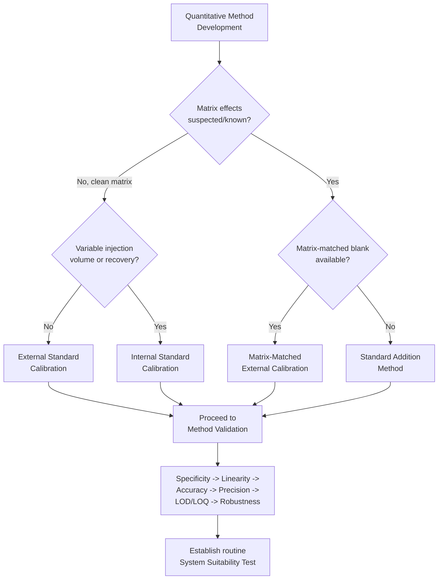

## Calibration and Method Validation

### Overview

Calibration and method validation form the quality-assurance backbone of instrumental analytical chemistry: calibration establishes the quantitative relationship between instrument response and analyte concentration, while method validation formally demonstrates — with documented statistical evidence — that an analytical method is fit for its intended purpose. Together they transform a raw instrument signal into a defensible, traceable quantitative result.

### Fundamental Concepts

**Analytical Figures of Merit**

A method's performance is characterized by a standard set of parameters, each with a specific statistical definition:

- **Accuracy** — closeness of a measured value to the true/accepted value, typically expressed as % recovery or bias
- **Precision** — closeness of agreement among repeated measurements, subdivided into *repeatability* (same analyst/instrument/day) and *reproducibility* (different analyst/instrument/lab/day, i.e., intermediate precision or inter-laboratory)
- **Sensitivity** — the slope of the calibration curve, $d(\text{signal})/d(\text{concentration})$; a steep slope means small concentration changes produce large signal changes
- **Selectivity/Specificity** — the ability of a method to measure the target analyte accurately in the presence of other components (matrix, interferents, degradation products)
- **Linearity** — the range over which signal is directly proportional to concentration
- **Range** — the interval between the lower and upper concentration limits over which the method has demonstrated acceptable accuracy, precision, and linearity
- **Limit of Detection (LOD)** and **Limit of Quantitation (LOQ)** — the lowest analyte levels reliably detectable and reliably quantifiable, respectively
- **Robustness** — insensitivity of results to small, deliberate variations in method parameters (pH, temperature, mobile phase ratio, flow rate)
- **Ruggedness** — insensitivity of results to changes in uncontrolled external factors (different analysts, labs, reagent lots, instruments)

---

## Calibration Methodologies

### External Standard Calibration

A series of standards of known concentration is prepared and analyzed under identical conditions to the sample, generating a calibration curve of signal ($y$) vs. concentration ($x$), typically fit by least-squares linear regression:

$$y = mx + b$$

where $m$ is the sensitivity (slope) and $b$ the intercept. Sample concentration is back-calculated from its measured signal using the regression equation. This is the simplest and most widely applicable approach but assumes the calibration standards and the sample experience identical matrix effects — a significant limitation when the sample matrix suppresses or enhances the instrument response relative to the clean standard solutions.

### Internal Standard Calibration

A fixed, known amount of a reference compound (the internal standard, IS) — chemically similar to the analyte but distinguishable by the detector, and *absent from the original sample* — is added to every standard and sample. The calibration curve is constructed as the **ratio** of analyte signal to IS signal versus concentration:

$$\frac{y_{analyte}}{y_{IS}} = m\left(\frac{C_{analyte}}{C_{IS}}\right) + b$$

Because both analyte and IS experience the same injection volume variability, extraction losses, and instrumental drift, this ratio compensates for many systematic errors, making internal standardization the method of choice for techniques with variable injection volumes/recovery (GC, LC-MS, ICP-MS). A well-chosen IS should have similar physicochemical properties and retention/elution behavior to the analyte, elute/appear near it but fully resolved, and not naturally occur in the sample.

### Standard Addition Method

Used specifically to counter **matrix effects** when a matrix-matched blank is unavailable or the matrix composition is variable/unknown. Aliquots of the sample are spiked with increasing, known amounts of analyte standard, and each spiked aliquot is measured. The unspiked-signal intercept on the concentration axis (extrapolated back through zero signal) gives the original analyte concentration:

$$C_x = \frac{-x_{intercept} \cdot V_{final}}{V_{sample}}$$

(with appropriate dilution corrections). Because every measurement is made in the actual sample matrix, matrix-induced signal suppression/enhancement affects the standard and the sample identically, canceling out. Limitation: standard addition corrects only for *proportional* (multiplicative) matrix effects, not *constant* (additive) interference from a co-eluting/co-responding species already present in the matrix, since the extrapolation captures the slope but not an unrelated background offset.

### Calibration Curve Statistics

**Least-Squares Regression**

The best-fit line minimizes the sum of squared residuals. Key derived parameters:

$$m = \frac{n\sum x_iy_i - \sum x_i \sum y_i}{n\sum x_i^2 - (\sum x_i)^2}$$

$$r^2 = \left(\frac{n\sum x_iy_i - \sum x_i\sum y_i}{\sqrt{[n\sum x_i^2-(\sum x_i)^2][n\sum y_i^2-(\sum y_i)^2}]}\right)^2$$

A high $r^2$ (commonly required $\geq 0.995$ or $\geq 0.999$ depending on regulatory context) indicates good linear fit but does **not** by itself confirm accuracy — a curve can be highly linear yet systematically biased if intercept or slope error is uncorrected; $r^2$ must always be interpreted alongside residual plots and, ideally, a lack-of-fit statistical test.

**Weighted Regression**

When the standard deviation of the signal is not constant across the concentration range (**heteroscedasticity**, common in chromatography and MS where absolute error grows with concentration), ordinary unweighted least-squares gives undue influence to high-concentration points and poor fit at the low end (where LOQ determination matters most). Weighted regression (commonly $1/x$ or $1/x^2$ weighting) corrects this by weighting each point inversely to its variance.

### Limit of Detection and Limit of Quantitation

Based on the calibration curve's residual standard deviation ($S_{y/x}$ or $S_b$, the standard deviation of blank/low-concentration replicates) and slope $m$:

$$\text{LOD} = \frac{3.3\, S_b}{m} \qquad \text{LOQ} = \frac{10\, S_b}{m}$$

The factors 3.3 and 10 derive from IUPAC convention targeting approximate signal-to-noise ratios of 3:1 (detection, minimum distinguishable from noise) and 10:1 (quantitation, sufficient precision for reliable numerical reporting), respectively. Alternative determination via replicate measurement of low-concentration samples (calculating the standard deviation directly) is preferred by many regulatory guidelines over extrapolation from the calibration curve alone, since $S_b$ from curve residuals may not reflect true low-concentration noise.

**Example**

A calibration curve for a drug substance by HPLC-UV over 0.5-50 µg/mL gives $y = 18{,}420x + 1250$ with $r^2 = 0.9996$ and residual standard deviation $S_{y/x} = 890$. LOD $= 3.3(890)/18{,}420 \approx 0.16\ \mu\text{g/mL}$; LOQ $= 10(890)/18{,}420 \approx 0.48\ \mu\text{g/mL}$ — consistent with the curve's stated lower range, confirming the calibration range was appropriately set at or above the LOQ.

---

## Method Validation

### Regulatory Frameworks

Method validation is formalized under harmonized guidelines, most notably:

- **ICH Q2(R2)** (International Council for Harmonisation) — the primary global guideline for analytical procedure validation in the pharmaceutical industry, covering identification, quantitative/limit tests for impurities, and assay procedures
- **USP <1225>** (United States Pharmacopeia) — validation of compendial methods
- **EPA methods** (e.g., SW-846) — environmental method validation, often with prescribed QC criteria per method
- **AOAC guidelines** — food and agricultural analysis validation

**[Unverified]** Specific numerical acceptance criteria (e.g., % RSD limits, recovery ranges) vary meaningfully by regulatory framework, matrix type, and intended use, and should be confirmed against the current version of the applicable governing guideline rather than treated as universal constants.

### Validation Parameters and Experimental Design

**Specificity/Selectivity**

Demonstrated by showing the method can distinguish the analyte from potential interferents: forced degradation studies (exposing the sample to heat, light, acid/base, oxidation) to confirm degradation products don't co-elute with/interfere with the analyte peak; analysis of blank matrix to confirm absence of false-positive response; peak purity assessment (e.g., photodiode-array UV spectral matching across a chromatographic peak, or mass spectral confirmation).

**Linearity and Range**

Established across a minimum of five concentration levels (commonly 50-150% of the expected/label concentration for assay methods, or a wider range for impurity/degradation methods), evaluating $r^2$, y-intercept (should not differ significantly from the theoretical zero-intercept expectation unless justified), and residual pattern (residuals should show no systematic curvature).

**Accuracy**

Assessed via recovery studies: known amounts of analyte are spiked into blank matrix (or into a sample with a known baseline content) at multiple levels (e.g., 80%, 100%, 120% of target) and analyzed; % recovery is calculated as:

$$\%\text{Recovery} = \frac{C_{found}}{C_{added}} \times 100$$

Typical acceptance ranges are method- and matrix-dependent, commonly falling in the 98-102% range for high-concentration pharmaceutical assay methods and progressively wider (e.g., 70-120%) for trace-level environmental or bioanalytical methods, reflecting the greater relative measurement uncertainty at low concentrations.

**Precision**

Evaluated at three hierarchical levels:

- *Repeatability* — multiple replicate injections/preparations by one analyst, one instrument, one day (e.g., 6 replicates at 100% target concentration, or 9 determinations across 3 concentrations × 3 replicates each)
- *Intermediate precision* — variation within the same laboratory across different days, analysts, or instruments
- *Reproducibility* — variation across different laboratories (collaborative/interlaboratory studies), most relevant for methods intended for transfer or compendial adoption

Precision is reported as **% relative standard deviation** (%RSD, also called coefficient of variation, CV):

$$\%\text{RSD} = \frac{s}{\bar{x}} \times 100$$

**Robustness**

Deliberate, small, systematic variation of method parameters likely to fluctuate in normal use (e.g., ±0.2 pH units in mobile phase, ±2°C column temperature, ±2% organic modifier, different column lots) evaluates whether results remain within acceptance criteria — often designed efficiently using a **fractional factorial (Plackett-Burman) experimental design** to test multiple factors simultaneously with a minimal number of runs, rather than one-factor-at-a-time testing.

**System Suitability Testing (SST)**

A set of pre-analysis checks run on each occasion the method is used (not a one-time validation exercise but an ongoing acceptance gate), verifying the analytical system performs adequately *that day* before sample analysis proceeds — typically including replicate injections of a system suitability standard checking: resolution between critical peak pairs, tailing factor, theoretical plate count (column efficiency), and %RSD of replicate injections.

### Method Transfer and Verification

When a validated method moves to a new laboratory, instrument, or is adopted from a compendial/standard source, **method transfer** studies (comparative testing between originating and receiving labs) or **method verification** (confirming a compendial method performs as expected in the new lab, a lighter exercise than full validation) are performed, rather than re-running the entire original validation package.

---

## Uncertainty and Traceability

### Measurement Uncertainty

Beyond validation, quantitative results ideally carry an associated **measurement uncertainty** — a parameter characterizing the dispersion of values that could reasonably be attributed to the measurand, combining contributions from calibration standard purity/uncertainty, instrument precision, sample preparation variability, and method bias, typically combined via propagation of uncertainty (root-sum-square of relative contributing uncertainties for independent, uncorrelated sources).

### Traceability

Calibration standards should be **traceable** to a recognized primary reference (e.g., NIST Standard Reference Materials, certified reference materials with documented uncertainty and unbroken chain of comparisons back to SI units or an accepted primary standard), ensuring results are comparable across laboratories, instruments, and time.

**Example**

A certified reference material (CRM) with certified value $10.00 \pm 0.05\ \mu\text{g/mL}$ (95% confidence) is used to verify a newly prepared in-house working standard. If the in-house standard, when analyzed against the CRM, gives a result of $10.15\ \mu\text{g/mL}$, this falls outside the CRM's certified uncertainty band, flagging a potential preparation error or instrument bias requiring investigation before the in-house standard is released for routine calibration use.

---

## Comparative Summary

| Calibration Approach | Corrects For | Key Limitation |
| --- | --- | --- |
| External standard | Nothing (assumes matched matrix) | Fails when matrix effects present |
| Internal standard | Injection volume, recovery, drift | Requires suitable IS compound |
| Standard addition | Proportional (multiplicative) matrix effects | Does not correct additive/constant interference |

| Validation Parameter | Typical Study Design | Statistical Output |
| --- | --- | --- |
| Specificity | Forced degradation, blank matrix, peak purity | Qualitative/spectral confirmation |
| Linearity | ≥5 concentration levels | $r^2$, slope, intercept, residuals |
| Accuracy | Spike/recovery at 3+ levels | % Recovery |
| Repeatability | 6+ replicates, 1 day/analyst | % RSD |
| Intermediate precision | Multi-day/analyst/instrument | % RSD (pooled) |
| Robustness | Plackett-Burman deliberate variation | Effect size per factor |
| LOD/LOQ | Low-concentration replicates or curve residuals | Concentration values |

### Process Flow: Calibration Strategy Selection (svg_diagram)

### Conceptual Diagram: Calibration Curve with LOD/LOQ Regions (svg_diagram)

<svg xmlns="http://www.w3.org/2000/svg" viewBox="0 0 640 380" font-family="Helvetica, Arial, sans-serif">
<text x="320" y="24" text-anchor="middle" font-size="16" font-weight="bold">Calibration Curve with LOD/LOQ Regions (svg_diagram)</text>

<line x1="80" y1="320" x2="580" y2="320" stroke="#333" stroke-width="2" />
<line x1="80" y1="320" x2="80" y2="50" stroke="#333" stroke-width="2" />
<text x="330" y="355" text-anchor="middle" font-size="13">Concentration</text>
<text x="35" y="185" text-anchor="middle" font-size="13" transform="rotate(-90 35 185)">Signal</text>

<rect x="80" y="50" width="60" height="270" fill="#fdecea" opacity="0.7" />
<text x="110" y="335" text-anchor="middle" font-size="10" fill="#c0392b">&lt; LOD</text>
<rect x="140" y="50" width="60" height="270" fill="#fff3e0" opacity="0.7" />
<text x="170" y="335" text-anchor="middle" font-size="10" fill="#b5651d">LOD-LOQ</text>
<rect x="200" y="50" width="330" height="270" fill="#e8f5e9" opacity="0.6" />
<text x="360" y="335" text-anchor="middle" font-size="10" fill="#2e7d32">Quantifiable Linear Range</text>

<line x1="80" y1="300" x2="530" y2="80" stroke="#2c6e8f" stroke-width="3" />

<circle cx="150" cy="260" r="5" fill="#2c6e8f" />
<circle cx="230" cy="215" r="5" fill="#2c6e8f" />
<circle cx="310" cy="170" r="5" fill="#2c6e8f" />
<circle cx="390" cy="125" r="5" fill="#2c6e8f" />
<circle cx="470" cy="95" r="5" fill="#2c6e8f" />

<line x1="140" y1="50" x2="140" y2="320" stroke="#b5651d" stroke-width="1.5" stroke-dasharray="4,3" />
<text x="140" y="45" text-anchor="middle" font-size="11" font-weight="bold" fill="#b5651d">LOD</text>
<line x1="200" y1="50" x2="200" y2="320" stroke="#2e7d32" stroke-width="1.5" stroke-dasharray="4,3" />
<text x="200" y="45" text-anchor="middle" font-size="11" font-weight="bold" fill="#2e7d32">LOQ</text>
</svg>

---

**Key Points**

- Calibration establishes the quantitative signal-concentration relationship (external standard, internal standard, or standard addition), while method validation statistically demonstrates the method is fit for purpose
- Standard addition corrects proportional matrix effects but not additive interference; internal standardization corrects for variable recovery/injection but requires a well-matched IS compound
- $r^2$ alone does not confirm accuracy; residual analysis and lack-of-fit testing are necessary complements
- LOD (S/N≈3) and LOQ (S/N≈10) are conventionally derived from calibration curve slope and residual/blank standard deviation, though direct low-concentration replicate measurement is often preferred
- Full method validation (ICH Q2(R2), USP <1225>) evaluates specificity, linearity, accuracy, precision (repeatability/intermediate/reproducibility), range, LOD/LOQ, and robustness
- System Suitability Testing is a recurring, per-run acceptance check distinct from the one-time validation exercise
- Traceability to certified reference materials underpins the comparability and defensibility of quantitative results across laboratories and time

**Next Steps**

- Statistical hypothesis testing in method comparison (t-test, F-test, paired comparisons between methods)
- Design of Experiments (DoE) approaches to robustness testing (Plackett-Burman, fractional factorial designs)
- Measurement uncertainty budgeting (GUM — Guide to the Expression of Uncertainty in Measurement)
- Analytical Quality by Design (AQbD) and method operable design region (MODR)
- Proficiency testing and interlaboratory comparison studies
- Chemometric approaches to multivariate calibration (PLS, PCR) for spectroscopic methods
- Out-of-specification (OOS) and out-of-trend (OOT) investigation frameworks in regulated laboratories