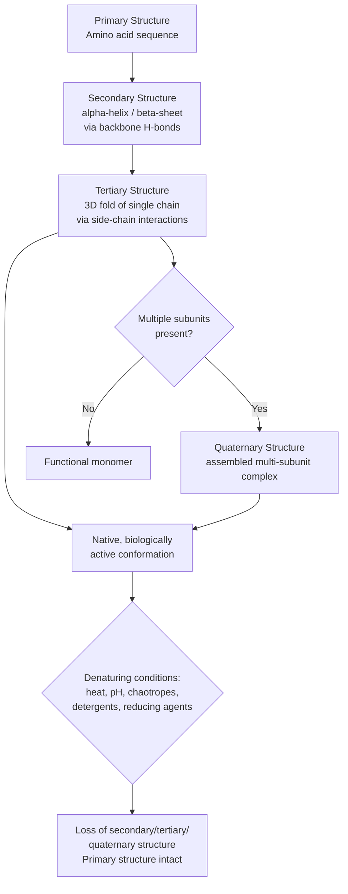

## Amino Acids and Protein Structure

### Overview

Amino acids are the monomeric building blocks of proteins, linked through amide (peptide) bonds into polymers whose three-dimensional folding produces the vast structural and functional diversity of biological macromolecules. Protein structure is conventionally analyzed at four hierarchical levels — primary, secondary, tertiary, and quaternary — each governed by distinct chemical interactions.

### Amino Acid Structure

**General Structure**

With the exception of proline, all 20 standard (proteinogenic) amino acids share a common core: a central **α-carbon** bonded to an amino group ($-\text{NH}_2$), a carboxyl group ($-\text{COOH}$), a hydrogen atom, and a variable **side chain (R group)** that determines the amino acid's chemical identity and properties.

$$\text{H}_2\text{N}-\overset{\displaystyle R}{\underset{\displaystyle H}{\text{C}}}-\text{COOH}$$

**Chirality**

The α-carbon is a stereocenter (except in glycine, where $R = \text{H}$, making the carbon non-chiral), giving rise to D- and L-enantiomers. Proteinogenic amino acids are almost universally the **L-configuration** (corresponding to S-configuration for most amino acids under CIP rules, with cysteine being a notable exception due to sulfur's priority ranking).

**Ionization State (Zwitterion)**

At physiological pH, both the amino and carboxyl groups are ionized simultaneously, forming a **zwitterion** — a dipolar ion with a net charge of zero (for amino acids with non-ionizable side chains) yet bearing both a positive and negative site:

$$\text{H}_3\text{N}^+-\text{CHR}-\text{COO}^-$$

The **isoelectric point (pI)** is the pH at which the amino acid carries zero net charge; for simple amino acids this is:

$$\text{pI} = \frac{\text{p}K_{a1} + \text{p}K_{a2}}{2}$$

(averaging the two flanking $\text{p}K_a$ values around the neutral/zwitterionic species; for amino acids with an ionizable side chain, the pI is calculated from the two $\text{p}K_a$ values flanking the zero-charge species rather than simply the first two).

### Classification by Side Chain

**Nonpolar/Hydrophobic** — Glycine, Alanine, Valine, Leucine, Isoleucine, Methionine, Proline, Phenylalanine, Tryptophan

- Aliphatic or aromatic side chains that avoid water, driving hydrophobic collapse in protein folding
- **Proline** is unique: its side chain cyclizes back onto the backbone nitrogen, forming a secondary amine (imino acid) that introduces a fixed, constrained backbone dihedral angle and disrupts regular secondary structure (α-helices, β-sheets)
- **Glycine** has the smallest possible side chain (H), granting exceptional backbone conformational flexibility, often found in tight turns

**Polar Uncharged** — Serine, Threonine, Cysteine, Asparagine, Glutamine, Tyrosine

- Contain hydroxyl, amide, or thiol groups capable of hydrogen bonding but not ionized at physiological pH
- **Cysteine's** thiol ($-\text{SH}$) can form a covalent **disulfide bond** ($-\text{S-S}-$) with another cysteine residue upon oxidation, a key tertiary/quaternary structure-stabilizing crosslink, especially in extracellular and secreted proteins

**Acidic (Negatively Charged at pH 7)** — Aspartate, Glutamate

- Carboxylic acid side chains, fully ionized ($-\text{COO}^-$) at physiological pH

**Basic (Positively Charged at pH 7)** — Lysine, Arginine, Histidine

- Amine/guanidinium/imidazole side chains; Lysine and Arginine are essentially fully protonated at pH 7, while **Histidine's** imidazole side chain has $\text{p}K_a \approx 6.0$, making it the only standard amino acid with a side chain $\text{p}K_a$ near physiological pH — this property is exploited extensively in enzyme catalysis (general acid-base catalysis) and pH-sensing

**Essential vs. Non-essential**

Essential amino acids cannot be synthesized by humans and must be obtained from the diet (Histidine, Isoleucine, Leucine, Lysine, Methionine, Phenylalanine, Threonine, Tryptophan, Valine); non-essential amino acids can be synthesized endogenously from metabolic intermediates.

### Peptide Bond Formation

Amino acids are linked via a **condensation (dehydration) reaction** between the carboxyl group of one residue and the amino group of the next, releasing water and forming an amide bond:

$$\text{R}_1\text{-COOH} + \text{H}_2\text{N-R}_2 \rightarrow \text{R}_1\text{-CO-NH-R}_2 + \text{H}_2\text{O}$$

**Peptide Bond Planarity**

The peptide (amide) bond exhibits significant **partial double-bond character** due to resonance delocalization of the nitrogen lone pair into the carbonyl $\pi$ system, restricting rotation about the C-N bond and locking the six atoms of the peptide unit ($C_\alpha$, C, O, N, H, $C_\alpha$) into a rigid, planar arrangement. This planarity is almost always found in the **trans** configuration (lower steric clash between adjacent side chains) rather than cis, with proline being a notable exception where cis/trans isomerization occurs more readily due to its cyclic secondary amine structure.

---

## Levels of Protein Structure

### Primary Structure

The linear sequence of amino acid residues in the polypeptide chain, connected by peptide bonds, read conventionally from the free **N-terminus** to the free **C-terminus**. Primary structure is entirely determined by the genetic sequence (via the genetic code and translation) and dictates all higher-order structure — this is the foundational premise of Anfinsen's thermodynamic hypothesis, that a protein's native fold is determined by its amino acid sequence.

### Secondary Structure

Local, regular, repeating folding patterns of the polypeptide backbone stabilized by **hydrogen bonds** between backbone amide N-H and carbonyl C=O groups (side chains are not directly involved in secondary structure hydrogen bonding).

**α-Helix**

A right-handed coiled structure with 3.6 residues per turn, stabilized by hydrogen bonds between the C=O of residue $n$ and the N-H of residue $n+4$, running parallel to the helix axis. Side chains project outward from the helix.

**β-Sheet**

Formed by two or more extended polypeptide strands (β-strands) held together by inter-strand hydrogen bonds, arranged either:

- **Parallel** — strands run in the same N-to-C direction, producing slightly weaker, non-linear (angled) hydrogen bonds
- **Antiparallel** — strands run in opposite directions, producing stronger, linear hydrogen bonds and typically a more stable arrangement

**Torsion Angles and the Ramachandran Plot**

Backbone conformation at each residue is described by two dihedral (torsion) angles: **phi** ($\phi$, rotation about the N-$C_\alpha$ bond) and **psi** ($\psi$, rotation about the $C_\alpha$-C bond). The **Ramachandran plot** ($\phi$ vs. $\psi$) maps sterically allowed combinations, revealing distinct clusters corresponding to α-helix, β-sheet, and left-handed helix regions, with the vast majority of conformational space sterically forbidden due to steric clash between backbone and side-chain atoms.

**Other Secondary Structures**

- **β-turns (reverse turns)** — tight, four-residue turns that reverse chain direction, frequently stabilized by a hydrogen bond between residue $i$ and $i+3$; often feature Glycine or Proline due to their conformational properties
- **Random coil** — regions lacking regular, repeating structure (not truly "random" — often well-defined but non-repetitive)

### Tertiary Structure

The overall three-dimensional arrangement of a single polypeptide chain, describing how secondary structure elements (helices, sheets, turns, loops) pack together in space. Stabilized by interactions among side chains distributed throughout the sequence (not necessarily close in primary sequence):

- **Hydrophobic effect** — burial of nonpolar side chains in the protein interior away from water, widely regarded as the dominant thermodynamic driving force for protein folding
- **Hydrogen bonds** — between polar side chains, and between side chains and backbone
- **Ionic (electrostatic) interactions/salt bridges** — between oppositely charged side chains (e.g., Lys⁺/Glu⁻)
- **Van der Waals forces** — weak, short-range interactions contributing to tight packing of the folded core
- **Disulfide bonds** — covalent S-S crosslinks between cysteine residues, providing additional stabilization, particularly important in extracellular/secreted proteins

**Domains and Motifs**

Larger proteins often organize into **domains** — compact, semi-independently folding structural/functional units — and recurring **motifs** (supersecondary structures) such as the helix-turn-helix, β-hairpin, and β-α-β motifs that recur across unrelated proteins.

### Quaternary Structure

The arrangement of multiple, independently folded polypeptide chains (**subunits**) into a single functional multi-subunit complex, stabilized by the same non-covalent forces (and occasionally interchain disulfide bonds) that stabilize tertiary structure, but now operating *between* separate chains. Not all proteins possess quaternary structure (many function as single-chain monomers); those that do range from simple homodimers to large multi-subunit assemblies.

**Example**

Hemoglobin is a classic quaternary-structure example: a tetramer of two α-globin and two β-globin subunits (α₂β₂), each individually folded (tertiary structure) and each binding one heme cofactor. Oxygen binding at one subunit induces a conformational shift transmitted through the subunit interfaces to the other three subunits (the T-to-R allosteric transition), producing cooperative, sigmoidal oxygen-binding behavior essential to efficient O₂ transport — a phenomenon impossible in a monomeric myoglobin-like protein.

---

## Protein Folding and Denaturation

### Folding

Anfinsen's experiments on ribonuclease A demonstrated that a denatured, reduced protein can spontaneously refold to its native, active conformation in vitro, establishing that the native structure represents (in many cases) the thermodynamic free-energy minimum accessible under physiological conditions, encoded entirely by the primary sequence. In cells, many proteins additionally rely on **molecular chaperones** (e.g., the Hsp70 and chaperonin/GroEL-GroES families) to assist correct folding kinetics and prevent aggregation, particularly for larger or more complex proteins, though the thermodynamic endpoint is still specified by sequence.

### Denaturation

Loss of native secondary, tertiary, and quaternary structure (primary structure/peptide bonds remain intact) upon exposure to:

- **Heat** — disrupts hydrogen bonds and hydrophobic interactions
- **pH extremes** — alters ionization state of side chains, disrupting ionic interactions and hydrogen bonding
- **Chaotropic agents** (urea, guanidinium chloride) — disrupt the hydrophobic effect by altering water structure/solvation
- **Detergents** (e.g., SDS) — disrupt hydrophobic interactions by coating hydrophobic surfaces
- **Reducing agents** (DTT, β-mercaptoethanol) — cleave disulfide bonds

Denaturation typically causes loss of biological activity (function depends on precise 3D structure) and often reduced solubility (exposure of previously buried hydrophobic residues promotes aggregation).

---

## Comparative Summary

| Structural Level | Defining Feature | Principal Stabilizing Forces |
| --- | --- | --- |
| Primary | Amino acid sequence | Covalent peptide bonds |
| Secondary | Local regular backbone folds (α-helix, β-sheet) | Backbone H-bonds |
| Tertiary | 3D fold of a single chain | Hydrophobic effect, H-bonds, ionic interactions, van der Waals, disulfides |
| Quaternary | Assembly of multiple subunits | Same non-covalent forces, interchain, occasional disulfides |

| Amino Acid Class | Representative Members | Physiological Charge (pH 7) |
| --- | --- | --- |
| Nonpolar/hydrophobic | Ala, Val, Leu, Ile, Phe, Trp, Met, Pro, Gly | Neutral |
| Polar uncharged | Ser, Thr, Cys, Asn, Gln, Tyr | Neutral |
| Acidic | Asp, Glu | Negative |
| Basic | Lys, Arg, His | Positive (His partial) |

### Process Flow: Protein Structure Hierarchy (svg_diagram)

### Structural Diagram: Alpha-Helix Hydrogen Bonding Pattern (svg_diagram)

<svg xmlns="http://www.w3.org/2000/svg" viewBox="0 0 640 340" font-family="Helvetica, Arial, sans-serif">
<text x="320" y="24" text-anchor="middle" font-size="16" font-weight="bold">alpha-Helix Backbone H-Bonding, n to n+4 (svg_diagram)</text>

<polyline points="100,280 160,240 220,270 280,220 340,250 400,200 460,230 520,180" fill="none" stroke="#555" stroke-width="2.5" />

<circle cx="100" cy="280" r="10" fill="#2c6e8f" />
<text x="100" y="310" text-anchor="middle" font-size="11">Res n</text>
<circle cx="160" cy="240" r="10" fill="#2c6e8f" />
<text x="160" y="215" text-anchor="middle" font-size="11">n+1</text>
<circle cx="220" cy="270" r="10" fill="#2c6e8f" />
<text x="220" y="300" text-anchor="middle" font-size="11">n+2</text>
<circle cx="280" cy="220" r="10" fill="#2c6e8f" />
<text x="280" y="195" text-anchor="middle" font-size="11">n+3</text>
<circle cx="340" cy="250" r="10" fill="#c0392b" />
<text x="340" y="280" text-anchor="middle" font-size="11" font-weight="bold">n+4</text>
<circle cx="400" cy="200" r="10" fill="#2c6e8f" />
<text x="400" y="175" text-anchor="middle" font-size="11">n+5</text>
<circle cx="460" cy="230" r="10" fill="#2c6e8f" />
<text x="460" y="260" text-anchor="middle" font-size="11">n+6</text>
<circle cx="520" cy="180" r="10" fill="#2c6e8f" />
<text x="520" y="155" text-anchor="middle" font-size="11">n+7</text>

<line x1="100" y1="280" x2="340" y2="250" stroke="#b5651d" stroke-width="1.5" stroke-dasharray="5,4" />
<text x="220" y="245" text-anchor="middle" font-size="10" fill="#b5651d">C=O(n)···H-N(n+4)</text>
<line x1="160" y1="240" x2="400" y2="200" stroke="#b5651d" stroke-width="1.5" stroke-dasharray="5,4" />

<text x="320" y="330" text-anchor="middle" font-size="11" fill="#333">Each C=O hydrogen bonds to the N-H four residues ahead, stabilizing the coil</text>

</svg>

---

**Key Points**

- All 20 standard amino acids share a common α-carbon backbone with a variable R-group side chain; classification by side chain (nonpolar, polar uncharged, acidic, basic) governs solubility, reactivity, and structural role
- Amino acids exist as zwitterions at physiological pH; the isoelectric point (pI) is the pH of zero net charge
- Peptide bonds are planar and predominantly trans due to partial double-bond character from amide resonance
- Secondary structure (α-helix, β-sheet) arises from backbone hydrogen bonding alone; tertiary structure involves side-chain interactions throughout the sequence, with the hydrophobic effect as the dominant folding driver
- Quaternary structure describes multi-subunit assembly and enables phenomena like cooperative allosteric binding (hemoglobin)
- Denaturation disrupts secondary/tertiary/quaternary structure while leaving the primary sequence (peptide bonds) intact
- Anfinsen's thermodynamic hypothesis establishes that primary sequence encodes the native fold, though cellular folding often requires chaperone assistance

**Next Steps**

- Protein purification and separation techniques (SDS-PAGE, ion-exchange, size-exclusion, affinity chromatography)
- Enzyme kinetics and catalytic mechanism (Michaelis-Menten kinetics, active site chemistry)
- Protein structure determination methods (X-ray crystallography, NMR, cryo-EM)
- Post-translational modifications (phosphorylation, glycosylation, ubiquitination)
- Protein-ligand and protein-protein interaction thermodynamics
- Nucleic acid structure (DNA/RNA) as a parallel macromolecular system
- Carbohydrate structure and glycobiology
- Lipid structure and membrane biochemistry