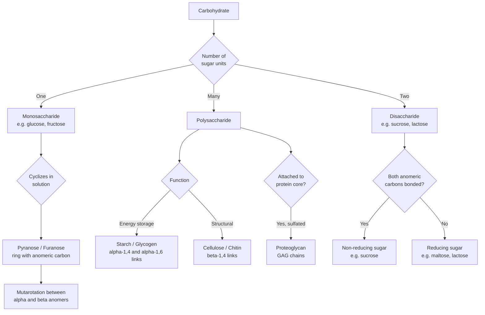

## Carbohydrate Structure and Function

### Overview

Carbohydrates are polyhydroxy aldehydes, ketones, and their derivatives/polymers, serving biologically as energy sources, structural materials, and molecular recognition elements. They range from simple monosaccharides through disaccharides and oligosaccharides to complex polysaccharides, with structural diversity arising from stereochemistry, ring size, glycosidic linkage position/anomeric configuration, and branching pattern.

### Classification and Nomenclature

**General Formula and Classes**

Carbohydrates broadly follow the empirical formula $(\text{CH}_2\text{O})_n$, though many biologically important derivatives (amino sugars, deoxy sugars, sugar acids) deviate from this. Classified by:

- **Size** — monosaccharides (single sugar unit), disaccharides (two units), oligosaccharides (3-10 units), polysaccharides (many units)
- **Functional group** — aldoses (containing an aldehyde, $-\text{CHO}$) vs. ketoses (containing a ketone, $\text{C=O}$)
- **Carbon count** — trioses (3C), tetroses (4C), pentoses (5C), hexoses (6C), etc.

Combining these: glucose is an **aldohexose**; fructose is a **ketohexose**; ribose is an **aldopentose**.

---

## Monosaccharide Stereochemistry

### Chiral Centers and D/L Nomenclature

Monosaccharides contain multiple stereocenters, generating numerous stereoisomers. By convention, D/L designation is assigned based on the configuration of the stereocenter **farthest from the carbonyl carbon** (for hexoses, C-5): if the hydroxyl group points to the right in the Fischer projection (matching D-glyceraldehyde), the sugar is D; if left, L. The vast majority of biologically relevant sugars are in the **D-configuration**.

### Epimers and Diastereomers

Stereoisomers that differ in configuration at only **one** stereocenter are termed **epimers** (e.g., glucose and galactose are C-4 epimers; glucose and mannose are C-2 epimers). Epimers are a specific subset of diastereomers (stereoisomers that are not mirror images), distinct from enantiomers (complete mirror images at every stereocenter).

### Cyclic Structure Formation (Haworth Projections)

In aqueous solution, aldoses and ketoses of 5 or more carbons exist predominantly in **cyclic hemiacetal (or hemiketal)** form rather than the open-chain form, formed by intramolecular attack of a hydroxyl group on the carbonyl carbon:

- **Furanose** — 5-membered ring (e.g., ribofuranose)
- **Pyranose** — 6-membered ring (e.g., glucopyranose), the thermodynamically dominant form for hexoses

This cyclization generates a **new stereocenter at the former carbonyl carbon**, called the **anomeric carbon**, giving rise to two additional stereoisomers, the **α- and β-anomers**, distinguished by the orientation of the anomeric hydroxyl relative to the reference stereocenter (in D-sugars, α has the anomeric OH trans to the C-5 CH₂OH-bearing carbon reference in Haworth projection convention — commonly stated as: α-OH points "down," β-OH points "up," for D-sugars drawn in standard Haworth orientation).

### Mutarotation

In solution, the α- and β-anomeric forms interconvert continuously via the open-chain aldehyde/ketone intermediate, eventually reaching a thermodynamic equilibrium ratio — a phenomenon observable as a time-dependent change in optical rotation when a pure anomer is dissolved, termed **mutarotation**. For D-glucose in water, the equilibrium mixture is approximately 36% α-anomer and 64% β-anomer (with the β form favored due to its all-equatorial substituent arrangement in the chair conformation, minimizing steric strain), plus a negligible trace of open-chain form.

### Chair Conformation

Pyranose rings adopt a **chair conformation** (most stable) analogous to cyclohexane, with substituents occupying axial or equatorial positions. β-D-glucopyranose is notable for having **all** bulky substituents (OH groups and the CH₂OH) in equatorial positions, minimizing steric (1,3-diaxial) strain — a structural feature frequently cited as contributing to glucose's prevalence as the primary biological fuel monosaccharide.

**Example**

D-glucose (open-chain: CHO-CHOH-CHOH-CHOH-CHOH-CH₂OH with defined stereochemistry at C2-C5) cyclizes via nucleophilic attack of the C-5 hydroxyl on the C-1 aldehyde carbon, forming a six-membered pyranose ring. The resulting hemiacetal carbon (C-1) becomes the new anomeric center: β-D-glucopyranose has the C-1 OH equatorial (same side as the C-6 CH₂OH reference), while α-D-glucopyranose has it axial.

---

## Glycosidic Bonds and Oligosaccharides

### Glycosidic Bond Formation

The anomeric hydroxyl of one sugar reacts with a hydroxyl (or other nucleophile) of a second sugar in a condensation reaction, releasing water and forming a **glycosidic bond** — an acetal linkage that, unlike the hemiacetal form, is configurationally locked (no further mutarotation at that anomeric center once the bond is formed).

$$\text{Sugar}_1\text{-OH} + \text{HO-Sugar}_2 \rightarrow \text{Sugar}_1\text{-O-Sugar}_2 + \text{H}_2\text{O}$$

Glycosidic bonds are named by specifying the anomeric configuration and the connected carbon numbers, e.g., **α(1→4)** or **β(1→4)**.

### Reducing vs. Non-Reducing Sugars

A sugar is a **reducing sugar** if it retains a free (non-glycosidically-bonded) anomeric carbon capable of reverting to the open-chain aldehyde form and undergoing oxidation (classically detected by Fehling's or Tollens' reagent reduction). If both anomeric carbons in a disaccharide are involved in the glycosidic linkage (as in sucrose), the sugar is **non-reducing**.

### Common Disaccharides

| Disaccharide | Composition | Linkage | Reducing? |
| --- | --- | --- | --- |
| Maltose | Glucose + Glucose | α(1→4) | Yes |
| Cellobiose | Glucose + Glucose | β(1→4) | Yes |
| Lactose | Galactose + Glucose | β(1→4) | Yes |
| Sucrose | Glucose + Fructose | α(1→2)β (both anomeric carbons linked) | No |

**[Note]** Maltose and cellobiose are both glucose-glucose disaccharides differing only in anomeric linkage configuration (α vs. β), yet this single stereochemical difference profoundly affects digestibility (human amylases hydrolyze α-linkages; cellobiose/cellulose's β-linkages are not digestible by human enzymes) and three-dimensional shape (α-linkages permit helical coiling, β-linkages favor extended, linear chains).

---

## Polysaccharides

### Storage Polysaccharides

**Starch** (plant energy storage), composed of two glucose polymers:

- **Amylose** — unbranched, α(1→4)-linked glucose chain, forming a left-handed helical coil
- **Amylopectin** — α(1→4)-linked backbone with α(1→6) branch points approximately every 24-30 residues, producing a highly branched structure

**Glycogen** (animal energy storage) — structurally analogous to amylopectin but with more frequent α(1→6) branching (approximately every 8-12 residues), producing a more compact, highly branched structure that provides many terminal ends for rapid, simultaneous enzymatic glucose release (by glycogen phosphorylase) during high metabolic demand.

### Structural Polysaccharides

**Cellulose** — unbranched, **β(1→4)**-linked glucose chains. The β-linkage forces each successive glucose unit to rotate 180° relative to its neighbor, producing a fully extended, straight-chain conformation (rather than a helix). Adjacent cellulose chains pack in parallel via extensive inter-chain hydrogen bonding, forming rigid microfibrils of exceptional tensile strength — the principal structural component of plant cell walls. Humans lack β(1→4)-glycosidase (cellulase) enzymes and cannot digest cellulose (dietary fiber), whereas ruminants and termites host symbiotic microorganisms that provide this enzymatic capability.

**Chitin** — a structural polysaccharide of **N-acetylglucosamine** units linked β(1→4), forming the principal structural component of fungal cell walls and arthropod exoskeletons; structurally analogous to cellulose but bearing an acetamido group in place of one hydroxyl on each residue.

### Glycosaminoglycans (GAGs) and Proteoglycans

Long, unbranched polysaccharide chains built from repeating disaccharide units, typically containing an amino sugar and a uronic acid, and heavily sulfated (contributing high negative charge density and strong water retention, important for tissue hydration/cushioning):

- **Hyaluronic acid** — glucuronic acid + N-acetylglucosamine, unsulfated, found in synovial fluid and connective tissue
- **Chondroitin sulfate**, **heparin/heparan sulfate**, **keratan sulfate** — additional GAG classes, each with characteristic sulfation patterns and tissue distributions

GAGs are typically covalently attached to a core protein to form **proteoglycans**, major components of extracellular matrix.

---

## Glycoconjugates and Molecular Recognition

### Glycoproteins and Glycolipids

Carbohydrates are frequently covalently attached to proteins (**glycoproteins**, via N-linked attachment to asparagine or O-linked attachment to serine/threonine) or to lipids (**glycolipids**, particularly in cell membranes), forming branched oligosaccharide structures on the outer cell surface.

### Biological Recognition Role

Cell-surface carbohydrate structures serve as highly specific molecular recognition tags, mediating:

- **Cell-cell recognition and adhesion** (e.g., selectin-mediated leukocyte rolling during inflammation)
- **Blood group antigen determination** (ABO blood groups differ by terminal sugar residues on a common glycolipid/glycoprotein core)
- **Pathogen recognition** — many viral/bacterial adhesins and toxins bind specific host cell-surface glycan structures as the first step of infection
- **Protein folding quality control and trafficking** — N-linked glycosylation in the endoplasmic reticulum participates in the calnexin/calreticulin folding-checkpoint system

---

## Comparative Summary

| Polysaccharide | Monomer | Linkage | Branching | Primary Role |
| --- | --- | --- | --- | --- |
| Amylose | Glucose | α(1→4) | None | Plant energy storage |
| Amylopectin | Glucose | α(1→4), α(1→6) branches | Moderate (~24-30 residues) | Plant energy storage |
| Glycogen | Glucose | α(1→4), α(1→6) branches | High (~8-12 residues) | Animal energy storage |
| Cellulose | Glucose | β(1→4) | None | Plant structural (cell wall) |
| Chitin | N-acetylglucosamine | β(1→4) | None | Fungal/arthropod structural |

### Process Flow: Carbohydrate Classification and Fate (svg_diagram)

### Structural Diagram: Alpha vs Beta Glycosidic Linkage Geometry (svg_diagram)

<svg xmlns="http://www.w3.org/2000/svg" viewBox="0 0 640 320" font-family="Helvetica, Arial, sans-serif">
<text x="320" y="24" text-anchor="middle" font-size="16" font-weight="bold">alpha(1-4) vs beta(1-4) Linkage Geometry (svg_diagram)</text>

<text x="160" y="60" text-anchor="middle" font-size="13" font-weight="bold" fill="`#2c6e8f`">alpha(1-4) — Amylose (helical)</text>

<path d="M60 100 Q100 140 60 180 Q20 220 60 260" fill="none" stroke="`#2c6e8f`" stroke-width="3" />

<circle cx="60" cy="100" r="9" fill="`#2c6e8f`" />

<circle cx="60" cy="180" r="9" fill="`#2c6e8f`" />

<circle cx="60" cy="260" r="9" fill="`#2c6e8f`" />

<path d="M180 100 Q220 140 180 180 Q140 220 180 260" fill="none" stroke="`#2c6e8f`" stroke-width="3" />

<circle cx="180" cy="100" r="9" fill="`#2c6e8f`" />

<circle cx="180" cy="180" r="9" fill="`#2c6e8f`" />

<circle cx="180" cy="260" r="9" fill="`#2c6e8f`" />

<text x="160" y="295" text-anchor="middle" font-size="11">Coiled helix — compact</text>

<text x="470" y="60" text-anchor="middle" font-size="13" font-weight="bold" fill="`#c0392b`">beta(1-4) — Cellulose (extended)</text>

<line x1="360" y1="150" x2="420" y2="170" stroke="`#c0392b`" stroke-width="3" />

<line x1="420" y1="170" x2="480" y2="150" stroke="`#c0392b`" stroke-width="3" />

<line x1="480" y1="150" x2="540" y2="170" stroke="`#c0392b`" stroke-width="3" />

<line x1="540" y1="170" x2="600" y2="150" stroke="`#c0392b`" stroke-width="3" />

<circle cx="360" cy="150" r="9" fill="`#c0392b`" />

<circle cx="420" cy="170" r="9" fill="`#c0392b`" />

<circle cx="480" cy="150" r="9" fill="`#c0392b`" />

<circle cx="540" cy="170" r="9" fill="`#c0392b`" />

<circle cx="600" cy="150" r="9" fill="`#c0392b`" />

<text x="480" y="200" text-anchor="middle" font-size="11">Alternating 180-degree rotation — straight, rigid</text>

<line x1="360" y1="150" x2="360" y2="220" stroke="#888" stroke-width="1" stroke-dasharray="3,3" />
<line x1="480" y1="150" x2="480" y2="220" stroke="#888" stroke-width="1" stroke-dasharray="3,3" />
<line x1="600" y1="150" x2="600" y2="220" stroke="#888" stroke-width="1" stroke-dasharray="3,3" />
<text x="480" y="240" text-anchor="middle" font-size="10" fill="#666">Interchain H-bonding -&gt; microfibril packing</text>
</svg>

---

**Key Points**

- Monosaccharides are classified by carbonyl type (aldose/ketose) and carbon number; D-sugars dominate biologically, assigned by the stereocenter farthest from the carbonyl
- Cyclization creates a new anomeric stereocenter (α/β), and mutarotation interconverts these forms in solution via the open-chain intermediate
- Glycosidic bond configuration (α vs. β) and linkage position (e.g., 1→4 vs. 1→6) determine dramatically different macromolecular shapes and digestibility, despite identical monomer composition (glucose in starch, glycogen, and cellulose)
- Reducing sugars retain a free anomeric carbon; non-reducing sugars (e.g., sucrose) have both anomeric carbons engaged in glycosidic bonds
- Branching frequency distinguishes glycogen (highly branched, rapid mobilization) from amylopectin (moderately branched) and amylose (unbranched)
- Cell-surface glycoconjugates (glycoproteins, glycolipids) mediate molecular recognition processes including cell adhesion, blood typing, and pathogen binding

**Next Steps**

- Carbohydrate metabolism: glycolysis, gluconeogenesis, and the pentose phosphate pathway
- Glycogen synthesis and breakdown regulation (glycogen synthase, phosphorylase, hormonal control)
- N-linked and O-linked glycosylation biosynthetic pathways
- Lectins and carbohydrate-binding protein recognition specificity
- Nucleic acid structure (ribose/deoxyribose as the carbohydrate backbone component)
- Analytical methods for carbohydrate characterization (HPAEC-PAD, mass spectrometry glycan profiling, NMR)
- Extracellular matrix biochemistry and proteoglycan function