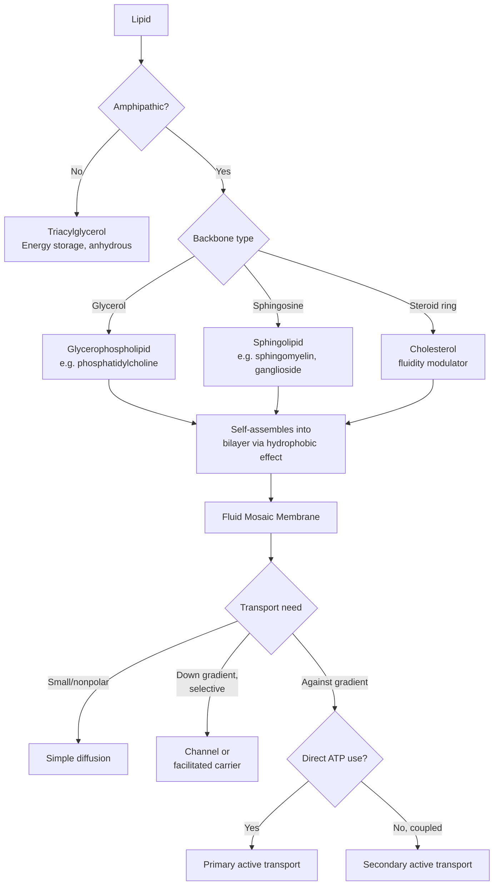

## Lipids and Biological Membranes

### Overview

Lipids are a chemically diverse class of biomolecules unified not by a common structural motif (unlike carbohydrates or proteins) but by their **hydrophobicity** — poor solubility in water and high solubility in nonpolar/organic solvents. This property underlies their principal biological roles: energy storage, membrane structure, and signaling. Biological membranes, built primarily from amphipathic lipids organized into bilayers, define cellular and organellar compartmentalization.

### Classification of Lipids

**Fatty Acids**

Long-chain carboxylic acids, typically 12-24 carbons, forming the building blocks of most complex lipids:

- **Saturated** — no C=C double bonds; fully extended, flexible chain conformation; higher melting point due to efficient packing
- **Unsaturated** — one (monounsaturated) or more (polyunsaturated) C=C double bonds; naturally occurring double bonds are predominantly **cis**, introducing a rigid ~30° kink in the chain that disrupts tight packing and lowers melting point
- Nomenclature: e.g., palmitic acid (16:0), oleic acid (18:1 cis-Δ9), linoleic acid (18:2)

**Triacylglycerols (Triglycerides)**

The principal energy-storage lipids, formed by esterification of three fatty acids to the three hydroxyl groups of **glycerol**:

$$\text{Glycerol} + 3\ \text{Fatty Acid} \rightarrow \text{Triacylglycerol} + 3\ \text{H}_2\text{O}$$

Triacylglycerols are non-polar and non-amphipathic (all three glycerol hydroxyls esterified), stored in anhydrous form (unlike glycogen, which binds substantial water), yielding roughly twice the energy density per gram compared to carbohydrates — a consequence of the fatty acid chains' highly reduced (hydrogen-rich) carbon backbone.

**Phospholipids**

The principal structural lipids of biological membranes, built on a glycerol (glycerophospholipids) or sphingosine (sphingolipids) backbone:

- **Glycerophospholipids** — glycerol esterified with two fatty acids (at sn-1, sn-2 positions) and a phosphate group (at sn-3), the phosphate further esterified to a polar head group (choline, ethanolamine, serine, inositol), giving phosphatidylcholine, phosphatidylethanolamine, phosphatidylserine, phosphatidylinositol, respectively
- **Sphingolipids** — built on the amino alcohol sphingosine rather than glycerol; **sphingomyelin** (a phosphosphingolipid, with a phosphocholine head group) is a major membrane component, particularly abundant in myelin sheaths

All phospholipids are **amphipathic**: a polar/charged head group and two nonpolar fatty acyl tails, the defining structural feature enabling spontaneous bilayer self-assembly.

**Sphingolipids and Glycolipids**

Beyond sphingomyelin, sphingosine-based lipids with a carbohydrate head group (rather than phosphate) are termed **glycosphingolipids**:

- **Cerebrosides** — single sugar head group
- **Gangliosides** — complex oligosaccharide head groups often including sialic acid (N-acetylneuraminic acid), abundant in neuronal plasma membranes and serving as recognition sites (notably, the receptor for cholera toxin)

**Sterols**

Rigid, fused four-ring (steroid) structures. **Cholesterol**, the principal animal sterol, has a small polar hydroxyl head group and a rigid, planar ring system with a short hydrocarbon tail — amphipathic enough to intercalate within membrane bilayers. Cholesterol is also the biosynthetic precursor of steroid hormones (cortisol, testosterone, estradiol), bile acids, and vitamin D.

**Eicosanoids**

Signaling lipids derived from the 20-carbon polyunsaturated fatty acid **arachidonic acid**, including prostaglandins, thromboxanes, and leukotrienes — potent local mediators of inflammation, pain, blood clotting, and smooth muscle contraction, synthesized via the cyclooxygenase (COX) and lipoxygenase pathways.

**[Unverified]** The precise physiological potency and receptor-binding characteristics of individual eicosanoid subtypes vary by tissue and species context and are an active area of ongoing pharmacological research.

---

## Membrane Structure: The Fluid Mosaic Model

### Bilayer Self-Assembly

Amphipathic phospholipids, when dispersed in water, spontaneously self-assemble into a **bilayer**: two leaflets with polar head groups facing the aqueous environment (both the extracellular/luminal side and cytoplasmic side) and nonpolar fatty acyl tails buried in the hydrophobic core, shielded from water. This organization is thermodynamically driven predominantly by the **hydrophobic effect** — minimizing the entropically unfavorable ordering of water molecules around exposed nonpolar surfaces — rather than by strong direct attractive forces between the lipid tails themselves.

### The Fluid Mosaic Model

Formulated by Singer and Nicolson (1972), this remains the foundational conceptual model of membrane organization: the lipid bilayer behaves as a two-dimensional fluid, within which proteins and other components are embedded and free to diffuse laterally (unless constrained by cytoskeletal anchoring, protein-protein interactions, or membrane microdomains).

**Membrane Fluidity Determinants**

- **Fatty acid saturation** — unsaturated (cis-kinked) tails pack less efficiently, increasing fluidity; saturated tails pack tightly, decreasing fluidity
- **Fatty acid chain length** — longer chains increase van der Waals contact area between adjacent tails, decreasing fluidity
- **Cholesterol content** — has a dual, temperature-dependent buffering effect: at physiological temperatures (above the phase transition temperature), cholesterol's rigid ring system restricts phospholipid tail motion, *decreasing* fluidity; below the transition temperature, cholesterol disrupts the tight ordered packing of the gel phase, *preventing* full solidification and thus *increasing* fluidity relative to a cholesterol-free membrane — net effect is a moderating, fluidity-buffering role across a range of temperatures
- **Temperature** — membranes undergo a **phase transition** from an ordered gel state (below the transition temperature $T_m$) to a disordered liquid-crystalline state (above $T_m$)

### Membrane Protein Categories

- **Integral (intrinsic) membrane proteins** — span or embed within the hydrophobic bilayer core, typically via one or more α-helical transmembrane domains (hydrophobic amino acid stretches ~20 residues long) or, less commonly, β-barrel structures (characteristic of bacterial outer membrane porins); removal requires disrupting the bilayer (detergents)
- **Peripheral (extrinsic) membrane proteins** — associated with the membrane surface via electrostatic/hydrogen-bond interactions with head groups or with integral proteins, without penetrating the hydrophobic core; removable by milder treatments (high salt, pH change) that don't disrupt the bilayer itself
- **Lipid-anchored proteins** — covalently attached to a lipid moiety (e.g., GPI-anchor, prenylation, myristoylation/palmitoylation) that inserts into one leaflet, tethering an otherwise soluble protein domain to the membrane surface

### Membrane Asymmetry

The two bilayer leaflets typically differ in lipid and protein composition (**transbilayer asymmetry**), actively maintained by ATP-dependent lipid transporters:

- **Flippases** — move specific phospholipids from the outer to inner leaflet
- **Floppases** — move lipids from inner to outer leaflet
- **Scramblases** — bidirectionally randomize lipid distribution, notably activated during apoptosis, where phosphatidylserine exposure on the outer leaflet (normally sequestered in the inner leaflet) serves as an "eat-me" signal for phagocytic clearance

### Lipid Rafts

Specialized membrane microdomains enriched in cholesterol, sphingolipids, and specific proteins, proposed to exist in a more ordered ("liquid-ordered") state than the surrounding bulk bilayer, implicated in signal transduction platform formation and protein sorting.

**[Speculation]** The precise physical nature, size, and functional significance of lipid rafts in living cell membranes remains an area of active investigation and some scientific debate, distinct from their better-characterized behavior in simplified model membrane systems.

---

## Membrane Transport

### Passive Diffusion

Small, uncharged, hydrophobic or very small polar molecules (O₂, CO₂, small alcohols, and to a limited extent water) can cross the bilayer directly by simple diffusion down their concentration gradient, without protein assistance, at a rate dependent on molecular size and lipid solubility (partition coefficient).

### Facilitated Transport

Most biologically relevant solutes (ions, glucose, amino acids, larger/charged molecules) cannot cross the hydrophobic core efficiently and require membrane transport proteins:

- **Channels** — form a continuous aqueous pore, allowing rapid, passive (no direct energy input), often ion-selective flow down an electrochemical gradient (e.g., voltage-gated ion channels, aquaporins for water)
- **Carriers (transporters)** — bind the solute, undergo a conformational change, and release it on the other side; slower than channels but allow selective, sometimes active transport
  - *Uniporters* — transport a single solute down its gradient
  - *Symporters* — couple transport of two solutes in the same direction, one typically moving down its gradient to drive the other against its gradient
  - *Antiporters* — couple transport of two solutes in opposite directions

### Active Transport

Movement against an electrochemical gradient, requiring energy input:

- **Primary active transport** — directly coupled to ATP hydrolysis (e.g., the Na⁺/K⁺-ATPase, which exports 3 Na⁺ and imports 2 K⁺ per ATP hydrolyzed, establishing the resting membrane potential and driving numerous secondary transport processes)
- **Secondary active transport** — uses the electrochemical gradient established by a primary active transporter as the energy source (e.g., Na⁺-glucose symporter, using the Na⁺ gradient generated by Na⁺/K⁺-ATPase to drive glucose uptake against its own concentration gradient)

**Example**

The Na⁺/K⁺-ATPase maintains a resting intracellular [Na⁺] far below and [K⁺] far above extracellular concentrations, at the direct cost of ATP hydrolysis. This gradient is then exploited without further ATP expenditure by the intestinal Na⁺-glucose cotransporter (SGLT1): as Na⁺ flows back into the cell down its steep electrochemical gradient through the symporter, the energy released is coupled to simultaneous glucose uptake against its own concentration gradient — a textbook illustration of how primary active transport indirectly powers secondary active transport.

---

## Comparative Summary

| Lipid Class | Backbone | Key Structural Feature | Primary Role |
| --- | --- | --- | --- |
| Triacylglycerol | Glycerol | Fully esterified, non-amphipathic | Energy storage |
| Glycerophospholipid | Glycerol | 2 fatty acids + phosphate head group | Membrane structure |
| Sphingolipid | Sphingosine | Amide-linked fatty acid + phosphate/sugar head | Membrane structure, signaling, myelin |
| Sterol (cholesterol) | Fused 4-ring steroid | Small polar head, rigid ring tail | Membrane fluidity modulation, hormone precursor |
| Eicosanoid | Arachidonic acid derivative | Short-range signaling molecule | Inflammation, pain, clotting mediation |

| Transport Mode | Energy Requirement | Selectivity | Example |
| --- | --- | --- | --- |
| Simple diffusion | None | Low (size/polarity dependent) | O₂, CO₂ |
| Channel-facilitated | None (passive, down gradient) | High (often ion-specific) | K⁺ channels, aquaporins |
| Carrier-facilitated (uniport) | None (passive, down gradient) | High | GLUT glucose transporters |
| Primary active | ATP hydrolysis | High | Na⁺/K⁺-ATPase |
| Secondary active | Coupled to existing gradient | High | Na⁺-glucose symporter |

### Process Flow: Lipid Classification and Membrane Role (svg_diagram)

### Structural Diagram: Phospholipid Bilayer Cross-Section (svg_diagram)

<svg xmlns="http://www.w3.org/2000/svg" viewBox="0 0 640 320" font-family="Helvetica, Arial, sans-serif">
<text x="320" y="24" text-anchor="middle" font-size="16" font-weight="bold">Phospholipid Bilayer Cross-Section (svg_diagram)</text>

<g>
<circle cx="100" cy="70" r="14" fill="#2c6e8f" />
<circle cx="160" cy="70" r="14" fill="#2c6e8f" />
<circle cx="220" cy="70" r="14" fill="#2c6e8f" />
<circle cx="280" cy="70" r="14" fill="#2c6e8f" />
<circle cx="340" cy="70" r="14" fill="#2c6e8f" />
<circle cx="400" cy="70" r="14" fill="#2c6e8f" />
<circle cx="460" cy="70" r="14" fill="#2c6e8f" />
<circle cx="520" cy="70" r="14" fill="#2c6e8f" />
</g>
<text x="590" y="75" font-size="11" fill="#2c6e8f">Outer leaflet</text>

<g stroke="#888" stroke-width="2.5">
<line x1="100" y1="84" x2="100" y2="150" />
<line x1="160" y1="84" x2="160" y2="150" />
<line x1="220" y1="84" x2="220" y2="150" />
<line x1="280" y1="84" x2="280" y2="150" />
<line x1="340" y1="84" x2="340" y2="150" />
<line x1="400" y1="84" x2="400" y2="150" />
<line x1="460" y1="84" x2="460" y2="150" />
<line x1="520" y1="84" x2="520" y2="150" />
</g>

<g stroke="#888" stroke-width="2.5">
<line x1="100" y1="166" x2="100" y2="232" />
<line x1="160" y1="166" x2="160" y2="232" />
<line x1="220" y1="166" x2="220" y2="232" />
<line x1="280" y1="166" x2="280" y2="232" />
<line x1="340" y1="166" x2="340" y2="232" />
<line x1="400" y1="166" x2="400" y2="232" />
<line x1="460" y1="166" x2="460" y2="232" />
<line x1="520" y1="166" x2="520" y2="232" />
</g>

<g>
<circle cx="100" cy="246" r="14" fill="#c0392b" />
<circle cx="160" cy="246" r="14" fill="#c0392b" />
<circle cx="220" cy="246" r="14" fill="#c0392b" />
<circle cx="280" cy="246" r="14" fill="#c0392b" />
<circle cx="340" cy="246" r="14" fill="#c0392b" />
<circle cx="400" cy="246" r="14" fill="#c0392b" />
<circle cx="460" cy="246" r="14" fill="#c0392b" />
<circle cx="520" cy="246" r="14" fill="#c0392b" />
</g>
<text x="590" y="250" font-size="11" fill="#c0392b">Inner leaflet</text>

<rect x="250" y="55" width="30" height="205" rx="10" fill="#d9c04c" stroke="#8d7415" stroke-width="2" />
<text x="265" y="290" text-anchor="middle" font-size="11" font-weight="bold">Integral protein</text>

<text x="320" y="165" text-anchor="middle" font-size="11" fill="#666">Hydrophobic core (fatty acyl tails)</text>

</svg>

---

**Key Points**

- Lipids are unified by hydrophobicity rather than shared structure; triacylglycerols (energy storage, non-amphipathic) contrast with phospholipids/sphingolipids (membrane structure, amphipathic)
- Amphipathic phospholipids self-assemble into bilayers driven predominantly by the hydrophobic effect, forming the basis of the fluid mosaic membrane model
- Membrane fluidity is tuned by fatty acid saturation and chain length, and buffered bidirectionally by cholesterol depending on temperature relative to the phase transition
- Membrane proteins are classified as integral, peripheral, or lipid-anchored based on their mode of bilayer association
- Membrane transport spans a spectrum from unassisted simple diffusion through passive facilitated transport (channels, uniporters) to energy-requiring active transport (primary, directly ATP-coupled; secondary, gradient-coupled)
- Membrane asymmetry (maintained by flippases/floppases/scramblases) and specialized microdomains (lipid rafts) add further functional complexity beyond the basic bilayer model

**Next Steps**

- Fatty acid biosynthesis and β-oxidation pathways
- Cholesterol biosynthesis (mevalonate pathway) and lipoprotein transport (LDL/HDL)
- Membrane potential and the electrochemical gradient (Nernst and Goldman equations)
- Signal transduction via membrane receptors (GPCRs, receptor tyrosine kinases) and eicosanoid signaling pathways
- Steroid hormone biosynthesis and receptor mechanisms
- Vesicular trafficking and membrane fusion (SNARE proteins, endocytosis/exocytosis)
- Amino acids and protein structure (as membrane protein context)
- Nucleic acid structure and function