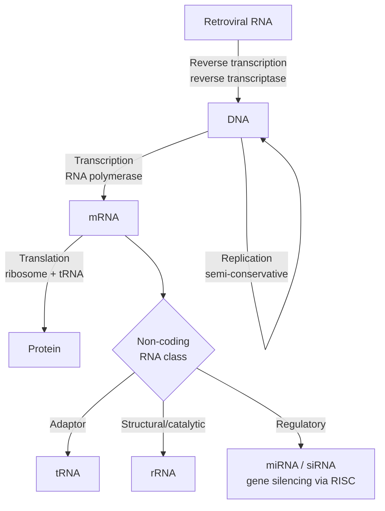

## Nucleic Acids and Genetic Information

### Overview

Nucleic acids (DNA and RNA) are linear polymers of nucleotide monomers that store, transmit, and express genetic information. Their chemical architecture — a repeating sugar-phosphate backbone bearing sequence-encoding nitrogenous bases — enables both stable long-term information storage (DNA) and the diverse structural/catalytic/regulatory roles required to decode that information into functional gene products (RNA and protein).

### Nucleotide Structure

**Components**

Each nucleotide consists of three covalently linked components:

1. A **nitrogenous base** — a purine or pyrimidine
2. A **pentose sugar** — ribose (RNA) or 2-deoxyribose (DNA)
3. One or more **phosphate groups**, esterified to the sugar's 5' hydroxyl

A base + sugar alone (no phosphate) is termed a **nucleoside**; addition of phosphate(s) yields a **nucleotide** (nucleoside mono-, di-, or triphosphate).

**Nitrogenous Bases**

- **Purines** (two fused rings) — Adenine (A), Guanine (G); found in both DNA and RNA
- **Pyrimidines** (single ring) — Cytosine (C) in both DNA and RNA; Thymine (T) unique to DNA; Uracil (U) unique to RNA (U lacks the 5-methyl group present on T)

**Sugar: Ribose vs. Deoxyribose**

RNA's ribose retains a 2'-hydroxyl group; DNA's deoxyribose lacks this oxygen at the 2' position. This single chemical difference has major functional consequences: the 2'-OH renders RNA considerably more susceptible to base-catalyzed hydrolysis (via intramolecular nucleophilic attack of the 2'-OH on the adjacent phosphodiester bond) and less thermodynamically/kinetically stable than DNA, consistent with DNA's role as the long-term genetic archive and RNA's role in more transient, functionally diverse processes.

### Phosphodiester Backbone

Nucleotides are joined by **phosphodiester bonds** linking the 3'-hydroxyl of one sugar to the 5'-phosphate of the next, creating a repeating sugar-phosphate backbone with inherent directionality — every nucleic acid strand has a distinct **5' end** (free or terminal 5'-phosphate) and **3' end** (free 3'-hydroxyl), and sequence is conventionally written 5'→3'.

The backbone phosphates carry a negative charge at physiological pH, making nucleic acids polyanionic — a property exploited analytically (e.g., gel electrophoresis separation by size, driven by uniform charge-to-mass ratio) and biologically (charge neutralization by histones and polyamines in chromatin packaging).

---

## DNA Structure

### The Watson-Crick Double Helix

DNA in its predominant biological form (**B-DNA**) is a right-handed double helix of two antiparallel polynucleotide strands, held together by:

- **Base pairing (hydrogen bonding)** — following strict complementarity rules: Adenine pairs with Thymine (2 hydrogen bonds), Guanine pairs with Cytosine (3 hydrogen bonds); this **Watson-Crick base pairing** explains Chargaff's rule (%A = %T, %G = %C in double-stranded DNA)
- **Base stacking** — hydrophobic and van der Waals interactions between vertically stacked, planar aromatic base pairs, now understood to contribute substantially (alongside hydrogen bonding) to overall helix stability
- **Antiparallel orientation** — the two strands run in opposite 5'→3' directions, a geometric requirement for proper Watson-Crick pairing geometry

### Structural Parameters of B-DNA

- Right-handed helix, approximately 10-10.5 base pairs per turn
- Helical diameter approximately 2.0 nm (20 Å)
- Rise per base pair approximately 0.34 nm
- Two grooves of unequal width: the **major groove** (wider, more information-rich — most sequence-specific DNA-binding proteins read base-pair edges via the major groove) and the **minor groove** (narrower)

### Alternative DNA Conformations

- **A-DNA** — a right-handed, shorter and wider helix favored under dehydrating conditions; the conformation adopted by DNA-RNA hybrid duplexes and double-stranded RNA regions
- **Z-DNA** — a left-handed, zigzag helix that can form transiently in alternating purine-pyrimidine sequences (e.g., GC repeats) under specific conditions (high salt, negative supercoiling); biological significance remains an area of ongoing investigation

**[Unverified]** The precise physiological prevalence and functional role of Z-DNA and other non-B-DNA conformations in living cells (as opposed to their well-established existence in vitro and crystallographic studies) continues to be actively researched and is not fully settled.

### DNA Denaturation and Renaturation

Heating (or chemical treatment, e.g., high pH/urea) disrupts hydrogen bonding and base stacking, separating the two strands (**denaturation/melting**), monitored by the increase in UV absorbance at 260 nm (**hyperchromic effect**, arising from disruption of base-stacking interactions that partially quench absorbance in the intact duplex). The **melting temperature ($T_m$)** — the temperature at which 50% of the DNA is denatured — increases with GC content, since G-C pairs (3 H-bonds, plus generally stronger stacking) are more thermally stable than A-T pairs (2 H-bonds). Slow cooling allows complementary strands to reanneal (**renaturation/hybridization**), the physicochemical basis of numerous molecular biology techniques (PCR, Southern/Northern blotting, microarray hybridization).

### Higher-Order DNA Packaging

In eukaryotes, DNA is organized around **histone** protein octamers (two copies each of histones H2A, H2B, H3, H4) into **nucleosomes** — approximately 147 base pairs of DNA wrapped ~1.65 times around the histone core, the fundamental repeating unit of **chromatin**. Further compaction (via linker histone H1 and higher-order folding) ultimately produces the condensed metaphase chromosome structure.

---

## RNA Structure and Function

### Structural Versatility

Unlike DNA's predominantly double-helical biological form, RNA is typically **single-stranded**, but this single strand frequently folds back on itself, forming complex secondary and tertiary structures through intramolecular Watson-Crick (and non-canonical) base pairing — producing stems, loops, hairpins, bulges, and pseudoknots that underlie RNA's diverse functional repertoire, including catalytic activity (ribozymes).

### Major RNA Classes

**Messenger RNA (mRNA)**

Carries protein-coding genetic information from DNA to the ribosome; in eukaryotes, processed with a 5' 7-methylguanosine cap and 3' poly-A tail, and with intron sequences removed via splicing.

**Transfer RNA (tRNA)**

Small (~76-90 nucleotide) adaptor molecules folding into a characteristic **cloverleaf secondary structure** (further folding into an L-shaped tertiary structure), bearing an **anticodon** loop that base-pairs with the mRNA codon and a 3' CCA end to which the corresponding amino acid is covalently attached (aminoacylation, catalyzed by aminoacyl-tRNA synthetases) — the physical link between nucleotide sequence and amino acid identity during translation.

**Ribosomal RNA (rRNA)**

Structural and catalytic core of the ribosome; the **peptidyl transferase center** that catalyzes peptide bond formation is composed entirely of rRNA, establishing the ribosome as a **ribozyme** — a finding with major implications for theories of RNA-based early life (the "RNA World" hypothesis).

**Regulatory and Non-coding RNAs**

- **microRNA (miRNA)** and **small interfering RNA (siRNA)** — short (~20-25 nt) RNAs that mediate post-transcriptional gene silencing via the RNA-induced silencing complex (RISC), typically by guiding mRNA cleavage or translational repression through partial or complete sequence complementarity
- **long non-coding RNA (lncRNA)** — diverse, longer non-coding transcripts implicated in chromatin regulation, transcriptional control, and other regulatory processes
- **small nuclear RNA (snRNA)** — core components of the spliceosome, the ribonucleoprotein machine that catalyzes pre-mRNA splicing

---

## Genetic Information Flow

### The Central Dogma

Formulated by Francis Crick, the central dogma describes the principal directional flow of genetic information in cells:

$$\text{DNA} \xrightarrow{\text{Replication}} \text{DNA} \xrightarrow{\text{Transcription}} \text{RNA} \xrightarrow{\text{Translation}} \text{Protein}$$

**Reverse transcription** (RNA → DNA, catalyzed by reverse transcriptase, notably in retroviruses such as HIV and in telomerase activity) represents a well-established exception to the strict unidirectional information flow, though protein-to-nucleic-acid information transfer has not been observed.

### DNA Replication

Semi-conservative (each daughter duplex retains one parental and one newly synthesized strand, established experimentally by the Meselson-Stahl experiment), proceeding via:

- Strand separation at the **origin of replication** by helicase
- Synthesis of new complementary strands by **DNA polymerase**, which extends only in the 5'→3' direction, requiring a primer (RNA primer, later replaced) and reading the template 3'→5'
- Because both strands are antiparallel but polymerase synthesizes only 5'→3', one new strand (**leading strand**) is synthesized continuously, while the other (**lagging strand**) is synthesized discontinuously as **Okazaki fragments**, later joined by DNA ligase

### Transcription

RNA polymerase synthesizes an RNA copy of one DNA strand (the template/antisense strand), reading 3'→5' and synthesizing RNA 5'→3', producing an RNA transcript identical in sequence (with U replacing T) to the non-template (coding/sense) strand.

### Translation and the Genetic Code

The ribosome reads mRNA in sequential, non-overlapping **codons** (nucleotide triplets), each specifying one amino acid (or a stop signal) according to the **genetic code**. Key properties:

- **Degeneracy (redundancy)** — most amino acids are specified by more than one codon (61 sense codons for 20 amino acids), with redundancy concentrated predominantly at the third codon position (**wobble position**), reducing the impact of many point mutations
- **Near-universality** — the standard genetic code is shared across nearly all known organisms (with a small number of documented exceptions, e.g., in mitochondrial genomes and certain microorganisms), strong evidence for common evolutionary descent
- **Non-overlapping and comma-free** — codons are read consecutively without gaps or overlap, established by the reading-frame set at the translation start codon (AUG)

**Example**

The mRNA codon **5'-AUG-3'** specifies methionine (and serves as the near-universal translation start codon, setting the reading frame), while **5'-UAA-3'**, **5'-UAG-3'**, and **5'-UGA-3'** are stop codons signaling translation termination (recognized not by a tRNA but by release factor proteins). A single silent point mutation changing a codon from GCU to GCC still specifies Alanine in both cases, illustrating codon degeneracy's buffering effect against certain point mutations.

---

## Comparative Summary

| Feature | DNA | RNA |
| --- | --- | --- |
| Sugar | 2-Deoxyribose | Ribose |
| Bases | A, G, C, T | A, G, C, U |
| Strandedness (typical) | Double-stranded helix | Single-stranded, self-folding |
| Chemical stability | High (no 2'-OH) | Lower (2'-OH promotes hydrolysis) |
| Primary role | Long-term genetic storage | Information transfer, catalysis, regulation |

| RNA Type | Key Structural Feature | Primary Function |
| --- | --- | --- |
| mRNA | 5' cap, 3' poly-A, linear coding sequence | Carries coding information to ribosome |
| tRNA | Cloverleaf/L-shaped fold, anticodon, 3'-CCA | Adaptor linking codon to amino acid |
| rRNA | Extensive folded structure within ribosome | Structural/catalytic core (peptidyl transferase) |
| miRNA/siRNA | Short, ~20-25 nt | Post-transcriptional gene silencing |

### Process Flow: Central Dogma and Information Flow (svg_diagram)

### Structural Diagram: Watson-Crick Base Pairing (svg_diagram)

<svg xmlns="http://www.w3.org/2000/svg" viewBox="0 0 640 300" font-family="Helvetica, Arial, sans-serif">
<text x="320" y="24" text-anchor="middle" font-size="16" font-weight="bold">Watson-Crick Base Pairing (svg_diagram)</text>

<line x1="60" y1="60" x2="60" y2="260" stroke="#2c6e8f" stroke-width="6" />
<text x="60" y="45" text-anchor="middle" font-size="11" fill="#2c6e8f">5' strand</text>

<line x1="580" y1="60" x2="580" y2="260" stroke="#c0392b" stroke-width="6" />
<text x="580" y="45" text-anchor="middle" font-size="11" fill="#c0392b">3' strand</text>

<line x1="66" y1="90" x2="574" y2="90" stroke="#888" stroke-width="2" />
<circle cx="120" cy="90" r="12" fill="#2c6e8f" />
<text x="120" y="94" text-anchor="middle" font-size="11" fill="#fff">A</text>
<circle cx="520" cy="90" r="12" fill="#c0392b" />
<text x="520" y="94" text-anchor="middle" font-size="11" fill="#fff">T</text>
<text x="320" y="80" text-anchor="middle" font-size="10">2 H-bonds</text>

<line x1="66" y1="150" x2="574" y2="150" stroke="#888" stroke-width="2" />
<circle cx="120" cy="150" r="12" fill="#2c6e8f" />
<text x="120" y="154" text-anchor="middle" font-size="11" fill="#fff">G</text>
<circle cx="520" cy="150" r="12" fill="#c0392b" />
<text x="520" y="154" text-anchor="middle" font-size="11" fill="#fff">C</text>
<text x="320" y="140" text-anchor="middle" font-size="10">3 H-bonds</text>

<line x1="66" y1="210" x2="574" y2="210" stroke="#888" stroke-width="2" />
<circle cx="120" cy="210" r="12" fill="#2c6e8f" />
<text x="120" y="214" text-anchor="middle" font-size="11" fill="#fff">C</text>
<circle cx="520" cy="210" r="12" fill="#c0392b" />
<text x="520" y="214" text-anchor="middle" font-size="11" fill="#fff">G</text>
<text x="320" y="200" text-anchor="middle" font-size="10">3 H-bonds</text>

<text x="320" y="285" text-anchor="middle" font-size="11" fill="#333">Antiparallel strands; A-T (2 H-bonds) vs G-C (3 H-bonds) governs local stability</text>

</svg>

---

**Key Points**

- Nucleotides (base + sugar + phosphate) polymerize via phosphodiester bonds into directional (5'→3') nucleic acid strands
- The 2'-OH distinguishes RNA from DNA chemically, conferring greater hydrolytic instability on RNA and correlating with their differing biological roles (transient function vs. stable storage)
- Watson-Crick base pairing (A-T, G-C) and base stacking together stabilize the B-DNA double helix; GC content correlates directly with melting temperature
- RNA's single-stranded nature permits extensive self-folding into functionally diverse secondary/tertiary structures, including catalytic ribozymes (rRNA's peptidyl transferase center)
- The central dogma (DNA→RNA→protein) describes the principal information flow, with reverse transcription as a well-established, biologically important exception
- Codon degeneracy (concentrated at the wobble position) and the near-universal genetic code are key features connecting nucleotide sequence to protein sequence

**Next Steps**

- DNA replication enzymology in detail (polymerase fidelity, proofreading, telomere replication)
- Transcriptional regulation (promoters, transcription factors, enhancers)
- RNA processing: splicing mechanism, spliceosome assembly, alternative splicing
- Mutation types and DNA repair mechanisms (mismatch repair, nucleotide excision repair, double-strand break repair)
- CRISPR-Cas systems and genome editing chemistry
- PCR and nucleic acid amplification technology
- Amino acids and protein structure (as the translational output)
- Epigenetics: DNA methylation and histone modification