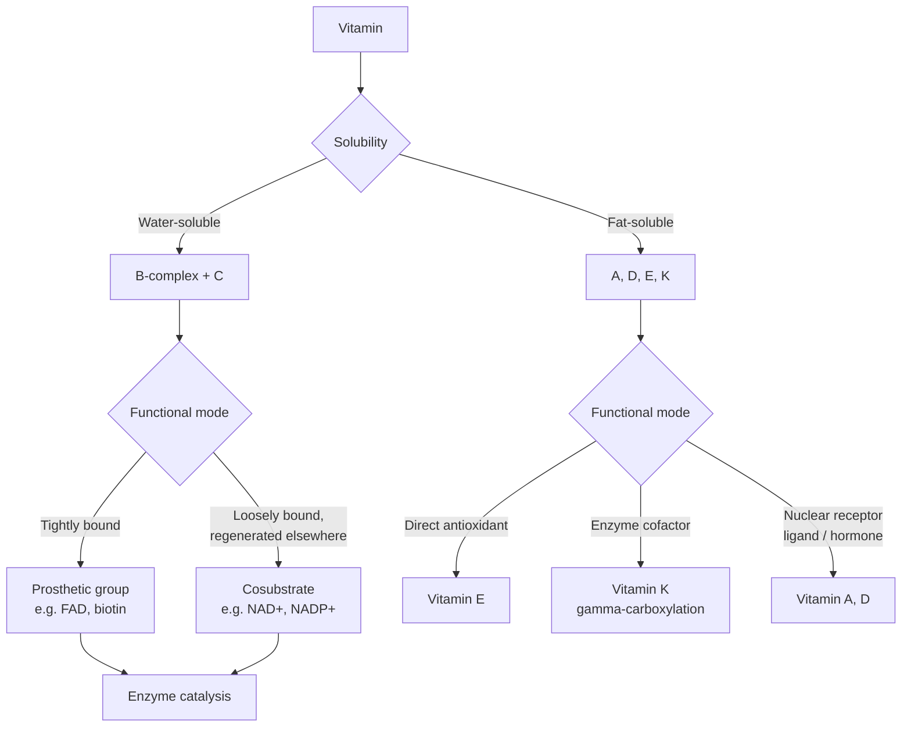

## Vitamins and Cofactors

### Overview

Vitamins are organic micronutrients required in small quantities for normal metabolism that an organism cannot synthesize in sufficient amounts and must obtain from the diet. Cofactors are non-protein chemical components (metal ions or organic molecules) required by many enzymes to achieve catalytic activity. The two categories overlap substantially: most water-soluble vitamins function biochemically as precursors to enzyme cofactors, linking dietary micronutrient chemistry directly to core metabolic catalysis.

### Cofactor Classification

**Coenzymes vs. Prosthetic Groups vs. Cosubstrates**

- **Coenzyme** — a general term for an organic, non-protein molecule required for enzymatic activity
- **Prosthetic group** — a coenzyme (or metal ion) that is **tightly, often covalently, bound** to the enzyme, remaining associated throughout the catalytic cycle (e.g., FAD in succinate dehydrogenase, biotin in carboxylases)
- **Cosubstrate (co-substrate)** — a coenzyme that binds **loosely and transiently**, is chemically altered during the reaction, released, and subsequently regenerated by a separate enzymatic reaction elsewhere in metabolism (e.g., NAD⁺ reduced to NADH by one enzyme, later reoxidized by another)

**Apoenzyme and Holoenzyme**

The catalytically inactive protein alone (lacking its required cofactor) is the **apoenzyme**; the complete, catalytically active complex of apoenzyme plus cofactor is the **holoenzyme**.

**Metal Ion Cofactors**

Many enzymes require inorganic metal ions (Mg²⁺, Zn²⁺, Fe²⁺/Fe³⁺, Mn²⁺, Cu²⁺, Ca²⁺, Mo, Se, etc.) for structural stabilization, direct participation in catalysis (e.g., electrophilic activation of a substrate carbonyl, or serving as an electron-transfer center in redox metalloenzymes), or charge stabilization of a reaction transition state.

---

## Water-Soluble Vitamins and Their Coenzyme Forms

Water-soluble vitamins are generally not stored extensively in the body (with some exceptions, e.g., B12) and require regular dietary intake; excess is typically excreted renally rather than accumulated to toxic levels (though high-dose supplementation of some, e.g., B6, can still cause toxicity).

### Vitamin B1 (Thiamine) → Thiamine Pyrophosphate (TPP)

TPP is the active coenzyme form, essential for enzymes catalyzing the transfer of a two-carbon (or decarboxylation) unit, functioning via its reactive **thiazolium ring**, which forms a stabilized carbanion (ylide) that acts as a nucleophile:

- **Pyruvate dehydrogenase complex** — oxidative decarboxylation of pyruvate to acetyl-CoA
- **α-ketoglutarate dehydrogenase** — TCA cycle
- **Transketolase** — pentose phosphate pathway

Deficiency causes **beriberi** (peripheral neuropathy, cardiac dysfunction) and, particularly associated with chronic alcohol use, **Wernicke-Korsakoff syndrome** (central nervous system manifestations).

### Vitamin B2 (Riboflavin) → FAD / FMN

Riboflavin is converted to **Flavin Mononucleotide (FMN)** and **Flavin Adenine Dinucleotide (FAD)**, both functioning as prosthetic groups (tightly, often covalently bound) in **flavoenzymes** catalyzing redox reactions. The isoalloxazine ring system can accept either one or two electrons (and protons), forming a stable semiquinone radical intermediate — a mechanistic capability NAD⁺/NADH lacks (which is restricted to obligate two-electron transfer), making flavins uniquely suited to interface two-electron metabolic reactions with one-electron transfer processes (e.g., in the electron transport chain, Complex II/succinate dehydrogenase).

### Vitamin B3 (Niacin) → NAD⁺/NADH, NADP⁺/NADPH

Niacin (nicotinic acid/nicotinamide) is converted to **Nicotinamide Adenine Dinucleotide (NAD⁺)** and its phosphorylated form **NADP⁺**, functioning as cosubstrates (loosely bound, freely diffusible) central to cellular redox metabolism. The nicotinamide ring accepts a hydride ion (2 electrons + 1 proton) at the C4 position, interconverting between oxidized (NAD⁺) and reduced (NADH) forms:

$$\text{NAD}^+ + 2e^- + \text{H}^+ \rightleftharpoons \text{NADH}$$

**NAD⁺/NADH** predominantly functions in catabolic (energy-releasing) oxidation reactions (glycolysis, TCA cycle, β-oxidation, feeding electrons into oxidative phosphorylation), while **NADP⁺/NADPH** predominantly functions in anabolic (biosynthetic, reductive) reactions and antioxidant defense (e.g., glutathione reductase) — this functional partitioning, despite near-identical chemistry, reflects distinct binding-pocket recognition by different sets of dehydrogenase enzymes, allowing cells to maintain the catabolic (NAD⁺/NADH) and anabolic (NADPH/NADP⁺) redox pools at different, independently regulated ratios. Deficiency causes **pellagra** (classically the "three D's": dermatitis, diarrhea, dementia).

### Vitamin B5 (Pantothenic Acid) → Coenzyme A

Pantothenic acid is a structural component of **Coenzyme A (CoA)**, whose reactive terminal **thiol (-SH)** group forms high-energy thioester bonds with acyl groups (most centrally, acetyl-CoA), functioning as the universal carrier of acyl groups in metabolism (fatty acid oxidation/synthesis, the TCA cycle, and numerous biosynthetic pathways).

### Vitamin B6 (Pyridoxine/Pyridoxal/Pyridoxamine) → Pyridoxal Phosphate (PLP)

PLP is one of the most mechanistically versatile coenzymes, functioning via reversible **Schiff base (imine)** formation between its reactive aldehyde group and the α-amino group of an amino acid substrate, which electronically stabilizes carbanion intermediates at the substrate's α-carbon (acting as an "electron sink" through the conjugated pyridinium ring system). This mechanism underlies PLP's role in:

- **Transamination** — amino acid ↔ α-keto acid interconversion (aminotransferases)
- **Decarboxylation** — amino acid → biogenic amine conversion (e.g., glutamate → GABA; histidine → histamine)
- **Racemization** and other side-chain modifications

### Vitamin B7 (Biotin) → Carboxylase Prosthetic Group

Biotin is covalently attached (via an amide bond to a specific lysine residue, forming **biocytin**) to biotin-dependent carboxylase enzymes, functioning as a mobile carrier of activated $\text{CO}_2$ (carboxybiotin intermediate) in carboxylation reactions (e.g., pyruvate carboxylase, acetyl-CoA carboxylase — the first committed step of fatty acid synthesis).

### Vitamin B9 (Folate) → Tetrahydrofolate (THF)

THF is the active coenzyme form, functioning as a carrier of **one-carbon units** at various oxidation states (methyl, methylene, methenyl, formyl), essential for purine and thymidylate (pyrimidine) biosynthesis, and thus for DNA synthesis and cell division. Folate deficiency impairs DNA synthesis in rapidly dividing cells, producing **megaloblastic anemia**, and maternal folate deficiency is strongly associated with **neural tube defects** in developing embryos, the basis for prenatal folic acid supplementation recommendations.

### Vitamin B12 (Cobalamin) → Methylcobalamin / Adenosylcobalamin

The structurally most complex vitamin, featuring a **corrin ring** system chelating a central cobalt ion. Two coenzyme forms serve distinct roles:

- **Methylcobalamin** — cofactor for methionine synthase (regenerating methionine from homocysteine, using a methyl group derived from methyl-THF, mechanistically linking B12 and folate metabolism)
- **Adenosylcobalamin** — cofactor for methylmalonyl-CoA mutase (a rearrangement reaction in odd-chain fatty acid and branched-chain amino acid catabolism)

B12 absorption requires **intrinsic factor**, a glycoprotein secreted by gastric parietal cells; deficiency (from dietary insufficiency, malabsorption, or intrinsic factor deficiency, as in pernicious anemia) causes megaloblastic anemia (overlapping with folate deficiency presentation) plus, distinctively, neurological symptoms from demyelination.

### Vitamin C (Ascorbic Acid)

Functions primarily as a **water-soluble antioxidant** (readily donates electrons, itself oxidized to dehydroascorbic acid) and as an essential cofactor for specific **hydroxylase enzymes** requiring Fe²⁺ in a reduced state, most notably **prolyl hydroxylase** and **lysyl hydroxylase**, which hydroxylate proline and lysine residues during collagen biosynthesis — hydroxylation essential for stable collagen triple-helix formation. Deficiency causes **scurvy**, classically presenting with connective tissue fragility (bleeding gums, poor wound healing) directly attributable to defective collagen maturation.

---

## Fat-Soluble Vitamins

Fat-soluble vitamins (A, D, E, K) are absorbed with dietary lipids, transported in lipoproteins, and can be stored in adipose tissue and the liver — meaning excess intake carries greater toxicity risk than water-soluble vitamins, since renal excretion cannot readily eliminate an accumulated excess.

### Vitamin A (Retinol and derivatives)

Functions in two chemically distinct roles: **11-cis-retinal**, covalently bound to the protein opsin, forms rhodopsin, the visual photopigment whose light-induced *cis*-to-*trans* isomerization initiates the phototransduction cascade in retinal photoreceptors; and **retinoic acid**, functioning as a ligand for nuclear retinoic acid receptors regulating gene transcription in cell differentiation and development. Deficiency causes night blindness and, in severe cases, xerophthalmia.

### Vitamin D (Calciferol)

Functions as a **steroid-derived hormone precursor** rather than a classical coenzyme: synthesized in skin from 7-dehydrocholesterol via UV-B exposure (or obtained from diet), then sequentially hydroxylated in the liver (25-hydroxyvitamin D) and kidney (1,25-dihydroxyvitamin D, calcitriol, the active hormone form), which binds nuclear vitamin D receptors to regulate intestinal calcium/phosphate absorption and bone mineral homeostasis. Deficiency causes rickets in children and osteomalacia in adults.

### Vitamin E (Tocopherols)

Functions as the principal **lipid-soluble chain-breaking antioxidant**, residing within cell membranes and lipoprotein particles, where its reactive phenolic hydroxyl group donates a hydrogen atom to terminate lipid peroxidation radical chain reactions, protecting polyunsaturated fatty acids in membranes from oxidative damage.

### Vitamin K (Phylloquinone/Menaquinone)

Functions as an essential cofactor for the enzyme **γ-glutamyl carboxylase**, which post-translationally carboxylates specific glutamate residues to γ-carboxyglutamate (Gla) in vitamin K-dependent proteins — most notably several blood clotting factors (II/prothrombin, VII, IX, X) and regulatory proteins C and S — the carboxylated Gla residues enabling Ca²⁺-dependent binding to phospholipid membrane surfaces essential for coagulation cascade assembly. This mechanism is the pharmacological target of **warfarin**, which inhibits vitamin K epoxide reductase, blocking vitamin K regeneration and thereby suppressing synthesis of functional clotting factors.

---

## Comparative Summary

| Vitamin | Active Coenzyme Form | Chemical Function | Deficiency Disease |
| --- | --- | --- | --- |
| B1 (Thiamine) | TPP | Decarboxylation, 2-carbon transfer | Beriberi, Wernicke-Korsakoff |
| B2 (Riboflavin) | FAD/FMN | 1- or 2-electron redox (prosthetic) | Ariboflavinosis |
| B3 (Niacin) | NAD⁺/NADP⁺ | Hydride transfer redox (cosubstrate) | Pellagra |
| B5 (Pantothenate) | Coenzyme A | Acyl group carrier (thioester) | Rare; fatigue, paresthesia |
| B6 (Pyridoxine) | PLP | Transamination, decarboxylation | Anemia, neuropathy |
| B7 (Biotin) | Biotin-lysine (prosthetic) | CO₂ carrier (carboxylation) | Rare; dermatitis |
| B9 (Folate) | THF | One-carbon unit transfer | Megaloblastic anemia, neural tube defects |
| B12 (Cobalamin) | Methyl-/Adenosylcobalamin | Methyl transfer, isomerization | Megaloblastic anemia, neuropathy |
| C (Ascorbate) | — (direct antioxidant/cofactor) | Fe²⁺ reduction for hydroxylases | Scurvy |
| A (Retinol) | 11-cis-retinal / retinoic acid | Photoreception, gene transcription | Night blindness |
| D (Calciferol) | Calcitriol | Nuclear hormone receptor ligand | Rickets/osteomalacia |
| E (Tocopherol) | — (direct antioxidant) | Lipid radical chain termination | Rare; neuromuscular |
| K (Phylloquinone) | — (enzyme cofactor) | γ-carboxylation | Coagulopathy |

### Process Flow: Vitamin Solubility Class and Functional Mode (svg_diagram)

### Structural Diagram: Apoenzyme-Cofactor-Holoenzyme Relationship (svg_diagram)

<svg xmlns="http://www.w3.org/2000/svg" viewBox="0 0 640 260" font-family="Helvetica, Arial, sans-serif">
<text x="320" y="24" text-anchor="middle" font-size="16" font-weight="bold">Apoenzyme + Cofactor -&gt; Holoenzyme (svg_diagram)</text>

<ellipse cx="140" cy="140" rx="90" ry="60" fill="#eaf4fb" stroke="#2c6e8f" stroke-width="2" />
<text x="140" y="145" text-anchor="middle" font-size="13" font-weight="bold">Apoenzyme</text>
<text x="140" y="163" text-anchor="middle" font-size="10">(catalytically inactive)</text>

<text x="255" y="150" text-anchor="middle" font-size="24" font-weight="bold">+</text>

<circle cx="330" cy="140" r="26" fill="#d9c04c" stroke="#8d7415" stroke-width="2" />
<text x="330" y="145" text-anchor="middle" font-size="11" font-weight="bold">Cofactor</text>

<line x1="380" y1="140" x2="440" y2="140" stroke="#333" stroke-width="2" />
<polygon points="440,133 455,140 440,147" fill="#333" />

<ellipse cx="550" cy="140" rx="80" ry="60" fill="#e8f5e9" stroke="#2e7d32" stroke-width="2" />
<circle cx="550" cy="140" r="18" fill="#d9c04c" stroke="#8d7415" stroke-width="2" />
<text x="550" y="188" text-anchor="middle" font-size="13" font-weight="bold">Holoenzyme</text>
<text x="550" y="205" text-anchor="middle" font-size="10">(catalytically active)</text>
</svg>

---

**Key Points**

- Most water-soluble B vitamins are biochemical precursors to enzyme coenzymes; the distinction between tightly bound prosthetic groups (e.g., FAD, biotin) and loosely bound, regenerated cosubstrates (e.g., NAD⁺, CoA) reflects fundamentally different modes of enzyme interaction
- PLP's Schiff-base mechanism and biotin's carboxybiotin intermediate exemplify how a small organic coenzyme provides reactive chemistry the 20 standard amino acid side chains cannot supply alone
- NAD⁺/NADH and NADP⁺/NADPH, though chemically near-identical, are functionally partitioned into catabolic and anabolic redox roles via selective enzyme recognition
- Fat-soluble vitamins (A, D, E, K) are stored in the body (unlike most water-soluble vitamins) and carry greater toxicity risk from over-supplementation; several (A, D) function as nuclear receptor ligands rather than classical enzyme coenzymes
- Vitamin C and vitamin K exemplify cofactor roles in post-translational modification of structural/functional proteins (collagen hydroxylation; clotting factor γ-carboxylation)
- Classic deficiency diseases (beriberi, pellagra, scurvy, rickets, megaloblastic anemia) map directly onto the specific biochemical pathway each vitamin/cofactor supports

**Next Steps**

- Enzyme kinetics and catalytic mechanism (Michaelis-Menten, active site chemistry)
- Central metabolic pathways: glycolysis, TCA cycle, oxidative phosphorylation (cofactor-dependent steps)
- Fatty acid synthesis and β-oxidation (CoA, biotin, FAD/NAD dependence)
- One-carbon metabolism and the folate/B12/methionine cycle
- Nuclear hormone receptor signaling (vitamin A and D receptor mechanisms)
- Blood coagulation cascade biochemistry
- Metalloenzymes and inorganic cofactor chemistry (Fe-S clusters, Zn finger motifs, Cu centers)
- Amino acids and protein structure (as the enzyme scaffold these cofactors act within)