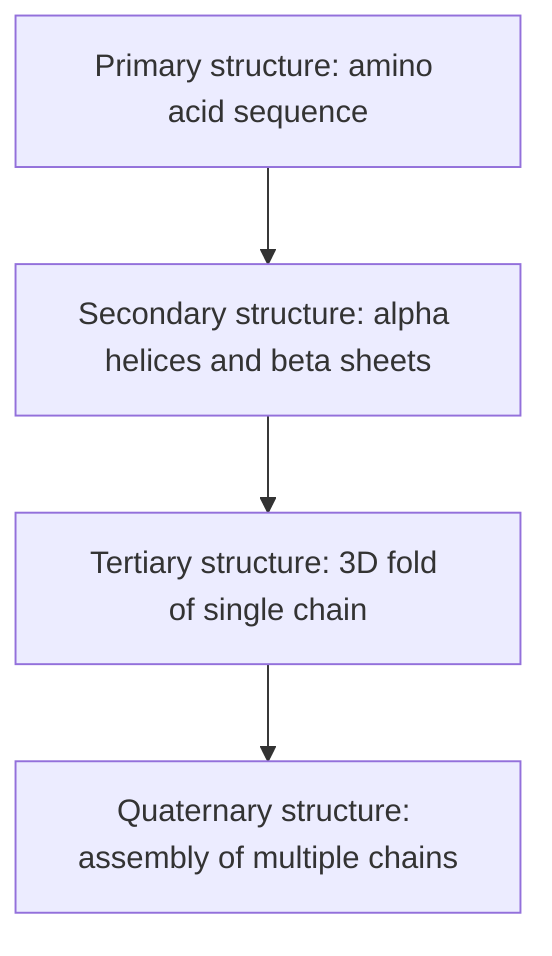
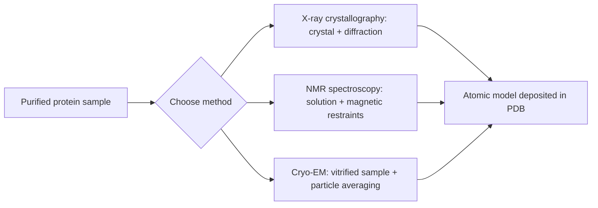

## Protein Folding and Structure Determination

### Overview

Protein folding is the physical process by which a polypeptide chain acquires its functional three-dimensional conformation, driven by the sequence of amino acids and the thermodynamics of the surrounding aqueous environment. Structure determination refers to the experimental and computational methods used to identify that three-dimensional conformation. These two subjects are treated together because the folding problem (how sequence dictates structure) can only be validated against structures obtained experimentally or predicted computationally.

### Levels of Protein Structure

**Primary structure**

The linear sequence of amino acids joined by peptide bonds, read from the N-terminus to the C-terminus. This sequence is encoded directly by mRNA codons and is the sole determinant of all higher-order structure, per Anfinsen's thermodynamic hypothesis.

**Secondary structure**

Local, regular folding patterns stabilized by hydrogen bonds between backbone carbonyl (C=O) and amide (N-H) groups.

- **$\alpha$-helix**: a right-handed coil with 3.6 residues per turn; hydrogen bonds form between the C=O of residue $n$ and the N-H of residue $n+4$.
- **$\beta$-sheet**: extended strands connected by hydrogen bonds, arranged as parallel or antiparallel sheets.
- **Turns and loops**: short connecting segments, often containing glycine or proline, allowing chain direction changes.

**Tertiary structure**

The overall three-dimensional folding of a single polypeptide chain, stabilized by interactions between side chains (R groups) that may be far apart in the primary sequence:

- Hydrophobic interactions (dominant driving force; nonpolar residues cluster in the core, minimizing contact with water)
- Hydrogen bonding between side chains
- Ionic bonds (salt bridges) between charged residues
- Disulfide bonds (covalent S-S bridges between cysteine residues)
- Van der Waals forces

**Quaternary structure**

The spatial arrangement of multiple polypeptide subunits into a functional multi-chain complex (e.g., hemoglobin's four subunits), stabilized by the same non-covalent and covalent interactions as tertiary structure, but between separate chains.

### Thermodynamics and Mechanism of Folding

**Anfinsen's Dogma**

Christian Anfinsen's experiments on ribonuclease A (1961) demonstrated that a denatured protein can spontaneously refold into its native, functional conformation without external assistance, establishing that all information required for correct folding resides in the primary sequence. This was foundational to the field and earned Anfinsen the 1972 Nobel Prize in Chemistry.

**The thermodynamic hypothesis**

The native fold corresponds to the global minimum of Gibbs free energy under physiological conditions:

$$\Delta G_{fold} = \Delta H_{fold} - T\Delta S_{fold}$$

Folding is generally driven by a favorable (negative) $\Delta H$ from non-covalent bond formation and, critically, by a favorable entropy change in the surrounding **water**, not the protein itself. This is because burial of hydrophobic side chains releases ordered water molecules from the hydrophobic hydration shell, increasing the overall entropy of the system — this is the **hydrophobic effect**, the principal thermodynamic driver of folding.

**Levinthal's paradox**

Cyrus Levinthal (1969) observed that if a protein sampled every possible conformation randomly, folding would take longer than the age of the universe, yet real proteins fold in microseconds to seconds. This paradox implies folding is not a random search but proceeds through defined, kinetically accessible pathways.

**The folding funnel model**

The modern resolution to Levinthal's paradox describes folding as a progressive, biased search on a funnel-shaped energy landscape, rather than a single defined pathway:

- The wide top of the funnel represents the many possible unfolded conformations, each with high free energy and high conformational entropy.
- As the chain forms local secondary structure and buries hydrophobic residues, it descends through decreasing energy and decreasing conformational entropy.
- The funnel narrows toward the native state, the global free-energy minimum, though local energy minima ("kinetic traps") can transiently slow folding.

Intermediate stages commonly discussed include the **molten globule state**, a compact, partially folded species with native-like secondary structure but a fluctuating, non-fixed tertiary packing.

### Protein Misfolding and Chaperones

Not all folding occurs spontaneously and error-free in vivo. Molecular chaperones assist folding and prevent aggregation:

- **Hsp70 (heat shock protein 70)**: binds exposed hydrophobic stretches on nascent or stress-denatured chains, using ATP hydrolysis cycles to prevent premature aggregation.
- **Chaperonins (e.g., GroEL/GroES in *E. coli*, TRiC/CCT in eukaryotes)**: barrel-shaped complexes that enclose a single unfolded protein in an isolated chamber, giving it a protected environment to fold, shielded from other unfolded chains.

Misfolding is clinically significant: incorrectly folded proteins can aggregate into insoluble fibrils. Amyloid-related conditions include Alzheimer's disease (amyloid-$\beta$ and tau aggregates) and transmissible spongiform encephalopathies (prion diseases, in which a misfolded PrP$^{Sc}$ conformation templates the misfolding of normal PrP$^C$).

### Experimental Structure Determination Methods

**X-ray crystallography**

- **Principle**: a purified protein is crystallized into an ordered lattice; X-rays are diffracted by the electron density of atoms in the crystal, producing a diffraction pattern.
- **Process**: diffraction spot intensities and phases (obtained via methods such as molecular replacement or multi-wavelength anomalous dispersion) are used to reconstruct an electron density map, into which an atomic model is built and refined.
- **Strengths**: can achieve very high resolution (better than 1–2 Å), well-established, historically the dominant method (majority of structures in the Protein Data Bank).
- **Limitations**: requires the protein to form a well-ordered crystal, which is often difficult for flexible, membrane-bound, or intrinsically disordered proteins; produces a static, time- and ensemble-averaged structure rather than a direct view of dynamics.

**Nuclear Magnetic Resonance (NMR) spectroscopy**

- **Principle**: measures magnetic interactions between spin-active nuclei (commonly $^1H$, $^{13}C$, $^{15}N$-labeled samples) in solution.
- **Process**: nuclear Overhauser effect (NOE) measurements provide distance restraints between nearby atoms; combined with chemical shift and coupling constant data, these restraints are used to compute an ensemble of structures consistent with the data.
- **Strengths**: performed in solution, closer to physiological conditions; no crystal required; can directly probe protein dynamics and flexibility.
- **Limitations**: practically limited to smaller proteins (historically roughly below ~35–50 kDa, though this ceiling has been extended with modern techniques); requires isotopic labeling; data processing is complex.

**Cryo-electron microscopy (cryo-EM)**

- **Principle**: a sample is rapidly vitrified (flash-frozen) in a thin layer of amorphous ice, preserving near-native conformation, and imaged by a transmission electron microscope.
- **Process**: thousands to millions of individual particle images, each representing a different random orientation, are computationally aligned and averaged (single-particle reconstruction) to build a 3D density map.
- **Strengths**: does not require crystallization, well-suited to large complexes, membrane proteins, and flexible or heterogeneous assemblies; resolution has improved dramatically since the "resolution revolution" (post-2012 direct electron detectors), now routinely reaching near-atomic resolution (better than 3 Å) for well-behaved samples.
- **Limitations**: historically weaker for small proteins (below ~50 kDa) due to low contrast, though this limit continues to be pushed lower.

### Computational Structure Prediction

**Homology (comparative) modeling**

Predicts a protein's structure by aligning its sequence to one or more evolutionarily related proteins ("templates") of known experimental structure, then building a model based on that alignment. Accuracy depends heavily on the degree of sequence identity to the template.

**Ab initio / physics-based prediction**

Attempts to predict structure directly from sequence using physical energy functions and conformational sampling, without relying on a homologous template. Computationally intensive and historically limited to small proteins or domains.

**Deep learning methods (AlphaFold and successors)**

[Inference — rapidly evolving subfield; specifics reflect the general architecture as documented, but ongoing model updates may alter details] DeepMind's AlphaFold2, introduced in 2020, produced a substantial leap in prediction accuracy at the CASP14 (Critical Assessment of Structure Prediction) competition, reaching accuracy competitive with experimental methods for many targets. Its architecture combines:

- A multiple sequence alignment (MSA) representation capturing evolutionary co-variation between residues
- The **Evoformer** module, which iteratively exchanges information between the MSA representation and a pairwise residue-residue representation
- A **structure module** that directly outputs 3D atomic coordinates using an attention-based mechanism operating on residue "frames" (rotation and translation)
- A per-residue confidence metric, **pLDDT** (predicted Local Distance Difference Test), and an inter-domain confidence metric, **PAE** (Predicted Aligned Error), used to assess reliability of different regions of the model

AlphaFold's parameters and predicted structures for many proteomes have been made publicly available, and successor and competing tools (e.g., RoseTTAFold) have extended this approach to protein complexes and design.

### Worked Example: Interpreting the Free Energy of Folding

Consider a simplified two-state folding equilibrium:

$$\text{Unfolded (U)} \rightleftharpoons \text{Folded (F)}$$

with equilibrium constant $K_{eq} = [F]/[U]$. The standard free energy of folding is:

$$\Delta G^{\circ}_{fold} = -RT \ln K_{eq}$$

**Example calculation:** If a small protein domain is found to be 90% folded and 10% unfolded at equilibrium at $T = 298\ \text{K}$:

$$K_{eq} = \frac{0.90}{0.10} = 9$$

$$\Delta G^{\circ}_{fold} = -(8.314\ \text{J mol}^{-1}\text{K}^{-1})(298\ \text{K})\ln(9) \approx -5.4\ \text{kJ/mol}$$

The negative value indicates the folded state is thermodynamically favored under these conditions, consistent with a modest but real stabilization typical of many small single-domain proteins (net stabilities are often only 20–60 kJ/mol despite the much larger number of favorable individual interactions, because folding is opposed by a large unfavorable loss of backbone and side-chain conformational entropy).

### Denaturation and Its Reversal

Protein structure can be disrupted without breaking the primary sequence (peptide bonds) via:

- **Heat**: increases kinetic energy, disrupting non-covalent interactions
- **pH changes**: alter ionization state of side chains, disrupting ionic bonds and hydrogen bonds
- **Chaotropic agents** (e.g., urea, guanidinium chloride): disrupt the hydrophobic effect and hydrogen-bonding network
- **Reducing agents** (e.g., $\beta$-mercaptoethanol, DTT): cleave disulfide bonds

Anfinsen's ribonuclease experiment specifically demonstrated that removal of denaturant (urea) and reducing agent, under appropriate conditions, allowed the majority of the protein population to spontaneously refold into its enzymatically active native conformation, confirming that the native fold is thermodynamically encoded rather than assembled by cellular machinery.

**Key Points**

- Structure is hierarchical: primary sequence determines secondary, tertiary, and quaternary organization.
- The hydrophobic effect, driven by solvent entropy, is the dominant force in tertiary folding.
- Levinthal's paradox is resolved by the folding funnel model, not by exhaustive conformational search.
- X-ray crystallography, NMR, and cryo-EM are complementary experimental techniques with distinct sample and resolution trade-offs.
- Deep learning models such as AlphaFold have substantially advanced computational structure prediction, approaching experimental accuracy for many single-chain targets.

**Related Topics**

- Enzyme active-site structure and catalytic mechanism
- Post-translational modifications and their effect on tertiary structure
- Protein-protein interaction interfaces and complex assembly
- Amyloid formation and neurodegenerative protein misfolding diseases
- Ramachandran plots and backbone dihedral angle analysis
- Circular dichroism spectroscopy for secondary structure estimation
- Protein Data Bank (PDB) file format and structural bioinformatics tools