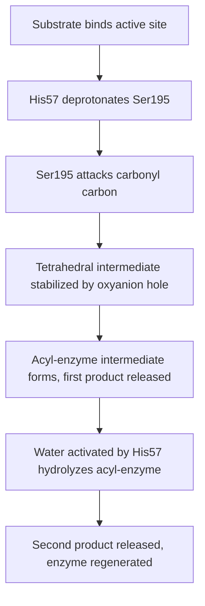

## Enzyme Structure and Catalytic Mechanisms

### Overview

Enzymes are biological catalysts, almost exclusively proteins (with the notable exception of catalytic RNAs, or ribozymes), that accelerate the rate of biochemical reactions without being consumed in the process. They achieve this by lowering the activation energy ($E_a$) of a reaction while leaving the overall thermodynamics ($\Delta G$) of the reaction unchanged. Enzymes do not alter the equilibrium position of a reaction; they only affect the rate at which equilibrium is reached.

### Enzyme Structure

**Active site**

A three-dimensional pocket or cleft on the enzyme surface, typically formed by residues that may be distant in the primary sequence but are brought into proximity by tertiary folding. The active site is responsible for:

- Substrate binding, via a specific combination of hydrogen bonds, ionic interactions, hydrophobic contacts, and van der Waals forces
- Catalysis, via functional groups of specific amino acid side chains positioned precisely to stabilize the transition state

**Substrate specificity models**

- **Lock-and-key model** (Emil Fischer, 1894): the earliest model, proposing the enzyme's active site is a rigid, pre-formed shape that exactly complements the substrate.
- **Induced-fit model** (Daniel Koshland, 1958): the currently accepted refinement, in which substrate binding triggers a conformational change in the enzyme, reshaping the active site to achieve optimal geometric and electronic complementarity, often with the transition state rather than the substrate itself.

**Cofactors and coenzymes**

Many enzymes require non-protein "helper" components for full catalytic activity:

- **Cofactors**: inorganic ions (e.g., $Zn^{2+}$, $Mg^{2+}$, $Fe^{2+}$) that stabilize enzyme structure or directly participate in catalysis (often via electrostatic stabilization of charged intermediates).
- **Coenzymes**: organic molecules, frequently derived from vitamins (e.g., NAD$^+$ from niacin, FAD from riboflavin, coenzyme A from pantothenic acid), that act as transient carriers of specific atoms or functional groups (electrons, acyl groups, methyl groups).
- **Prosthetic groups**: coenzymes or cofactors that are permanently and tightly (often covalently) bound to the enzyme, as opposed to co-substrates that bind and dissociate with each catalytic cycle.
- The complete, catalytically active complex of enzyme protein plus cofactor is termed the **holoenzyme**; the protein-only component lacking its cofactor is the **apoenzyme**.

### Mechanisms of Catalysis

Enzymes accelerate reactions through several combined physical and chemical strategies:

**Proximity and orientation effects**

Binding brings substrates together in the active site at high effective local concentration and in the correct spatial orientation for reaction, overcoming the entropic cost of two molecules colliding productively in free solution.

**Transition-state stabilization**

This is considered the central unifying principle of enzymatic catalysis. The active site is shaped to bind the transition state of the reaction (the highest-energy, least-stable configuration along the reaction coordinate) more tightly than it binds the substrate or product. By selectively lowering the free energy of the transition state, the enzyme lowers $E_a$.

**Acid-base catalysis**

Active-site side chains (commonly histidine, aspartate, glutamate, cysteine, or lysine, depending on local $pK_a$) donate or accept protons to stabilize developing charges on reaction intermediates.

**Covalent catalysis**

A nucleophilic residue in the active site (e.g., the serine hydroxyl in serine proteases, or a cysteine thiol) forms a transient covalent bond with the substrate, creating a covalent enzyme-substrate intermediate that proceeds through a lower-energy pathway than the uncatalyzed reaction.

**Metal ion catalysis**

Metal cofactors stabilize negative charge on intermediates, orient substrates, or mediate oxidation-reduction chemistry via reversible changes in the metal's oxidation state.

**Preferential binding of the transition state and strain/distortion**

Enzyme binding can induce electronic or geometric strain in the substrate, distorting its bonds toward the geometry of the transition state, effectively lowering the energy barrier that must be crossed.

### Worked Example: Chymotrypsin's Catalytic Triad

Chymotrypsin, a serine protease, illustrates covalent and acid-base catalysis acting together through its **catalytic triad**: Ser195, His57, and Asp102.

1. Asp102 orients and stabilizes the protonation state of His57 via a hydrogen bond.
2. His57 acts as a general base, deprotonating the Ser195 hydroxyl, increasing its nucleophilicity.
3. The activated serine oxygen attacks the carbonyl carbon of the peptide bond substrate, forming a tetrahedral intermediate.
4. The **oxyanion hole** (backbone N-H groups positioned to donate hydrogen bonds) stabilizes the developing negative charge on the tetrahedral intermediate's oxygen, which is the rate-determining transition state.
5. The tetrahedral intermediate collapses, releasing the C-terminal product fragment and leaving an acyl-enzyme intermediate (Ser195 covalently bonded to the remaining substrate portion).
6. A water molecule, activated in the same general-base manner by His57, hydrolyzes the acyl-enzyme intermediate, releasing the second product and regenerating free enzyme.

### Enzyme Kinetics

**The Michaelis-Menten model**

Describes the relationship between substrate concentration $[S]$ and initial reaction velocity $v_0$ for a simple one-substrate enzyme reaction:

$$v_0 = \frac{V_{max}[S]}{K_M + [S]}$$

- $V_{max}$: the maximum velocity approached asymptotically at saturating substrate concentration, when every enzyme active site is occupied.
- $K_M$ (Michaelis constant): the substrate concentration at which $v_0 = V_{max}/2$. $K_M$ is an inverse approximation of the enzyme's binding affinity for its substrate under steady-state conditions (a low $K_M$ generally indicates high apparent affinity), though it is not a true equilibrium dissociation constant unless the rate-limiting step is substrate release.
- $k_{cat}$ (turnover number): the number of substrate molecules converted to product per active site per unit time at saturation, defined by $V_{max} = k_{cat}[E]_{total}$.
- $k_{cat}/K_M$: the **specificity constant**, a measure of overall catalytic efficiency, particularly useful for comparing an enzyme's activity toward different substrates. Its theoretical upper bound is set by the diffusion-controlled rate at which enzyme and substrate can encounter one another in solution (roughly $10^8$–$10^9\ M^{-1}s^{-1}$); enzymes approaching this limit are termed "catalytically perfect."

**Worked example:** An enzyme has $V_{max} = 100\ \mu M/min$ and $K_M = 5\ mM$. At a substrate concentration of $[S] = 5\ mM$:

$$v_0 = \frac{100 \times 5}{5 + 5} = \frac{500}{10} = 50\ \mu M/\text{min}$$

This confirms the defining property of $K_M$: at $[S] = K_M$, the reaction proceeds at exactly half of $V_{max}$.

**Lineweaver-Burk linearization**

Taking the reciprocal of the Michaelis-Menten equation produces a linear form useful for graphical determination of kinetic parameters from experimental data:

$$\frac{1}{v_0} = \frac{K_M}{V_{max}} \cdot \frac{1}{[S]} + \frac{1}{V_{max}}$$

Plotting $1/v_0$ against $1/[S]$ gives a straight line with slope $K_M/V_{max}$, a y-intercept of $1/V_{max}$, and an x-intercept of $-1/K_M$.

### Enzyme Inhibition

**Competitive inhibition**

The inhibitor structurally resembles the substrate and binds reversibly at the active site, competing directly for occupancy. Effect: increases apparent $K_M$ (more substrate is needed to reach half-maximal velocity) but $V_{max}$ is unchanged, since sufficiently high $[S]$ can outcompete the inhibitor.

**Uncompetitive inhibition**

The inhibitor binds only to the enzyme-substrate (ES) complex, not to free enzyme. Effect: decreases both apparent $V_{max}$ and apparent $K_M$ by the same factor.

**Noncompetitive (mixed, with $\alpha = \alpha'$) inhibition**

The inhibitor binds to a site distinct from the active site (an allosteric site), with equal affinity for free enzyme and the ES complex. Effect: decreases apparent $V_{max}$; $K_M$ is unchanged in the pure noncompetitive case.

**Mixed inhibition**

A more general case in which the inhibitor binds both free enzyme and the ES complex, but with different affinities, altering both apparent $V_{max}$ and apparent $K_M$, in either direction depending on the relative affinities.

**Irreversible inhibition**

The inhibitor forms a stable covalent bond with the enzyme (often at or near the active site), permanently inactivating it. Example: organophosphates covalently and irreversibly inhibiting acetylcholinesterase by phosphorylating its catalytic serine.

### Regulation of Enzyme Activity

**Allosteric regulation**

Binding of an effector molecule at a site distinct from the active site induces a conformational change transmitted through the protein structure, altering catalytic activity at the active site. Allosteric enzymes frequently display sigmoidal (rather than hyperbolic) velocity-versus-$[S]$ kinetics, reflecting cooperative substrate binding between multiple subunits.

**Covalent modification**

Reversible post-translational modifications, most commonly phosphorylation of serine, threonine, or tyrosine residues by protein kinases (reversed by phosphatases), can activate or inactivate enzymes by inducing conformational changes.

**Zymogen activation**

Some enzymes are synthesized as inactive precursors (zymogens or proenzymes) that require irreversible proteolytic cleavage to become active — a mechanism used to prevent premature or misdirected activity (e.g., pepsinogen to pepsin, trypsinogen to trypsin).

**Feedback inhibition**

The end product of a metabolic pathway allosterically inhibits an earlier enzyme in that same pathway (often the first committed step), providing a self-limiting regulatory loop responsive to cellular demand.

### Effect of Temperature and pH

Enzyme activity generally rises with temperature up to an optimum (increased kinetic energy and collision frequency), beyond which activity falls sharply as heat disrupts non-covalent interactions maintaining tertiary structure, leading to denaturation. Similarly, each enzyme has a characteristic optimal pH, reflecting the ionization states required for active-site residues to perform their catalytic roles (e.g., pepsin functions optimally near pH 2 in the stomach, while trypsin functions optimally near pH 8 in the small intestine).

**Key Points**

- Enzymes lower activation energy without changing reaction equilibrium or being consumed.
- Transition-state stabilization is the unifying principle underlying diverse specific catalytic mechanisms.
- The Michaelis-Menten equation relates $[S]$ to $v_0$ via $V_{max}$ and $K_M$; $k_{cat}/K_M$ measures overall catalytic efficiency.
- Competitive, uncompetitive, and noncompetitive/mixed inhibition are distinguished by their distinct effects on apparent $K_M$ and $V_{max}$.
- Enzyme activity is tuned in vivo through allosteric regulation, covalent modification, zymogen activation, and feedback inhibition.

**Related Topics**

- Protein folding and structure determination
- Metabolic pathway regulation and feedback loops
- Coenzyme chemistry (NAD$^+$/NADH, FAD/FADH$_2$, coenzyme A)
- Cooperativity and the Hill equation
- Isozymes and tissue-specific enzyme regulation
- Enzyme kinetics determination via steady-state assays