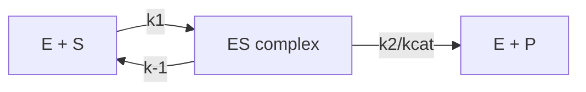
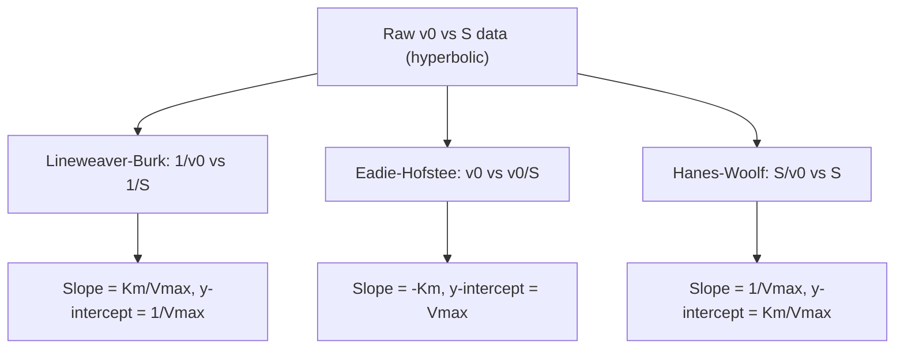

## Michaelis-Menten Enzyme Kinetics

### Overview

Michaelis-Menten kinetics is the foundational quantitative model describing the rate of enzyme-catalyzed reactions as a function of substrate concentration. Developed by Leonor Michaelis and Maud Menten in 1913 (building on earlier work by Victor Henri), the model provides a mathematical framework connecting a simple kinetic mechanism to the experimentally observable hyperbolic relationship between substrate concentration and initial reaction velocity.

### The Basic Kinetic Mechanism

The model assumes a minimal two-step reaction scheme in which free enzyme (E) reversibly binds substrate (S) to form an enzyme-substrate complex (ES), which then proceeds irreversibly to release product (P) and regenerate free enzyme:

$$E + S \underset{k_{-1}}{\overset{k_1}{\rightleftharpoons}} ES \xrightarrow{k_2} E + P$$

- $k_1$: the second-order rate constant for ES complex formation
- $k_{-1}$: the first-order rate constant for ES dissociation back to E and S
- $k_2$ (also written $k_{cat}$): the first-order rate constant for the catalytic step converting ES to product

### The Steady-State Assumption

The derivation of the rate equation relies on the **steady-state approximation**, introduced by Briggs and Haldane in 1925. This assumes that shortly after the reaction begins, the concentration of the ES complex remains approximately constant over the timescale of the initial velocity measurement, because the rate of ES formation equals its rate of breakdown:

$$\frac{d[ES]}{dt} \approx 0$$

This condition holds when enzyme concentration is much smaller than substrate concentration, which is the standard assumption for most in vitro enzyme assays.

### Derivation of the Rate Equation

Starting from the mass-action rate expressions:

$$\text{Rate of ES formation} = k_1[E][S]$$

$$\text{Rate of ES breakdown} = k_{-1}[ES] + k_2[ES]$$

Applying the steady-state condition:

$$k_1[E][S] = (k_{-1} + k_2)[ES]$$

Rearranging and defining the **Michaelis constant**:

$$K_M = \frac{k_{-1} + k_2}{k_1}$$

gives:

$$[E][S] = K_M[ES]$$

Using the conservation of total enzyme, $[E]_{total} = [E] + [ES]$, substituting for $[E]$, and solving for $[ES]$:

$$[ES] = \frac{[E]_{total}[S]}{K_M + [S]}$$

Since the initial velocity $v_0$ is defined as the rate of product formation, $v_0 = k_2[ES]$, and $V_{max} = k_2[E]_{total}$ (the velocity when all enzyme is saturated as ES), substitution yields the **Michaelis-Menten equation**:

$$v_0 = \frac{V_{max}[S]}{K_M + [S]}$$

### Interpreting the Parameters

**$V_{max}$ (maximum velocity)**

The asymptotic upper limit of $v_0$ as $[S] \to \infty$, reached when essentially all enzyme molecules are present as the ES complex. $V_{max}$ is directly proportional to total enzyme concentration: $V_{max} = k_{cat}[E]_{total}$.

**$K_M$ (Michaelis constant)**

The substrate concentration at which $v_0 = V_{max}/2$, verified by substituting $[S] = K_M$ into the rate equation:

$$v_0 = \frac{V_{max} \cdot K_M}{K_M + K_M} = \frac{V_{max}}{2}$$

$K_M$ has units of concentration (typically $\mu M$ or $mM$) and serves as a rough inverse indicator of an enzyme's apparent affinity for its substrate: a low $K_M$ suggests the enzyme reaches half-maximal velocity at low substrate concentrations (high apparent affinity), while a high $K_M$ indicates the opposite. [Inference — this interpretation is standard but only strictly equals a true dissociation constant, $K_M \approx K_d = k_{-1}/k_1$, in the special case where $k_2 \ll k_{-1}$; when the catalytic step is fast relative to ES dissociation, $K_M$ deviates from a simple binding affinity.]

**$k_{cat}$ (turnover number)**

Defined by $V_{max} = k_{cat}[E]_{total}$, $k_{cat}$ represents the maximum number of substrate molecules converted to product per active site per unit time under saturating conditions. Units are typically expressed as $s^{-1}$.

**$k_{cat}/K_M$ (specificity constant)**

A composite second-order rate constant describing catalytic efficiency under conditions where $[S] \ll K_M$ (i.e., where the enzyme is far from saturation, the physiologically common scenario for many enzymes). It is especially valuable for comparing an enzyme's efficiency across multiple competing substrates. The theoretical maximum value of $k_{cat}/K_M$ is bounded by the diffusion-limited rate of encounter between enzyme and substrate in solution, approximately $10^8$ to $10^9\ M^{-1}s^{-1}$; enzymes operating near this ceiling (e.g., triose phosphate isomerase, superoxide dismutase) are described as having achieved "catalytic perfection," since further improvement in the chemical step would not increase the overall observed rate.

### Worked Example

An enzyme is assayed at several substrate concentrations, yielding the following initial velocities:

| $[S]$ (mM) | $v_0$ ($\mu M/min$) |
| --- | --- |
| 1 | 20 |
| 5 | 50 |
| 10 | 67 |
| 20 | 80 |
| 50 | 91 |

**Step 1 — Estimate $V_{max}$ and $K_M$ graphically or by curve-fitting.**

Nonlinear regression to $v_0 = V_{max}[S]/(K_M + [S])$ on this data set gives approximately $V_{max} \approx 100\ \mu M/min$ and $K_M \approx 5\ mM$.

**Step 2 — Verify using the defining relationship.**

At $[S] = K_M = 5\ mM$, the equation predicts $v_0 = V_{max}/2 = 50\ \mu M/min$, which matches the tabulated value exactly, confirming the fitted parameters.

**Step 3 — Calculate $k_{cat}$ if enzyme concentration is known.**

If $[E]_{total} = 1\ nM$:

$$k_{cat} = \frac{V_{max}}{[E]_{total}} = \frac{100\ \mu M/min}{1\ nM} = \frac{100 \times 10^{-6}\ M/min}{1 \times 10^{-9}\ M} = 1 \times 10^5\ \text{min}^{-1}$$

Converting to per-second units: $k_{cat} \approx 1667\ s^{-1}$.

**Step 4 — Calculate the specificity constant.**

$$\frac{k_{cat}}{K_M} = \frac{1667\ s^{-1}}{5 \times 10^{-3}\ M} \approx 3.3 \times 10^5\ M^{-1}s^{-1}$$

This value is below the diffusion limit, indicating the chemical catalytic step, not substrate encounter, is rate-limiting for this enzyme under these conditions.

### Linearization Methods

Before nonlinear regression software was widely available, several linear transformations of the Michaelis-Menten equation were used to extract kinetic parameters graphically from experimental data.

**Lineweaver-Burk (double-reciprocal) plot**

Taking the reciprocal of both sides:

$$\frac{1}{v_0} = \frac{K_M}{V_{max}}\cdot\frac{1}{[S]} + \frac{1}{V_{max}}$$

Plotting $1/v_0$ (y-axis) against $1/[S]$ (x-axis) produces a straight line with slope $K_M/V_{max}$, y-intercept $1/V_{max}$, and x-intercept $-1/K_M$. [Unverified as a general statistical claim, though widely documented] This method is known to distort experimental error, since it disproportionately weights low-velocity (high $1/v_0$) data points, and is now used primarily for visual/qualitative comparison of inhibition patterns rather than precise parameter fitting.

**Eadie-Hofstee plot**

Rearranging to:

$$v_0 = -K_M\left(\frac{v_0}{[S]}\right) + V_{max}$$

Plotting $v_0$ against $v_0/[S]$ gives a line with slope $-K_M$ and y-intercept $V_{max}$. This method distributes error more evenly across the data range than the Lineweaver-Burk plot but weights $v_0$ on both axes, which can also bias the fit.

**Hanes-Woolf plot**

Rearranging to:

$$\frac{[S]}{v_0} = \frac{1}{V_{max}}[S] + \frac{K_M}{V_{max}}$$

Plotting $[S]/v_0$ against $[S]$ gives a line with slope $1/V_{max}$ and y-intercept $K_M/V_{max}$. This transformation generally provides the most statistically reliable linear fit of the three classical methods, though direct nonlinear regression on the untransformed data is the modern standard for accurate parameter estimation.

### Assumptions and Limitations of the Model

The classical Michaelis-Menten treatment relies on several simplifying assumptions that constrain its applicability:

- **Single substrate**: the basic model describes one-substrate reactions; multi-substrate reactions (the majority of metabolic enzymes) require extended models (e.g., ping-pong or sequential mechanisms).
- **Irreversible product formation step**: the reverse reaction ($P \to ES$) is assumed negligible, valid primarily for initial-rate measurements before significant product accumulates.
- **No cooperativity**: the model assumes a single, independent active site (or multiple independent, non-interacting sites). Enzymes exhibiting cooperative substrate binding between subunits instead show sigmoidal kinetics, described by the Hill equation rather than the hyperbolic Michaelis-Menten form.
- **$[E]_{total} \ll [S]$**: required for the steady-state approximation to hold over the measurement timescale.
- **Constant environmental conditions**: temperature, pH, and ionic strength are assumed constant throughout the assay, since all rate constants are temperature- and pH-dependent.

### Distinguishing Types of Inhibition via Kinetic Parameters

Michaelis-Menten parameters change in characteristic, diagnostic ways depending on inhibitor mechanism, making kinetic analysis a standard tool for classifying inhibitors:

| Inhibition type | Apparent $K_M$ | Apparent $V_{max}$ |
| --- | --- | --- |
| Competitive | Increased | Unchanged |
| Uncompetitive | Decreased | Decreased |
| Noncompetitive (pure) | Unchanged | Decreased |
| Mixed | Changed (either direction) | Decreased |

**Key Points**

- The Michaelis-Menten equation, $v_0 = V_{max}[S]/(K_M+[S])$, arises from the steady-state approximation applied to a simple two-step E + S $\rightleftharpoons$ ES $\rightarrow$ E + P mechanism.
- $K_M$ is the substrate concentration giving half-maximal velocity and is only strictly a binding affinity constant under specific rate-constant conditions.
- $k_{cat}/K_M$, the specificity constant, measures catalytic efficiency and is bounded above by the diffusion limit.
- Classical linearization methods (Lineweaver-Burk, Eadie-Hofstee, Hanes-Woolf) remain useful pedagogically and for visually diagnosing inhibition type, though nonlinear regression is preferred for accurate parameter determination.
- The model's core assumptions (single substrate, negligible reverse reaction, non-cooperative binding, $[E] \ll [S]$) define its boundaries of applicability.

**Related Topics**

- Enzyme structure and catalytic mechanisms
- Enzyme inhibition: competitive, uncompetitive, and mixed models
- Cooperative binding and the Hill equation
- Multi-substrate enzyme kinetics (ping-pong and sequential mechanisms)
- Allosteric enzyme regulation
- pH and temperature dependence of enzyme rate constants