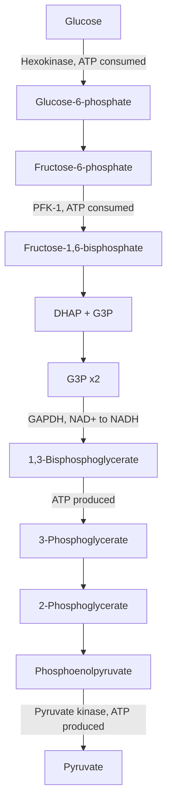
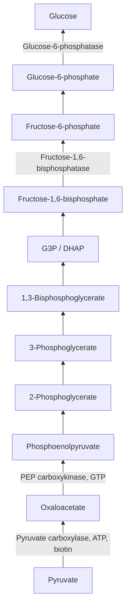

## Glycolysis and Gluconeogenesis

### Overview

Glycolysis and gluconeogenesis are reciprocal metabolic pathways governing the breakdown and synthesis of glucose. Glycolysis is the cytosolic, near-universally conserved pathway that oxidizes one molecule of glucose into two molecules of pyruvate, generating ATP and NADH. Gluconeogenesis is the pathway by which the liver (and, to a lesser extent, the kidney) synthesizes new glucose from non-carbohydrate precursors, essential for maintaining blood glucose during fasting. Although gluconeogenesis largely reverses glycolysis, it is not a simple reversal: three glycolytic steps are thermodynamically irreversible and must be bypassed by distinct enzymatic reactions.

### Glycolysis: The Ten-Step Pathway

Glycolysis is divided into an energy-investment phase (steps 1–5), which consumes 2 ATP per glucose, and an energy-payoff phase (steps 6–10), which generates ATP and NADH from each of the two three-carbon products.

**Energy investment phase**

1. **Hexokinase** (or glucokinase in liver/pancreatic $\beta$-cells): phosphorylates glucose to glucose-6-phosphate, using ATP. This traps glucose inside the cell (phosphorylated glucose cannot cross the plasma membrane) and commits it to metabolism. Irreversible.
2. **Phosphoglucose isomerase**: isomerizes glucose-6-phosphate to fructose-6-phosphate.
3. **Phosphofructokinase-1 (PFK-1)**: phosphorylates fructose-6-phosphate to fructose-1,6-bisphosphate, using a second ATP. This is the primary committed and rate-limiting step of glycolysis, and the principal site of regulation. Irreversible.
4. **Aldolase**: cleaves fructose-1,6-bisphosphate into two three-carbon sugars: dihydroxyacetone phosphate (DHAP) and glyceraldehyde-3-phosphate (G3P).
5. **Triose phosphate isomerase**: interconverts DHAP and G3P, so both three-carbon units can proceed through the remainder of the pathway as G3P.

**Energy payoff phase** (each reaction from this point occurs twice per original glucose molecule)

6. **Glyceraldehyde-3-phosphate dehydrogenase**: oxidizes G3P and adds inorganic phosphate, producing 1,3-bisphosphoglycerate and reducing NAD$^+$ to NADH.
7. **Phosphoglycerate kinase**: transfers a phosphate group from 1,3-bisphosphoglycerate to ADP, producing ATP (via substrate-level phosphorylation) and 3-phosphoglycerate.
8. **Phosphoglycerate mutase**: relocates the phosphate group, converting 3-phosphoglycerate to 2-phosphoglycerate.
9. **Enolase**: removes a water molecule from 2-phosphoglycerate, forming the high-energy compound phosphoenolpyruvate (PEP).
10. **Pyruvate kinase**: transfers the phosphate from PEP to ADP, producing ATP (substrate-level phosphorylation) and pyruvate. Irreversible.

### Net Yield of Glycolysis

Per molecule of glucose:

$$\text{Glucose} + 2\text{NAD}^+ + 2\text{ADP} + 2P_i \rightarrow 2\text{Pyruvate} + 2\text{NADH} + 2\text{ATP} + 2\text{H}^+ + 2\text{H}_2\text{O}$$

- **ATP**: 4 produced (steps 7 and 10, each occurring twice) minus 2 consumed (steps 1 and 3) = net **2 ATP**
- **NADH**: 2 produced (step 6, occurring twice)
- **Pyruvate**: 2 molecules

**Fate of pyruvate and NADH depends on oxygen availability:**

- **Aerobic conditions**: pyruvate is transported into the mitochondrial matrix and oxidatively decarboxylated by the pyruvate dehydrogenase complex to acetyl-CoA, which enters the citric acid cycle; NADH is reoxidized via the electron transport chain.
- **Anaerobic conditions (fermentation)**: NADH must be reoxidized to NAD$^+$ to sustain glycolysis, since the supply of NAD$^+$ is limited. In muscle, lactate dehydrogenase reduces pyruvate to lactate, regenerating NAD$^+$ (lactic acid fermentation). In yeast, pyruvate decarboxylase and alcohol dehydrogenase convert pyruvate to ethanol and $CO_2$ (alcoholic fermentation).

### Regulation of Glycolysis

**Phosphofructokinase-1 (PFK-1)** is the principal regulatory point:

- Allosterically **inhibited** by high ATP and citrate (both signal that energy and biosynthetic precursors are already abundant)
- Allosterically **activated** by AMP and by fructose-2,6-bisphosphate (F2,6BP), a potent activator synthesized by the bifunctional enzyme PFK-2/FBPase-2 in response to hormonal signaling (elevated in the fed state, promoting glycolysis)

**Hexokinase** is product-inhibited by its own product, glucose-6-phosphate, preventing excessive accumulation.

**Pyruvate kinase** is allosterically activated by fructose-1,6-bisphosphate (**feedforward activation**, coordinating the final step with upstream flux) and inhibited by ATP and alanine; in liver, it is also inactivated by glucagon-stimulated phosphorylation during fasting.

### Gluconeogenesis: Reversing Glycolysis

Gluconeogenesis occurs primarily in the liver (with a smaller contribution from the kidney cortex), largely in the cytosol, with one step occurring in the mitochondrion. It converts non-carbohydrate precursors — **lactate, glycerol, and glucogenic amino acids** (via pathways converging on pyruvate or citric acid cycle intermediates) — into glucose. Notably, **acetyl-CoA (and thus fatty acids) cannot serve as a net precursor for gluconeogenesis** in animals, because the pyruvate dehydrogenase reaction is irreversible and the two carbons entering the citric acid cycle as acetyl-CoA are lost as $CO_2$ before oxaloacetate can be regenerated.

Seven of the ten glycolytic reactions are freely reversible and are used directly, in reverse, by gluconeogenesis. The three irreversible glycolytic steps (catalyzed by hexokinase, PFK-1, and pyruvate kinase) are each bypassed by distinct enzymes:

**Bypass 1: Pyruvate to phosphoenolpyruvate (bypassing pyruvate kinase)**

This bypass requires two enzymatic steps across two cellular compartments:

1. **Pyruvate carboxylase** (mitochondrial matrix, requires biotin as a cofactor and ATP): carboxylates pyruvate to oxaloacetate.

$$\text{Pyruvate} + CO_2 + ATP \rightarrow \text{Oxaloacetate} + ADP + P_i$$

2. Oxaloacetate is converted to malate (or aspartate) to cross the inner mitochondrial membrane, since oxaloacetate itself has no dedicated transporter, then reconverted to oxaloacetate in the cytosol.
3. **PEP carboxykinase (PEPCK)** (cytosolic): decarboxylates and phosphorylates oxaloacetate to phosphoenolpyruvate, using GTP.

$$\text{Oxaloacetate} + GTP \rightarrow \text{PEP} + CO_2 + GDP$$

**Bypass 2: Fructose-1,6-bisphosphate to fructose-6-phosphate (bypassing PFK-1)**

**Fructose-1,6-bisphosphatase (FBPase-1)**: hydrolyzes the phosphate group, a simple irreversible hydrolysis rather than a reversal of the kinase reaction.

$$\text{Fructose-1,6-bisphosphate} + H_2O \rightarrow \text{Fructose-6-phosphate} + P_i$$

**Bypass 3: Glucose-6-phosphate to glucose (bypassing hexokinase/glucokinase)**

**Glucose-6-phosphatase** (located in the endoplasmic reticulum, present primarily in liver and kidney, notably absent in muscle and brain): hydrolyzes the phosphate group, releasing free glucose that can be exported into the blood.

$$\text{Glucose-6-phosphate} + H_2O \rightarrow \text{Glucose} + P_i$$

The tissue-specific absence of glucose-6-phosphatase in muscle explains why muscle can perform glycolysis and store glycogen but cannot release free glucose into the bloodstream for use by other tissues; muscle glycogen is used only locally.

### Energetic Cost of Gluconeogenesis

Because gluconeogenesis must overcome the large negative free energy changes of the three glycolytic irreversible steps, it is energetically more expensive than the ATP yield of glycolysis would suggest. Synthesizing one glucose molecule from two pyruvate molecules consumes:

$$2\text{Pyruvate} + 4ATP + 2GTP + 2NADH + 6H_2O \rightarrow \text{Glucose} + 4ADP + 2GDP + 6P_i + 2NAD^+ + 2H^+$$

This totals **6 high-energy phosphate bonds** (4 ATP + 2 GTP) consumed per glucose synthesized, compared to the 2 ATP net produced when that glucose is degraded by glycolysis — reflecting the thermodynamic cost of driving synthesis against the pathway's natural direction.

### Reciprocal Regulation of Glycolysis and Gluconeogenesis

Because simultaneous operation of both pathways at the three bypass points would constitute a futile cycle (net consumption of ATP with no useful product), the opposing enzyme pairs at each bypass are reciprocally regulated so that when one pathway's enzyme is active, the corresponding opposing enzyme is inhibited.

| Regulatory step | Glycolysis enzyme | Gluconeogenesis enzyme | Key reciprocal regulator |
| --- | --- | --- | --- |
| Fructose-6-P / Fructose-1,6-BP | PFK-1 | FBPase-1 | Fructose-2,6-bisphosphate activates PFK-1, inhibits FBPase-1 |
| Pyruvate / PEP | Pyruvate kinase | Pyruvate carboxylase + PEPCK | Acetyl-CoA activates pyruvate carboxylase; ATP inhibits pyruvate kinase |

**Fructose-2,6-bisphosphate (F2,6BP)** is the key reciprocal signal at the PFK-1/FBPase-1 control point. It is synthesized and degraded by the single bifunctional enzyme **PFK-2/FBPase-2**, whose activity is set by hormonal phosphorylation state:

- **Fed state** (high insulin/glucagon ratio): PFK-2/FBPase-2 is dephosphorylated, favoring its kinase activity, raising F2,6BP, which allosterically activates PFK-1 and inhibits FBPase-1 — favoring glycolysis.
- **Fasted state** (glucagon-dominant, via cAMP-dependent protein kinase A): PFK-2/FBPase-2 is phosphorylated, favoring its phosphatase activity, lowering F2,6BP, which relieves PFK-1 activation and FBPase-1 inhibition — favoring gluconeogenesis.

Glucagon and epinephrine additionally inhibit pyruvate kinase directly via PKA-mediated phosphorylation in the liver, further suppressing glycolytic flux during fasting.

### Worked Example: Carbon Tracing Through the PEP Bypass

Consider $^{14}C$-labeled pyruvate, labeled at the carboxyl carbon, entering gluconeogenesis:

1. Pyruvate carboxylase adds a new (unlabeled) $CO_2$ to pyruvate's methyl carbon, forming oxaloacetate — the original carboxyl label is retained, now as one of oxaloacetate's two carboxyl groups.
2. PEP carboxykinase removes a carboxyl group as $CO_2$ during decarboxylation. [Inference — depending on which specific carboxyl carbon is enzymatically removed, mechanistic carbon-labeling studies have been used historically to establish that the carbon lost here corresponds to the carbon added by pyruvate carboxylase, not the original pyruvate carbon] This elegant "add one carbon, then remove one carbon" sequence is why the pathway indirectly achieves the reverse of pyruvate kinase's essentially irreversible reaction: it couples the unfavorable phosphoryl transfer to the highly favorable decarboxylation step, making the overall two-step bypass thermodynamically feasible.

### Cori Cycle and Glucose-Alanine Cycle

**Cori cycle**: lactate produced by anaerobic glycolysis in exercising muscle or red blood cells is transported via the blood to the liver, where gluconeogenesis converts it back to glucose, which can be released into the blood and returned to muscle — an inter-organ cycle that shifts the metabolic (and ATP) burden of glucose regeneration to the liver.

**Glucose-alanine cycle**: in muscle, pyruvate is transaminated to alanine (incorporating an amino group from amino acid catabolism), which is transported to the liver; there it is transaminated back to pyruvate and used for gluconeogenesis, simultaneously shuttling nitrogen from muscle to the liver for urea cycle disposal.

**Key Points**

- Glycolysis nets 2 ATP and 2 NADH per glucose, converting glucose to 2 pyruvate; three steps (hexokinase, PFK-1, pyruvate kinase) are irreversible.
- Gluconeogenesis bypasses these three irreversible steps using distinct enzymes (pyruvate carboxylase + PEPCK, FBPase-1, glucose-6-phosphatase) and costs 6 high-energy phosphate bonds per glucose synthesized.
- Fructose-2,6-bisphosphate, controlled by the bifunctional PFK-2/FBPase-2 enzyme, is the master reciprocal regulator coordinating PFK-1 and FBPase-1 activity with hormonal (insulin/glucagon) state.
- Acetyl-CoA cannot serve as a net gluconeogenic precursor in animals due to the irreversibility of pyruvate dehydrogenase.
- The Cori cycle and glucose-alanine cycle link muscle glycolysis to hepatic gluconeogenesis at the whole-body level.

**Related Topics**

- Pyruvate dehydrogenase complex and entry into the citric acid cycle
- Citric acid cycle (Krebs cycle) and oxidative phosphorylation
- Glycogen metabolism and hormonal regulation (glycogenesis/glycogenolysis)
- Pentose phosphate pathway
- Hormonal control of metabolism: insulin, glucagon, and the fasting-fed transition
- Amino acid catabolism and glucogenic vs. ketogenic amino acids