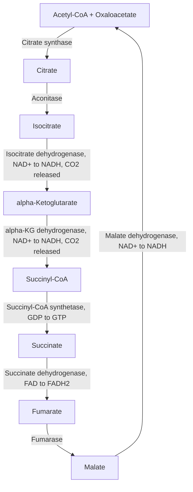
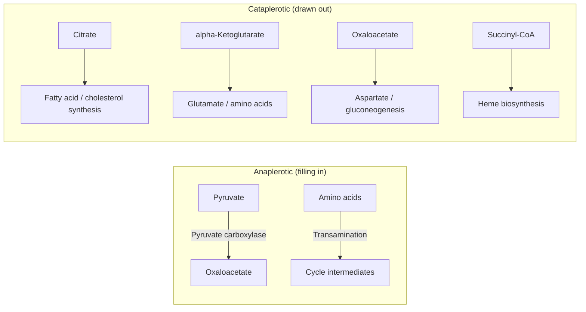

## The Citric Acid Cycle

### Overview

The citric acid cycle (also called the Krebs cycle or the tricarboxylic acid/TCA cycle) is the central hub of aerobic metabolism, occurring in the mitochondrial matrix of eukaryotic cells (and the cytosol of prokaryotes). It completes the oxidation of the two-carbon acetyl group derived from carbohydrates, fats, and proteins, releasing the carbon as $CO_2$ while conserving the released energy primarily as reduced electron carriers (NADH and FADH$_2$) that subsequently drive oxidative phosphorylation. The cycle is amphibolic: it serves both catabolic (energy-releasing) and anabolic (biosynthetic precursor-supplying) roles.

### Entry Point: Pyruvate Dehydrogenase Complex

Before entering the cycle proper, pyruvate generated by glycolysis must be transported into the mitochondrial matrix and oxidatively decarboxylated by the **pyruvate dehydrogenase complex (PDC)**, a large multi-enzyme assembly requiring five cofactors: thiamine pyrophosphate (TPP), lipoic acid, coenzyme A (from pantothenic acid), FAD, and NAD$^+$.

$$\text{Pyruvate} + CoA + NAD^+ \rightarrow \text{Acetyl-CoA} + CO_2 + NADH$$

This reaction is irreversible under physiological conditions, which is why acetyl-CoA cannot be net-converted back to pyruvate or glucose (relevant to the impossibility of net gluconeogenesis from fatty-acid-derived acetyl-CoA). PDC is itself tightly regulated: inhibited by its own products (acetyl-CoA, NADH) and by ATP, and inactivated by phosphorylation via pyruvate dehydrogenase kinase (activated when energy charge is high) — reactivated by dephosphorylation via pyruvate dehydrogenase phosphatase (stimulated by $Ca^{2+}$ and insulin signaling).

### The Eight Steps of the Cycle

Each turn of the cycle consumes one acetyl-CoA (2 carbons) and one oxaloacetate (4 carbons, regenerated at the end), releasing two carbons as $CO_2$ and regenerating oxaloacetate to begin again.

1. **Citrate synthase**: condenses acetyl-CoA with oxaloacetate to form citrate (6 carbons), releasing free CoA. This is the first committed step and a major regulatory point. Strongly exergonic and effectively irreversible.
2. **Aconitase**: isomerizes citrate to isocitrate via a cis-aconitate intermediate, repositioning the hydroxyl group to allow subsequent oxidation.
3. **Isocitrate dehydrogenase**: oxidatively decarboxylates isocitrate to $\alpha$-ketoglutarate (5 carbons), reducing NAD$^+$ to NADH and releasing the first $CO_2$. This is the primary rate-limiting, regulated step of the cycle. Irreversible.
4. **$\alpha$-Ketoglutarate dehydrogenase complex**: oxidatively decarboxylates $\alpha$-ketoglutarate to succinyl-CoA (4 carbons), reducing a second NAD$^+$ to NADH and releasing the second $CO_2$. Mechanistically and structurally homologous to the pyruvate dehydrogenase complex, using the same five cofactors. Irreversible.
5. **Succinyl-CoA synthetase**: cleaves the high-energy thioester bond of succinyl-CoA, coupling it to substrate-level phosphorylation of GDP (or ADP, tissue-dependent) to GTP (or ATP), producing succinate. This is the only step generating a nucleoside triphosphate directly within the cycle.
6. **Succinate dehydrogenase**: oxidizes succinate to fumarate, reducing FAD (covalently bound to the enzyme) to FADH$_2$. This enzyme is also **Complex II of the electron transport chain**, uniquely embedded in the inner mitochondrial membrane rather than free in the matrix, directly linking the cycle to the respiratory chain.
7. **Fumarase**: hydrates fumarate to malate.
8. **Malate dehydrogenase**: oxidizes malate to oxaloacetate, reducing a third NAD$^+$ to NADH, regenerating oxaloacetate to accept a new acetyl-CoA. This reaction is thermodynamically unfavorable in isolation ($\Delta G^{\circ\prime} > 0$) but is pulled forward by the rapid consumption of oxaloacetate by citrate synthase in step 1.

### Net Yield Per Turn

For one acetyl-CoA entering the cycle:

$$\text{Acetyl-CoA} + 3NAD^+ + FAD + GDP + P_i + 2H_2O \rightarrow 2CO_2 + 3NADH + FADH_2 + GTP + 2H^+ + CoA$$

- **3 NADH** (isocitrate dehydrogenase, $\alpha$-ketoglutarate dehydrogenase, malate dehydrogenase)
- **1 FADH$_2$** (succinate dehydrogenase)
- **1 GTP (or ATP)** (succinyl-CoA synthetase, substrate-level phosphorylation)
- **2 $CO_2$** released (from isocitrate dehydrogenase and $\alpha$-ketoglutarate dehydrogenase steps — note these carbons correspond to atoms originally from oxaloacetate, not necessarily the specific carbons that entered as the acetyl group in that same turn, since the cycle intermediates pool and mix over successive turns)

When the reduced carriers are subsequently oxidized via the electron transport chain, their energy is converted to ATP via oxidative phosphorylation. Using standard (though somewhat variable, depending on the shuttle system and P/O ratios used) conversion estimates of approximately 2.5 ATP per NADH and 1.5 ATP per FADH$_2$, one full turn of the cycle yields the equivalent of roughly $3(2.5) + 1(1.5) + 1 = 10$ ATP-equivalents. [Inference — these P/O ratios are commonly cited approximations rather than fixed universal constants; actual ATP yield varies with the specific NADH shuttle mechanism used to transport cytosolic reducing equivalents and other physiological factors]

### Regulation of the Citric Acid Cycle

The cycle is regulated primarily at its three exergonic, essentially irreversible steps, integrating signals reflecting the cell's energy charge and reducing power:

**Citrate synthase**

- Inhibited by high ATP, NADH, succinyl-CoA, and citrate itself (product inhibition)
- Substrate availability (acetyl-CoA, oxaloacetate) also directly limits flux

**Isocitrate dehydrogenase**

- Allosterically activated by ADP and $Ca^{2+}$ (signaling low energy charge / increased demand)
- Inhibited by ATP and NADH

**$\alpha$-Ketoglutarate dehydrogenase complex**

- Inhibited by its own products, succinyl-CoA and NADH
- Activated by $Ca^{2+}$ (particularly relevant in tissues with high, fluctuating energy demand such as muscle, where $Ca^{2+}$ simultaneously triggers contraction and upregulates ATP-generating flux)

More broadly, the cellular **NADH/NAD$^+$ ratio** exerts overarching control: since three of the eight steps require NAD$^+$ as a substrate, a high NADH/NAD$^+$ ratio (indicating the electron transport chain is not keeping pace, often due to limited $O_2$ availability) slows the entire cycle by substrate limitation at multiple steps.

### Anaplerotic and Cataplerotic Reactions

Because citric acid cycle intermediates are continuously withdrawn for biosynthetic purposes (a **cataplerotic** function), the cycle depends on **anaplerotic** ("filling up") reactions to replenish intermediates and sustain catalytic turnover.

**Key anaplerotic reactions:**

- **Pyruvate carboxylase**: $\text{Pyruvate} + CO_2 + ATP \rightarrow \text{Oxaloacetate} + ADP + P_i$ (the same reaction used in gluconeogenesis, here serving to replenish oxaloacetate; strongly activated by acetyl-CoA, which signals a need for more oxaloacetate to condense with accumulating acetyl-CoA)
- Transamination of amino acids into cycle intermediates (e.g., alanine to pyruvate, aspartate to oxaloacetate, glutamate to $\alpha$-ketoglutarate)
- Propionyl-CoA (from odd-chain fatty acid oxidation or certain amino acids) converted via methylmalonyl-CoA to succinyl-CoA

**Key cataplerotic (biosynthetic withdrawal) uses of intermediates:**

- Citrate exported to the cytosol as a precursor for fatty acid and cholesterol synthesis (cleaved by ATP-citrate lyase back to acetyl-CoA and oxaloacetate)
- $\alpha$-Ketoglutarate as a precursor for glutamate (and thus other amino acids and neurotransmitter synthesis) via transamination
- Oxaloacetate as a precursor for aspartate and for gluconeogenesis (in gluconeogenic tissues)
- Succinyl-CoA as a precursor for heme (porphyrin) biosynthesis

### Worked Example: Tracing Carbon Fate Over Successive Turns

A common point of confusion is whether the two carbons entering as acetyl-CoA in a given turn are the same two carbons released as $CO_2$ in that same turn.

Isotope labeling experiments (using $^{14}C$-labeled acetyl-CoA) demonstrate that they are **not** the same carbons. Because citrate is a symmetric-appearing molecule that aconitase acts upon asymmetrically (due to the enzyme's stereospecific active site, which distinguishes the two arms of citrate despite their chemical similarity), the carbons lost as $CO_2$ in isocitrate dehydrogenase and $\alpha$-ketoglutarate dehydrogenase in a given turn originate from the oxaloacetate that condensed with acetyl-CoA at the start of that turn, not from the newly added acetyl group. The acetyl-derived carbons are retained within the four-carbon backbone and are only released as $CO_2$ in subsequent turns of the cycle. This subtlety was resolved experimentally in the 1940s and required careful isotope-tracing methodology to distinguish from the initially assumed (and incorrect) symmetric behavior.

### The Cycle's Amphibolic Role

The citric acid cycle sits at the metabolic crossroads of carbohydrate, lipid, and amino acid metabolism:

- **Carbohydrates**: enter via glycolysis-derived pyruvate, converted to acetyl-CoA
- **Fatty acids**: enter via $\beta$-oxidation, which directly produces acetyl-CoA (bypassing pyruvate dehydrogenase)
- **Amino acids**: glucogenic amino acids feed into the cycle at various points (pyruvate, oxaloacetate, $\alpha$-ketoglutarate, succinyl-CoA, fumarate) after deamination/transamination; ketogenic amino acids (leucine, lysine) are degraded directly to acetyl-CoA or acetoacetyl-CoA

This convergence is why the cycle is described as amphibolic rather than purely catabolic: it simultaneously extracts energy from diverse fuel sources and supplies carbon skeletons for biosynthesis of glucose, amino acids, nucleotides (via succinyl-CoA-derived porphyrins and other routes), and lipids.

**Key Points**

- One turn of the cycle oxidizes an acetyl group fully to 2 $CO_2$, yielding 3 NADH, 1 FADH$_2$, and 1 GTP directly; the reduced carriers subsequently drive the bulk of ATP synthesis via oxidative phosphorylation.
- Citrate synthase, isocitrate dehydrogenase, and $\alpha$-ketoglutarate dehydrogenase are the three regulated, essentially irreversible control points, chiefly responsive to ATP/ADP, NADH/NAD$^+$, and $Ca^{2+}$.
- The carbons released as $CO_2$ in a given turn come from the oxaloacetate carbon skeleton, not directly from the acetyl-CoA that entered that same turn.
- Anaplerotic reactions (chiefly pyruvate carboxylase) replenish intermediates continuously withdrawn for cataplerotic biosynthetic purposes (fatty acids, amino acids, heme, glucose).
- Succinate dehydrogenase uniquely functions as both a cycle enzyme and Complex II of the electron transport chain.

**Related Topics**

- Oxidative phosphorylation and the electron transport chain
- Pyruvate dehydrogenase complex regulation
- $\beta$-oxidation of fatty acids
- Amino acid catabolism: glucogenic and ketogenic pathways
- Glyoxylate cycle (plants/microorganisms)
- Mitochondrial substrate shuttle systems (malate-aspartate and glycerol-3-phosphate shuttles)