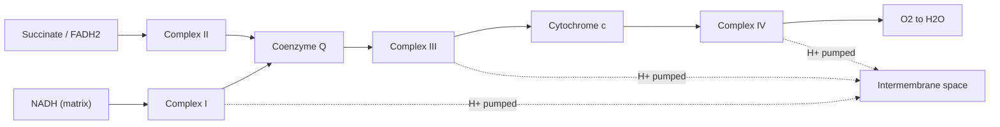
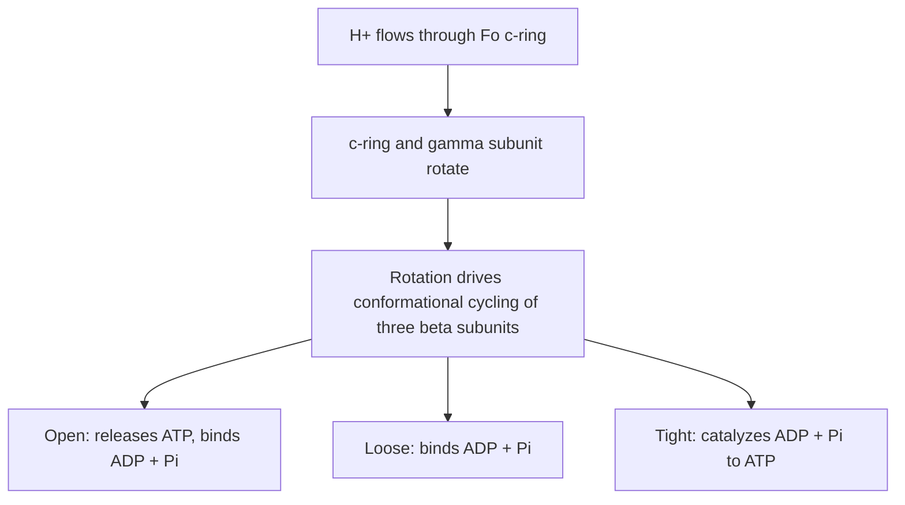

## Oxidative Phosphorylation

### Overview

Oxidative phosphorylation is the process by which mitochondria (and, in prokaryotes, the plasma membrane) generate the vast majority of cellular ATP by coupling the transfer of electrons from reduced carriers (NADH and FADH$_2$) through a series of membrane-embedded protein complexes to molecular oxygen, harnessing the released energy to pump protons across the inner mitochondrial membrane and drive ATP synthesis. It comprises two mechanistically distinct but physically coupled processes: **electron transport** (the flow of electrons through the respiratory chain) and **chemiosmotic ATP synthesis** (the use of the resulting proton gradient to synthesize ATP).

### The Electron Transport Chain: Four Complexes

The electron transport chain (ETC) consists of four large multi-subunit protein complexes embedded in the inner mitochondrial membrane, plus two mobile electron carriers that shuttle electrons between them.

**Complex I (NADH-coenzyme Q oxidoreductase / NADH dehydrogenase)**

Oxidizes NADH, passing its electrons through a flavin mononucleotide (FMN) prosthetic group and a series of iron-sulfur clusters, ultimately reducing ubiquinone (coenzyme Q) to ubiquinol. This is the largest complex in the chain and pumps 4 protons from the matrix to the intermembrane space per pair of electrons transferred.

$$NADH + H^+ + Q \rightarrow NAD^+ + QH_2$$

**Complex II (succinate-coenzyme Q oxidoreductase / succinate dehydrogenase)**

Identical to the citric acid cycle enzyme succinate dehydrogenase; oxidizes succinate to fumarate, passing electrons via FAD and iron-sulfur clusters to ubiquinone. Complex II does **not** pump protons, which is why electrons entering via FADH$_2$ (Complex II) yield less ATP than those entering via NADH (Complex I).

**Coenzyme Q (ubiquinone)**

A small, lipid-soluble, mobile electron carrier that diffuses within the inner membrane, accepting electrons from Complex I, Complex II, and other flavoprotein dehydrogenases (e.g., the electron-transferring flavoprotein of fatty acid $\beta$-oxidation), and delivering them to Complex III.

**Complex III (coenzyme Q-cytochrome c oxidoreductase / cytochrome $bc_1$ complex)**

Transfers electrons from ubiquinol to cytochrome c via the **Q cycle**, a mechanism that allows the two-electron carrier ubiquinol to interface with the one-electron carrier cytochrome c while pumping additional protons. Contains cytochromes $b$ and $c_1$ and an iron-sulfur protein. Pumps 4 protons per pair of electrons (net, accounting for the Q cycle's proton consumption and release).

**Cytochrome c**

A small, water-soluble heme protein located in the intermembrane space, associated peripherally with the outer face of the inner membrane. Carries a single electron at a time from Complex III to Complex IV.

**Complex IV (cytochrome c oxidase)**

The terminal enzyme of the chain, containing copper centers ($Cu_A$, $Cu_B$) and cytochromes $a$ and $a_3$. Accepts four electrons sequentially from four molecules of cytochrome c and uses them to reduce one molecule of $O_2$ to two molecules of water, the terminal electron acceptor of aerobic respiration. Pumps 2 protons across the membrane per pair of electrons, in addition to consuming matrix protons in the water-forming reaction itself.

$$O_2 + 4H^+ + 4e^- \rightarrow 2H_2O$$

### The Chemiosmotic Hypothesis

Proposed by Peter Mitchell in 1961 (awarded the Nobel Prize in Chemistry in 1978), the **chemiosmotic hypothesis** was a paradigm-shifting theory proposing that ATP synthesis is driven not by a direct chemical intermediate, but by an electrochemical proton gradient across a membrane. As electrons flow through Complexes I, III, and IV, protons are actively pumped from the mitochondrial matrix into the intermembrane space, generating:

- A **chemical concentration gradient** (higher $H^+$ concentration, lower pH, in the intermembrane space)
- An **electrical potential gradient** (the intermembrane space is more positive relative to the matrix)

Together these constitute the **proton-motive force (PMF)**, which has both a pH-gradient component and a membrane-potential ($\Delta\Psi$) component:

$$\Delta p = \Delta\Psi - \frac{2.303RT}{F}\Delta pH$$

This stored electrochemical energy is then used to drive ATP synthesis as protons flow back down their gradient into the matrix through a specific channel within ATP synthase, rather than diffusing freely across the (otherwise proton-impermeable) inner membrane.

### ATP Synthase (Complex V)

ATP synthase is a remarkable rotary molecular machine composed of two functional domains:

**$F_o$ domain** (membrane-embedded): forms the proton channel; the "c-ring," a rotor composed of multiple c-subunits (the exact number varies by organism), rotates as protons flow through it down the electrochemical gradient, driven by protonation/deprotonation of a conserved acidic residue on each c-subunit as it passes a fixed half-channel.

**$F_1$ domain** (matrix-facing, catalytic head): composed of alternating $\alpha$ and $\beta$ subunits arranged in a hexameric ring around a central, asymmetric $\gamma$ subunit shaft that is physically continuous with the rotating c-ring.

The rotation of the $\gamma$ subunit within the stationary $\alpha_3\beta_3$ hexamer sequentially forces each of the three catalytic $\beta$ subunits through three distinct conformational states, described by Paul Boyer's **binding change mechanism** (which, together with Mitchell's chemiosmotic theory and John Walker's structural determination of ATP synthase, was recognized by the 1997 Nobel Prize in Chemistry):

1. **Open (O)**: low affinity for ligands; releases previously synthesized ATP and binds fresh ADP + $P_i$
2. **Loose (L)**: binds ADP and $P_i$ loosely
3. **Tight (T)**: binds ADP and $P_i$ with high affinity, catalyzing their condensation to ATP with minimal additional energy input at this specific chemical step, since the major energy expenditure of the process is in the conformational change itself, not the phosphoanhydride bond formation

Each 360° rotation of the $\gamma$ subunit drives all three catalytic sites through a full cycle, synthesizing 3 ATP molecules and requiring, depending on the c-ring stoichiometry of the organism, a corresponding number of protons to pass through $F_o$.

### Coupling ETC Stoichiometry to ATP Yield

Historically, ATP yield was estimated using fixed **P/O ratios** (ATP synthesized per oxygen atom reduced, equivalently per pair of electrons transferred): approximately 2.5 for NADH entering at Complex I, and approximately 1.5 for FADH$_2$ entering at Complex II. [Inference — these values are widely used standard approximations rather than exact fixed constants; the true stoichiometric yield depends on the specific c-ring subunit count of the organism's ATP synthase (which determines protons required per ATP) and is not necessarily a whole or fixed number] Older textbooks frequently cited P/O ratios of 3 and 2 respectively, based on now-superseded assumptions about coupling stoichiometry; the 2.5/1.5 values reflect more recent structural and biochemical determination of the actual number of protons translocated per electron pair and required per ATP synthesized.

### Worked Example: Total ATP Yield from One Glucose Molecule

Combining glycolysis, pyruvate dehydrogenase, the citric acid cycle, and oxidative phosphorylation, using the standard 2.5/1.5 P/O approximations:

| Source | NADH | FADH$_2$ | Direct ATP/GTP |
| --- | --- | --- | --- |
| Glycolysis | 2 | — | 2 (net) |
| Pyruvate dehydrogenase (×2, one per pyruvate) | 2 | — | — |
| Citric acid cycle (×2 turns) | 6 | 2 | 2 |
| **Totals** | **10** | **2** | **4** |

$$\text{ATP from NADH} = 10 \times 2.5 = 25$$

$$\text{ATP from FADH}_2 = 2 \times 1.5 = 3$$

$$\text{Total ATP} = 25 + 3 + 4 = 32$$

This total of **approximately 32 ATP per glucose** is the commonly cited modern estimate. [Inference — this figure assumes the malate-aspartate shuttle, which delivers cytosolic glycolytic NADH-equivalents to the matrix as NADH (full Complex I entry); if the glycerol-3-phosphate shuttle is used instead, those two cytosolic NADH are effectively delivered as FADH$_2$-equivalent electrons, reducing the total yield to approximately 30 ATP. The true cellular yield also varies with the proton leak, the ATP/ADP translocase cost, and other factors, so this number represents a theoretical maximum rather than a precisely fixed constant.] Older textbook figures of "36" or "38" ATP per glucose reflect outdated assumptions (P/O ratios of 3 and 2, and no accounting for the cost of transporting ATP out of the mitochondrion) and have been superseded.

### Uncoupling and Inhibitors

The tight coupling between electron transport and ATP synthesis can be experimentally or physiologically disrupted at several distinct points, a classification useful for understanding mechanism:

- **Electron transport chain inhibitors**: block electron flow at a specific complex, halting both electron transport and (since the pump-driven gradient collapses) ATP synthesis. Examples: rotenone (Complex I), antimycin A (Complex III), cyanide and carbon monoxide (Complex IV, by binding the heme iron).
- **ATP synthase inhibitors**: directly block the $F_o$ proton channel, which secondarily backs up and halts electron transport as well, since the proton gradient cannot dissipate. Example: oligomycin.
- **Uncoupling agents**: dissipate the proton gradient directly without blocking either process. Chemical uncouplers such as 2,4-dinitrophenol (DNP) are lipid-soluble weak acids that shuttle protons across the membrane independent of ATP synthase, allowing electron transport (and thus oxygen consumption) to continue unabated while ATP synthesis collapses; the dissipated energy is released as heat. Physiologically, **uncoupling protein 1 (UCP1, thermogenin)**, present in brown adipose tissue mitochondria, serves an analogous natural role in non-shivering thermogenesis.

### Reactive Oxygen Species and the ETC

Electron transport is not perfectly efficient: electrons can occasionally leak prematurely from the chain (particularly at Complexes I and III) and react directly with $O_2$, generating the superoxide radical ($O_2^{\bullet-}$), a reactive oxygen species (ROS). Cells counter this via antioxidant defenses including superoxide dismutase (converting superoxide to hydrogen peroxide) and catalase/glutathione peroxidase (detoxifying hydrogen peroxide to water). [Inference — chronic or excessive ROS production is broadly implicated in oxidative stress and cellular damage, and the "mitochondrial free radical theory of aging" proposes a causal link to aging processes, though this remains an area of ongoing scientific investigation and debate rather than settled consensus]

**Key Points**

- Electrons flow from NADH/FADH$_2$ through Complexes I/II, coenzyme Q, Complex III, cytochrome c, and Complex IV to reduce $O_2$ to water, with Complexes I, III, and IV pumping protons across the inner mitochondrial membrane.
- Mitchell's chemiosmotic hypothesis established that the resulting proton-motive force, not a direct chemical intermediate, drives ATP synthesis.
- ATP synthase is a rotary motor; proton flow through $F_o$ drives rotation of the $\gamma$ subunit, cycling each $F_1$ catalytic site through open, loose, and tight conformations (Boyer's binding change mechanism).
- NADH oxidized via Complex I yields more ATP (~2.5 ATP) than FADH$_2$ entering at Complex II (~1.5 ATP), since Complex II does not pump protons.
- Uncouplers (e.g., DNP, UCP1), ETC inhibitors (e.g., cyanide, rotenone), and ATP synthase inhibitors (e.g., oligomycin) disrupt oxidative phosphorylation at mechanistically distinct points.

**Related Topics**

- The citric acid cycle
- Mitochondrial substrate shuttle systems (malate-aspartate and glycerol-3-phosphate shuttles)
- Reactive oxygen species and cellular antioxidant defenses
- Brown adipose tissue and non-shivering thermogenesis
- Mitochondrial DNA and genetic diseases of oxidative phosphorylation
- Fatty acid $\beta$-oxidation and its convergence on the electron transport chain