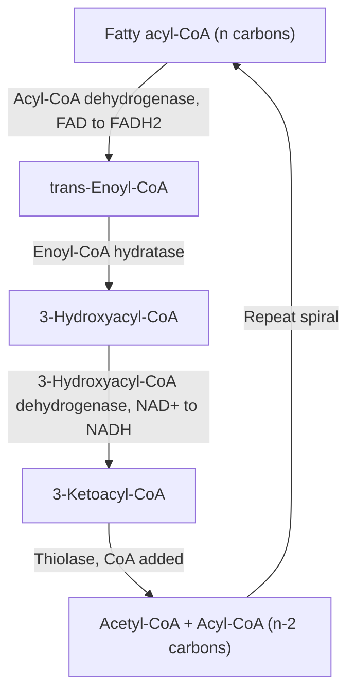
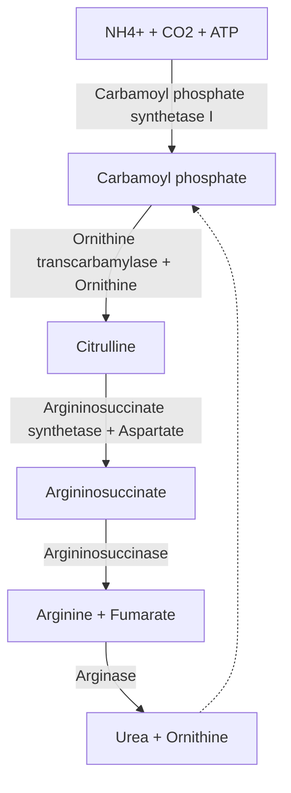

## Lipid and Amino Acid Metabolism

### Overview

Lipid and amino acid metabolism encompass the pathways by which fats and proteins are broken down for energy and biosynthetic precursors, and synthesized when substrate is abundant. Both classes of pathways converge extensively with carbohydrate metabolism at the level of acetyl-CoA and citric acid cycle intermediates, making them integral components of the same interconnected metabolic network rather than isolated systems.

### Lipid Metabolism: Fatty Acid Oxidation ($\beta$-Oxidation)

**Mobilization and activation**

Stored triacylglycerols in adipose tissue are hydrolyzed by hormone-sensitive lipase (activated by glucagon/epinephrine via PKA-mediated phosphorylation, inhibited by insulin) to release free fatty acids and glycerol into the blood. Once inside a cell, a fatty acid must be activated before oxidation:

$$\text{Fatty acid} + CoA + ATP \rightarrow \text{Fatty acyl-CoA} + AMP + PP_i$$

This reaction, catalyzed by acyl-CoA synthetase, consumes the equivalent of 2 ATP (since the released pyrophosphate, $PP_i$, is rapidly hydrolyzed, pulling the reaction forward and making it effectively irreversible).

**The carnitine shuttle**

Fatty acyl-CoA cannot cross the inner mitochondrial membrane directly and must be transported via the **carnitine shuttle**:

1. **Carnitine palmitoyltransferase I (CPT-I)**, on the outer mitochondrial membrane, transfers the acyl group from CoA to carnitine, forming acylcarnitine.
2. **Carnitine-acylcarnitine translocase** shuttles acylcarnitine across the inner membrane in exchange for free carnitine.
3. **Carnitine palmitoyltransferase II (CPT-II)**, on the matrix side of the inner membrane, transfers the acyl group back to a matrix CoA molecule, regenerating fatty acyl-CoA and free carnitine.

CPT-I is the rate-limiting and primary regulatory point of fatty acid oxidation: it is allosterically **inhibited by malonyl-CoA**, the first committed intermediate of fatty acid *synthesis*. This provides an elegant reciprocal control mechanism, ensuring that fatty acid synthesis and oxidation are not simultaneously active in the same cell (a potential futile cycle).

**The four-step $\beta$-oxidation spiral**

Once in the matrix, fatty acyl-CoA undergoes repeated cycles of four reactions, each cycle shortening the acyl chain by two carbons (released as one acetyl-CoA):

1. **Acyl-CoA dehydrogenase**: introduces a trans double bond between C2-C3, reducing FAD to FADH$_2$.
2. **Enoyl-CoA hydratase**: adds water across the double bond, forming a 3-hydroxyacyl-CoA.
3. **3-Hydroxyacyl-CoA dehydrogenase**: oxidizes the hydroxyl group to a ketone, reducing NAD$^+$ to NADH.
4. **Thiolase (acyl-CoA acetyltransferase)**: cleaves the bond between C2-C3 using a new CoA molecule, releasing acetyl-CoA and a fatty acyl-CoA shortened by two carbons, which re-enters the spiral.

**Energy yield example: palmitate (C16)**

A saturated 16-carbon fatty acid requires 7 complete cycles of $\beta$-oxidation to be fully degraded to 8 acetyl-CoA molecules:

- **FADH$_2$**: 7 (one per cycle)
- **NADH**: 7 (one per cycle)
- **Acetyl-CoA**: 8, each yielding 3 NADH + 1 FADH$_2$ + 1 GTP via the citric acid cycle

Using standard P/O approximations (2.5 ATP/NADH, 1.5 ATP/FADH$_2$) and accounting for the 2 ATP-equivalent cost of initial activation:

$$7(1.5) + 7(2.5) + 8[3(2.5) + 1.5 + 1] - 2 = 10.5 + 17.5 + 8(10) - 2 = 106\ \text{ATP}$$

This substantially higher ATP yield per gram compared to glucose reflects the highly reduced state of the carbons in a fatty acid chain relative to the partially oxidized carbons of a carbohydrate.

**Special cases**

- **Unsaturated fatty acids**: require two additional auxiliary enzymes (an isomerase and/or a reductase) to reposition or reduce naturally occurring cis double bonds into the trans configuration processed by the standard pathway, slightly reducing net ATP yield relative to a fully saturated chain of the same length.
- **Odd-chain fatty acids**: the final cycle yields propionyl-CoA (3 carbons) instead of acetyl-CoA. Propionyl-CoA is carboxylated (using biotin) to methylmalonyl-CoA, then isomerized (using a vitamin B$_{12}$/cobalamin-dependent mutase) to succinyl-CoA, which enters the citric acid cycle directly — this is one of the few routes by which fatty acid carbons can contribute to net gluconeogenesis, since succinyl-CoA is a cycle intermediate that can be converted to oxaloacetate.
- **Very-long-chain fatty acids**: initial oxidation cycles occur in peroxisomes (rather than mitochondria) before the shortened chain is transferred to mitochondria for completion.

### Ketone Body Metabolism

During prolonged fasting or in uncontrolled diabetes, hepatic acetyl-CoA production from extensive fatty acid oxidation exceeds the oxaloacetate available for citrate synthase condensation (oxaloacetate is diverted to gluconeogenesis under these same conditions). Excess acetyl-CoA is instead converted in the liver to **ketone bodies** (acetoacetate, $\beta$-hydroxybutyrate, and acetone), which are exported and used as an alternative fuel by extrahepatic tissues, notably the brain (which cannot use fatty acids directly, since they cannot cross the blood-brain barrier efficiently, but can adapt to substantial ketone body utilization during prolonged starvation). The liver itself lacks the enzyme (succinyl-CoA:3-ketoacid CoA transferase) required to reactivate acetoacetate for its own use, ensuring ketone bodies are exported rather than consumed locally.

### Amino Acid Catabolism

**Transamination and deamination**

The first step in catabolizing most amino acids is removal of the $\alpha$-amino group, most commonly via **transamination**: transfer of the amino group to $\alpha$-ketoglutarate, forming glutamate and the corresponding $\alpha$-keto acid, catalyzed by aminotransferases (transaminases) that universally require **pyridoxal phosphate (PLP, derived from vitamin B$_6$)** as a cofactor.

Glutamate then undergoes **oxidative deamination**, primarily via glutamate dehydrogenase in the mitochondrial matrix, releasing free ammonia ($NH_4^+$) and regenerating $\alpha$-ketoglutarate:

$$\text{Glutamate} + NAD^+ (\text{or } NADP^+) + H_2O \rightarrow \alpha\text{-Ketoglutarate} + NH_4^+ + NADH$$

**The urea cycle**

Free ammonia is highly toxic (particularly to the central nervous system) and must be safely disposed of. In terrestrial vertebrates (ureotelic organisms), this occurs via the **urea cycle**, spanning both the mitochondrial matrix and the cytosol of hepatocytes:

1. **Carbamoyl phosphate synthetase I** (mitochondrial matrix): condenses $NH_4^+$, $CO_2$, and 2 ATP to form carbamoyl phosphate. This is the rate-limiting, regulated step, allosterically activated by N-acetylglutamate (itself synthesized in response to elevated arginine and glutamate, signaling amino acid excess).
2. **Ornithine transcarbamylase** (mitochondrial matrix): combines carbamoyl phosphate with ornithine to form citrulline, which is transported to the cytosol.
3. **Argininosuccinate synthetase** (cytosol): condenses citrulline with aspartate (using ATP, cleaved to AMP + $PP_i$) to form argininosuccinate. This step incorporates the cycle's second nitrogen atom, derived from aspartate.
4. **Argininosuccinase (argininosuccinate lyase)** (cytosol): cleaves argininosuccinate into arginine and fumarate. The released fumarate links the urea cycle directly to the citric acid cycle.
5. **Arginase** (cytosol): hydrolyzes arginine to urea and ornithine, regenerating ornithine (transported back into the mitochondrion to restart the cycle) and releasing urea, which is transported to the kidney for excretion.

$$NH_4^+ + CO_2 + \text{Aspartate} + 3ATP + H_2O \rightarrow \text{Urea} + \text{Fumarate} + 2ADP + 2P_i + AMP + PP_i$$

### Glucogenic and Ketogenic Amino Acids

Once deaminated, the remaining carbon skeletons of amino acids feed into central metabolism at one of several defined entry points, determining their metabolic classification:

- **Glucogenic amino acids**: carbon skeletons enter as pyruvate or a citric acid cycle intermediate (oxaloacetate, $\alpha$-ketoglutarate, succinyl-CoA, or fumarate), and can therefore be converted to glucose via gluconeogenesis. This includes the majority of the 20 standard amino acids.
- **Ketogenic amino acids**: carbon skeletons enter as acetyl-CoA or acetoacetyl-CoA, and can be converted to ketone bodies or fatty acids but not net glucose (for the same thermodynamic reason acetyl-CoA cannot support net gluconeogenesis). **Leucine and lysine are exclusively ketogenic** in humans.
- **Both glucogenic and ketogenic**: several amino acids (isoleucine, phenylalanine, threonine, tryptophan, and tyrosine) yield carbon skeletons that split between both categories, depending on which specific carbons follow which degradative branch.

### Worked Example: Alanine as a Nitrogen Shuttle

Alanine exemplifies the interplay between amino acid catabolism, the urea cycle, and gluconeogenesis via the **glucose-alanine cycle** introduced in the context of gluconeogenesis:

1. In muscle, protein degradation and amino acid catabolism release amino groups, collected onto pyruvate via transamination (alanine aminotransferase) to form alanine — pyruvate itself is abundant in muscle from ongoing glycolysis.
2. Alanine, uncharged and freely diffusible, is released into the blood and taken up by the liver.
3. In the liver, the reverse transamination regenerates pyruvate (used for gluconeogenesis) and glutamate, which is oxidatively deaminated by glutamate dehydrogenase, feeding its nitrogen into the urea cycle for safe disposal.

This cycle achieves two goals simultaneously: it transports nitrogen from muscle to the liver in a non-toxic form, and it shuttles a gluconeogenic carbon skeleton (pyruvate) back to the liver — directly complementing the analogous lactate-based Cori cycle.

### Convergence of Lipid and Amino Acid Metabolism on Central Pathways

Both classes of pathway ultimately feed into the same limited set of central metabolic entry points, underscoring the integrated nature of cellular metabolism:

| Pathway | Primary entry point(s) into central metabolism |
| --- | --- |
| Even-chain fatty acid $\beta$-oxidation | Acetyl-CoA |
| Odd-chain fatty acid $\beta$-oxidation (final cycle) | Succinyl-CoA (via propionyl-CoA) |
| Ketogenic amino acid catabolism | Acetyl-CoA / acetoacetyl-CoA |
| Glucogenic amino acid catabolism | Pyruvate, oxaloacetate, $\alpha$-ketoglutarate, succinyl-CoA, fumarate |

**Key Points**

- $\beta$-oxidation degrades fatty acids two carbons at a time via a repeating four-step spiral (dehydrogenation, hydration, oxidation, thiolytic cleavage), generating FADH$_2$, NADH, and acetyl-CoA per cycle.
- CPT-I, inhibited by malonyl-CoA, is the key regulatory point reciprocally coordinating fatty acid oxidation with fatty acid synthesis.
- Excess hepatic acetyl-CoA during fasting is converted to ketone bodies, an important alternative fuel for extrahepatic tissues including the brain.
- Amino acid catabolism begins with transamination (PLP-dependent) and oxidative deamination, releasing toxic ammonia that is safely converted to urea via the five-step urea cycle.
- Amino acids are classified as glucogenic, ketogenic, or both, based on which central metabolic intermediate their carbon skeleton enters as.

**Related Topics**

- Fatty acid biosynthesis and the malonyl-CoA/acetyl-CoA carboxylase pathway
- The citric acid cycle
- Glycolysis and gluconeogenesis
- Ketone body synthesis and utilization
- Nitrogen balance and protein turnover
- Inborn errors of metabolism (e.g., phenylketonuria, urea cycle disorders)