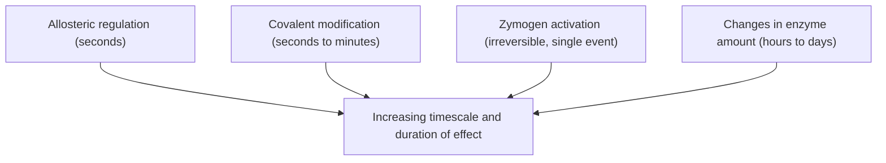
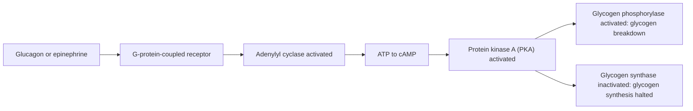

## Metabolic Regulation

### Overview

Metabolic regulation encompasses the mechanisms by which cells and organisms control the rate and direction of metabolic pathways in response to changing internal and external conditions. Because a single cell contains hundreds of interconnected reactions, often with opposing pathways (e.g., glycolysis and gluconeogenesis) sharing the same starting or ending metabolites, effective regulation is essential to avoid wasteful futile cycles, to direct flux toward whatever the cell currently needs, and to maintain metabolic homeostasis despite fluctuating nutrient supply and energy demand.

### Levels of Metabolic Control

Regulation operates across several distinct timescales and mechanistic levels, from near-instantaneous to long-term structural change.

**Allosteric regulation (fastest, seconds timescale)**

Small-molecule effectors bind reversibly to a regulatory site distinct from the enzyme's active site, inducing a conformational change that alters catalytic activity. This is typically the most rapid form of control, requiring no new protein synthesis or covalent modification, and often provides direct feedback based on the immediate concentration of pathway substrates, products, or energy-charge indicators (ATP, ADP, AMP, NADH).

**Covalent modification (fast, seconds to minutes)**

Reversible post-translational modification, most commonly phosphorylation (by protein kinases) and dephosphorylation (by protein phosphatases), alters enzyme conformation and activity. This mechanism allows a single hormonal signal (e.g., glucagon via cAMP-dependent protein kinase A) to simultaneously and coordinately regulate multiple enzymes across different pathways within seconds of receptor activation.

**Zymogen activation (irreversible, occurs once per protein molecule)**

Certain enzymes are synthesized as inactive precursors requiring specific, irreversible proteolytic cleavage to become active. Once activated, the enzyme's activity cannot be turned back off by this mechanism; regulation instead occurs at the level of when and where the precursor is cleaved, or via subsequent degradation of the active enzyme.

**Changes in enzyme amount (slow, hours to days)**

Achieved through regulation of gene transcription (induction or repression of the genes encoding metabolic enzymes) and, correspondingly, altered rates of protein degradation. This mechanism cannot respond quickly but allows sustained, large-magnitude shifts in metabolic capacity, such as the upregulation of gluconeogenic enzymes during prolonged fasting.

**Compartmentalization**

Distinct metabolic pathways are physically separated into different cellular compartments (e.g., fatty acid oxidation in the mitochondrial matrix versus fatty acid synthesis in the cytosol), allowing opposing pathways to be regulated independently and preventing certain futile cycles by physical separation alone.

### Allosteric Regulation in Detail

Allosteric enzymes typically possess multiple subunits and exhibit **cooperativity**, in which ligand binding at one active site influences the affinity of other active sites on the same enzyme complex. This produces the characteristic **sigmoidal** velocity-versus-substrate-concentration curve (rather than the hyperbolic curve of simple Michaelis-Menten enzymes), described quantitatively by the **Hill equation**:

$$v_0 = \frac{V_{max}[S]^n}{K_{0.5}^n + [S]^n}$$

where $n$ (the Hill coefficient) reflects the degree of cooperativity ($n > 1$ indicates positive cooperativity), and $K_{0.5}$ is the substrate concentration at half-maximal velocity. Sigmoidal kinetics allow an allosteric enzyme to behave almost like a switch, transitioning sharply from low to high activity over a relatively narrow range of substrate or effector concentration — a useful property for a rate-limiting, regulatory step.

**Feedback inhibition** is the most common allosteric regulatory pattern in biosynthetic pathways: the final product of a multi-step pathway allosterically inhibits an early, often the first committed, enzyme of that same pathway. This provides automatic, self-correcting control that reduces flux as soon as sufficient product has accumulated, without requiring any external signal.

**Feedforward activation** is the converse pattern, in which an upstream intermediate allosterically activates a downstream enzyme, coordinating flux through sequential steps of a pathway (e.g., fructose-1,6-bisphosphate activating pyruvate kinase in glycolysis, ensuring the final committed step keeps pace with upstream flux).

### Covalent Modification and Hormonal Signal Transduction

Hormones acting through cell-surface receptors frequently regulate metabolism via intracellular second-messenger cascades that culminate in reversible phosphorylation of key metabolic enzymes.

**The glucagon/epinephrine-cAMP-PKA cascade** exemplifies this mechanism:

1. Glucagon (fasting signal) or epinephrine (fight-or-flight signal) binds a G-protein-coupled receptor on the target cell surface.
2. The activated G protein stimulates adenylyl cyclase, converting ATP to cyclic AMP (cAMP), a diffusible intracellular second messenger.
3. cAMP binds and activates protein kinase A (PKA) by dissociating its inhibitory regulatory subunits from its catalytic subunits.
4. Active PKA phosphorylates multiple downstream target enzymes, producing a coordinated, amplified metabolic response across several pathways simultaneously — a single receptor-binding event can, through this signal amplification cascade, ultimately phosphorylate a vastly larger number of downstream enzyme molecules.

A key example of reciprocal control by phosphorylation is **glycogen metabolism**: PKA phosphorylates and activates glycogen phosphorylase kinase, which in turn activates glycogen phosphorylase (promoting glycogen breakdown), while PKA-mediated phosphorylation simultaneously inactivates glycogen synthase (inhibiting glycogen synthesis) — ensuring the two opposing pathways are never both maximally active at once.

Insulin (fed-state signal) generally opposes these effects via a distinct receptor tyrosine kinase pathway, ultimately activating protein phosphatases that reverse PKA-mediated phosphorylations, favoring anabolic, energy-storing pathways (glycogen synthesis, fatty acid synthesis).

### The Master Reciprocal Control Point: Fructose-2,6-Bisphosphate

The regulation of glycolysis versus gluconeogenesis at the PFK-1/fructose-1,6-bisphosphatase step, governed by fructose-2,6-bisphosphate (F2,6BP), illustrates how multiple levels of control (allosteric regulation and covalent modification) integrate at a single node:

- The bifunctional enzyme **PFK-2/FBPase-2** possesses two opposing catalytic activities on a single polypeptide.
- In the **dephosphorylated state** (favored by insulin, fed state), its kinase domain dominates, synthesizing F2,6BP from fructose-6-phosphate.
- F2,6BP then **allosterically activates PFK-1** (favoring glycolysis) and **allosterically inhibits FBPase-1** (suppressing gluconeogenesis).
- In the **phosphorylated state** (favored by glucagon via PKA, fasted state), the phosphatase domain dominates, degrading F2,6BP, which reverses both effects, favoring gluconeogenesis.

This single bifunctional enzyme thus functions as a molecular switch connecting hormonal status (via covalent modification) directly to allosteric control of two opposing metabolic pathways.

### Energy Charge as an Integrating Signal

The cellular **adenylate energy charge**, formalized by Daniel Atkinson, provides a unifying quantitative measure of a cell's energy status:

$$\text{Energy charge} = \frac{[ATP] + \frac{1}{2}[ADP]}{[ATP] + [ADP] + [AMP]}$$

This value ranges from 0 (all AMP, fully depleted) to 1 (all ATP, fully charged); healthy cells typically maintain energy charge near 0.8–0.9. ATP-generating (catabolic) pathways are generally allosterically inhibited by high energy charge (high ATP, low AMP/ADP) and activated by low energy charge, while ATP-consuming (anabolic/biosynthetic) pathways show the opposite sensitivity — collectively buffering energy charge within a narrow physiological range despite fluctuating supply and demand. **AMP-activated protein kinase (AMPK)** is a key cellular sensor of this state, activated allosterically and via upstream kinases when the AMP/ATP ratio rises, broadly switching cellular metabolism from anabolic to catabolic mode by phosphorylating numerous downstream targets (e.g., inhibiting acetyl-CoA carboxylase to suppress fatty acid synthesis and relieve inhibition of $\beta$-oxidation).

### Hormonal Integration Across Organs: Fed Versus Fasted States

Whole-body metabolic regulation is coordinated primarily by the relative levels of **insulin** (secreted by pancreatic $\beta$-cells in response to elevated blood glucose) and **glucagon** (secreted by pancreatic $\alpha$-cells in response to low blood glucose), which act antagonistically across multiple tissues:

| Condition | Insulin/glucagon | Liver | Adipose tissue | Muscle |
| --- | --- | --- | --- | --- |
| Fed state | High insulin | Glycogen synthesis, fatty acid synthesis | Triacylglycerol synthesis | Glucose uptake, glycogen synthesis |
| Fasted state | High glucagon | Glycogenolysis, gluconeogenesis, ketogenesis | Lipolysis | Fatty acid oxidation, reduced glucose uptake |

During prolonged fasting or starvation, this hormonal shift progressively mobilizes fuel reserves in a defined order: hepatic glycogen (rapidly depleted within roughly a day), then adipose triacylglycerol stores (via lipolysis, sustaining fatty acid oxidation and ketogenesis over weeks), with muscle protein degradation providing glucogenic amino acids for gluconeogenesis primarily as a longer-term, less-preferred reserve, since extensive protein loss compromises tissue and organ function.

### Worked Example: Integrated Control at PFK-1

Consider PFK-1 as an integration point receiving multiple simultaneous allosteric inputs, illustrating how several regulatory signals combine:

- High **ATP** (indicating abundant energy) directly and allosterically inhibits PFK-1 by lowering its affinity for fructose-6-phosphate.
- High **citrate** (indicating abundant citric acid cycle intermediates and biosynthetic precursor availability) also allosterically inhibits PFK-1, reinforcing the ATP signal.
- High **AMP** (indicating depleted energy charge) allosterically activates PFK-1, overriding ATP inhibition, since AMP accumulates disproportionately as ATP is depleted (due to the adenylate kinase equilibrium, $2ADP \rightleftharpoons ATP + AMP$, making AMP a more sensitive indicator of energy depletion than ADP alone).
- High **fructose-2,6-bisphosphate** (reflecting the fed hormonal state, via PFK-2/FBPase-2) allosterically activates PFK-1 independent of the immediate ATP/AMP/citrate status.

A cell can therefore simultaneously integrate its immediate local energy charge, its biosynthetic precursor supply, and its whole-body hormonal state into a single quantitative output: the flux through this one committed, rate-limiting enzyme.

**Key Points**

- Metabolic regulation operates across multiple timescales: fast allosteric and covalent control (seconds to minutes), irreversible zymogen activation, and slow transcriptional/translational control (hours to days).
- Allosteric enzymes often display cooperative, sigmoidal kinetics (Hill equation) and are subject to feedback inhibition (by pathway end-products) and feedforward activation (by upstream intermediates).
- Hormone-triggered second-messenger cascades (e.g., glucagon-cAMP-PKA) achieve rapid, coordinated, and amplified regulation of multiple enzymes via reversible phosphorylation.
- Fructose-2,6-bisphosphate, controlled by the bifunctional PFK-2/FBPase-2 enzyme, exemplifies the integration of hormonal (covalent) and allosteric control at a single reciprocal regulatory node.
- Adenylate energy charge and AMPK provide a unifying cellular sensing mechanism linking ATP/ADP/AMP status to broad shifts between catabolic and anabolic pathway activity.

**Related Topics**

- Glycolysis and gluconeogenesis
- The citric acid cycle
- Hormonal signal transduction and G-protein-coupled receptors
- Glycogen metabolism (glycogenesis and glycogenolysis)
- AMPK and cellular energy sensing
- Lipid and amino acid metabolism